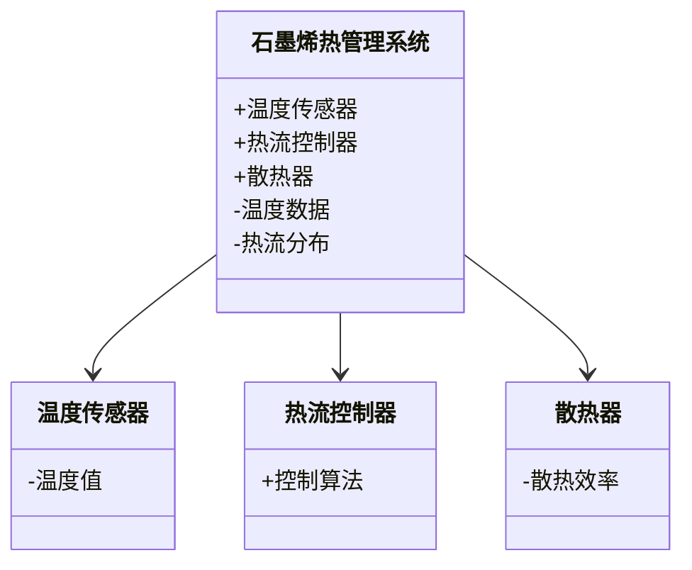

                 


```markdown
# 价值投资中的新型高效热管理石墨烯材料技术

> 关键词：石墨烯、热管理、价值投资、电子设备、新能源汽车

> 摘要：本文探讨了石墨烯材料在热管理领域的应用及其投资价值。通过分析石墨烯的物理特性、热导率计算模型、系统架构设计以及实际项目案例，展示了石墨烯在电子设备和新能源汽车中的潜力，为投资者提供技术与市场结合的深度分析。

---

## 第一部分: 石墨烯材料与热管理概述

### 第1章: 石墨烯材料的基本特性

#### 1.1 石墨烯的定义与基本结构
石墨烯是一种由碳原子组成的二维蜂窝状晶体结构，具有极高的导热性和导电性。其单层结构使其在物理和化学性质上表现出独特的特性，如高强度、柔韧性和优异的热导性能。

#### 1.2 热管理的重要性
在电子设备和新能源汽车中，热管理是确保性能和寿命的关键因素。石墨烯的高导热性能使其成为解决散热问题的理想材料。

#### 1.3 石墨烯在热管理中的优势
- **高导热性**：石墨烯的热导率远高于传统材料，可有效降低设备温度。
- **柔韧性**：适合应用于柔性电子设备和可穿戴设备。
- **轻薄性**：减少设备重量，提高效率。

### 第2章: 石墨烯材料的物理特性

#### 2.1 石墨烯的导热性能
石墨烯的高导热性源于其独特的碳原子结构，热导率可达2000 W/m·K以上，是铜的几倍。

#### 2.2 石墨烯的柔韧性与可加工性
石墨烯的柔韧性使其能够适应各种形状和尺寸，适合复杂设备的热管理需求。

### 第3章: 石墨烯在热管理中的应用

#### 3.1 电子设备中的应用
- 智能手机和笔记本电脑的散热解决方案。
- LED照明设备的热管理。

#### 3.2 新能源汽车中的应用
- 电池热管理，提高电池效率和安全性。
- 电机和控制器的散热解决方案。

---

## 第二部分: 石墨烯热管理技术的数学建模与算法

### 第4章: 石墨烯热导率的计算模型

#### 4.1 热导率计算的理论基础
热导率与材料的结构、密度和温度相关。石墨烯的热导率公式为：

$$ K = \frac{3k^2}{m} $$

其中，\( k \) 是波速，\( m \) 是质量。

#### 4.2 石墨烯热导率计算的算法
```mermaid
graph TD
    A[开始] --> B[计算石墨烯结构]
    B --> C[确定波速 \( k \)]
    C --> D[确定质量 \( m \)]
    D --> E[计算热导率 \( K \)]
    E --> F[输出结果]
```

#### 4.3 Python实现
```python
def calculate_thermal_conductivity(k, m):
    return (3 * k**2) / m

# 示例计算
k = 1e9  # 波速，单位 m/s
m = 0.022  # 质量，单位 kg/m²
K = calculate_thermal_conductivity(k, m)
print(f"热导率: {K:.2f} W/m·K")
```

---

## 第三部分: 石墨烯热管理系统架构设计

### 第5章: 系统架构与设计

#### 5.1 系统应用场景
石墨烯热管理系统应用于电子设备和新能源汽车的散热解决方案。

#### 5.2 系统功能设计
- 温度监测模块：实时监测设备温度。
- 热流控制模块：优化热流分布。
- 散热模块：主动散热。

#### 5.3 系统架构图


---

## 第四部分: 项目实战

### 第6章: 石墨烯热管理系统的实现

#### 6.1 实验环境搭建
- 石墨烯材料：选择高质量的石墨烯片层。
- 实验设备：温度传感器、热流传感器、数据采集仪。

#### 6.2 系统实现
- 程序实现：编写温度监测和热流控制算法。
- 硬件实现：安装石墨烯散热器。

#### 6.3 实验数据分析
通过实验数据分析石墨烯的散热效果，验证其在实际应用中的有效性。

---

## 第五部分: 最佳实践与总结

### 第7章: 总结与展望

#### 7.1 项目小结
石墨烯在热管理中的应用前景广阔，其高导热性和柔韧性使其成为未来散热解决方案的核心材料。

#### 7.2 投资建议
石墨烯热管理技术在电子设备和新能源汽车领域具有巨大的市场潜力，值得投资者关注。

#### 7.3 拓展阅读
建议进一步研究石墨烯在其他领域的应用，如电磁屏蔽和超级电容器。

---

通过本文的详细分析，我们可以看到石墨烯材料在热管理中的巨大潜力，也为投资者提供了技术与市场结合的深度分析，帮助他们做出明智的投资决策。
```

