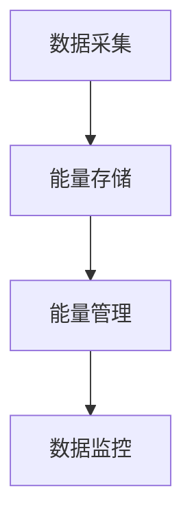

                 


---

# 价值投资中的新型高效相变储能材料技术

> **关键词**: 相变储能材料, 价值投资, 储能技术, 能源市场, 热力学分析

> **摘要**: 本文探讨了相变储能材料在价值投资中的潜力，通过分析相变储能材料的物理化学性质、高效储能技术的核心算法原理、系统架构设计以及实际案例，揭示了其在能源市场中的应用前景。文章从背景介绍、核心概念、算法原理、系统架构到项目实战，全面解析了相变储能材料技术与价值投资的结合，为投资者和技术开发者提供了深入的分析和见解。

---

## 第一部分: 相变储能材料与价值投资概述

### 第1章: 相变储能材料与价值投资概述

#### 1.1 相变储能材料的基本概念

##### 1.1.1 相变储能材料的定义

相变储能材料是一种能够在相变过程中吸收或释放大量热能的物质。其核心原理是利用物质在固态、液态或气态之间的相变过程来储存和释放能量。例如，冰融化成水的过程会吸收大量潜热，而水结冰的过程则会释放潜热。

相变储能材料的分类主要基于其相变类型，包括固-液相变材料（如石蜡、盐 hydrate）、液-气相变材料（如液氮）等。这些材料在能源储存、建筑节能、工业应用等领域具有广泛的应用潜力。

##### 1.1.2 相变储能的基本原理

相变储能的核心是能量的储存与释放。在相变过程中，材料会吸收或释放潜热，从而实现能量的储存。例如，当材料从固态变为液态时，会吸收大量的热能；当液态变为固态时，则会释放热能。这一过程可以用来储存太阳能、工业余热等能源。

##### 1.1.3 相变储能材料的分类

相变储能材料主要分为以下几类：

- **固-液相变材料**: 如石蜡、盐 hydrate、PEG（聚乙二醇）等。
- **液-气相变材料**: 如液氮、二氧化碳等。
- **固-固相变材料**: 如某些形状记忆合金。

#### 1.2 价值投资的基本概念

##### 1.2.1 价值投资的定义

价值投资是一种投资策略，旨在通过分析企业的基本面（如财务状况、盈利能力、行业地位等）来寻找被市场低估的投资标的。其核心理念是“买入低于内在价值的资产”。

##### 1.2.2 价值投资的核心理念

价值投资的核心理念包括以下几点：

1. **安全边际**: 投资者应以低于内在价值的价格买入资产，以确保投资的安全性。
2. **长期视角**: 价值投资强调长期持有的理念，关注企业的长期盈利能力。
3. **基本面分析**: 通过分析企业的财务报表、行业地位、竞争优势等，评估其内在价值。

##### 1.2.3 价值投资与技术的关系

随着科技的发展，新技术往往能够带来新的投资机会。例如，高效相变储能材料的出现，为储能技术带来了革新，同时也为投资者提供了新的投资方向。价值投资者需要关注这些新技术的市场潜力、技术成熟度以及商业化能力。

#### 1.3 相变储能材料与价值投资的结合

##### 1.3.1 相变储能材料在能源领域的应用

相变储能材料在能源领域的主要应用包括：

1. **太阳能储存**: 利用相变材料储存白天的太阳能，供夜间使用。
2. **工业余热利用**: 将工业生产过程中产生的余热储存起来，用于其他生产环节。
3. **建筑节能**: 在建筑中使用相变材料调节室内温度，降低能源消耗。

##### 1.3.2 价值投资在相变储能材料中的潜力

随着全球能源需求的增长和环保意识的增强，相变储能材料市场前景广阔。投资者可以通过分析相关企业的技术创新能力、市场占有率、盈利能力等因素，寻找具有投资价值的标的。

##### 1.3.3 本章小结

本章介绍了相变储能材料的基本概念及其在能源领域的应用，同时探讨了价值投资在相变储能材料中的潜力。下一章将深入分析相变储能材料的物理化学性质。

---

### 第2章: 相变储能材料的物理化学性质

#### 2.1 相变储能材料的热力学性质

##### 2.1.1 相变过程中的热力学分析

在相变过程中，系统会经历状态的变化，同时伴随着能量的吸收或释放。根据热力学第一定律，能量守恒是相变过程中的基本原理。

##### 2.1.2 熔化和凝固过程的热力学公式

相变过程中的潜热公式为：

$$ Q = m \cdot L $$

其中，\( Q \) 表示潜热，\( m \) 表示物质的质量，\( L \) 表示潜热。

##### 2.1.3 相变材料的潜热计算公式

相变材料的潜热可以通过实验测量或理论计算得到。例如，石蜡的潜热可以通过以下公式计算：

$$ L = \frac{Q}{m} $$

其中，\( Q \) 是相变过程中吸收或释放的热量，\( m \) 是物质的质量。

#### 2.2 相变储能材料的物理性质

##### 2.2.1 导热系数的影响因素

导热系数是材料导热性能的重要指标。相变储能材料的导热系数受以下因素影响：

1. **材料结构**: 纤维状材料的导热系数较低，而致密材料的导热系数较高。
2. **温度**: 导热系数通常随温度升高而增加。
3. **相态**: 固态材料的导热系数一般高于液态材料。

##### 2.2.2 比热容的计算方法

比热容是材料在单位质量下温度升高1摄氏度所需的能量。比热容的计算公式为：

$$ c = \frac{Q}{m \cdot \Delta T} $$

其中，\( c \) 是比热容，\( Q \) 是吸收的热量，\( m \) 是质量，\( \Delta T \) 是温度变化。

##### 2.2.3 相变过程中的体积变化

相变过程中，材料的体积会发生显著变化。例如，冰融化成水时，体积会缩小约9%。体积变化会影响材料的储层设计和应用效果。

#### 2.3 相变储能材料的化学稳定性

##### 2.3.1 材料化学反应的稳定性分析

相变材料的化学稳定性是其长期使用的前提。例如，某些相变材料在高温或潮湿环境下容易发生化学降解，从而影响其储能性能。

##### 2.3.2 材料在不同环境中的耐久性

耐久性是材料在长期使用过程中保持性能不变的能力。相变材料的耐久性受环境条件（如温度、湿度、化学腐蚀等）的影响。

##### 2.3.3 化学稳定性对储能效率的影响

化学稳定性好的相变材料具有较长的使用寿命，能够提高储能系统的整体效率。相反，化学稳定性差的材料会导致系统频繁更换，增加维护成本。

#### 2.4 本章小结

本章分析了相变储能材料的热力学性质、物理性质和化学稳定性。下一章将探讨高效相变储能技术的核心算法原理。

---

### 第3章: 高效相变储能技术的核心算法原理

#### 3.1 热量传递与存储的数学模型

##### 3.1.1 热传导方程的建立

热传导方程是描述热量在材料中传递的基本方程。一维热传导方程为：

$$ \frac{\partial T}{\partial t} = \alpha \frac{\partial^2 T}{\partial x^2} $$

其中，\( T \) 是温度，\( \alpha \) 是导热系数，\( t \) 是时间，\( x \) 是空间坐标。

##### 3.1.2 相变过程中的能量守恒方程

相变过程中的能量守恒方程为：

$$ \frac{\partial T}{\partial t} + \frac{\partial Q}{\partial t} = 0 $$

其中，\( Q \) 是相变材料吸收的热量。

##### 3.1.3 数学模型的求解方法

数学模型的求解通常采用数值方法，如有限差分法或有限元法。例如，使用有限差分法求解一维热传导方程：

$$ T_{i+1} = T_i + \alpha \cdot \frac{1}{\Delta x^2} \cdot (T_{i-1} - 2T_i + T_{i+1}) $$

其中，\( \Delta x \) 是空间步长。

#### 3.2 相变储能优化算法

##### 3.2.1 基于遗传算法的优化策略

遗传算法是一种模拟自然选择的优化算法。其基本步骤包括：

1. **初始化**: 随机生成初始种群。
2. **适应度评估**: 计算每个个体的适应度。
3. **选择**: 根据适应度选择优秀个体。
4. **交叉**: 对选中的个体进行基因交叉。
5. **变异**: 对新个体进行随机变异。
6. **迭代**: 重复上述步骤，直到满足终止条件。

##### 3.2.2 粒子群算法在相变储能中的应用

粒子群算法是一种基于群体智能的优化算法。其基本步骤包括：

1. **初始化**: 随机生成粒子群。
2. **适应度评估**: 计算每个粒子的适应度。
3. **更新速度和位置**: 根据粒子和全局最优解更新速度和位置。
4. **迭代**: 重复上述步骤，直到满足终止条件。

##### 3.2.3 深度学习算法的潜在应用

深度学习算法在相变储能领域的潜在应用包括：

1. **材料性能预测**: 使用神经网络模型预测材料的热导率、比热容等性能。
2. **优化设计**: 使用深度强化学习优化材料的微观结构设计。
3. **故障预测**: 使用深度学习模型预测材料在使用过程中的潜在故障。

#### 3.3 算法的数学推导与公式

##### 3.3.1 热传导方程的推导

热传导方程的推导基于能量守恒原理。假设系统中没有内部热源，能量守恒方程为：

$$ \frac{\partial T}{\partial t} = \alpha \nabla^2 T $$

其中，\( \nabla^2 \) 是拉普拉斯算子。

##### 3.3.2 相变过程中的潜热公式

相变过程中的潜热公式为：

$$ Q = m \cdot L $$

其中，\( Q \) 是潜热，\( m \) 是质量，\( L \) 是潜热。

##### 3.3.3 算法优化的数学表达

以遗传算法为例，其适应度函数可以表示为：

$$ f(x) = \text{最大化或最小化目标函数} $$

其中，\( x \) 是决策变量。

#### 3.4 本章小结

本章详细介绍了高效相变储能技术的核心算法原理，包括数学模型的建立、优化算法的选择以及算法的数学推导。下一章将探讨价值投资中的技术评估与市场分析。

---

### 第4章: 价值投资中的技术评估与市场分析

#### 4.1 相变储能材料的技术评估指标

##### 4.1.1 材料性能评估标准

相变储能材料的技术评估指标包括：

- **潜热**: 材料的储热能力。
- **导热系数**: 材料的热传导能力。
- **化学稳定性**: 材料的耐久性。

##### 4.1.2 技术成熟度评估方法

技术成熟度评估方法包括：

1. **实验室测试**: 通过实验测量材料的性能指标。
2. **小试验证**: 在小规模条件下验证材料的可行性。
3. **中试验证**: 在中等规模条件下验证材料的性能。

##### 4.1.3 技术经济性分析

技术经济性分析包括：

1. **成本分析**: 材料的生产成本、储存成本等。
2. **收益分析**: 材料的应用带来的经济效益。
3. **投资回报分析**: 投资者在材料应用中的收益与成本的比值。

#### 4.2 相变储能材料的市场分析

##### 4.2.1 全球储能市场现状

全球储能市场近年来快速增长，主要驱动力包括：

1. **可再生能源的发展**: 太阳能、风能等可再生能源的快速发展推动了储能技术的需求。
2. **政策支持**: 各国政府通过政策支持推动储能技术的商业化应用。
3. **能源结构转型**: 全球能源结构向清洁化、低碳化方向转型，促进了储能技术的发展。

##### 4.2.2 相变储能材料的市场潜力

相变储能材料在以下几个领域的市场潜力较大：

1. **太阳能储存**: 利用相变材料储存白天的太阳能，供夜间使用。
2. **工业余热利用**: 将工业生产过程中产生的余热储存起来，用于其他生产环节。
3. **建筑节能**: 在建筑中使用相变材料调节室内温度，降低能源消耗。

##### 4.2.3 市场竞争格局分析

目前，全球相变储能材料市场的主要竞争者包括：

1. **国际企业**: 如美国的3M公司、德国的 BASF 公司等。
2. **国内企业**: 如中国的比亚迪、格力等。
3. **初创企业**: 一些初创企业专注于新型相变储能材料的研发和生产。

#### 4.3 价值投资策略的制定

##### 4.3.1抽样技术评估与投资决策

价值投资者在进行抽样技术评估时，需要关注以下几个方面：

1. **技术可行性**: 材料的技术成熟度、商业化能力等。
2. **市场潜力**: 材料的市场需求、应用前景等。
3. **竞争优势**: 企业在市场竞争中的优势，如技术壁垒、成本优势等。

##### 4.3.2 市场风险与收益的平衡

价值投资者需要在市场风险和收益之间找到平衡点。例如，选择技术成熟但市场需求较大的材料，可以在保证收益的同时降低投资风险。

##### 4.3.3 投资组合优化策略

价值投资者可以通过优化投资组合来分散风险、提高收益。例如，将资金分配到不同领域的相变储能材料项目中，以降低单一项目的风险。

#### 4.4 本章小结

本章分析了相变储能材料的技术评估指标和市场潜力，探讨了价值投资者在技术评估和市场分析中的策略。下一章将探讨系统架构与接口设计。

---

### 第5章: 系统架构与接口设计

#### 5.1 系统功能设计

##### 5.1.1 系统目标与功能模块

相变储能系统的功能模块包括：

1. **数据采集**: 采集相变材料的温度、湿度等参数。
2. **能量存储**: 实现能量的存储与释放。
3. **能量管理**: 对能量的存储与释放进行优化管理。
4. **数据监控**: 监控系统的运行状态。

##### 5.1.2 系统功能模块图



##### 5.1.3 功能模块之间的关系

数据采集模块负责采集系统的运行数据，传递给能量存储模块。能量存储模块根据数据进行能量的存储与释放，并将数据传递给能量管理模块。能量管理模块对能量的存储与释放进行优化，并将数据传递给数据监控模块。数据监控模块对系统的运行状态进行监控，并提供人机交互界面。

#### 5.2 系统架构设计

##### 5.2.1 系统架构图


##### 5.2.2 系统架构设计的详细分析

系统架构设计包括以下几个部分：

1. **数据采集层**: 采集系统的运行数据，如温度、湿度等。
2. **能量存储层**: 实现能量的存储与释放。
3. **能量管理层**: 对能量的存储与释放进行优化管理。
4. **数据监控层**: 监控系统的运行状态，并提供人机交互界面。

#### 5.3 系统接口设计

##### 5.3.1 系统接口设计

系统接口设计包括以下几个部分：

1. **数据采集接口**: 采集系统的运行数据。
2. **能量存储接口**: 实现能量的存储与释放。
3. **能量管理接口**: 对能量的存储与释放进行优化管理。
4. **数据监控接口**: 监控系统的运行状态，并提供人机交互界面。

##### 5.3.2 系统接口的详细分析

数据采集接口负责采集系统的运行数据，如温度、湿度等。能量存储接口负责实现能量的存储与释放。能量管理接口负责对能量的存储与释放进行优化管理。数据监控接口负责监控系统的运行状态，并提供人机交互界面。

#### 5.4 本章小结

本章详细介绍了相变储能系统的系统功能设计、架构设计和接口设计。下一章将探讨项目实战。

---

### 第6章: 项目实战

#### 6.1 环境安装

##### 6.1.1 系统运行环境

相变储能系统的运行环境包括：

1. **硬件环境**: 包括数据采集设备、能量存储设备、能量管理设备等。
2. **软件环境**: 包括数据采集软件、能量管理软件、数据监控软件等。

##### 6.1.2 安装步骤

1. **硬件安装**: 安装数据采集设备、能量存储设备、能量管理设备等。
2. **软件安装**: 安装数据采集软件、能量管理软件、数据监控软件等。

#### 6.2 系统核心实现源代码

##### 6.2.1 系统核心代码

以下是相变储能系统的核心代码示例：

```python
import numpy as np

def heat_conduction(T_initial, alpha, delta_x, delta_t):
    n = int(1/delta_x)
    T = np.zeros(n+1)
    T[0] = T_initial
    for t in range(n):
        for i in range(1, n):
            T_new = T[i] + alpha * (T[i-1] - 2*T[i] + T[i+1]) * delta_t
            T[i] = T_new
    return T

# 示例运行
T_initial = 300  # 初始温度
alpha = 0.1       # 导热系数
delta_x = 0.1     # 空间步长
delta_t = 0.01     # 时间步长
T_final = heat_conduction(T_initial, alpha, delta_x, delta_t)
print("最终温度分布:", T_final)
```

##### 6.2.2 代码应用解读与分析

上述代码实现了相变储能系统中的热传导过程。通过数值方法求解热传导方程，模拟了能量在材料中的传递过程。代码中定义了初始温度、导热系数、空间步长和时间步长，并通过有限差分法计算了最终的温度分布。

#### 6.3 项目小结

本章通过具体的项目实战，展示了相变储能系统的环境安装、核心代码实现和系统运行结果。下一章将进行总结和展望。

---

### 第7章: 总结与展望

#### 7.1 总结

本文详细探讨了相变储能材料在价值投资中的潜力，分析了其物理化学性质、高效储能技术的核心算法原理、系统架构设计以及实际案例。通过对相变储能材料的技术评估和市场分析，揭示了其在能源市场中的应用前景。

#### 7.2 展望

未来，随着技术的进步和市场需求的增长，相变储能材料将在更多领域得到应用。投资者和技术开发者需要继续关注相变储能材料的技术创新和市场动态，抓住投资机会。

---

### 结语

通过本文的分析，读者可以深入了解相变储能材料的技术特点和市场潜力，为价值投资者和技术开发者提供了重要的参考。

