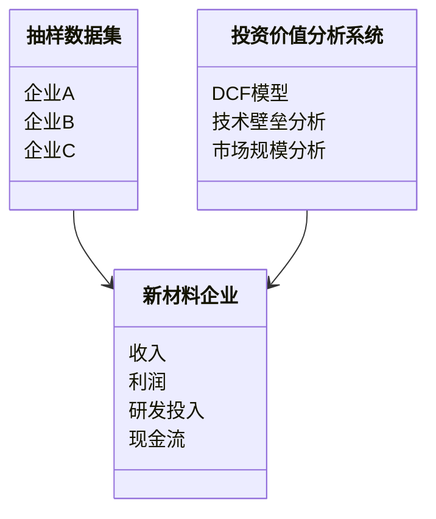
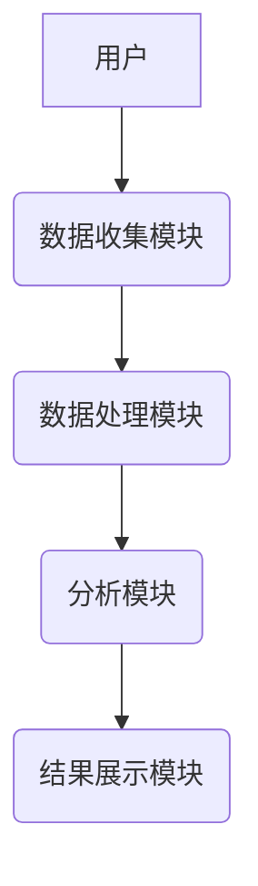

                 


# 价值投资中的新材料科技前景

## 关键词：价值投资，新材料科技，投资前景，纳米材料，石墨烯，生物材料，DCF模型

## 摘要：本文深入探讨了新材料科技在价值投资中的潜力，分析了纳米材料、石墨烯和生物材料等领域的投资机会，并结合数学模型和实际案例，为投资者提供科学的决策支持。

## 第3章: 价值投资的基本原理

### 3.1 基本面分析

#### 3.1.1 新材料科技企业的财务指标分析

在价值投资中，基本面分析是评估企业内在价值的核心方法。对于新材料科技企业，关键的财务指标包括：

- **收入与利润**：评估企业的盈利能力和市场地位。
- **研发投入**：衡量企业技术创新的能力。
- **现金流**：判断企业的财务健康状况和持续发展能力。

#### 3.1.2 DCF模型的数学公式

DCF（Discounted Cash Flow，贴现现金流法）是评估企业内在价值的重要工具。其核心公式为：

$$
DCF = \sum_{t=1}^{n} \frac{CF_t}{(1+r)^t} + \frac{TV}{(1+r)^n}
$$

其中，$CF_t$为第t年的自由现金流，$r$为贴现率，$TV$为终值。

### 3.2 投资模型与数学公式

#### 3.2.1 DCF模型的实现代码

以下是计算DCF的Python代码示例：

```python
def calculate_dcf(cash_flows, discount_rate, terminal_value):
    dcf = 0
    for t in range(len(cash_flows)):
        dcf += cash_flows[t] / (1 + discount_rate) ** t
    dcf += terminal_value / (1 + discount_rate) ** len(cash_flows)
    return dcf

# 示例数据
cash_flows = [100, 150, 200]
discount_rate = 0.1
terminal_value = 500

dcf_value = calculate_dcf(cash_flows, discount_rate, terminal_value)
print(f"DCF Value: {dcf_value}")
```

#### 3.2.2 投资组合优化的数学模型

投资组合优化的目标是在给定风险水平下最大化收益，或在给定收益下最小化风险。其数学模型可以表示为：

$$
\text{最大化 } \mu - \lambda \sigma
$$

其中，$\mu$为预期收益，$\sigma$为风险，$\lambda$为风险厌恶系数。

---

## 第4章: 新材料科技与价值投资的结合

### 4.1 新材料科技企业的技术壁垒

#### 4.1.1 技术壁垒的定义与衡量

技术壁垒是新材料企业核心竞争力的体现，包括专利数量、研发团队实力和技术创新能力。技术壁垒越高，企业的竞争优势越明显。

#### 4.1.2 技术壁垒对投资价值的影响

强大的技术壁垒意味着企业具有更高的定价能力和市场支配力，从而提升投资价值。

### 4.2 市场规模与竞争格局

#### 4.2.1 新材料科技市场的规模分析

新材料市场涵盖多个领域，包括半导体材料、新能源材料和生物材料等。各领域的市场规模和发展前景差异显著。

#### 4.2.2 行业竞争格局与市场集中度

分析行业内的主要竞争者和市场集中度，有助于评估企业的市场地位和竞争优势。

---

## 第5章: 项目实战

### 5.1 环境安装与数据收集

#### 5.1.1 数据收集工具与方法

使用公开的财务数据、行业报告和专利数据库等多渠道收集相关数据。

#### 5.1.2 数据清洗与预处理

清除无效数据，处理缺失值和异常值，确保数据质量。

### 5.2 系统核心实现

#### 5.2.1 投资模型的实现代码

```python
import pandas as pd
import numpy as np

# 示例数据加载
data = pd.read_csv('新材料企业数据.csv')

# 计算DCF值
def calculate_dcf(fcf, discount_rate, terminal_value):
    n = len(fcf)
    dcf = 0
    for t in range(n):
        dcf += fcf[t] / (1 + discount_rate) ** t
    dcf += terminal_value / (1 + discount_rate) ** n
    return dcf

# 示例计算
fcf = data['Free Cash Flow'].values[:3]
discount_rate = 0.1
terminal_value = 500

dcf_value = calculate_dcf(fcf, discount_rate, terminal_value)
print(f"DCF Value: {dcf_value}")
```

---

## 第6章: 系统分析与架构设计

### 6.1 系统功能设计

#### 6.1.1 领域模型



### 6.2 系统架构设计



---

## 第7章: 总结与展望

### 7.1 总结

新材料科技在价值投资中具有巨大的潜力，通过科学的分析方法和模型，投资者可以更准确地评估企业的内在价值。

### 7.2 展望

未来，随着新材料技术的不断进步，投资机会将更加多元化。投资者需要持续关注行业动态和技术发展，优化投资策略。

### 7.3 投资建议

- **长期视角**：关注具有强大技术壁垒的企业。
- **风险管理**：合理分散投资组合，降低风险。

---

通过以上分析，我们为投资者提供了新材料科技领域的投资策略和实战方法，帮助读者在复杂多变的市场中捕捉投资机会，实现长期稳健的投资回报。

