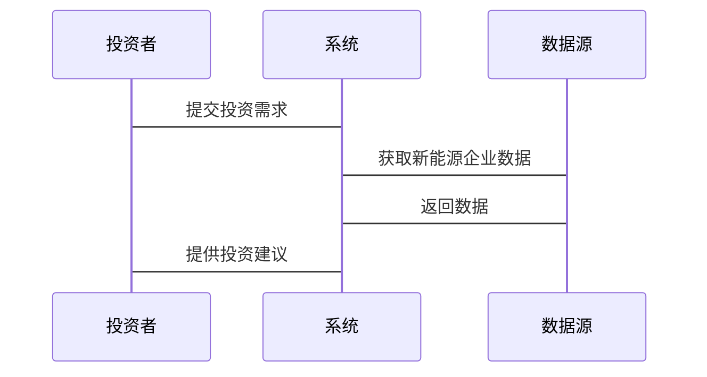

                 


# 价值投资中的新能源革命分析

> 关键词：价值投资，新能源革命，能源转型，投资分析，技术驱动

> 摘要：本文将从价值投资的角度，深入分析新能源革命对投资策略的影响。通过对新能源技术、市场、政策等多维度的分析，揭示新能源革命如何改变传统投资逻辑，为企业价值评估提供新视角，并探讨投资者如何在新能源革命中把握投资机会。

---

## 第一部分: 新能源革命的背景与价值投资的结合

### 第1章: 新能源革命的背景

#### 1.1 新能源革命的定义与核心驱动因素

- 新能源革命是指以可再生能源（如太阳能、风能、生物质能等）为核心，逐步替代传统化石能源的过程。
- 核心驱动因素包括：气候变化、能源安全、技术进步和政策支持。

#### 1.2 新能源革命对全球经济的影响

- 全球能源结构转型：从化石能源向可再生能源过渡。
- 新能源技术的快速发展：技术创新推动成本下降，加速市场渗透。
- 新能源产业的崛起：新能源企业在全球经济中的地位显著提升。

#### 1.3 新能源革命与价值投资的结合

- 价值投资关注企业的长期价值，而新能源革命为企业提供了新的增长点。
- 投资者需要重新评估新能源企业的核心竞争力和估值方法。

---

### 第2章: 价值投资的核心理念

#### 2.1 价值投资的基本原则

- 以合理价格买入优质资产。
- 长期持有，关注企业的基本面。
- 避免短期市场波动的干扰。

#### 2.2 价值投资在新能源领域的应用

- 新能源企业的估值需要考虑技术壁垒、成本优势和市场前景。
- 新能源行业的周期性分析：行业的成长阶段和周期波动对投资策略的影响。

#### 2.3 新能源革命对投资逻辑的改变

- 传统能源企业的转型：如何在新能源革命中找到新的增长点。
- 新能源企业的技术驱动：技术领先企业在投资中的优势。

---

## 第二部分: 新能源技术与投资分析

### 第3章: 新能源技术的深度分析

#### 3.1 太阳能技术

- 太阳能电池的技术进步：从晶体硅到薄膜电池的发展。
- 光伏发电的成本下降趋势：技术进步推动平准化能源成本（LCOE）下降。
- 市场前景：太阳能发电的全球增长潜力。

#### 3.2 风能技术

- 风能发电的效率提升：大叶片、高塔架技术的应用。
- 海上风电的发展：资源潜力和成本优势。
- 技术瓶颈：风能发电的不稳定性问题。

#### 3.3 储能技术

- 储能技术的核心：电池技术的突破（如锂离子电池、固态电池）。
- 储能系统在电网中的应用：削峰填谷、提高电网稳定性。
- 技术进步对储能成本的影响。

#### 3.4 智能电网技术

- 智能电网的概念：通过数字化技术实现电网的智能化管理。
- 智能电网对新能源接入的支持：提高可再生能源的利用率。
- 技术创新对电网效率的提升。

---

### 第4章: 新能源技术对投资的影响

#### 4.1 技术创新对企业价值的影响

- 技术领先企业的竞争优势：专利、研发能力和市场占有率。
- 技术创新对成本的影响：技术进步如何降低企业生产成本。

#### 4.2 新能源技术的市场渗透率分析

- 各种新能源技术的市场渗透率：太阳能、风能、储能等的市场占比。
- 市场渗透率与投资策略的关系：高渗透率技术的投资机会与风险。

#### 4.3 技术风险与投资决策

- 技术失败的风险：如何评估新能源技术的可行性。
- 技术替代的风险：如何应对技术更新换代带来的投资风险。

---

## 第三部分: 价值投资的分析框架

### 第5章: 企业财务分析与估值

#### 5.1 财务指标分析

- 利润能力：净利润率、ROE（净资产收益率）。
- 营业能力：收入增长率、成本控制能力。
- 财务健康性：资产负债率、现金流状况。

#### 5.2 企业竞争优势分析

- 核心竞争力：技术、成本、市场占有率。
- 企业护城河：专利、品牌、规模效应。
- 管理团队：领导层的经验与战略能力。

#### 5.3 新能源企业的估值方法

- 市盈率法：基于市盈率的估值。
- 市净率法：基于净资产倍数的估值。
- 现金流折现法：基于未来现金流的估值。

---

### 第6章: 新能源市场的投资机会与风险

#### 6.1 市场机会分析

- 新能源行业的市场规模：全球和区域市场的增长潜力。
- 技术领先企业的投资价值：如何选择具有技术优势的企业。
- 新能源政策的影响：政府补贴、税收优惠等政策对企业的影响。

#### 6.2 市场风险分析

- 行业周期性风险：行业的波动周期对投资的影响。
- 技术风险：技术失败或替代的风险。
- 政策风险：政策变化对行业和企业的影响。

---

## 第四部分: 新能源投资的系统架构与策略

### 第7章: 新能源投资的系统架构

#### 7.1 系统功能设计

- 数据采集与分析：收集新能源企业的财务数据、技术数据和市场数据。
- 估值模型构建：基于数据构建新能源企业的估值模型。
- 投资决策支持：通过模型输出投资建议。

#### 7.2 系统架构设计

- 数据层：数据的存储与管理。
- 业务逻辑层：模型的计算与分析。
- 用户界面层：用户交互与结果展示。

#### 7.3 系统接口设计

- 数据接口：与外部数据库或API的对接。
- 用户接口：与用户的交互界面。

#### 7.4 系统交互流程图



---

### 第8章: 项目实战与案例分析

#### 8.1 项目环境安装

- 安装Python环境：包括numpy、pandas、scipy等库。
- 数据获取：通过API获取新能源企业的财务数据和市场数据。

#### 8.2 核心代码实现

```python
import numpy as np
import pandas as pd

# 示例数据：新能源企业的财务数据
data = {
    '企业': ['企业A', '企业B', '企业C'],
    '收入': [100, 150, 200],
    '净利润': [20, 30, 40],
    '研发投入': [10, 15, 20],
    '股价': [50, 60, 70]
}

df = pd.DataFrame(data)

# 计算市盈率
df['市盈率'] = df['股价'] / df['净利润']

# 计算市净率
df['市净率'] = df['股价'] / (df['收入'] / df['企业'].count())

print(df)
```

#### 8.3 案例分析

- 选择一家新能源企业，分析其财务数据、技术优势和市场前景。
- 构建估值模型，计算其合理估值。
- 提出投资建议：是否值得投资，投资比例和时机。

---

## 第五部分: 总结与展望

### 第9章: 总结

#### 9.1 投资策略总结

- 价值投资在新能源领域的核心是关注企业的长期价值。
- 新能源技术的创新和市场渗透率是投资的关键因素。

#### 9.2 投资建议

- 选择技术领先、财务健康、竞争优势明显的企业。
- 关注政策变化和市场周期，合理配置投资组合。

### 第10章: 展望

#### 10.1 新能源技术的未来趋势

- 可再生能源技术的进一步突破。
- 储能技术的商业化应用。
- 智能电网的普及。

#### 10.2 价值投资的未来方向

- 新能源投资的全球化趋势。
- 新能源与传统能源的融合发展。
- 技术创新对企业价值的持续影响。

---

## 第六部分: 最佳实践与注意事项

### 第11章: 最佳实践

#### 11.1 投资前的准备工作

- 深入研究新能源技术和市场。
- 评估企业的财务状况和竞争优势。
- 关注政策变化和市场动态。

#### 11.2 投资中的注意事项

- 避免盲目跟风，注重基本面分析。
- 合理分散投资，降低风险。
- 定期复盘和调整投资策略。

---

## 第七部分: 结语

### 第12章: 结语

- 新能源革命正在改变全球能源结构，也为投资者提供了新的机遇。
- 价值投资的核心是长期持有优质资产，新能源领域的投资也不例外。
- 投资者需要结合技术、市场和政策多方面因素，制定科学的投资策略。

---

## 参考文献

- 《价值投资实战策略》
- 《新能源技术与市场分析》
- 相关新能源政策文件

---

通过以上结构和内容，您可以撰写一篇详细的、逻辑清晰的专业技术博客文章。文章涵盖了新能源革命的背景、技术分析、投资策略、系统设计和案例分析，帮助读者全面理解新能源革命对价值投资的影响。

