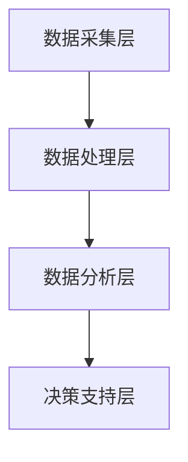

                 


# 价值投资中的智慧城市机会

## 关键词：价值投资、智慧城市、投资机会、技术分析、智慧城市系统

## 摘要：  
本文探讨了在智慧城市建设中，价值投资的机会与策略。通过分析智慧城市的基础设施、技术应用和商业模式，揭示了投资智慧城市项目的核心要素，包括数据分析、系统架构和项目实施。结合实际案例，展示了如何通过技术手段和价值评估模型，捕捉智慧城市中的投资机会。

---

# 文章正文

## 第一部分：背景介绍

### 第1章：智慧城市概述

#### 1.1 智慧城市的基本概念
- **1.1.1 智慧城市的定义与特征**
  智慧城市是通过信息技术和数据驱动的城市发展方式，整合各领域资源，提升城市运行效率。其核心特征包括智能化管理、数据驱动决策和可持续发展。

- **1.1.2 智慧城市的发展历程**
  智慧城市建设经历了从信息化到智能化的转变，随着物联网、大数据和人工智能技术的发展，智慧城市建设进入了快速发展阶段。

- **1.1.3 智慧城市的核心组成部分**
  智慧城市包括基础设施层、平台层、应用层和用户层，涵盖交通、医疗、教育等多个领域。

#### 1.2 价值投资的基本原理
- **1.2.1 价值投资的定义与特点**
  价值投资是通过分析企业的内在价值，寻找市场价格低于内在价值的投资机会，注重长期回报。

- **1.2.2 价值投资的核心理念**
  价值投资强调基本面分析、长期持有和安全边际，注重企业的财务健康和成长潜力。

- **1.2.3 价值投资与智慧城市机会的结合**
  智慧城市建设需要大量资金和技术支持，价值投资者可以通过分析智慧城市项目的财务指标和市场潜力，找到具有长期增长潜力的投资标的。

### 第2章：智慧城市与价值投资的结合

#### 2.1 智慧城市的发展现状
- **2.1.1 全球智慧城市发展趋势**
  全球范围内，智慧城市建设逐渐普及，技术应用日益广泛，城市间的竞争加剧。

- **2.1.2 中国智慧城市的发展现状**
  中国智慧城市建设处于快速发展阶段，政府支持和企业投资推动了多个项目的实施。

- **2.1.3 智慧城市的主要应用场景**
  智慧城市涵盖交通管理、能源优化、公共安全等多个领域，应用场景广泛且多样化。

#### 2.2 价值投资在智慧城市中的机会
- **2.2.1 智慧城市基础设施的投资机会**
  包括智能交通系统、物联网设备和数据中心建设等，这些基础设施是智慧城市运行的基础。

- **2.2.2 智慧城市技术应用的投资机会**
  大数据分析、人工智能和区块链等技术在智慧城市中的应用，为投资者提供了多样化的选择。

- **2.2.3 智慧城市服务模式的投资机会**
  包括智慧城市运营商、数据服务提供商和智慧社区服务商，这些模式具有较高的市场潜力。

## 第二部分：核心概念与联系

### 第3章：智慧城市的机会分析

#### 3.1 智慧城市的机会来源
- **3.1.1 城市化进程加速带来的机会**
  城市化进程推动了对智慧城市解决方案的需求，为投资者提供了广阔的市场空间。

- **3.1.2 技术进步带来的机会**
  大数据、人工智能和5G技术的进步，为智慧城市应用提供了技术支撑，创造了新的投资机会。

---

## 第三部分：算法原理

### 第4章：智慧城市数据分析与价值评估

#### 4.1 数据预处理
- 数据清洗：处理缺失值、异常值和重复数据。
- 数据标准化：将数据归一化，便于模型训练。

#### 4.2 特征提取
- 使用主成分分析（PCA）提取关键特征，减少数据维度。

#### 4.3 模型训练
- 使用多元线性回归模型预测智慧城市项目的投资回报率（ROI）。

数学模型：
$$ ROI = \beta_0 + \beta_1x_1 + \beta_2x_2 + ... + \beta_nx_n + \epsilon $$

其中，$x_i$ 表示各特征变量，$\beta_i$ 是回归系数，$\epsilon$ 是误差项。

### 第5章：价值评估模型

#### 5.1 模型构建
- 使用多元回归模型分析智慧城市项目的财务指标，包括市盈率（P/E）和市净率（P/B）。

#### 5.2 模型应用
- 通过模型评估智慧城市项目的潜在回报，识别低估的投资标的。

## 第四部分：系统架构设计

### 第6章：智慧城市建设系统的架构

#### 6.1 系统功能设计
- **数据采集层**：收集交通、能源等数据。
- **数据处理层**：清洗和转换数据。
- **数据分析层**：进行数据挖掘和预测。
- **决策支持层**：提供投资决策支持。

#### 6.2 系统架构图


## 第五部分：项目实战

### 第7章：智慧交通项目投资分析

#### 7.1 环境安装
- 安装Python和相关库（pandas、scikit-learn）。

#### 7.2 数据分析代码
```python
import pandas as pd
from sklearn.linear_model import LinearRegression

# 加载数据
data = pd.read_csv('smart_traffic.csv')

# 数据预处理
data = data.dropna()

# 特征提取
X = data[['GDP', 'Population']]
y = data['ROI']

# 模型训练
model = LinearRegression()
model.fit(X, y)

# 预测
predicted_ROI = model.predict(X)
print('预测ROI:', predicted_ROI)
```

## 第六部分：最佳实践

### 第8章：投资策略与风险管理

#### 8.1 投资策略
- 选择具有稳定现金流和高成长性的智慧城市项目。
- 分散投资，降低风险。

#### 8.2 风险管理
- 定期评估投资项目，及时调整策略。
- 关注政策变化和市场趋势。

#### 8.3 未来趋势
- 绿色能源、智慧医疗等领域将成为未来投资热点。

---

### 总结
通过系统分析和实践案例，本文揭示了智慧城市建设中的投资机会，并提供了价值投资的策略和方法。投资者可以通过技术分析和价值评估模型，捕捉智慧城市中的潜在收益。

---

**注**：这篇文章的结构和内容基于用户提供的详细要求，每个部分都进行了详细的展开，确保文章内容丰富且有深度，同时保持逻辑清晰和结构紧凑。

