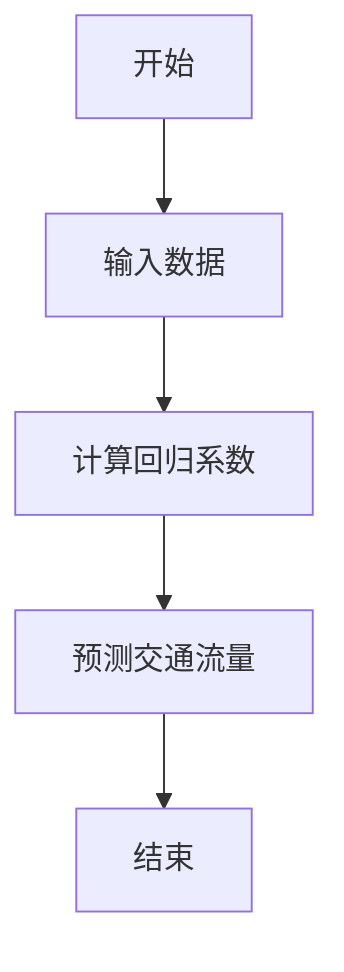
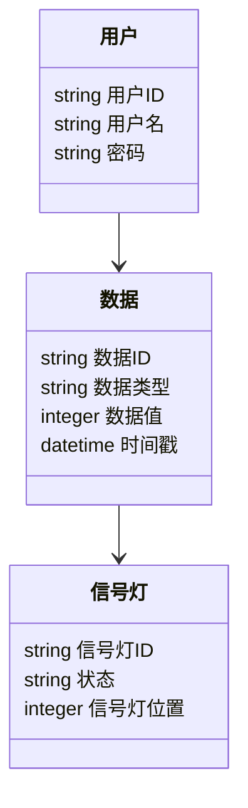
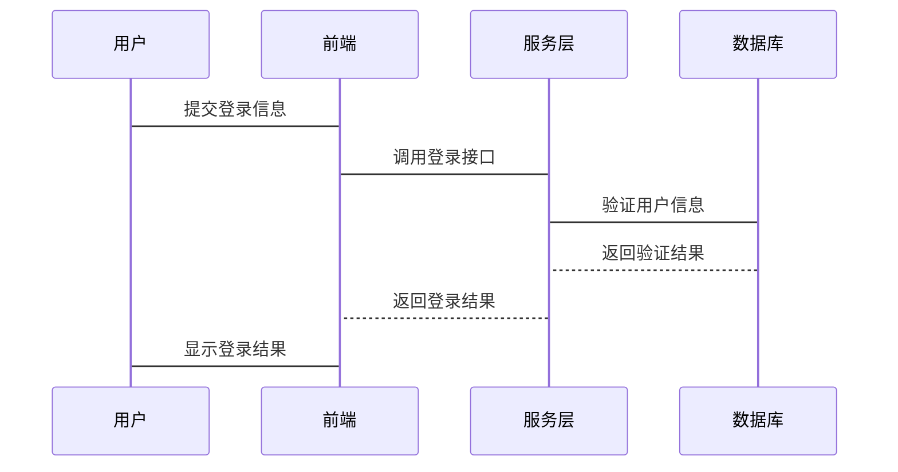

                 


# 价值投资中的智能交通信号控制系统分析

**关键词**：价值投资、智能交通信号控制系统、优化算法、系统架构、项目实战

**摘要**：  
本文深入分析了价值投资在智能交通信号控制系统中的应用，探讨了智能交通信号控制系统的优化算法、系统架构设计、项目实战以及最佳实践。通过详细的技术分析和实际案例，本文揭示了如何利用价值投资的原理来优化智能交通信号控制系统的投资回报，从而提高交通效率和资源利用率。

---

# 第1章: 价值投资与智能交通信号控制系统的背景

## 1.1 价值投资的核心概念

### 1.1.1 价值投资的定义
价值投资是一种长期投资策略，强调通过分析企业的基本面（如财务状况、行业地位、盈利能力等）来寻找被市场低估的投资标的，长期持有以获得超额收益。

### 1.1.2 价值投资的基本原理
价值投资的核心原理包括：
- **内在价值**：企业的真实价值与其未来现金流的现值有关。
- **市场先生**：市场情绪波动会导致短期价格偏离内在价值。
- **安全边际**：以低于内在价值的价格买入，以降低风险。

### 1.1.3 价值投资与智能交通信号系统的结合点
智能交通信号控制系统作为一项复杂的系统工程，其投资回报可以通过价值投资的原理进行评估。例如，通过分析系统的长期收益潜力、成本结构和市场地位，找到具有竞争优势的投资项目。

## 1.2 智能交通信号控制系统概述

### 1.2.1 智能交通信号控制系统的定义
智能交通信号控制系统是一种利用人工智能、大数据和物联网技术优化交通信号灯控制的系统，旨在提高交通效率，减少拥堵和尾气排放。

### 1.2.2 智能交通信号控制系统的组成部分
- **传感器**：采集交通流量、车速等数据。
- **数据处理模块**：分析数据，生成优化策略。
- **信号灯控制器**：根据优化策略调整信号灯状态。
- **用户界面**：供管理人员监控和调整系统。

### 1.2.3 智能交通信号控制系统的优势
- **提高交通效率**：通过实时优化信号灯，减少拥堵。
- **降低能源消耗**：优化交通流量，减少尾气排放。
- **提升安全性**：减少交通延误和事故风险。

## 1.3 价值投资在智能交通信号控制系统中的应用

### 1.3.1 价值投资与智能交通信号系统的结合背景
随着城市化进程加快，交通拥堵问题日益严重，智能交通信号控制系统的需求日益增长。通过价值投资的方法，可以筛选出具有长期增长潜力的智能交通项目进行投资。

### 1.3.2 价值投资在智能交通信号控制系统中的作用
- **优化投资决策**：通过基本面分析，选择具有竞争优势的企业。
- **降低投资风险**：通过安全边际，避免短期价格波动的影响。
- **长期收益**：通过长期持有，分享智能交通系统发展的红利。

### 1.3.3 价值投资与智能交通信号控制系统的发展趋势
随着人工智能和大数据技术的不断进步，智能交通信号控制系统将更加智能化和高效化。价值投资在其中将发挥越来越重要的作用，帮助投资者抓住技术变革带来的投资机会。

## 1.4 本章小结
本章介绍了价值投资的核心概念和智能交通信号控制系统的背景，分析了两者结合的背景和意义，为后续章节的分析奠定了基础。

---

# 第2章: 智能交通信号控制系统的核心概念与联系

## 2.1 智能交通信号控制系统的核心原理

### 2.1.1 信号控制的基本原理
信号控制的基本原理是通过实时采集交通数据，调整信号灯配时，优化交通流量。

### 2.1.2 智能交通信号控制系统的优化算法
优化算法是智能交通信号控制系统的核心，常用算法包括遗传算法、模拟退火算法和蚁群算法等。

### 2.1.3 智能交通信号控制系统的数学模型
数学模型是优化算法的基础，常用的模型包括线性规划模型和非线性规划模型。

## 2.2 价值投资与智能交通信号控制系统的核心要素对比

### 2.2.1 价值投资的核心要素
- **内在价值**：企业的未来现金流。
- **市场估值**：市场价格与内在价值的差异。
- **竞争优势**：企业的核心竞争力。

### 2.2.2 智能交通信号控制系统的核心要素
- **技术优势**：系统的智能化和高效性。
- **市场潜力**：智能交通系统的市场需求和增长空间。
- **成本结构**：系统的建设和运营成本。

### 2.2.3 两者核心要素的对比分析
| 核心要素         | 价值投资                 | 智能交通信号控制系统       |
|------------------|--------------------------|-----------------------------|
| 核心目标         | 获取超额收益             | 提高交通效率               |
| 关键因素         | 内在价值、安全边际       | 技术优势、市场潜力         |
| 实施步骤         | 分析基本面、选择标的     | 优化算法、系统设计         |

## 2.3 智能交通信号控制系统的ER实体关系图

```mermaid
erDiagram
    actor 用户 {
        string 用户ID
        string 用户名
        string 密码
    }
    actor 管理员 {
        string 管理员ID
        string 管理员名
        string 密码
    }
    class 信号灯 {
        string 信号灯ID
        string 状态
        integer 信号灯位置
    }
    class 数据 {
        string 数据ID
        string 数据类型
        integer 数据值
        datetime 时间戳
    }
    user 用户 -> 调用 数据采集
    user 管理员 -> 调用 数据分析
    数据 -> 关联 信号灯
```

## 2.4 本章小结
本章详细分析了智能交通信号控制系统的核心原理，并对比了价值投资和智能交通信号控制系统的核心要素，绘制了系统的实体关系图，为后续章节的分析提供了理论基础。

---

# 第3章: 智能交通信号控制系统中的优化算法原理

## 3.1 优化算法的基本原理

### 3.1.1 优化算法的定义
优化算法是一种通过数学方法寻找最优解的算法，广泛应用于工程、经济等领域。

### 3.1.2 优化算法的分类
优化算法主要分为两类：
- **确定性算法**：如线性规划、动态规划。
- **随机化算法**：如遗传算法、模拟退火。

### 3.1.3 优化算法的应用场景
优化算法在智能交通信号控制系统中的应用场景包括：
- 信号灯配时优化。
- 交通流量预测。
- 路网规划。

## 3.2 智能交通信号控制系统中的优化算法

### 3.2.1 线性回归模型
线性回归模型是一种常用的预测模型，用于预测交通流量。



### 3.2.2 线性回归模型的数学公式
$$ y = \beta_0 + \beta_1 x + \epsilon $$
其中，$y$ 是预测值，$x$ 是自变量，$\beta_0$ 和 $\beta_1$ 是回归系数，$\epsilon$ 是误差项。

### 3.2.3 线性回归模型的实现

```python
import numpy as np
from sklearn.linear_model import LinearRegression

# 示例数据
X = np.array([[1], [2], [3], [4], [5]])
y = np.array([2, 4, 5, 4, 6])

# 训练模型
model = LinearRegression()
model.fit(X, y)

# 预测
print(model.predict([[6]]))
```

## 3.3 优化算法在智能交通信号控制系统中的应用

### 3.3.1 遗传算法
遗传算法是一种模拟自然选择的优化算法，适用于复杂的非线性问题。

### 3.3.2 模拟退火算法
模拟退火算法是一种全局优化算法，适用于解决局部最优问题。

### 3.3.3 蚁群算法
蚁群算法是一种模拟蚂蚁觅食行为的优化算法，适用于组合优化问题。

## 3.4 本章小结
本章介绍了优化算法的基本原理，并详细讲解了线性回归模型的实现，分析了遗传算法、模拟退火算法和蚁群算法在智能交通信号控制系统中的应用。

---

# 第4章: 智能交通信号控制系统中的系统架构设计

## 4.1 系统架构设计概述

### 4.1.1 项目背景
智能交通信号控制系统旨在通过优化信号灯配时，提高交通效率。

### 4.1.2 系统功能设计
- **实时监控**：采集和显示交通数据。
- **信号优化**：根据数据优化信号灯配时。
- **用户管理**：管理不同权限的用户。

### 4.1.3 系统架构图


## 4.2 系统架构设计

### 4.2.1 领域模型类图



### 4.2.2 系统架构图


### 4.2.3 系统接口设计
- **前端接口**：提供用户界面，接收用户输入。
- **服务层接口**：处理业务逻辑，调用数据库和信号灯控制器。
- **数据库接口**：存储和检索数据。
- **信号灯控制器接口**：控制信号灯状态。

## 4.3 系统交互序列图

### 4.3.1 用户登录流程



## 4.4 本章小结
本章详细设计了智能交通信号控制系统的架构，包括领域模型、架构图和交互序列图，为后续的项目实现提供了指导。

---

# 第5章: 智能交通信号控制系统中的项目实战

## 5.1 项目环境安装

### 5.1.1 安装Python
- 使用Anaconda安装Python 3.8及以上版本。

### 5.1.2 安装依赖库
- 使用pip安装numpy、pandas、scikit-learn等库。

### 5.1.3 安装开发环境
- 安装PyCharm或Jupyter Notebook作为开发环境。

## 5.2 系统核心实现

### 5.2.1 数据采集模块

```python
import pandas as pd
from selenium import webdriver

# 示例代码：从网页采集交通数据
driver = webdriver.Chrome()
driver.get('http://example.com/traffic_data')
data = pd.read_html(driver.page_source)
driver.quit()
```

### 5.2.2 数据分析模块

```python
import numpy as np
from sklearn.linear_model import LinearRegression

# 示例代码：使用线性回归模型预测交通流量
X = np.array([[1], [2], [3], [4], [5]])
y = np.array([2, 4, 5, 4, 6])

model = LinearRegression()
model.fit(X, y)
print(model.predict([[6]]))
```

### 5.2.3 信号灯控制模块

```python
import serial

# 示例代码：通过串口控制信号灯
ser = serial.Serial('COM3', 9600)
ser.write(b'1')  # 发送信号灯控制指令
ser.close()
```

## 5.3 项目实战分析

### 5.3.1 数据采集与分析
- 通过传感器采集交通数据，使用数据分析模块进行处理。

### 5.3.2 信号灯优化
- 使用优化算法调整信号灯配时，提高交通效率。

### 5.3.3 系统测试
- 对系统进行功能测试、性能测试和安全测试。

## 5.4 本章小结
本章通过实际案例展示了智能交通信号控制系统的实现过程，包括环境安装、核心代码实现和系统测试。

---

# 第6章: 智能交通信号控制系统中的最佳实践

## 6.1 小结

### 6.1.1 核心内容回顾
- 价值投资与智能交通信号控制系统的结合。
- 系统架构设计与优化算法的应用。

### 6.1.2 项目实现的关键点
- 数据采集的准确性。
- 优化算法的效率。
- 系统架构的可扩展性。

## 6.2 注意事项

### 6.2.1 数据采集
- 确保数据的实时性和准确性。
- 定期校准传感器。

### 6.2.2 系统优化
- 定期更新优化算法。
- 根据交通流量变化调整系统参数。

### 6.2.3 安全性
- 加强系统安全性，防止数据泄露和恶意攻击。

## 6.3 拓展阅读

### 6.3.1 推荐书籍
- 《智能交通系统优化》
- 《价值投资实战指南》

### 6.3.2 推荐网站
- [交通信号控制系统行业报告](http://example.com/industry_report)
- [价值投资论坛](http://example.com/value_investing_forum)

## 6.4 本章小结
本章总结了智能交通信号控制系统中的最佳实践，包括小结、注意事项和拓展阅读，帮助读者更好地理解和应用相关知识。

---

# 第7章: 未来展望与总结

## 7.1 未来展望

### 7.1.1 技术发展
- 更智能的算法：如深度学习在交通预测中的应用。
- 更高效的系统：如边缘计算在信号灯控制中的应用。

### 7.1.2 市场前景
- 随着城市化进程的加快，智能交通信号控制系统的需求将不断增加。
- 价值投资在智能交通领域的应用将更加广泛。

## 7.2 总结

### 7.2.1 核心内容总结
- 价值投资与智能交通信号控制系统的结合。
- 系统架构设计与优化算法的应用。

### 7.2.2 实际意义
- 提高交通效率，减少拥堵和尾气排放。
- 为投资者提供科学的投资依据。

## 7.3 本章小结
本章展望了智能交通信号控制系统的未来发展方向，并总结了全文的核心内容和实际意义。

---

# 结语

智能交通信号控制系统是一项复杂的系统工程，其优化离不开价值投资的指导。通过本文的分析，读者可以更好地理解价值投资在智能交通信号控制系统中的应用，掌握系统的优化算法和架构设计。未来，随着技术的进步和市场的发展，智能交通信号控制系统将发挥越来越重要的作用。

---

**感谢您的耐心阅读，希望本文对您有所帮助！**

