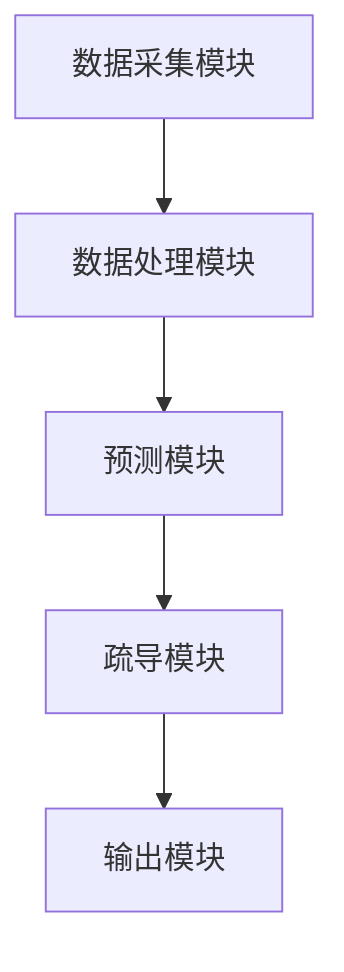

                 


# 价值投资中的智能交通拥堵预测与疏导系统分析

## 关键词：智能交通系统、价值投资、交通拥堵预测、疏导策略、算法模型、系统架构

## 摘要：本文深入分析了智能交通拥堵预测与疏导系统的核心原理，结合价值投资的视角，探讨了如何通过智能算法优化交通流量，减少拥堵，提升城市交通效率。文章从系统背景、核心概念、算法实现、系统架构、项目实战到最佳实践，全面解析了智能交通系统的价值投资潜力。

---

# 第一部分：背景介绍

## 第1章：智能交通拥堵问题与价值投资背景

### 1.1 交通拥堵问题的现状与挑战

#### 1.1.1 交通拥堵的定义与影响
交通拥堵是指在城市交通网络中，由于车流量超过道路容量而导致的车辆行驶速度下降、交通延误增加的现象。其主要影响包括：
- 增加车辆燃油消耗和排放，加剧环境污染。
- 延长出行时间，降低城市居民的生活质量。
- 提高交通事故发生率，增加社会经济损失。

#### 1.1.2 传统交通管理的局限性
传统交通管理手段，如交通信号灯和交警指挥，难以应对复杂的城市交通网络和动态变化的交通需求。主要问题包括：
- 无法实时感知交通流量变化。
- 缺乏全局优化能力，容易导致局部拥堵。
- 无法根据交通需求动态调整道路资源分配。

#### 1.1.3 智能交通系统的出现
智能交通系统（Intelligent Transportation Systems, ITS）通过传感器、摄像头、大数据分析和人工智能算法，实时感知和预测交通流量，优化交通信号灯配时，调整交通路线，从而有效缓解交通拥堵问题。

---

## 第2章：价值投资与智能交通系统的结合

### 2.1 价值投资的核心理念
价值投资是一种投资策略，强调以低于内在价值的价格购买优质资产。其核心理念包括：
- 识别具有长期增长潜力的项目。
- 通过深入分析项目的经济效益和社会价值，评估其投资回报。

### 2.2 智能交通系统的价值潜力
智能交通系统作为一项具有社会价值和经济价值的基础设施，可以通过以下方式实现价值投资：
- **经济效益**：通过减少交通拥堵，降低企业和居民的出行成本，提升整体经济效率。
- **社会价值**：改善城市交通环境，提高居民生活质量，减少环境污染。
- **长期价值**：智能交通系统可以通过数据积累和算法优化，持续提升交通效率，创造长期价值。

---

# 第二部分：核心概念与技术原理

## 第3章：智能交通拥堵预测的核心原理

### 3.1 数据采集与处理
#### 3.1.1 数据来源
智能交通系统通过以下途径采集交通数据：
- **传感器**：包括交通流量计、视频监控设备、GPS定位设备等。
- **交通管理系统**：包括交通信号灯、电子收费系统等。
- **移动设备**：通过智能手机、车载设备等获取实时交通数据。

#### 3.1.2 数据预处理
数据预处理是智能交通系统的核心步骤之一，包括：
- 数据清洗：去除噪声数据和异常值。
- 数据转换：将原始数据转换为可供模型使用的格式。
- 数据归一化：对不同量纲的数据进行标准化处理。

### 3.2 拥堵预测模型
#### 3.2.1 机器学习模型
常用的机器学习模型包括：
- **线性回归**：用于预测交通流量的趋势。
- **随机森林**：用于分类和回归分析，预测拥堵状态。
- **XGBoost**：用于分类和回归分析，预测拥堵概率。

#### 3.2.2 时间序列分析
时间序列分析是一种常用的拥堵预测方法，通过分析历史交通数据，预测未来的交通流量变化。

#### 3.2.3 空间分析
空间分析用于识别交通网络中的瓶颈路段和拥堵热点区域。

---

## 第4章：智能交通疏导系统的设计原理

### 4.1 疏导策略的制定
#### 4.1.1 交通信号灯优化
通过实时调整交通信号灯的配时，优化交通流量分配。

#### 4.1.2 路线优化
基于实时交通数据，为驾驶员提供最优行驶路线建议。

#### 4.1.3 交通需求管理
通过价格机制（如动态收费）调节交通需求，平衡交通流量。

### 4.2 系统的可扩展性与灵活性
智能交通系统需要具备以下特点：
- **可扩展性**：能够适应城市交通网络的扩展和变化。
- **灵活性**：能够根据实时交通数据动态调整疏导策略。

---

# 第三部分：算法实现与系统架构

## 第5章：拥堵预测算法的实现

### 5.1 机器学习模型的实现
#### 5.1.1 线性回归模型
$$
y = \beta_0 + \beta_1x + \epsilon
$$
其中，$y$ 是预测的交通流量，$x$ 是输入特征，$\beta_0$ 和 $\beta_1$ 是模型参数，$\epsilon$ 是误差项。

#### 5.1.2 随机森林模型
随机森林是一种基于决策树的集成学习算法，适用于分类和回归问题。

#### 5.1.3 XGBoost模型
XGBoost是一种高效的梯度提升算法，适用于分类和回归问题。

### 5.2 时间序列分析的实现
#### 5.2.1 ARIMA模型
ARIMA（自回归积分滑动平均模型）是一种常用的时间序列分析模型，适用于线性时间序列数据。

---

## 第6章：系统架构设计

### 6.1 系统功能设计
#### 6.1.1 数据采集模块
负责采集交通流量、车辆位置等实时数据。

#### 6.1.2 数据处理模块
对采集到的数据进行清洗、转换和归一化处理。

#### 6.1.3 预测模块
基于机器学习模型和时间序列分析模型，预测未来交通流量。

#### 6.1.4 疏导模块
根据预测结果，制定并执行疏导策略。

### 6.2 系统架构图


---

# 第四部分：项目实战与案例分析

## 第7章：项目实战

### 7.1 环境配置
#### 7.1.1 数据采集工具
常用的交通数据采集工具包括：
- **摄像头**：用于实时监测交通流量。
- **交通传感器**：用于采集车辆速度、流量等数据。

#### 7.1.2 数据处理工具
常用的编程语言和工具包括：
- **Python**：用于数据处理和机器学习模型的实现。
- **Pandas**：用于数据处理和分析。
- **NumPy**：用于数值计算。

### 7.2 核心代码实现
#### 7.2.1 数据预处理代码
```python
import pandas as pd
import numpy as np

# 读取数据
data = pd.read_csv('traffic_data.csv')

# 数据清洗
data = data.dropna()
data = data[~data['speed'].isin([0])]

# 数据归一化
from sklearn.preprocessing import MinMaxScaler
scaler = MinMaxScaler()
data_normalized = scaler.fit_transform(data[['speed', 'flow']])
```

#### 7.2.2 模型训练代码
```python
from sklearn.ensemble import RandomForestRegressor
from sklearn.metrics import mean_squared_error

# 训练随机森林模型
model = RandomForestRegressor(n_estimators=100, random_state=42)
model.fit(X_train, y_train)

# 模型预测
y_pred = model.predict(X_test)

# 模型评估
mse = mean_squared_error(y_test, y_pred)
print(f'Mean Squared Error: {mse}')
```

### 7.3 案例分析
#### 7.3.1 案例背景
假设我们选择一个城市的主要干道，分析其交通拥堵情况。

#### 7.3.2 数据分析
通过数据分析，识别出交通拥堵的高峰期和热点区域。

#### 7.3.3 模型预测
基于机器学习模型，预测未来的交通流量变化。

#### 7.3.4 疏导策略
根据预测结果，制定交通信号灯优化和路线调整策略。

---

# 第五部分：最佳实践与总结

## 第8章：最佳实践

### 8.1 小结
智能交通拥堵预测与疏导系统通过大数据分析和人工智能算法，能够有效优化城市交通流量，减少拥堵，提升交通效率。

### 8.2 注意事项
- 数据质量是模型预测的关键，需确保数据的准确性和完整性。
- 疏导策略的实施需要结合实际交通状况，避免一刀切。
- 系统的维护和更新是持续优化的重要环节。

### 8.3 拓展阅读
- 《数据挖掘与机器学习实战》
- 《智能交通系统设计与实现》
- 《价值投资与技术创新》

---

# 结语

智能交通拥堵预测与疏导系统是人工智能和大数据技术在交通管理领域的典型应用。通过价值投资的视角，我们可以更好地理解其社会价值和经济价值。未来，随着技术的不断发展，智能交通系统将更加智能化和人性化，为城市交通管理带来更大的变革。

