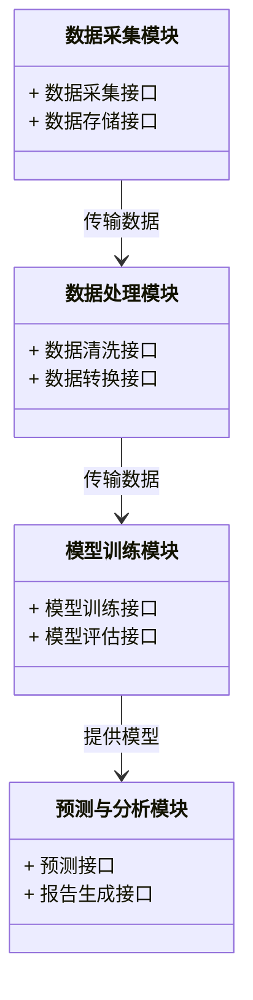
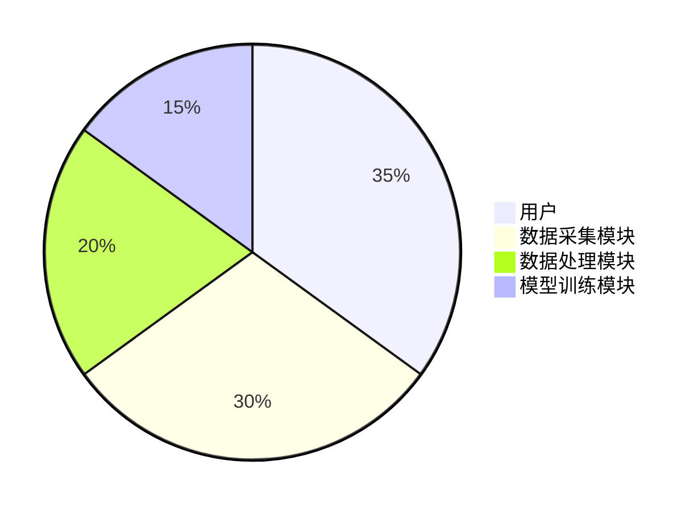
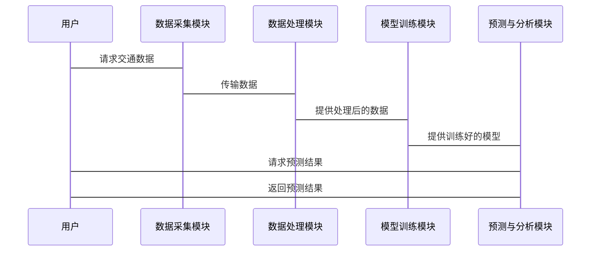

                 


---

# 价值投资中的智能交通拥堵预测系统分析

> **关键词**：价值投资，智能交通，拥堵预测，机器学习，交通流量，数据分析

> **摘要**：本文旨在探讨价值投资与智能交通拥堵预测系统之间的结合与应用。通过对智能交通拥堵预测系统的分析，揭示其在价值投资中的潜在价值，并通过具体案例分析，展示如何利用智能交通拥堵预测系统来优化投资决策。本文从系统背景、核心概念、算法原理、系统架构、项目实战等方面进行详细阐述，为读者提供全面的技术视角。

---

# 第1章: 价值投资与智能交通拥堵预测系统背景

## 1.1 价值投资的基本概念

### 1.1.1 价值投资的定义与核心理念

价值投资是一种投资策略，强调通过深入分析企业的基本面，寻找市场估值低于其内在价值的投资机会。其核心理念是购买低于其实际价值的资产，并长期持有，直到其价值被市场重新评估。

### 1.1.2 价值投资的核心要素

价值投资的核心要素包括：

1. **基本面分析**：关注企业的财务状况、盈利能力、行业地位等因素。
2. **市场估值**：寻找市场价格低于内在价值的资产。
3. **长期投资**：耐心持有优质资产，等待价值回归。

### 1.1.3 价值投资与智能交通拥堵预测的结合意义

随着城市化进程的加快，交通拥堵问题日益严重，影响了城市的运行效率和居民生活质量。通过智能交通拥堵预测系统，投资者可以更好地评估交通状况对房地产、基础设施等领域的影响，从而优化投资决策。

---

## 1.2 智能交通拥堵预测系统概述

### 1.2.1 智能交通拥堵预测系统的定义

智能交通拥堵预测系统是一种利用大数据、人工智能和物联网技术，实时分析交通数据，预测交通拥堵情况的系统。其目的是为交通管理部门和用户提供实时的交通信息，优化交通流量，减少拥堵。

### 1.2.2 智能交通拥堵预测系统的组成部分

智能交通拥堵预测系统通常包括以下几个部分：

1. **数据采集**：通过传感器、摄像头等设备收集交通流量数据。
2. **数据处理**：对采集到的数据进行清洗、转换和存储。
3. **模型训练**：利用机器学习算法训练交通拥堵预测模型。
4. **预测与分析**：基于模型预测交通拥堵情况，并生成报告。

### 1.2.3 智能交通拥堵预测系统的应用场景

智能交通拥堵预测系统广泛应用于城市交通管理、智能导航、公共交通调度等领域。例如，交通管理部门可以通过该系统优化信号灯控制，减少拥堵；驾驶员可以通过系统提供的实时信息选择最佳路线。

---

## 1.3 价值投资与智能交通拥堵预测系统的结合

### 1.3.1 交通拥堵与价值投资的关系

交通拥堵状况对房地产、商业、交通基础设施等领域有重要影响。例如，交通拥堵可能导致房地产价值下降，商业区域人流量减少。通过预测交通拥堵情况，投资者可以更准确地评估这些资产的价值。

### 1.3.2 智能交通拥堵预测在价值投资中的应用潜力

智能交通拥堵预测系统可以帮助投资者评估交通状况对资产价值的影响，从而优化投资决策。例如，投资者可以通过预测交通拥堵情况，选择交通便利的区域进行投资。

### 1.3.3 智能交通拥堵预测系统的投资价值分析

智能交通拥堵预测系统本身具有较高的投资价值。随着城市化进程的加快和人们对交通效率要求的提高，智能交通系统的需求将持续增长。投资者可以关注相关技术的研发、应用和服务领域。

---

## 1.4 本章小结

本章主要介绍了价值投资和智能交通拥堵预测系统的背景和基本概念，探讨了两者结合的意义和应用潜力。通过分析交通拥堵对投资决策的影响，揭示了智能交通拥堵预测系统在价值投资中的重要性。

---

# 第2章: 价值投资中的智能交通拥堵预测系统核心概念

## 2.1 价值投资中的智能交通拥堵预测系统核心概念

### 2.1.1 交通流量预测

交通流量预测是智能交通拥堵预测系统的核心功能之一。通过对历史数据的分析，系统可以预测未来的交通流量，从而提前发现潜在的拥堵点。

### 2.1.2 交通拥堵预测模型

交通拥堵预测模型是基于机器学习算法构建的数学模型，用于预测交通拥堵的发生时间和地点。常见的模型包括ARIMA、随机森林等。

### 2.1.3 价值投资中的交通数据特征

在价值投资中，交通数据特征（如交通流量、拥堵频率等）是评估资产价值的重要因素。投资者需要关注这些数据的变化趋势，以优化投资决策。

---

## 2.2 智能交通拥堵预测系统的原理与特征

### 2.2.1 数据驱动的交通拥堵预测

智能交通拥堵预测系统基于大量的交通数据，利用机器学习算法进行预测。数据来源包括交通传感器、摄像头、GPS等。

### 2.2.2 智能交通系统的数据特征

智能交通系统的数据特征包括：

1. **时间序列特征**：交通流量随时间的变化规律。
2. **空间特征**：不同区域的交通状况差异。
3. **关联特征**：交通拥堵与其他因素（如天气、节假日）的关系。

### 2.2.3 交通拥堵预测的数学模型

常用的数学模型包括：

1. **ARIMA模型**：用于时间序列预测。
2. **随机森林模型**：用于分类和回归分析。

---

## 2.3 价值投资中的智能交通拥堵预测系统架构

### 2.3.1 系统功能模块划分

智能交通拥堵预测系统通常包括以下功能模块：

1. **数据采集模块**：收集交通数据。
2. **数据处理模块**：清洗和转换数据。
3. **模型训练模块**：训练预测模型。
4. **预测与分析模块**：生成预测结果并分析。

### 2.3.2 系统数据流分析

数据流分析展示了系统各模块之间的数据交互关系。例如，数据采集模块将数据传输到数据处理模块，处理后的数据用于模型训练模块。

### 2.3.3 系统架构的可扩展性

系统架构应具备良好的可扩展性，以适应未来数据量和复杂性的增加。模块化设计和分布式架构是实现可扩展性的关键。

---

## 2.4 本章小结

本章详细介绍了价值投资中的智能交通拥堵预测系统的核心概念，包括交通流量预测、拥堵预测模型、数据特征等。同时，探讨了系统的原理和架构设计，为后续的算法分析和项目实现奠定了基础。

---

# 第3章: 价值投资中的智能交通拥堵预测系统算法原理

## 3.1 交通拥堵预测算法概述

### 3.1.1 时间序列预测模型

时间序列预测模型是一种基于历史数据预测未来趋势的模型。常用的模型包括ARIMA、LSTM等。

### 3.1.2 机器学习算法在交通拥堵预测中的应用

机器学习算法（如随机森林、支持向量机）在交通拥堵预测中具有重要作用。这些算法能够处理复杂的非线性关系，提高预测精度。

### 3.1.3 深度学习算法在交通拥堵预测中的应用

深度学习算法（如卷积神经网络、LSTM）在交通拥堵预测中表现优异。这些算法能够捕捉复杂的时空特征，提高预测精度。

---

## 3.2 基于机器学习的交通拥堵预测模型

### 3.2.1 数据预处理与特征提取

数据预处理包括数据清洗、缺失值处理等。特征提取包括选择与拥堵相关的特征（如时间、地点、天气等）。

### 3.2.2 算法选择与模型训练

根据数据特征和预测目标选择合适的算法，进行模型训练。例如，使用随机森林模型进行分类预测。

### 3.2.3 模型评估与优化

通过交叉验证、准确率、召回率等指标评估模型性能，并通过网格搜索优化模型参数。

---

## 3.3 交通拥堵预测的数学模型与公式

### 3.3.1 时间序列模型（ARIMA）

ARIMA模型是一种常用的时间序列预测模型，适用于具有趋势和季节性特征的数据。

$$ARIMA(p, d, q)$$

其中，$p$为自回归阶数，$d$为差分阶数，$q$为移动平均阶数。

### 3.3.2 随机森林模型

随机森林是一种基于决策树的集成学习算法，适用于分类和回归问题。

$$y = \sum_{i=1}^{n} w_i \cdot y_i$$

其中，$w_i$为决策树的权重，$y_i$为决策树的预测值。

---

## 3.4 本章小结

本章详细介绍了交通拥堵预测算法的原理和实现过程，包括数据预处理、模型选择、训练与优化。通过数学公式和实际案例分析，展示了算法在智能交通拥堵预测系统中的应用。

---

# 第4章: 智能交通拥堵预测系统的系统分析与架构设计

## 4.1 系统功能设计

### 4.1.1 领域模型设计

领域模型描述了系统的功能模块和交互关系。以下是领域模型的类图（使用mermaid）：



### 4.1.2 系统架构设计

系统架构设计包括前端和后端两部分。前端负责用户交互，后端负责数据处理和模型训练。以下是系统架构图（使用mermaid）：



### 4.1.3 接口设计

系统需要提供以下接口：

1. 数据采集接口：用于采集交通数据。
2. 数据处理接口：用于清洗和转换数据。
3. 模型训练接口：用于训练预测模型。
4. 预测接口：用于预测交通拥堵情况。

### 4.1.4 交互序列图

以下是系统交互的序列图（使用mermaid）：



---

## 4.2 本章小结

本章详细介绍了智能交通拥堵预测系统的功能设计、架构设计和接口设计，展示了系统各部分之间的交互关系。

---

# 第5章: 价值投资中的智能交通拥堵预测系统项目实战

## 5.1 项目背景与目标

### 5.1.1 项目背景

本项目旨在利用智能交通拥堵预测系统，帮助投资者评估交通状况对房地产价值的影响。

### 5.1.2 项目目标

通过构建智能交通拥堵预测系统，实现交通拥堵的实时预测，并分析其对房地产价值的影响。

---

## 5.2 环境安装与配置

### 5.2.1 系统环境

- 操作系统：Linux/Windows
- Python版本：3.8以上
- 数据库：MySQL/PostgreSQL

### 5.2.2 工具安装

- Python库：pandas、numpy、scikit-learn、xgboost
- 数据可视化工具：Matplotlib、Seaborn
- 版本控制工具：Git

---

## 5.3 系统核心代码实现

### 5.3.1 数据预处理代码

```python
import pandas as pd
import numpy as np

# 读取数据
data = pd.read_csv('traffic_data.csv')

# 数据清洗
data = data.dropna()
data = data.drop_duplicates()

# 数据转换
data['time'] = pd.to_datetime(data['time'])
data.set_index('time', inplace=True)
```

### 5.3.2 模型训练代码

```python
from sklearn.ensemble import RandomForestClassifier
from sklearn.metrics import accuracy_score

# 特征选择
X = data.drop('label', axis=1)
y = data['label']

# 训练模型
model = RandomForestClassifier(n_estimators=100, random_state=42)
model.fit(X, y)

# 模型评估
y_pred = model.predict(X)
print('准确率:', accuracy_score(y, y_pred))
```

### 5.3.3 预测与分析代码

```python
# 预测未来交通拥堵情况
future_data = pd.read_csv('future_traffic_data.csv')
future_data['time'] = pd.to_datetime(future_data['time'])
future_data.set_index('time', inplace=True)

y_future_pred = model.predict(future_data)
print('未来交通拥堵预测结果:', y_future_pred)
```

---

## 5.4 实际案例分析

### 5.4.1 案例背景

假设我们有一个城市，交通数据包括交通流量、时间、天气等信息。我们需要预测未来一周的交通拥堵情况，并分析其对房地产价值的影响。

### 5.4.2 数据分析与解读

通过对历史数据的分析，我们发现交通拥堵在高峰时段和恶劣天气下更为严重。因此，我们可以预测未来一周的交通拥堵情况，并评估其对周边房地产价值的影响。

### 5.4.3 投资决策建议

根据预测结果，建议投资者在交通拥堵严重的区域谨慎投资，而在交通便利的区域增加投资。

---

## 5.5 项目小结

本章通过实际案例分析，展示了智能交通拥堵预测系统在价值投资中的应用。通过数据预处理、模型训练和预测分析，帮助投资者做出更明智的投资决策。

---

# 第6章: 价值投资中的智能交通拥堵预测系统最佳实践

## 6.1 项目小结

### 6.1.1 核心知识点回顾

- 价值投资的基本概念
- 智能交通拥堵预测系统的原理与架构
- 机器学习算法在交通拥堵预测中的应用

### 6.1.2 技术要点总结

- 数据预处理与特征提取
- 模型选择与优化
- 系统架构设计与实现

---

## 6.2 注意事项与风险提示

### 6.2.1 数据质量问题

数据的质量直接影响预测结果的准确性。需要注意数据的完整性、准确性和及时性。

### 6.2.2 模型过拟合问题

模型过拟合可能导致预测结果不准确。需要通过交叉验证和参数优化来避免过拟合。

### 6.2.3 系统可扩展性问题

随着数据量的增加，系统需要具备良好的可扩展性。可以通过模块化设计和分布式架构来实现。

---

## 6.3 拓展阅读与学习资源

### 6.3.1 推荐书籍

1. 《深入浅出机器学习》
2. 《智能交通系统》
3. 《价值投资实战》

### 6.3.2 在线资源

1. GitHub代码库：[智能交通拥堵预测系统](https://github.com/...)
2. 专业论坛：[机器学习社区](https://www...)

### 6.3.3 专业培训课程

1. 《机器学习实战》在线课程
2. 《智能交通系统》专业课程

---

## 6.4 本章小结

本章总结了项目的核心知识点，提出了注意事项和风险提示，并提供了拓展阅读和学习资源，帮助读者进一步深入学习和实践。

---

# 第7章: 价值投资中的智能交通拥堵预测系统总结与展望

## 7.1 总结

### 7.1.1 核心成果

通过本项目，我们成功构建了智能交通拥堵预测系统，并将其应用于价值投资决策中。

### 7.1.2 主要收获

- 掌握了智能交通拥堵预测系统的构建方法
- 学习了机器学习算法在交通预测中的应用
- 提升了数据分析与决策能力

---

## 7.2 展望

### 7.2.1 技术发展

随着人工智能和大数据技术的不断发展，智能交通拥堵预测系统将更加智能化和精准化。

### 7.2.2 应用领域扩展

智能交通拥堵预测系统在城市规划、公共交通调度等领域具有广阔的应用前景。

### 7.2.3 投资策略优化

通过智能交通拥堵预测系统的支持，投资者可以更科学地进行价值投资，优化投资组合。

---

## 7.3 本章小结

本章总结了项目的成果和收获，展望了智能交通拥堵预测系统在技术和应用领域的未来发展方向，为读者提供了进一步学习和实践的方向。

---

# 结语

智能交通拥堵预测系统在价值投资中的应用，不仅提高了投资决策的科学性，也为投资者提供了新的视角和工具。随着技术的不断进步，智能交通拥堵预测系统将在价值投资中发挥越来越重要的作用。

