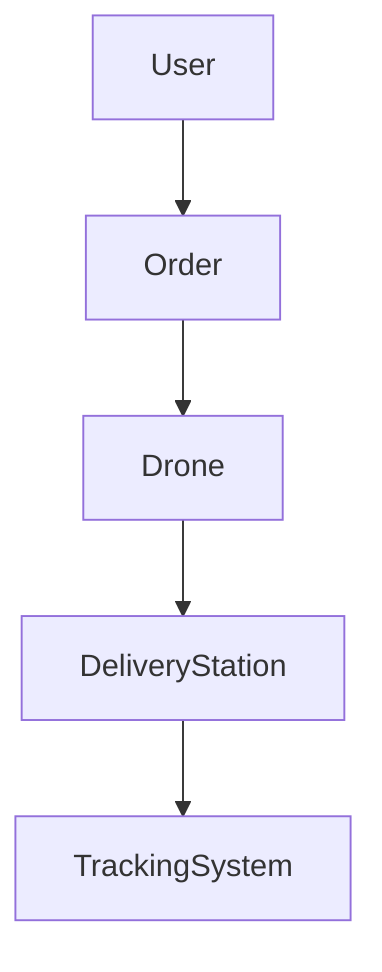
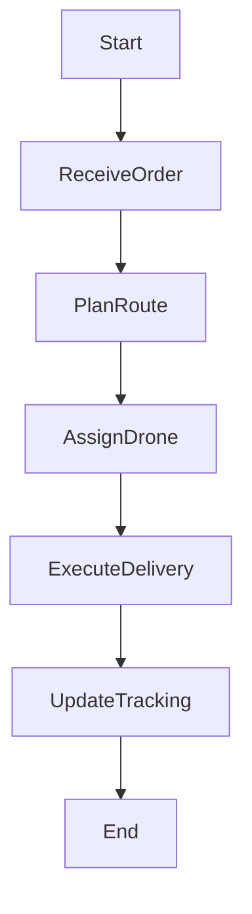
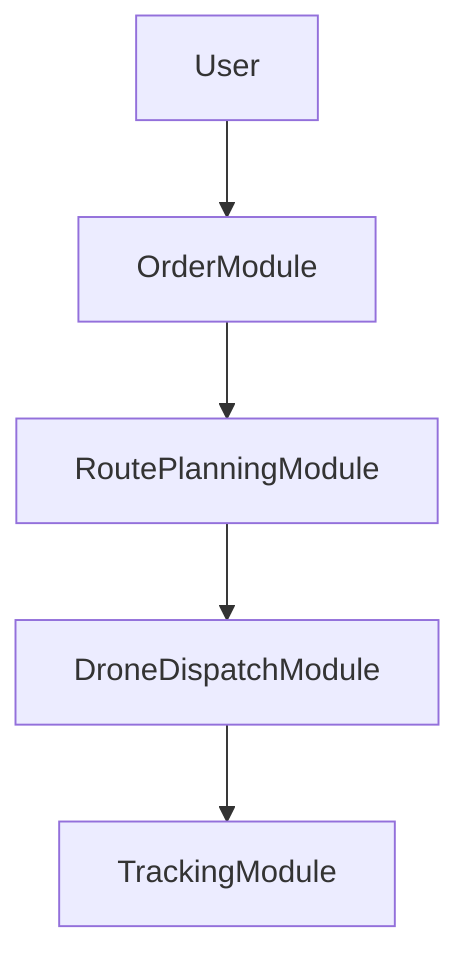
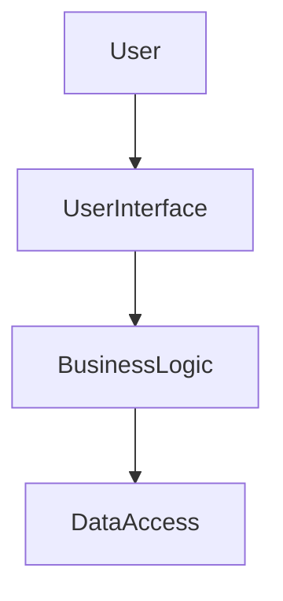
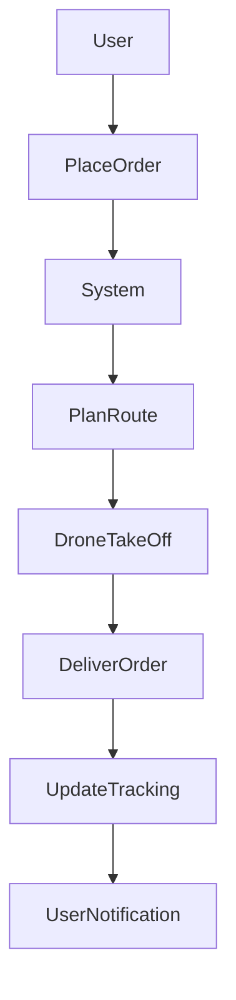

                 


# 价值投资中的智能交通无人机配送系统分析

## 关键词：价值投资，智能交通，无人机配送系统，物流优化，算法分析，系统架构设计

## 摘要：  
本文分析了智能交通无人机配送系统在价值投资中的潜力和应用，探讨了无人机配送系统的背景、核心概念、算法原理、系统架构设计以及实际项目案例。通过详细的技术分析和系统设计，揭示了无人机配送系统在物流优化中的优势，并为投资者提供了相关的投资建议和最佳实践。

---

## 第1章: 价值投资中的智能交通无人机配送系统概述

### 1.1 价值投资与智能交通的结合  
价值投资是一种长期投资策略，注重从企业的基本面分析中寻找被市场低估的投资机会。近年来，智能交通技术的快速发展，特别是无人机配送系统的兴起，为价值投资提供了新的研究方向。  

#### 1.1.1 价值投资的核心概念  
价值投资的核心在于寻找具有持续竞争优势、良好管理和合理估值的企业。在智能交通领域，无人机配送系统的高效性和低成本优势，使其成为价值投资者关注的焦点。  

#### 1.1.2 智能交通系统的定义与特点  
智能交通系统（ITS）利用先进的信息技术，优化交通管理和服务。无人机配送作为ITS的重要组成部分，通过无人机完成货物的运输，显著提升了物流效率。  

#### 1.1.3 无人机配送系统在价值投资中的应用  
无人机配送系统通过降低物流成本、提高配送效率，为企业创造更大的利润空间，进而提升企业的市场价值。这为投资者提供了新的投资机会。

### 1.2 无人机配送系统的背景与发展  
无人机配送系统的出现，源于对高效物流的需求。通过无人机实现快速、精准的配送，不仅提高了物流效率，还减少了运输成本。  

#### 1.2.1 无人机配送的基本原理  
无人机通过GPS导航和路径规划算法，实现自主飞行和货物配送。其核心优势在于快速响应和灵活配送能力。  

#### 1.2.2 无人机配送与传统物流的对比  
与传统物流相比，无人机配送更加高效，尤其是在偏远地区和紧急情况下表现出色。然而，其成本和监管问题仍需进一步解决。  

#### 1.2.3 无人机配送系统的投资价值  
无人机配送系统的广泛应用将推动物流行业的升级，为企业带来显著的经济效益，这为投资者提供了长期稳定的回报潜力。

## 第2章: 无人机配送系统的核心概念与联系

### 2.1 无人机配送系统的实体关系分析  
无人机配送系统涉及多个实体，包括用户、无人机、配送站和订单等。通过分析这些实体之间的关系，可以更好地理解系统的运行机制。

#### 2.1.1 实体关系图  
使用Mermaid图展示实体关系：  


### 2.2 无人机配送系统的流程图  
无人机配送的流程包括订单接收、路径规划、配送执行和反馈等环节。

#### 2.2.1 流程图  


### 2.3 核心概念对比分析  
无人机配送系统在成本、效率和可靠性方面与传统物流进行对比，分析其优劣势。

#### 2.3.1 优势对比  
- 高效性：无人机配送速度快，尤其适用于偏远地区。
- 成本优势：通过减少人力和时间成本，降低物流费用。

#### 2.3.2 劣势对比  
- 成本高：无人机研发和维护成本较高。
- 受限于天气条件：恶劣天气可能影响飞行安全。

## 第3章: 无人机配送系统的算法原理

### 3.1 路径优化算法概述  
路径优化是无人机配送的核心算法，常用算法包括Dijkstra和遗传算法。

#### 3.1.1 Dijkstra算法原理  
Dijkstra算法用于寻找起点到终点的最短路径，适合无人机配送中的路径规划。

#### 3.1.2 遗传算法原理  
遗传算法通过模拟自然选择过程，优化配送路径，适用于多目标配送场景。

### 3.2 算法实现  
通过Python代码实现路径优化算法，展示其在无人机配送中的应用。

#### 3.2.1 Dijkstra算法实现  
```python
import heapq

def dijkstra(graph, start, end):
    dist = {node: float('infinity') for node in graph}
    dist[start] = 0
    heap = [(0, start)]
    
    while heap:
        current_dist, current_node = heapq.heappop(heap)
        if current_dist > dist[current_node]:
            continue
        if current_node == end:
            break
        for neighbor, weight in graph[current_node].items():
            if dist[neighbor] > current_dist + weight:
                dist[neighbor] = current_dist + weight
                heapq.heappush(heap, (dist[neighbor], neighbor))
    return dist[end]
```

#### 3.2.2 数学模型与公式  
路径优化问题可以表示为：  
$$ \text{minimize} \quad \sum_{i} c_{i} $$
$$ \text{subject to} \quad \sum_{i} x_{i} = 1 $$
其中，\( c_{i} \) 是边的权重，\( x_{i} \) 是决策变量。

## 第4章: 无人机配送系统的系统架构设计

### 4.1 系统功能模块设计  
无人机配送系统包括用户下单、路径规划、无人机调度和订单跟踪四个模块。

#### 4.1.1 功能模块设计  
使用Mermaid图展示系统功能模块：  


### 4.2 系统架构设计  
采用分层架构设计，包括用户层、业务逻辑层和数据访问层。

#### 4.2.1 分层架构图  


### 4.3 系统接口设计  
定义用户端、无人机端和后台管理接口，确保系统各部分协同工作。

#### 4.3.1 接口设计  
- 用户端接口：接收订单请求。
- 无人机端接口：控制无人机飞行。
- 后台管理接口：处理订单和调度无人机。

### 4.4 系统交互流程设计  
通过Mermaid图展示系统交互流程：  


## 第5章: 无人机配送系统的项目实战与最佳实践

### 5.1 项目实战  
以某电商平台的无人机配送项目为例，展示系统的实现和应用。

#### 5.1.1 环境配置  
安装Python、Mermaid和相关开发工具。

#### 5.1.2 核心代码实现  
实现路径规划算法和系统交互流程。

#### 5.1.3 案例分析  
通过具体案例分析无人机配送系统的实际效果和经济效益。

### 5.2 最佳实践  
总结无人机配送系统的投资建议和未来发展。

#### 5.2.1 投资建议  
- 关注具有技术优势的企业。
- 评估政策支持和市场潜力。

#### 5.2.2 注意事项  
- 考虑无人机配送的成本和监管风险。
- 关注技术进步和市场动态。

### 5.3 小结  
无人机配送系统在价值投资中具有重要地位，通过技术创新和成本优化，未来将为企业创造更大的价值。

---

## 总结  
本文通过详细分析无人机配送系统的背景、核心概念、算法原理、系统架构和实际案例，揭示了其在价值投资中的潜力和应用。通过技术分析和系统设计，为投资者提供了有益的参考和最佳实践建议。

