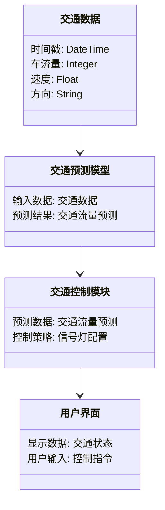
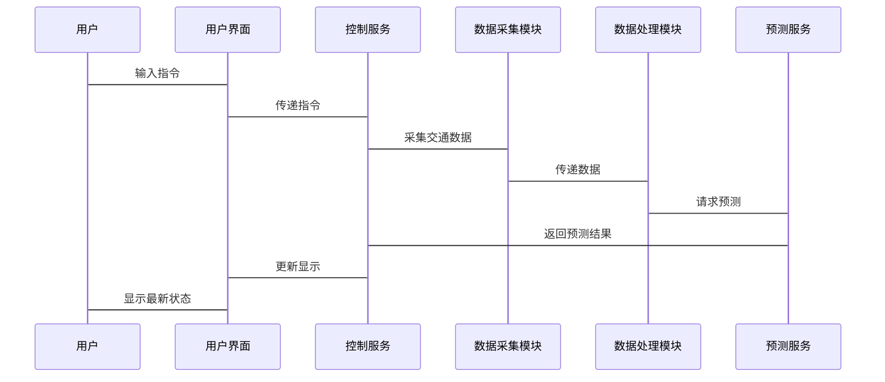

                 

# 价值投资中的智能交通系统发展趋势

> 关键词：价值投资，智能交通系统，ITS，交通效率，算法优化，系统架构，深度学习，强化学习

> 摘要：本文探讨了智能交通系统（ITS）在价值投资中的发展趋势，分析了ITS的核心技术、价值评估模型、算法原理、系统架构设计、项目实战以及最佳实践。通过结合价值投资的长期视角，本文深入挖掘ITS技术在提高交通效率、优化资源配置方面的潜力，并为投资者提供有效的决策支持。

---

## 第1章: 价值投资与智能交通系统概述

### 1.1 价值投资的基本概念

#### 1.1.1 价值投资的定义与核心理念
价值投资是一种长期投资策略，强调通过深入分析企业的基本面，寻找那些市场价格低于其内在价值的公司进行投资。其核心理念包括：
- **长期视角**：关注企业的长期发展潜力，而非短期市场波动。
- **安全边际**：确保买入价格低于企业的内在价值，以降低风险。
- **竞争优势**：寻找具有强大护城河的企业，确保其长期盈利能力。

#### 1.1.2 智能交通系统的定义与特点
智能交通系统（ITS）是通过先进的信息技术、数据处理技术和通信技术，对交通系统进行智能化管理与优化的系统。其特点包括：
- **实时性**：能够实时采集和处理交通数据。
- **智能化**：通过人工智能技术实现交通预测、优化和决策。
- **集成性**：整合多种交通 subsystem（如交通信号控制、车辆定位、交通事故检测等）。

#### 1.1.3 价值投资与智能交通系统的结合
价值投资与ITS的结合体现在以下几个方面：
- **技术驱动**：ITS的核心技术（如人工智能、大数据）为企业创造价值。
- **市场潜力**：随着城市化进程的加快，ITS的应用前景广阔。
- **长期收益**：通过投资于 ITS 相关企业，投资者可以分享其技术进步和市场扩大的收益。

### 1.2 智能交通系统的组成部分

#### 1.2.1 数据采集与处理
智能交通系统的核心是数据的采集与处理。主要的数据来源包括：
- **交通传感器**：如交通摄像头、雷达、车流量检测器等。
- **车辆数据**：如 GPS 数据、车辆速度、加速度等。
- **用户数据**：如移动设备数据、社交媒体数据等。

#### 1.2.2 交通预测与优化
基于采集到的数据，ITS能够进行交通流量预测和优化。常用的方法包括：
- **时间序列分析**：如ARIMA模型。
- **机器学习**：如随机森林、XGBoost等。
- **深度学习**：如LSTM网络。

#### 1.2.3 智能决策与控制
智能决策系统基于预测结果，制定最优的交通控制策略。例如：
- **交通信号优化**：根据实时流量调整信号灯时长。
- **路径规划**：为车辆提供最优行驶路线。
- **事故处理**：快速响应交通事故，疏导交通。

### 1.3 价值投资中的智能交通系统发展趋势

#### 1.3.1 ITS技术的演进历程
 ITS 的发展经历了以下几个阶段：
- **早期阶段**：20世纪80年代，主要用于交通信号控制和简单的交通监控。
- **发展阶段**：90年代，引入了计算机技术和通信技术，实现了数据的实时传输和处理。
- **智能化阶段**：近年来，随着人工智能和大数据技术的发展，ITS进入智能化阶段。

#### 1.3.2 价值投资视角下的ITS发展机遇
从价值投资的角度来看，ITS 的发展机遇主要体现在以下几个方面：
- **技术进步**：人工智能和大数据技术的快速发展为 ITS 提供了强大的技术支持。
- **市场需求**：随着城市交通问题的加剧，市场对 ITS 的需求不断增加。
- **政策支持**：各国政府都在加大对 ITS 的支持力度，推动其产业化发展。

#### 1.3.3 ITS对交通效率提升的潜在价值
通过优化交通流量、减少拥堵、提高车辆通行效率，ITS 可以显著降低交通成本，提升整体交通效率。从价值投资的角度来看，这意味着相关企业的盈利能力将得到提升，从而增加其市场价值。

---

## 第2章: 智能交通系统的价值评估模型

### 2.1 ITS核心价值的定义

#### 2.1.1 ITS的核心价值维度
 ITS 的核心价值可以从以下几个维度进行评估：
- **技术能力**：企业的技术水平和创新能力。
- **市场潜力**：企业的市场占有率和未来增长潜力。
- **财务状况**：企业的财务健康状况和盈利能力。
- **竞争优势**：企业在行业中的竞争优势。

#### 2.1.2 价值评估的关键指标
常用的评估指标包括：
- **市盈率（P/E）**：市价与每股收益的比率。
- **市净率（P/B）**：市价与每股净资产的比率。
- **ROE（净资产收益率）**：衡量企业的盈利能力。
- **研发投入占比**：衡量企业的创新能力。

### 2.2 ITS价值评估模型的构建

#### 2.2.1 数据采集与特征提取
在价值评估模型的构建过程中，首先需要采集相关数据，包括：
- **企业财务数据**：收入、利润、研发投入等。
- **市场数据**：股票价格、市场占有率等。
- **技术数据**：专利数量、技术先进性等。

#### 2.2.2 模型构建与验证
常用的模型构建方法包括：
- **回归分析**：通过回归模型预测企业的价值。
- **聚类分析**：将企业分成不同的类别，进行比较分析。
- **神经网络**：利用深度学习模型进行价值评估。

#### 2.2.3 模型的应用与优化
模型的应用需要结合实际场景，不断进行优化。例如：
- **动态调整模型参数**：根据市场变化调整模型的权重。
- **引入新的数据源**：如实时的市场反馈数据。
- **模型的可解释性**：确保模型的决策过程具有可解释性。

### 2.3 价值评估模型的数学公式

#### 2.3.1 综合价值评分公式
综合价值评分公式可以表示为：
$$ V = \sum_{i=1}^{n} w_i x_i $$
其中，$w_i$为第i个指标的权重，$x_i$为第i个指标的评分。

#### 2.3.2 模型的验证与优化
模型的验证可以通过以下步骤进行：
1. **数据分割**：将数据分为训练集、验证集和测试集。
2. **模型训练**：在训练集上训练模型。
3. **模型验证**：在验证集上调整模型参数。
4. **模型测试**：在测试集上评估模型的性能。

---

## 第3章: 智能交通系统的算法原理

### 3.1 ITS算法的核心原理

#### 3.1.1 数据预处理与特征工程
数据预处理是算法实现的基础，包括：
- **数据清洗**：处理缺失值、异常值等。
- **特征提取**：从原始数据中提取有用特征。
- **特征标准化**：对特征进行标准化处理，确保不同特征的可比性。

#### 3.1.2 算法选择与优化
在选择算法时，需要考虑以下几个因素：
- **数据类型**：分类、回归、聚类等问题。
- **数据规模**：大数据场景可能需要分布式算法。
- **模型解释性**：是否需要模型的可解释性。

#### 3.1.3 算法的性能评估
常用的性能评估指标包括：
- **准确率**：模型正确预测的比例。
- **召回率**：模型识别出正类的比例。
- **F1分数**：准确率和召回率的调和平均数。

### 3.2 基于深度学习的ITS算法

#### 3.2.1 神经网络模型在ITS中的应用
神经网络模型在ITS中的应用包括：
- **交通流量预测**：利用LSTM网络进行时间序列预测。
- **图像识别**：利用CNN网络识别交通标志和车辆。
- **行为预测**：预测驾驶员的行为，优化交通信号控制。

#### 3.2.2 深度学习模型的训练流程
深度学习模型的训练流程通常包括：
1. **数据准备**：收集和预处理数据。
2. **模型构建**：设计神经网络的结构。
3. **模型训练**：使用训练数据训练模型。
4. **模型验证**：在验证集上调整模型参数。
5. **模型测试**：在测试集上评估模型性能。

#### 3.2.3 模型的调参与优化
模型调优可以通过以下方法进行：
- **调整学习率**：通过学习率衰减优化训练过程。
- **改变网络结构**：增加或减少网络层数。
- **引入正则化**：防止模型过拟合。

### 3.3 基于强化学习的ITS算法

#### 3.3.1 强化学习的基本原理
强化学习通过智能体与环境的交互，学习最优策略。在ITS中，可以用于：
- **交通信号控制**：智能体通过与交通环境的交互，学习最优的信号控制策略。
- **路径规划**：智能体通过与交通环境的交互，学习最优的行驶路径。

#### 3.3.2 强化学习在交通控制中的应用
强化学习在交通控制中的应用包括：
- **动态交通信号优化**：根据实时流量调整信号灯时长。
- **自动驾驶决策**：通过强化学习训练自动驾驶车辆的决策系统。

#### 3.3.3 强化学习算法的实现与优化
强化学习算法的实现通常包括：
1. **环境定义**：定义智能体所处的环境。
2. **动作空间定义**：定义智能体可执行的动作。
3. **奖励函数设计**：设计奖励函数，指导智能体的学习方向。
4. **策略优化**：通过策略梯度方法优化智能体的策略。

---

## 第4章: ITS系统的架构设计与实现

### 4.1 系统功能设计

#### 4.1.1 系统功能模块划分
ITS系统的主要功能模块包括：
- **数据采集模块**：负责采集交通数据。
- **数据处理模块**：对采集到的数据进行预处理。
- **模型预测模块**：利用机器学习模型进行交通预测。
- **控制决策模块**：根据预测结果制定控制策略。
- **用户界面模块**：提供友好的用户界面，供用户查看和操作。

#### 4.1.2 系统功能设计的领域模型
领域模型是一个系统的核心业务逻辑的抽象，用于描述系统中的实体及其关系。ITS系统的领域模型可以用类图表示，如下：

### 4.2 系统架构设计

#### 4.2.1 系统架构设计的总体思路
ITS系统的架构设计需要考虑以下几个方面：
- **可扩展性**：系统应支持功能的扩展。
- **可维护性**：系统应易于维护和升级。
- **高性能**：系统应具备处理大规模数据的能力。
- **安全性**：系统应具备数据安全和网络安全的能力。

#### 4.2.2 系统架构设计的分层结构
ITS系统的架构可以采用分层结构，包括：
- **数据层**：负责数据的存储和管理。
- **业务逻辑层**：负责系统的业务逻辑处理。
- **用户界面层**：负责与用户的交互。

#### 4.2.3 系统架构设计的详细描述
系统的详细架构设计可以采用微服务架构，包括以下几个服务：
- **数据采集服务**：负责采集交通数据。
- **数据处理服务**：负责对数据进行预处理。
- **预测服务**：负责利用机器学习模型进行交通预测。
- **控制服务**：负责根据预测结果制定控制策略。
- **用户界面服务**：负责提供友好的用户界面。

### 4.3 系统接口设计

#### 4.3.1 系统内部接口设计
系统内部接口设计需要考虑以下几个方面：
- **数据接口**：数据采集模块与数据处理模块之间的接口。
- **预测接口**：数据处理模块与预测服务之间的接口。
- **控制接口**：预测服务与控制服务之间的接口。

#### 4.3.2 系统外部接口设计
系统外部接口设计需要考虑以下几个方面：
- **用户接口**：用户与系统之间的交互接口。
- **第三方接口**：与其他系统（如交通管理部门）之间的接口。

### 4.4 系统交互设计

#### 4.4.1 系统交互流程
系统的交互流程如下：
1. 用户通过用户界面输入指令。
2. 用户界面将指令传递给控制服务。
3. 控制服务根据当前的交通状态，调整交通信号灯配置。
4. 数据采集模块采集新的交通数据。
5. 数据处理模块对数据进行预处理。
6. 预测服务利用机器学习模型进行交通预测。
7. 预测结果传递给控制服务。
8. 控制服务根据预测结果调整交通信号灯配置。
9. 用户界面更新显示最新的交通状态。

#### 4.4.2 系统交互的详细描述
系统的交互流程可以用序列图表示，如下：

---

## 第5章: ITS项目的实战与应用

### 5.1 环境搭建

#### 5.1.1 开发环境的选择
开发环境的选择需要考虑以下几个方面：
- **操作系统**：推荐使用Linux或macOS。
- **编程语言**：推荐使用Python。
- **开发工具**：推荐使用Jupyter Notebook或PyCharm。

#### 5.1.2 数据源的选择
数据源的选择需要考虑以下几个方面：
- **数据类型**：选择适合机器学习的数据。
- **数据规模**：选择合适的数据集大小。
- **数据质量**：确保数据的完整性和准确性。

### 5.2 系统核心实现

#### 5.2.1 数据预处理与特征工程
数据预处理是机器学习模型实现的基础，包括：
- **数据清洗**：处理缺失值、异常值等。
- **特征提取**：从原始数据中提取有用特征。
- **特征标准化**：对特征进行标准化处理。

#### 5.2.2 模型实现与优化
模型的实现与优化包括以下几个步骤：
1. **模型选择**：选择适合的机器学习模型。
2. **模型训练**：在训练集上训练模型。
3. **模型验证**：在验证集上调整模型参数。
4. **模型测试**：在测试集上评估模型性能。

#### 5.2.3 系统集成与部署
系统的集成与部署包括以下几个步骤：
1. **系统集成**：将各个功能模块集成到一个系统中。
2. **系统测试**：对系统进行全面的测试，确保系统的稳定性和可靠性。
3. **系统部署**：将系统部署到实际环境中，进行实际应用。

### 5.3 项目实战的案例分析

#### 5.3.1 案例背景
假设我们正在开发一个城市交通信号优化系统，旨在通过智能算法优化交通信号灯的配置，减少交通拥堵。

#### 5.3.2 数据采集与处理
我们首先需要采集交通数据，包括：
- **交通流量**：每分钟的车流量。
- **信号灯状态**：每分钟的信号灯状态。
- **天气状况**：温度、湿度、降雨量等。

#### 5.3.3 模型实现与优化
我们选择使用LSTM网络进行交通流量预测，并根据预测结果优化信号灯配置。模型的训练过程如下：
1. **数据预处理**：将原始数据进行标准化处理。
2. **模型训练**：在训练集上训练LSTM网络。
3. **模型验证**：在验证集上调整模型参数。
4. **模型测试**：在测试集上评估模型性能。

#### 5.3.4 系统集成与部署
我们将训练好的模型集成到系统中，并进行实际应用测试。测试结果表明，系统能够有效优化交通信号灯配置，减少交通拥堵。

### 5.4 项目小结

#### 5.4.1 项目成果
通过本次项目，我们成功实现了智能交通信号优化系统，验证了ITS技术在实际应用中的有效性。

#### 5.4.2 项目经验总结
在项目实施过程中，我们总结了以下几点经验：
- **数据质量的重要性**：数据的质量直接影响模型的性能。
- **模型调优的必要性**：模型的调优能够显著提高预测的准确性。
- **系统集成的复杂性**：系统集成需要考虑多个模块之间的协同工作。

---

## 第6章: ITS系统的最佳实践与注意事项

### 6.1 投资策略与风险管理

#### 6.1.1 投资策略
投资者在进行ITS投资时，需要注意以下几个方面：
- **技术风险**：ITS技术的复杂性和不确定性。
- **市场风险**：市场的波动性和竞争的加剧。
- **政策风险**：政策的变化可能对ITS行业产生重大影响。

#### 6.1.2 风险管理
投资者可以通过以下方式进行风险管理：
- **分散投资**：将资金分散投资于不同的项目，降低风险。
- **定期评估**：定期评估投资项目的表现，及时调整投资策略。
- **关注政策变化**：密切关注政策变化，及时调整投资策略。

### 6.2 系统维护与优化

#### 6.2.1 系统维护
系统维护是保证ITS系统正常运行的重要环节，包括：
- **数据更新**：定期更新系统中的数据。
- **软件升级**：定期升级系统软件，修复漏洞。
- **硬件维护**：定期检查和维护硬件设备。

#### 6.2.2 系统优化
系统优化是提高ITS系统性能的重要手段，包括：
- **算法优化**：不断优化算法，提高预测的准确性。
- **系统架构优化**：优化系统架构，提高系统的扩展性和可维护性。
- **性能监控**：通过性能监控工具，实时监控系统性能，及时发现和解决问题。

### 6.3 技术展望与未来方向

#### 6.3.1 技术发展趋势
ITS技术的发展趋势包括：
- **智能化**：进一步提高系统的智能化水平。
- **集成化**：实现不同 subsystem 的深度集成。
- **网络化**：构建更加完善的交通网络。

#### 6.3.2 未来研究方向
未来的研究方向包括：
- **新型算法研究**：研究更高效的算法，提高系统的预测和控制能力。
- **多模态数据融合**：研究如何更好地融合多模态数据，提高系统的智能化水平。
- **人机协作**：研究如何实现人机协作，提高系统的决策能力和用户体验。

### 6.4 本章小结

#### 6.4.1 小结
通过本章的讨论，我们了解了ITS系统在实际应用中的最佳实践和注意事项。

#### 6.4.2 注意事项
在实际应用中，需要注意以下几点：
- **数据安全**：确保系统的数据安全，防止数据泄露。
- **系统稳定性**：确保系统的稳定性，避免系统崩溃。
- **用户隐私**：保护用户的隐私，遵守相关法律法规。

#### 6.4.3 拓展阅读
对于感兴趣的研究者和投资者，可以进一步阅读以下内容：
- **深度学习在ITS中的应用**：研究深度学习在ITS中的更多应用。
- **强化学习在ITS中的应用**：研究强化学习在ITS中的更多应用。
- **ITS系统的安全与隐私保护**：研究ITS系统的安全与隐私保护。

---

## 第7章: 总结与展望

### 7.1 本章总结

#### 7.1.1 核心内容回顾
通过本文的讨论，我们了解了ITS技术在价值投资中的发展趋势，包括ITS的核心技术、价值评估模型、算法原理、系统架构设计、项目实战以及最佳实践。

#### 7.1.2 本文的主要贡献
本文的主要贡献包括：
- **系统性分析**：系统性地分析了ITS技术在价值投资中的发展趋势。
- **实用指导**：为投资者提供了实用的决策支持和投资建议。
- **技术深度**：深入探讨了ITS技术的核心算法和系统架构设计。

### 7.2 未来展望

#### 7.2.1 技术发展
未来，ITS技术将朝着更加智能化、网络化和集成化的方向发展。

#### 7.2.2 市场前景
随着城市化进程的加快和智能技术的不断发展，ITS市场前景广阔，具有巨大的发展潜力。

#### 7.2.3 投资机会
对于投资者来说，ITS行业将提供丰富的投资机会，特别是在技术创新和市场拓展方面。

### 7.3 本章小结

#### 7.3.1 总结
通过本文的讨论，我们了解了ITS技术在价值投资中的发展趋势，以及如何通过ITS技术实现交通效率的提升和投资价值的增加。

#### 7.3.2 展望
未来，ITS技术将继续发展，为投资者提供更多的投资机会和决策支持。

---

## 参考文献
1. [此处列出相关的参考文献]

---

## 致谢
感谢在撰写本文过程中给予帮助和支持的各位专家和朋友。

