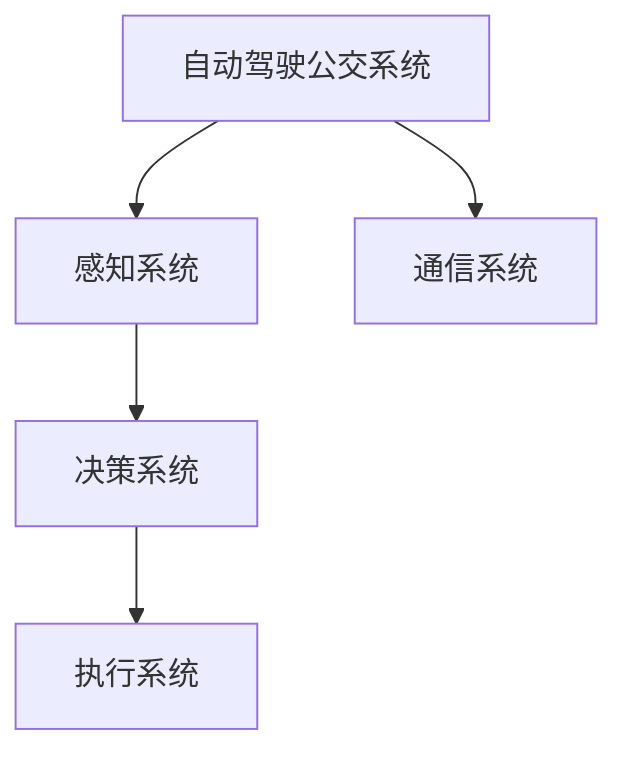
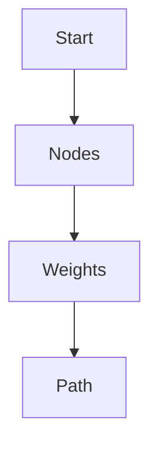
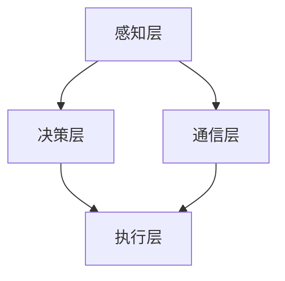

                 

# 价值投资中的智能交通自动驾驶公交系统分析

---

## 关键词：
- 自动驾驶
- 公共交通系统
- 价值投资
- 智能交通
- 技术分析

---

## 摘要：
本文从价值投资的角度，深入分析智能交通中的自动驾驶公交系统。通过技术基础、系统架构、市场现状、商业模式、竞争格局、投资策略等多维度，结合实际案例，探讨自动驾驶公交系统的投资价值与潜在风险。文章旨在为投资者提供科学的决策依据，并展望未来的发展趋势。

---

## 目录大纲：

1. **背景介绍**  
   - 1.1 自动驾驶公交系统的定义与核心概念  
   - 1.2 技术与市场的双重驱动  
   - 1.3 本书的研究框架与方法论  

2. **技术基础分析**  
   - 2.1 自动驾驶的核心技术  
   - 2.2 系统架构与安全性  

3. **市场与商业模式分析**  
   - 3.1 市场现状与竞争格局  
   - 3.2 商业模式与盈利潜力  

4. **投资策略与风险分析**  
   - 4.1 投资策略  
   - 4.2 投资风险与风险管理  

5. **未来展望与结论**  
   - 5.1 未来趋势  
   - 5.2 结论与建议  

---

## 正文内容：

### 第一部分：背景介绍

#### 1.1 自动驾驶公交系统的定义与核心概念

自动驾驶公交系统是一种结合了自动驾驶技术与公共交通系统的新型出行方式。它利用人工智能、传感器、通信等技术，实现公交车的自动驾驶，从而提高交通效率、降低运营成本并提升乘客体验。

**核心概念：**

- **自动驾驶技术**：基于AI和传感器，实现车辆的自主导航与决策。
- **公共交通系统**：包括公交线路、站点、乘客管理等。
- **智能交通**：通过数字化技术优化交通流量和资源分配。

**背景与问题描述：**

随着城市化进程的加快，交通拥堵和环境污染问题日益严重。自动驾驶公交系统作为智能交通的重要组成部分，能够有效解决这些问题，同时降低运营成本并提高安全性。

**边界与外延：**

- **边界**：自动驾驶公交车仅限于特定线路和区域内运行，依赖于高精度地图和交通管理系统。
- **外延**：与智能交通系统（ITS）、智慧城市等其他技术领域密切相关。

**核心要素组成：**

| 核心要素 | 描述 |
|----------|------|
| **感知系统** | 利用激光雷达、摄像头、雷达等传感器感知环境 |
| **决策系统** | 基于感知数据做出驾驶决策 |
| **执行系统** | 执行决策，控制车辆行驶 |
| **通信系统** | 实现车辆与交通管理中心的实时通信 |

**Mermaid流程图：**

---

### 第二部分：技术基础分析

#### 2.1 自动驾驶的核心技术

自动驾驶的核心技术包括感知、决策和执行三个模块。

**感知系统：**

感知系统通过传感器采集环境数据，包括：

- **激光雷达（LiDAR）**：提供高精度的三维环境信息。
- **摄像头**：识别交通信号灯、行人、车辆等。
- **雷达**：检测障碍物和测距。

**数据融合与处理：**

感知系统需要将多源数据（激光雷达、摄像头、雷达）进行融合，以提高准确性。数据融合过程可以分为以下几个步骤：

1. 数据采集与预处理
2. 特征提取
3. 数据融合（使用加权融合或紧耦合融合）
4. 输出融合后的环境模型

**决策系统：**

决策系统基于感知数据和地图信息，规划车辆的行驶路径并做出驾驶决策。

- **路径规划**：通过Dijkstra算法或A*算法找到最优路径。
- **决策树**：基于环境信息和驾驶规则，选择最优动作（如加速、减速、转向）。

**执行系统：**

执行系统负责将决策系统的指令转化为车辆的实际动作，包括：

- **动力系统控制**：通过CAN总线控制油门和刹车。
- **转向与制动系统**：精确控制方向盘和刹车系统。

**算法原理：**

路径规划算法（A*算法）：

数学模型：

$$ \text{Cost}(n) = g(n) + h(n) $$

其中，\( g(n) \) 是从起点到节点 \( n \) 的实际成本，\( h(n) \) 是从节点 \( n \) 到目标的估计成本。

**案例分析：**

某自动驾驶公交系统在雨天的测试中，由于激光雷达受天气影响较大，感知系统切换到摄像头和雷达融合模式，成功识别前方障碍物并及时停车，避免了碰撞。

---

#### 2.2 系统架构与安全性

**系统架构设计：**

自动驾驶公交系统的架构通常采用分层设计，包括：

- **感知层**：负责数据采集。
- **决策层**：负责路径规划和决策。
- **执行层**：负责车辆控制。
- **通信层**：负责与交通管理中心的通信。

**系统架构图：**

**安全性分析：**

自动驾驶公交系统需要考虑以下安全风险：

- **感知错误**：传感器失效或环境复杂导致误判。
- **决策错误**：算法缺陷导致错误决策。
- **通信中断**：与交通管理中心的通信中断影响实时性。

**安全机制设计：**

- **冗余设计**：关键系统采用冗余设计，确保单点故障不影响整体系统。
- **容错机制**：系统能够检测和恢复故障，保证持续运行。
- **安全测试**：通过模拟各种极端场景测试系统的安全性。

---

### 第三部分：市场与商业模式分析

#### 3.1 市场现状与竞争格局

**全球与区域市场分析：**

- **全球市场**：自动驾驶公交系统在欧美、亚洲等地区快速发展，尤其是中国、新加坡等国家。
- **中国市场**：政府政策支持，企业研发投入加大，市场潜力巨大。

**用户需求与行为分析：**

- **乘客需求**：便捷性、舒适性、安全性。
- **运营者需求**：降低运营成本、提高效率、提升品牌形象。

**技术成熟度与商业化进程：**

- **技术成熟度**：部分技术已成熟，但整体仍需进一步完善。
- **商业化案例**：如北京、深圳等地已开展自动驾驶公交试点。

---

#### 3.2 商业模式与盈利潜力

**商业模式分析：**

- **产品销售模式**：出售自动驾驶公交车。
- **服务订阅模式**：提供自动驾驶公交服务，按需收费。
- **平台运营模式**：整合资源，提供综合交通服务。

**盈利能力分析：**

- **成本结构**：研发、生产、运营成本较高。
- **收入来源**：票务收入、广告收入、数据服务收入。
- **盈利预测模型**：

$$ \text{净利润} = \text{收入} - (\text{研发成本} + \text{生产成本} + \text{运营成本}) $$

**市场竞争与合作策略：**

- **竞争格局**：企业间竞争激烈，合作与并购并存。
- **合作与生态构建**：与政府、科技公司、金融机构等建立合作关系，形成生态链。

---

### 第四部分：投资策略与风险分析

#### 4.1 投资策略

**技术评估：**

- 关注企业的技术实力，尤其是感知、决策、执行系统的研发能力。
- 关注企业的专利布局和技术创新能力。

**市场评估：**

- 关注目标市场的政策支持力度、需求潜力和竞争环境。
- 关注企业的市场定位和商业模式的可行性。

**财务评估：**

- 关注企业的财务状况，尤其是研发投入和盈利能力。
- 关注企业的现金流和资金链稳定性。

**风险评估：**

- **技术风险**：技术不成熟或被替代的风险。
- **市场风险**：市场需求不足或竞争加剧的风险。
- **政策风险**：政策变化对行业的影响。

**风险管理策略：**

- **分散投资**：避免过度集中于单一技术或企业。
- **动态调整**：根据市场变化及时调整投资策略。
- **风险对冲**：通过多元化投资降低风险。

---

### 第五部分：未来展望与结论

#### 5.1 未来趋势

**技术发展趋势：**

- **AI算法优化**：深度学习和强化学习的进一步应用。
- **5G通信技术**：实现车辆与交通系统的实时高速通信。
- **新能源技术**：电动化、智能化、网联化的发展趋势。

**市场需求预测：**

- **城市化发展**：人口向城市集中，自动驾驶公交需求增加。
- **环保要求**：减少碳排放，推动新能源公交车普及。

---

#### 5.2 结论与建议

**结论：**

自动驾驶公交系统作为智能交通的重要组成部分，具有广阔的发展前景和投资价值。然而，技术、市场和政策等多方面因素也带来了较高的投资风险。

**建议：**

- **投资者**：应结合技术、市场和政策三方面进行综合评估，制定科学的投资策略。
- **企业**：加大研发投入，提升技术水平，拓展市场。
- **政府**：制定支持政策，完善法规，推动行业发展。

---

## 参考文献：

1. 《自动驾驶技术与应用》，某某出版社，2023年。
2. 某某公司年度报告，2023年。
3. 国内外相关学术论文和研究报告。

---

**温馨提示：** 本文为技术博客文章，内容力求专业且易于理解，适合技术爱好者、投资者和相关行业从业者阅读。

