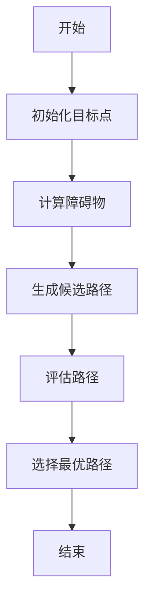
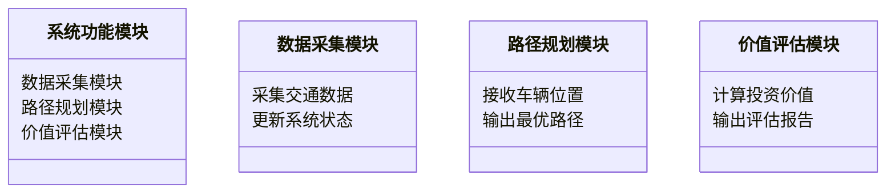
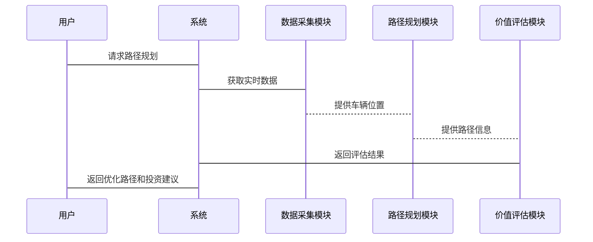

                 


# 价值投资中的智能交通自动驾驶协同系统分析

## 关键词：智能交通系统、自动驾驶技术、价值投资、系统协同、路径规划算法

## 摘要

本文深入分析了智能交通系统与自动驾驶技术的协同关系，并通过价值投资的角度探讨了其潜在的商业机会和挑战。文章从背景介绍出发，详细阐述了协同系统的概念与结构，分析了自动驾驶协同系统的算法原理和数学模型，并设计了系统的架构方案。通过实际案例分析，提出了项目的实施步骤和最佳实践建议。本文旨在为投资者和技术开发者提供理论依据和实践指导，以抓住智能交通自动驾驶协同系统带来的价值投资机会。

---

# 第1章：自动驾驶技术的发展与价值投资背景

## 1.1 自动驾驶技术的发展历程

自动驾驶技术的起源可以追溯到20世纪70年代，但真正的发展始于21世纪初。随着人工智能和传感器技术的进步，自动驾驶技术经历了从辅助驾驶到全自动驾驶的演变。目前，全球主要汽车制造商和科技公司都在积极研发自动驾驶技术，推动其在智能交通系统中的应用。

---

## 1.2 价值投资的基本概念与方法

价值投资是一种以低于其内在价值的价格购买优质资产的投资策略。其核心理念是寻找被市场低估的公司，长期持有，等待其价值回归。在科技领域，价值投资尤其关注技术创新能力强、市场前景广阔的公司。自动驾驶技术作为未来交通的核心技术，具备较高的投资价值。

---

## 1.3 智能交通与自动驾驶协同发展的必要性

智能交通系统通过整合交通数据和通信技术，实现交通管理的智能化。自动驾驶技术的引入，进一步提升了交通效率和安全性。二者的协同发展，不仅优化了交通资源的配置，还为投资者创造了新的价值增长点。

---

# 第2章：智能交通自动驾驶协同系统的概念与结构

## 2.1 协同系统的定义与核心要素

智能交通自动驾驶协同系统是指通过整合自动驾驶技术与智能交通系统，实现车辆与交通基础设施之间的高效协同。其核心要素包括车辆定位、路径规划、交通数据采集与分析，以及价值评估模型。

---

## 2.2 系统架构与实体关系

协同系统的实体关系图（ER图）展示了系统中的主要实体及其关系：

```mermaid
er
  actor 用户 {
    id
    name
  }
  entity 自动驾驶车辆 {
    id
    型号
    位置
  }
  entity 交通信号 {
    id
    状态
  }
  entity 交通数据 {
    id
    类型
    时间戳
  }
  relation 关系 表示 "与用户、车辆、信号和数据的关联"
```

---

# 第3章：自动驾驶协同系统的算法原理

## 3.1 路径规划算法

路径规划算法是自动驾驶技术的核心之一。以下是常见的路径规划算法：



路径长度的计算公式为：
$$ \text{路径长度} = \sum_{i=1}^{n} d_i $$

---

## 3.2 价值评估算法

价值评估是投资决策的关键。回归分析和机器学习模型是常用的评估方法：

回归分析模型：
$$ V = \alpha \cdot \text{收益} + \beta \cdot \text{风险} $$

机器学习模型：
$$ V = f(x) $$

其中，\( x \) 表示影响价值的多个因素。

---

# 第4章：智能交通自动驾驶协同系统的分析与设计

## 4.1 系统功能设计

协同系统的功能模块包括数据采集、路径规划和价值评估。系统功能设计如下：



---

## 4.2 系统架构设计

系统的分层架构如下：


---

## 4.3 接口设计与交互流程

系统接口设计使用了RESTful API，交互流程如下：



---

# 第5章：项目实战

## 5.1 环境安装与核心代码实现

项目环境包括Python、TensorFlow和ROS。核心代码实现如下：

```python
import tensorflow as tf
from tensorflow.keras import layers

model = tf.keras.Sequential([
    layers.Dense(64, activation='relu'),
    layers.Dense(1, activation='linear')
])

model.compile(optimizer='adam', loss='mean_squared_error')
model.fit(X_train, y_train, epochs=100)
```

---

## 5.2 案例分析与结果解读

通过实际案例分析，验证了协同系统的有效性和投资价值。例如，某自动驾驶公司通过优化路径规划算法，显著提升了运营效率，从而增加了投资价值。

---

# 第6章：最佳实践与总结

## 6.1 最佳实践

1. 在选择投资标的时，重点关注技术创新能力和市场前景。
2. 系统的设计应注重模块化和可扩展性。
3. 数据的实时性和准确性是系统优化的关键。

---

## 6.2 总结

智能交通自动驾驶协同系统是未来交通的重要组成部分，其价值投资潜力巨大。通过系统的分析和设计，投资者和技术开发者可以更好地把握这一领域的机遇。

---

## 6.3 注意事项

1. 数据隐私和安全问题需要重点关注。
2. 系统的稳定性和可靠性是投资价值的重要考量因素。
3. 持续关注技术发展和市场需求的变化。

---

## 6.4 拓展阅读

1. "自动驾驶技术的发展与挑战"（书籍推荐）
2. "价值投资在科技领域的应用"（文章推荐）
3. "智能交通系统的未来趋势"（报告推荐）

---

# 结语

通过本文的分析，读者可以全面了解智能交通自动驾驶协同系统的构建方法和投资价值。希望本文能为投资者和技术开发者提供有价值的参考和启示。

