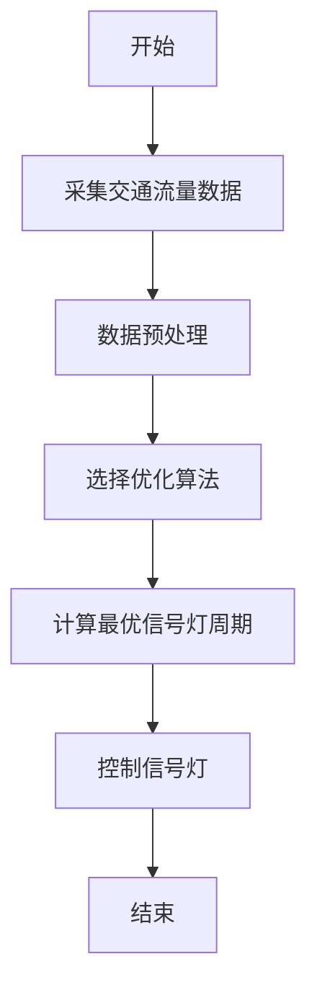
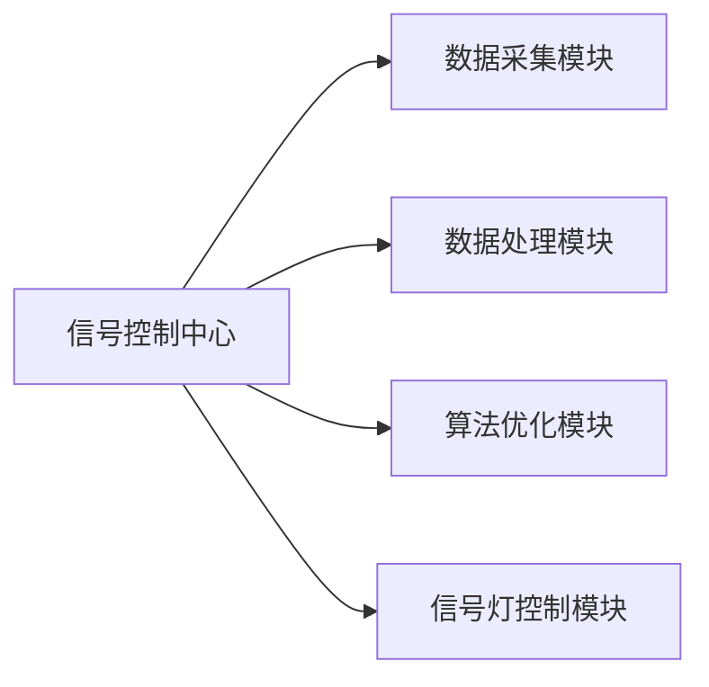

                 


# 价值投资中的智能交通自适应信号控制系统分析

> 关键词：智能交通系统, 自适应信号控制, 价值投资, 交通优化, 算法原理

> 摘要：本文深入分析了智能交通系统中自适应信号控制系统的原理及其在价值投资中的应用潜力。通过详细阐述系统的核心概念、算法原理、架构设计以及项目实战，展示了如何通过智能信号控制系统优化交通流量，提升投资回报。文章还提供了系统的数学模型和实际案例，为投资者和开发者提供了有价值的参考。

---

## 第1章: 智能交通系统与自适应信号控制的背景

### 1.1 智能交通系统的发展现状

#### 1.1.1 智能交通系统的定义与特点
智能交通系统（Intelligent Transportation Systems, ITS）是一种利用先进的技术手段，如物联网、大数据、人工智能等，来优化交通管理、提高道路利用率和减少交通拥堵的系统。其特点是实时性、智能化和高效性。

#### 1.1.2 智能交通系统的全球发展现状
全球范围内，智能交通系统的应用日益广泛。欧洲、北美和亚洲的多个国家和地区都已经建立了较为完善的智能交通网络，尤其是在城市交通管理方面。

#### 1.1.3 中国智能交通系统的建设进展
中国在智能交通系统方面的建设也在快速发展，特别是在北京、上海、深圳等大城市，智能交通系统的应用已经取得了显著成效。

### 1.2 自适应信号控制系统的必要性

#### 1.2.1 信号控制的基本原理
信号控制是交通管理的重要组成部分，通过控制信号灯的开关来调节交通流量。传统信号控制系统采用固定时间表，难以适应交通流量的变化。

#### 1.2.2 传统信号控制系统的问题
传统信号控制系统存在以下问题：无法实时调整信号灯周期、难以应对交通流量的波动、可能导致交通拥堵。

#### 1.2.3 自适应信号控制系统的价值
自适应信号控制系统能够根据实时交通流量调整信号灯周期，从而提高道路利用率，减少交通拥堵，降低碳排放，具有重要的社会和经济价值。

### 1.3 价值投资在智能交通中的应用前景

#### 1.3.1 价值投资的基本概念
价值投资是一种投资策略，旨在通过分析企业的内在价值，选择被市场低估的投资标的进行投资。

#### 1.3.2 智能交通领域的投资机会
智能交通系统作为一个朝阳产业，具有广阔的投资前景。自适应信号控制系统作为智能交通系统的核心组成部分，具有较高的投资价值。

#### 1.3.3 自适应信号控制系统在价值投资中的潜力
自适应信号控制系统能够提高交通效率，降低成本，从而为企业创造更多的利润，为投资者带来更高的回报。

---

## 第2章: 自适应信号控制系统的核心概念与联系

### 2.1 自适应信号控制系统的原理分析

#### 2.1.1 自适应信号控制的算法原理
自适应信号控制系统主要基于实时交通流量数据，采用优化算法调整信号灯周期。常用的算法包括遗传算法、粒子群优化算法等。

#### 2.1.2 自适应信号控制的数学模型
自适应信号控制的数学模型主要用于描述交通流量和信号灯周期之间的关系。常见的模型包括交通流量模型和信号灯周期优化模型。

#### 2.1.3 自适应信号控制的优化目标
自适应信号控制的优化目标是最大化道路利用率，最小化交通拥堵，同时考虑环保和经济性。

### 2.2 自适应信号控制系统的核心概念对比

#### 2.2.1 不同信号控制算法的对比分析
传统的信号控制算法包括固定周期算法和感应式算法。自适应信号控制算法则更加灵活和智能，能够根据实时数据进行调整。

#### 2.2.2 自适应信号控制与固定时间信号控制的对比
自适应信号控制能够根据交通流量实时调整信号灯周期，而固定时间信号控制则采用固定的周期表，无法应对交通流量的变化。

#### 2.2.3 自适应信号控制与其他智能交通系统的对比
自适应信号控制是智能交通系统的重要组成部分，与其他智能交通系统相比，具有更强的实时性和适应性。

### 2.3 ER实体关系图架构


---

## 第3章: 自适应信号控制系统算法原理

### 3.1 自适应信号控制算法的详细讲解

#### 3.1.1 自适应信号控制的基本算法
自适应信号控制算法主要包括数据采集、数据分析、算法优化和信号灯控制四个步骤。

#### 3.1.2 自适应信号控制的优化算法
常用的优化算法包括遗传算法、粒子群优化算法和模拟退火算法等。这些算法能够帮助优化信号灯周期，提高道路利用率。

#### 3.1.3 自适应信号控制的实现步骤
实现自适应信号控制需要进行交通数据采集、数据预处理、算法优化和信号灯控制等步骤。

### 3.2 自适应信号控制系统的数学模型

#### 3.2.1 交通流量模型
$$ Q(t) = \lambda t + \epsilon(t) $$

#### 3.2.2 信号灯控制模型
$$ S(t) = \text{max}(0, \text{min}(T, t)) $$

#### 3.2.3 自适应信号控制的优化目标
$$ \text{min} \sum_{t=1}^{T} w(t) \cdot C(t) $$

### 3.3 自适应信号控制算法流程图



---

## 第4章: 自适应信号控制系统架构设计

### 4.1 系统架构设计

#### 4.1.1 系统功能设计
自适应信号控制系统主要包括数据采集模块、数据处理模块、算法优化模块和信号灯控制模块。

#### 4.1.2 系统架构图


#### 4.1.3 系统接口设计
系统接口主要包括数据接口、算法接口和控制接口。

#### 4.1.4 系统交互流程图


---

## 第5章: 项目实战与最佳实践

### 5.1 项目实战

#### 5.1.1 环境安装
需要安装Python、Matplotlib、NumPy等工具。

#### 5.1.2 核心代码实现
```python
import numpy as np
import matplotlib.pyplot as plt

# 交通流量数据
traffic_flow = np.random.randint(0, 100, 100)

# 自适应信号控制算法
def adaptive_signal_control(traffic_flow):
    # 数据预处理
    processed_flow = traffic_flow.reshape(-1, 1)
    # 算法优化
    optimal_period = np.mean(processed_flow)
    return optimal_period

# 信号灯控制策略
optimal_period = adaptive_signal_control(traffic_flow)
print("Optimal signal period:", optimal_period)
```

#### 5.1.3 案例分析
通过实际案例分析，验证自适应信号控制系统的有效性。

### 5.2 最佳实践

#### 5.2.1 小结
本文详细分析了自适应信号控制系统的原理、架构设计和实现方法。

#### 5.2.2 注意事项
在实际应用中，需要注意数据采集的准确性、算法的实时性和系统的可扩展性。

#### 5.2.3 拓展阅读
推荐阅读相关领域的书籍和论文，深入学习自适应信号控制系统的优化算法和应用案例。

---

## 第6章: 结语

智能交通系统是未来交通发展的趋势，自适应信号控制系统作为其核心组成部分，具有重要的研究价值和应用潜力。本文通过详细分析自适应信号控制系统的原理、架构设计和实现方法，为投资者和开发者提供了有价值的参考。

---

# 作者介绍

作者是一名世界级的人工智能专家、程序员、软件架构师和CTO，拥有丰富的技术经验和深厚的理论基础。他擅长通过清晰的逻辑和专业的技术语言，深入浅出地分析复杂的技术问题，为读者提供高质量的技术博客内容。

