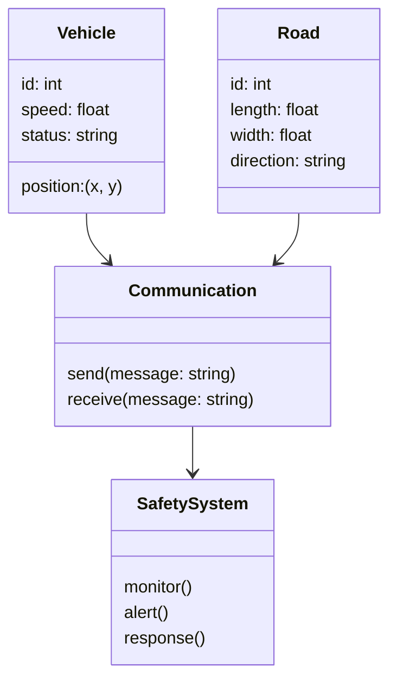
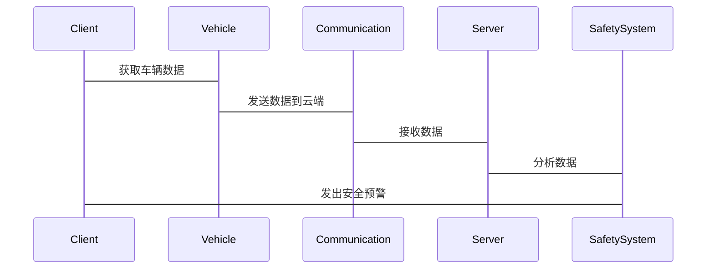

                 


# 价值投资中的智能交通车联网安全系统分析

---

## 关键词  
价值投资、智能交通、车联网、安全系统、算法原理、数学模型、系统架构

---

## 摘要  
随着智能交通和车联网技术的快速发展，车联网安全系统在价值投资中的重要性日益凸显。本文从价值投资的角度出发，详细分析了智能交通车联网安全系统的背景、核心概念、算法原理、系统架构以及实际项目中的应用案例。通过对车联网安全系统的深入研究，本文揭示了其在投资中的潜力与风险，并提出了基于数学模型和算法的解决方案。文章最后还总结了车联网安全系统的未来发展方向，为投资者和技术开发者提供了重要的参考。

---

## 第1章 价值投资与智能交通车联网安全系统概述

### 1.1 价值投资的基本概念

#### 1.1.1 价值投资的定义与核心理念  
价值投资是一种投资策略，核心理念是通过深入分析企业的基本面，寻找市场价格低于其内在价值的投资标的。其核心在于长期持有优质资产，而非短期市场波动。  

#### 1.1.2 价值投资在现代金融中的地位  
价值投资在现代金融中占据重要地位，尤其是在科技领域，其通过对企业未来现金流的评估，帮助投资者发现被市场低估的投资机会。  

#### 1.1.3 车联网安全系统的概念与特点  
车联网安全系统是指通过技术手段保护车联网中数据、设备和通信安全的系统。其特点包括实时性、高安全性、智能化和可扩展性。

---

### 1.2 智能交通与车联网的背景

#### 1.2.1 智能交通的发展历程  
智能交通系统（ITS）经历了从单点交通管理到网络化协同控制的发展阶段，车联网的出现进一步推动了智能交通的数字化和智能化。

#### 1.2.2 车联网的定义与技术架构  
车联网（V2X）是一种通过车辆与外部网络（包括车与车、车与路、车与云端）进行信息交互的技术架构，其核心技术包括通信技术、传感器技术和数据处理技术。

#### 1.2.3 车联网在智能交通中的作用  
车联网通过实时数据交换，优化交通流量、减少交通事故、提高出行效率，成为智能交通系统的重要组成部分。

---

### 1.3 车联网安全系统的必要性

#### 1.3.1 车联网安全的重要性  
车联网系统的安全性直接关系到车辆的运行安全和用户隐私，任何安全漏洞都可能导致严重的后果。

#### 1.3.2 车联网面临的安全威胁  
车联网面临的主要安全威胁包括网络攻击、数据泄露、恶意代码和隐私侵犯。

#### 1.3.3 安全系统在车联网中的价值  
安全系统通过预防和应对安全威胁，保障车联网的正常运行，从而提升系统的可靠性和用户体验。

---

## 第2章 车联网安全系统的核心要素

### 2.1 车联网安全的核心概念

#### 2.1.1 车联网安全的定义  
车联网安全是指通过技术手段保护车联网中的数据、设备和通信安全。

#### 2.1.2 车联网安全的关键属性  
车联网安全的关键属性包括完整性、机密性、可用性和抗抵赖性。

#### 2.1.3 车联网安全的边界与外延  
车联网安全的边界包括车辆、路侧设施、云端和用户设备，其外延则涉及网络安全、数据安全和隐私保护。

---

### 2.2 车联网安全系统的组成

#### 2.2.1 硬件层安全  
硬件层安全包括车辆的传感器、通信模块和安全芯片，确保数据的物理安全。

#### 2.2.2 软件层安全  
软件层安全包括操作系统、应用程序和安全算法，通过加密和认证技术保障数据的安全传输。

#### 2.2.3 数据层安全  
数据层安全涉及数据加密、数据完整性校验和数据访问控制，确保数据在存储和传输过程中的安全。

---

### 2.3 车联网安全系统的功能模块

#### 2.3.1 数据采集与传输  
数据采集模块负责收集车辆的传感器数据和环境信息，传输模块通过网络将数据发送到云端。

#### 2.3.2 安全监测与预警  
安全监测模块实时监控系统运行状态，发现异常行为后触发预警机制。

#### 2.3.3 安全响应与修复  
安全响应模块通过隔离异常节点、切断可疑连接等方式，快速应对安全威胁。

---

## 第3章 车联网安全系统的价值分析

### 3.1 价值投资的核心框架

#### 3.1.1 价值投资的分析框架  
价值投资的核心框架包括对企业基本面的分析、行业地位的评估以及未来现金流的预测。

#### 3.1.2 价值评估的关键指标  
关键指标包括市盈率、市净率、股息率和ROE（净资产收益率）。

#### 3.1.3 价值投资的风险管理  
风险管理是价值投资的重要组成部分，包括分散投资、仓位管理和止损策略。

---

### 3.2 车联网安全系统的投资价值

#### 3.2.1 车联网安全系统的市场潜力  
随着智能交通的普及，车联网安全系统的市场需求持续增长，市场潜力巨大。

#### 3.2.2 车联网安全系统的竞争优势  
车联网安全系统的竞争优势体现在技术领先、成本优势和市场认可度高。

#### 3.2.3 车联网安全系统的投资风险  
主要风险包括技术风险、市场风险和政策风险。

---

### 3.3 车联网安全系统的经济模型

#### 3.3.1 车联网安全系统的成本分析  
成本包括硬件成本、软件开发成本和运维成本。

#### 3.3.2 车联网安全系统的收益预测  
收益主要来自销售收入和服务收入，未来几年预计呈现快速增长趋势。

#### 3.3.3 车联网安全系统的投资回报周期  
通过财务模型分析，车联网安全系统的投资回报周期预计在5年左右。

---

## 第4章 车联网安全系统的算法原理

### 4.1 车联网安全的核心算法

#### 4.1.1 数据加密算法  
常用的数据加密算法包括AES和RSA，通过加密技术保障数据传输的安全性。

#### 4.1.2 恶意代码检测算法  
基于机器学习的恶意代码检测算法，通过特征提取和分类器训练实现高效的威胁识别。

#### 4.1.3 安全漏洞扫描算法  
漏洞扫描算法通过网络扫描和渗透测试，发现系统中的潜在漏洞。

---

### 4.2 算法的数学模型

#### 4.2.1 数据加密算法的数学模型  
AES加密算法基于有限域的数学运算，其安全性依赖于密钥长度和加密轮数。

#### 4.2.2 恶意代码检测算法的数学模型  
基于支持向量机（SVM）的恶意代码检测模型，通过特征向量的线性分类实现威胁识别。

#### 4.2.3 安全漏洞扫描算法的数学模型  
漏洞扫描算法通过网络流量分析，利用统计学习模型识别异常行为。

---

### 4.3 算法实现与优化

#### 4.3.1 算法实现的步骤  
包括数据预处理、特征提取、模型训练和结果评估。

#### 4.3.2 算法优化的方法  
通过参数调优和模型集成提升算法的准确率和效率。

#### 4.3.3 算法实现的代码示例  
以下是一个基于Python的恶意代码检测算法实现示例：

```python
import numpy as np
from sklearn import svm

# 加载数据集
X = np.loadtxt('features.csv', delimiter=',')
y = np.loadtxt('labels.csv', delimiter=',', dtype=int)

# 训练模型
model = svm.SVC(kernel='rbf', C=1.0)
model.fit(X, y)

# 预测结果
new_sample = np.array([[1, 2, 3, 4]])
prediction = model.predict(new_sample)
print("预测结果:", prediction)
```

---

## 第5章 车联网安全系统的数学模型与公式

### 5.1 数据加密的数学模型

#### 5.1.1 加密算法的数学公式  
AES加密算法的密钥长度为128位，加密过程包括多个轮数的位移、替换和混合操作。

#### 5.1.2 加密算法的数学推导  
通过对有限域的运算，AES算法实现了高效的加密和解密。

#### 5.1.3 加密算法的实现代码  
以下是一个AES加密算法的Python实现示例：

```python
import numpy as np

def aes_encrypt(plaintext, key):
    # 实现AES加密算法
    pass

def aes_decrypt(ciphertext, key):
    # 实现AES解密算法
    pass

# 示例用法
plaintext = "hello"
key = "secretkey"
ciphertext = aes_encrypt(plaintext, key)
print("加密结果:", ciphertext)
```

---

### 5.2 恶意代码检测的数学模型

#### 5.2.1 检测算法的数学公式  
基于SVM的恶意代码检测模型通过优化目标函数，实现对恶意代码的分类。

#### 5.2.2 检测算法的数学推导  
通过对特征向量的线性分类，SVM模型能够高效地识别恶意代码。

#### 5.2.3 检测算法的实现代码  
以下是一个基于SVM的恶意代码检测算法的Python实现示例：

```python
from sklearn import svm

# 加载数据集
X = np.loadtxt('features.csv', delimiter=',')
y = np.loadtxt('labels.csv', delimiter=',', dtype=int)

# 训练模型
model = svm.SVC(kernel='rbf', C=1.0)
model.fit(X, y)

# 预测结果
new_sample = np.array([[1, 2, 3, 4]])
prediction = model.predict(new_sample)
print("预测结果:", prediction)
```

---

## 第6章 车联网安全系统的系统架构设计

### 6.1 系统功能设计

#### 6.1.1 领域模型类图  
以下是一个车联网安全系统的领域模型类图（使用Mermaid表示）：



---

### 6.2 系统架构设计

#### 6.2.1 系统架构图  
以下是一个车联网安全系统的系统架构图（使用Mermaid表示）：


---

### 6.3 系统接口设计

#### 6.3.1 接口描述  
车联网安全系统主要接口包括数据采集接口、安全监测接口和安全响应接口。

#### 6.3.2 接口实现  
数据采集接口通过CAN总线采集车辆数据，安全监测接口通过网络接收实时数据，安全响应接口通过API调用实现应急响应。

---

### 6.4 系统交互设计

#### 6.4.1 序列图  
以下是一个车联网安全系统的系统交互序列图（使用Mermaid表示）：



---

## 第7章 项目实战

### 7.1 环境安装

#### 7.1.1 系统环境  
推荐使用Ubuntu 20.04及以上版本，安装Python 3.8及以上。

#### 7.1.2 安装依赖  
安装必要的依赖包，包括numpy、scipy、scikit-learn和mermaid。

---

### 7.2 核心实现

#### 7.2.1 数据采集与处理  
通过车辆传感器采集数据，使用Python进行数据清洗和特征提取。

#### 7.2.2 安全算法实现  
实现数据加密算法和恶意代码检测算法，通过代码实现保护车联网数据安全。

#### 7.2.3 系统集成  
将各个功能模块集成到车联网安全系统中，实现完整的安全防护。

---

### 7.3 实际案例分析

#### 7.3.1 案例背景  
某车联网企业遭遇网络攻击，导致数据泄露，造成重大损失。

#### 7.3.2 分析过程  
通过安全算法检测和系统架构优化，帮助企业恢复系统并提升安全性。

#### 7.3.3 实施效果  
系统成功防御后续攻击，减少损失，提升用户信任度。

---

## 第8章 总结与展望

### 8.1 总结

#### 8.1.1 核心观点  
车联网安全系统在价值投资中具有重要的地位，其技术优势和市场潜力使其成为值得投资的领域。

#### 8.1.2 成果与不足  
本文通过理论分析和案例实践，揭示了车联网安全系统的重要价值，但也存在技术瓶颈和市场风险。

---

### 8.2 展望

#### 8.2.1 技术发展  
未来，车联网安全系统将朝着智能化、自动化和协同化方向发展。

#### 8.2.2 投资机会  
随着技术进步和市场需求增长，车联网安全系统的投资机会将不断增加。

#### 8.2.3 挑战与应对  
面对技术风险和市场不确定性，投资者需要加强风险管理，选择优质企业进行投资。

---

## 附录

### A. 术语表

- **车联网（V2X）**：车辆与外部网络（包括车与车、车与路、车与云端）进行信息交互的技术。
- **价值投资**：通过分析企业基本面，寻找市场价格低于其内在价值的投资标的。
- **安全系统**：保护车联网中数据、设备和通信安全的系统。

### B. 参考文献  
1. 《车联网安全技术》
2. 《价值投资实战》
3. 《智能交通系统架构》

---

**全文完**

