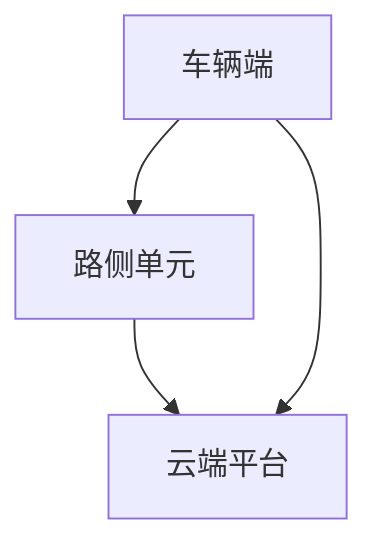
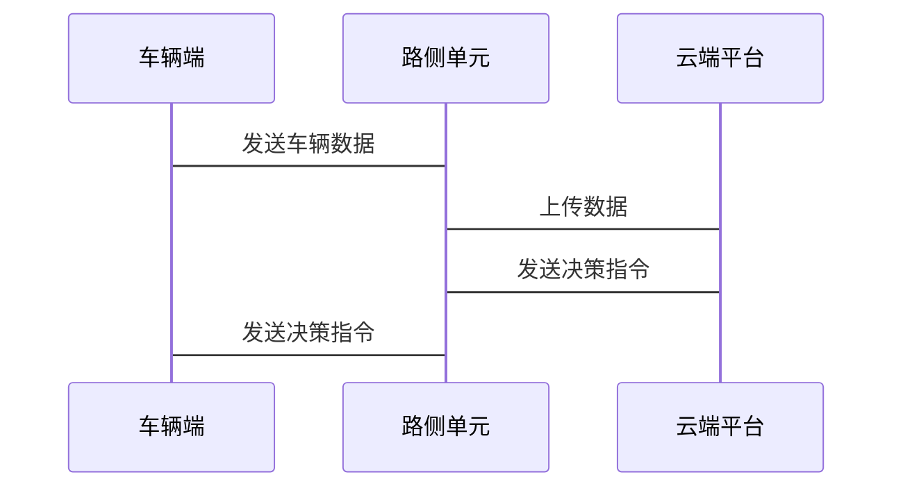

                 


# 价值投资中的智能交通车路协同系统分析

> 关键词：价值投资、智能交通、车路协同、系统分析、算法原理、系统架构

> 摘要：本文从价值投资的角度出发，详细分析了智能交通中的车路协同系统。首先介绍了车路协同系统的概念、背景和核心价值，接着深入探讨了其核心概念、算法原理和系统架构，最后通过项目实战分析了系统的实现和投资机会。

---

## 第1章 车路协同系统的基本概念

### 1.1 车路协同的定义与背景

#### 1.1.1 车路协同的概念
车路协同（Vehicular Communication，VC）是一种基于车辆与道路基础设施之间通信的智能交通系统，旨在通过实时数据交换优化交通流量、减少拥堵和提高安全性。

#### 1.1.2 智能交通系统的发展背景
随着城市化进程的加快和车辆保有量的增加，传统交通管理方式已难以应对复杂的交通问题。智能交通系统（ITS）应运而生，车路协同作为ITS的重要组成部分，成为提升交通效率的关键技术。

#### 1.1.3 车路协同在智能交通中的地位
车路协同通过车辆与路侧设备的通信，实现交通信息的实时共享，是智能交通系统的核心技术之一。

### 1.2 价值投资与智能交通的结合

#### 1.2.1 价值投资的基本概念
价值投资是一种以低于内在价值的价格购买优质资产的投资策略，强调长期持有和稳健回报。

#### 1.2.2 智能交通系统的投资价值
智能交通系统通过提高交通效率和减少拥堵，可以降低社会成本，带来经济效益和环境效益。

#### 1.2.3 车路协同系统的投资机会
车路协同系统作为智能交通的核心技术，具有广阔的市场前景和投资潜力。

### 1.3 车路协同系统的组成与特点

#### 1.3.1 系统组成部分
- 车辆端：包括车载传感器、通信设备和车载计算机。
- 路侧设备：包括交通信号灯、摄像头、传感器和路边计算单元。
- 云端平台：包括数据存储、处理和管理功能。

#### 1.3.2 系统的特点与优势
- 实时性：数据采集和传输速度快。
- 可靠性：系统稳定性高，误报率低。
- 可扩展性：支持多种应用场景和设备的接入。

#### 1.3.3 系统的边界与外延
- 系统边界：车辆、路侧设备和云端平台之间的通信与数据处理。
- 系统外延：与交通管理、城市规划和其他交通方式的协同。

---

## 第2章 车路协同系统的核心概念与联系

### 2.1 车路协同系统的核心要素

#### 2.1.1 车辆端
- 感知：通过激光雷达、摄像头和雷达感知周围环境。
- 通信：通过5G、Wi-Fi和DSRC等技术与路侧设备和云端平台通信。

#### 2.1.2 路侧设备
- 感知：通过传感器和摄像头采集交通数据。
- 通信：通过路边单元（RSU）与车辆和云端平台通信。

#### 2.1.3 云端平台
- 数据存储：存储车辆和路侧设备上传的数据。
- 数据处理：通过算法处理数据，生成决策指令。
- 服务提供：为车辆和路侧设备提供实时服务。

### 2.2 车路协同系统的核心原理

#### 2.2.1 数据采集与传输
- 数据采集：车辆和路侧设备通过传感器和摄像头采集交通数据。
- 数据传输：通过通信技术将数据传输到云端平台。

#### 2.2.2 数据融合与处理
- 数据融合：将多源数据（如车辆数据、路侧数据和云端数据）进行融合，提高数据的准确性和完整性。
- 数据处理：通过算法对数据进行分析和处理，生成决策指令。

#### 2.2.3 决策与控制
- 决策：基于处理后的数据，生成交通信号灯控制、车辆路径规划等决策指令。
- 控制：通过通信技术将决策指令发送到车辆和路侧设备，实现交通控制。

### 2.3 车路协同系统的概念结构

#### 2.3.1 系统架构图


#### 2.3.2 核心要素之间的关系
- 车辆端与路侧设备：通过通信技术实时交互数据。
- 路侧设备与云端平台：路侧设备将数据上传到云端平台，云端平台处理后发送指令到路侧设备。
- 车辆端与云端平台：车辆端通过云端平台获取实时交通信息和决策指令。

---

## 第3章 车路协同系统的算法原理

### 3.1 数据融合算法

#### 3.1.1 多源数据融合
- 数据来源：车辆传感器、路侧传感器和云端数据。
- 融合方法：基于概率的融合方法和基于深度学习的融合方法。

#### 3.1.2 基于概率的融合方法
- 方法：通过贝叶斯定理对多源数据进行概率融合。
- 示例：通过车辆传感器和路侧传感器的数据，计算交通流量的概率分布。

#### 3.1.3 基于深度学习的融合方法
- 方法：使用卷积神经网络（CNN）对多源数据进行特征提取和融合。
- 示例：通过CNN对车辆和路侧设备的图像数据进行融合，提高识别精度。

### 3.2 决策优化算法

#### 3.2.1 基于强化学习的决策优化
- 方法：通过强化学习算法（如Q-Learning）优化交通信号灯的控制策略。
- 示例：通过Q-Learning算法，优化交通信号灯的切换时间，减少拥堵。

#### 3.2.2 基于遗传算法的优化方法
- 方法：通过遗传算法对交通流量进行优化。
- 示例：通过遗传算法优化交通信号灯的配时，提高交通效率。

#### 3.2.3 基于模糊逻辑的决策方法
- 方法：通过模糊逻辑对交通数据进行处理，生成决策指令。
- 示例：通过模糊逻辑处理交通流量和密度数据，生成交通信号灯的控制指令。

### 3.3 算法实现与优化

#### 3.3.1 算法实现流程
- 数据采集：通过传感器和摄像头采集交通数据。
- 数据预处理：对数据进行清洗和归一化处理。
- 数据融合：通过算法对多源数据进行融合。
- 决策优化：通过算法生成决策指令。
- 系统控制：将决策指令发送到车辆和路侧设备。

#### 3.3.2 算法优化策略
- 并行计算：通过多核计算和分布式计算提高算法效率。
- 参数调优：通过网格搜索和随机搜索优化算法参数。
- 模型压缩：通过剪枝和量化技术减少模型的计算量。

---

## 第4章 车路协同系统的系统架构设计

### 4.1 系统功能设计

#### 4.1.1 车辆端功能
- 数据采集：通过传感器采集车辆的实时数据。
- 数据传输：通过通信技术将数据传输到云端平台。
- 决策执行：根据云端平台的决策指令执行操作。

#### 4.1.2 路侧设备功能
- 数据采集：通过传感器和摄像头采集交通数据。
- 数据传输：通过路侧单元（RSU）将数据传输到云端平台。
- 本地控制：根据本地决策指令进行交通控制。

#### 4.1.3 云端平台功能
- 数据存储：存储车辆和路侧设备上传的数据。
- 数据处理：通过算法对数据进行分析和处理。
- 服务提供：为车辆和路侧设备提供实时服务和决策指令。

### 4.2 系统架构图

#### 4.2.1 系统架构图


#### 4.2.2 核心要素之间的关系
- 车辆端与路侧设备：通过通信技术实时交互数据。
- 路侧设备与云端平台：路侧设备将数据上传到云端平台，云端平台处理后发送指令到路侧设备。
- 车辆端与云端平台：车辆端通过云端平台获取实时交通信息和决策指令。

### 4.3 系统接口设计

#### 4.3.1 接口设计
- 车辆端与路侧设备之间的接口：通过通信协议（如5G、Wi-Fi）实现数据传输。
- 路侧设备与云端平台之间的接口：通过HTTP协议实现数据传输。
- 车辆端与云端平台之间的接口：通过MQTT协议实现数据传输。

#### 4.3.2 交互流程图


---

## 第5章 项目实战：车路协同系统的实现与分析

### 5.1 环境安装

#### 5.1.1 系统环境
- 操作系统：Linux
- 开发工具：PyCharm
- 依赖库：numpy、pandas、scikit-learn、tensorflow

### 5.2 核心实现源代码

#### 5.2.1 数据融合算法实现
```python
import numpy as np
import pandas as pd
from sklearn.metrics import accuracy_score

def fuse_data(sensor_data, camera_data):
    # 数据预处理
    sensor_data = sensor_data.dropna()
    camera_data = camera_data.dropna()
    
    # 数据融合
    fused_data = pd.concat([sensor_data, camera_data], axis=1)
    return fused_data

# 示例数据
sensor_data = pd.DataFrame({'temperature': [25, 26, 24], 'humidity': [60, 65, 58]})
camera_data = pd.DataFrame({'object detected': [True, False, True], 'distance': [5, 10, 3]})
fused_data = fuse_data(sensor_data, camera_data)
print(fused_data)
```

#### 5.2.2 决策优化算法实现
```python
import numpy as np
import tensorflow as tf

def traffic_optimization(model, input_data):
    # 数据预处理
    input_data = input_data.reshape(-1, 1)
    input_data = input_data.astype(np.float32)
    
    # 模型预测
    prediction = model.predict(input_data)
    return prediction

# 示例模型
model = tf.keras.Sequential([
    tf.keras.layers.Dense(64, activation='relu'),
    tf.keras.layers.Dense(1, activation='sigmoid')
])
model.compile(optimizer='adam', loss='binary_crossentropy')
```

### 5.3 案例分析与解读

#### 5.3.1 案例分析
- 案例背景：某城市交通信号灯优化项目。
- 数据采集：通过传感器和摄像头采集交通流量和密度数据。
- 数据融合：通过数据融合算法对多源数据进行融合。
- 决策优化：通过强化学习算法优化交通信号灯的控制策略。
- 系统实现：通过云端平台实现交通信号灯的实时控制。

#### 5.3.2 实际案例分析
- 数据分析：通过数据分析工具（如Python和R）对数据进行分析和可视化。
- 系统优化：通过系统优化算法（如遗传算法和强化学习）对交通信号灯的控制策略进行优化。
- 系统实现：通过系统实现工具（如Python和Java）实现交通信号灯的实时控制。

### 5.4 项目小结

#### 5.4.1 核心实现总结
- 数据融合算法：通过多源数据融合提高数据的准确性和完整性。
- 决策优化算法：通过强化学习算法优化交通信号灯的控制策略。

#### 5.4.2 项目实施的难点
- 数据融合的准确性：如何提高数据融合的准确性。
- 决策优化的效果：如何提高决策优化的效果。

#### 5.4.3 项目的实际价值
- 提高交通效率：通过优化交通信号灯的控制策略，减少拥堵和提高交通效率。
- 减少交通事故：通过实时数据共享和协同控制，减少交通事故的发生。

---

## 第6章 总结与展望

### 6.1 总结

#### 6.1.1 核心内容总结
- 车路协同系统的核心概念与联系。
- 数据融合算法和决策优化算法的实现与优化。
- 系统架构设计与实现。

#### 6.1.2 投资策略总结
- 价值投资的核心理念：长期持有优质资产，获得稳健回报。
- 车路协同系统的投资价值：广阔的市场前景和巨大的经济效益。

### 6.2 投资策略与注意事项

#### 6.2.1 投资策略
- 关注行业趋势：关注智能交通行业的发展趋势和政策支持。
- 选择优质企业：选择具有技术优势和市场竞争力的企业进行投资。
- 长期持有：长期持有优质资产，获得稳健回报。

#### 6.2.2 投资注意事项
- 风险控制：合理分散投资风险，避免过度集中投资。
- 信息获取：及时获取行业动态和企业信息，做出明智的投资决策。

### 6.3 未来展望

#### 6.3.1 技术发展
- 人工智能：人工智能技术的进一步发展将推动车路协同系统的智能化和自动化。
- 5G技术：5G技术的普及和应用将提升车路协同系统的通信能力和实时性。

#### 6.3.2 市场前景
- 市场需求：随着城市化进程的加快和交通问题的加剧，车路协同系统的需求将不断增加。
- 市场竞争：市场竞争将更加激烈，技术优势和成本优势将成为竞争优势的关键。

---

## 参考文献

1. 《智能交通系统概论》
2. 《价值投资实战》
3. 《车路协同系统的设计与实现》
4. 《算法设计与优化》

---

## 结语

价值投资中的智能交通车路协同系统分析是一门复杂而有趣的学科，通过对系统核心概念、算法原理和系统架构的深入分析，我们可以更好地理解其投资价值和实际应用。未来，随着技术的发展和市场的成熟，车路协同系统将在智能交通领域发挥越来越重要的作用。

