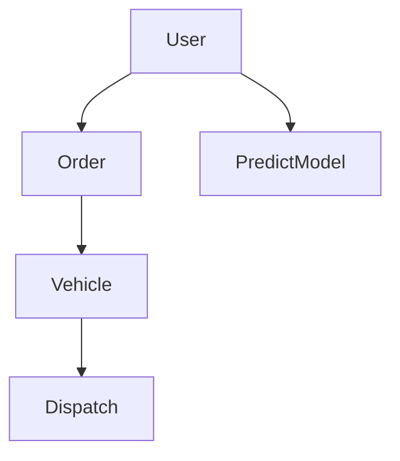
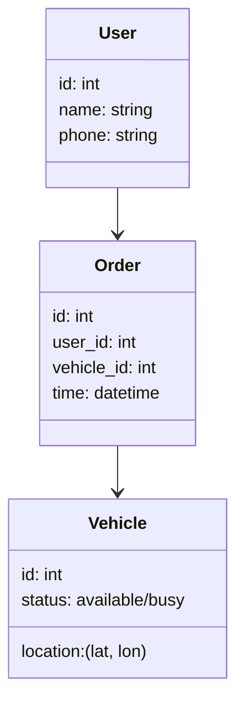
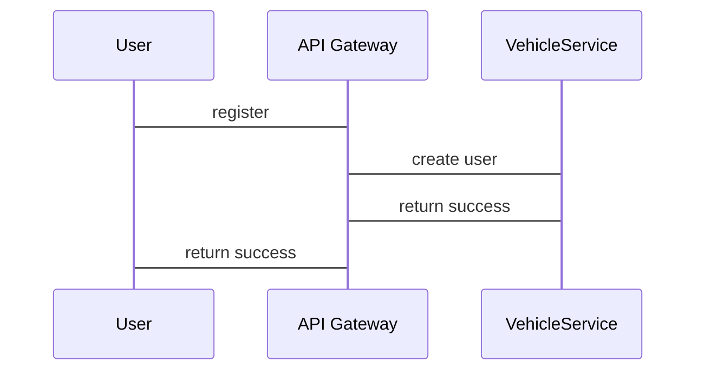
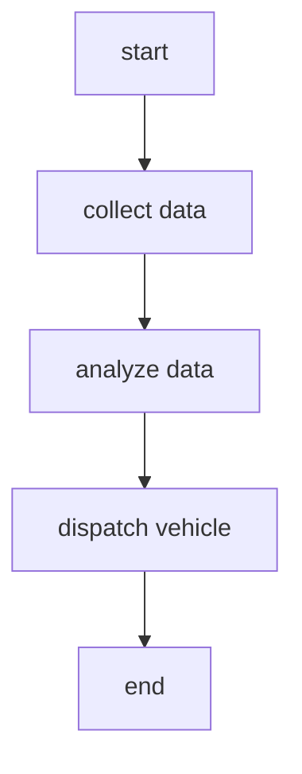
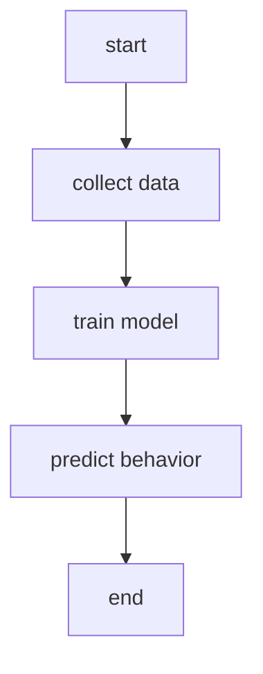

                 


# 价值投资中的智能交通车辆共享系统分析

**关键词：价值投资、智能交通、车辆共享、系统分析、算法原理、数学模型**

**摘要：** 本文从价值投资的角度，深入分析智能交通车辆共享系统的经济价值和优化策略。通过系统分析、算法原理、数学模型等方法，探讨如何利用技术手段提升共享系统的效率和收益，为投资者和系统管理者提供科学的决策依据。

---

# 第1章: 背景介绍与核心概念

## 1.1 价值投资与智能交通车辆共享系统概述

### 1.1.1 价值投资的定义与核心理念
价值投资是一种长期投资策略，强调以低于市场价的合理价格购买优质资产。其核心理念是通过深入分析企业的基本面，寻找具有持续竞争优势和良好管理的公司，长期持有以获得稳定收益。

### 1.1.2 智能交通车辆共享系统的定义与特点
智能交通车辆共享系统是一种基于互联网和人工智能技术的共享出行平台，通过智能化的车辆调度和用户管理，实现资源的高效利用和用户的便捷出行。其特点包括：实时调度、按需分配、数据驱动、用户友好等。

### 1.1.3 价值投资与智能交通车辆共享系统的结合
价值投资在智能交通车辆共享系统中的应用，主要体现在通过技术手段优化系统运行效率、降低成本、提升用户满意度，从而实现系统的可持续发展和投资收益的最大化。

---

## 1.2 问题背景与问题描述

### 1.2.1 智能交通车辆共享系统的现状与挑战
当前，共享出行市场快速发展，但存在车辆调度效率低、资源浪费、用户体验差等问题。这些问题直接影响了系统的运营效率和投资回报。

### 1.2.2 价值投资在共享系统中的应用需求
为了实现价值投资的目标，需要通过技术手段解决共享系统中的效率低下问题，优化资源分配，提升系统整体收益。

### 1.2.3 问题解决的思路与目标
通过分析系统运行中的关键问题，提出基于人工智能和大数据的解决方案，优化车辆调度算法和用户行为预测模型，提升系统的运营效率和投资回报。

---

## 1.3 系统的边界与外延

### 1.3.1 系统的功能边界
智能交通车辆共享系统的核心功能包括车辆调度、用户管理、订单处理和收益预测。

### 1.3.2 系统的外延与扩展
系统可以通过数据接口与第三方服务（如支付平台、地图服务）集成，实现功能扩展。

### 1.3.3 系统的核心要素组成
系统的核心要素包括：车辆、用户、订单、收益预测模型、车辆调度算法。

---

## 1.4 核心概念与联系

### 1.4.1 核心概念的定义与属性特征
- **车辆调度算法**：用于优化车辆的分配和调度。
- **用户行为预测模型**：用于预测用户的出行需求。
- **收益预测模型**：用于预测系统的收益情况。

### 1.4.2 核心概念的对比分析
通过对比分析，明确不同算法和模型的优缺点。

### 1.4.3 系统的ER实体关系图



---

# 第2章: 核心概念与联系

## 2.1 核心概念的原理与特征

### 2.1.1 车辆调度算法的原理
车辆调度算法通过实时数据分析，优化车辆的分配和调度，提高系统的运行效率。

### 2.1.2 用户行为预测模型的特征
用户行为预测模型基于历史数据，预测用户的出行需求，帮助系统提前做好资源准备。

### 2.1.3 收益预测模型的属性
收益预测模型通过分析用户需求和系统运行情况，预测系统的收益情况。

---

## 2.2 核心概念的对比分析

### 2.2.1 车辆调度算法的对比
通过对比不同调度算法的优缺点，选择最优算法。

### 2.2.2 用户行为预测模型的对比
通过对比不同预测模型的准确性，选择最适合的模型。

### 2.2.3 系统的ER实体关系图
通过ER图展示系统中各实体的关系。

---

## 2.3 系统的ER实体关系图


---

# 第3章: 系统分析与架构设计方案

## 3.1 问题场景介绍

### 3.1.1 系统运行中的问题
- 车辆调度效率低
- 用户体验差
- 系统收益不稳定

### 3.1.2 问题解决的思路
通过优化算法和模型，提升系统的运行效率和收益。

---

## 3.2 项目介绍

### 3.2.1 项目目标
优化车辆调度算法和用户行为预测模型，提升系统效率和收益。

### 3.2.2 项目范围
包括车辆调度、用户管理、订单处理和收益预测。

---

## 3.3 系统功能设计

### 3.3.1 领域模型图



---

## 3.4 系统架构设计

### 3.4.1 系统架构图

```mermaid
graph TD
    Client --> API Gateway
    API Gateway --> VehicleService
    VehicleService --> VehicleDB
    VehicleService --> PredictModel
```

---

## 3.5 系统接口设计

### 3.5.1 API接口
- `/api/users/register`
- `/api/orders/create`
- `/api/vehicles/dispatch`

---

## 3.6 系统交互设计

### 3.6.1 用户注册流程



---

# 第4章: 算法原理与数学模型

## 4.1 算法原理

### 4.1.1 车辆调度算法



### 4.1.2 用户行为预测模型



---

## 4.2 算法实现

### 4.2.1 车辆调度算法的Python代码

```python
def dispatch_vehicle(location, status):
    # Algorithm implementation
    pass
```

### 4.2.2 用户行为预测模型的Python代码

```python
def predict_behavior(user_data):
    # Algorithm implementation
    pass
```

---

## 4.3 数学模型

### 4.3.1 收益预测模型

$$ \text{Revenue} = \sum_{i=1}^{n} (p_i \times q_i) $$

其中：
- \( p_i \) 表示第 \( i \) 个用户的支付价格
- \( q_i \) 表示第 \( i \) 个用户的数量

---

# 第5章: 项目实战

## 5.1 环境安装

### 5.1.1 安装Python和相关库
- 安装Python：`python --version`
- 安装库：`pip install numpy pandas`

---

## 5.2 系统核心实现

### 5.2.1 核心代码

```python
def dispatch_vehicle(location, status):
    # 调度算法实现
    pass
```

### 5.2.2 代码解读
- 解释代码的功能和实现逻辑。

---

## 5.3 实际案例分析

### 5.3.1 案例分析
- 分析一个实际案例，解释系统的运行过程。

---

## 5.4 项目小结

### 5.4.1 经验总结
- 总结项目中的经验和教训。

### 5.4.2 注意事项
- 提醒读者在实际应用中需要注意的问题。

---

# 第6章: 总结与展望

## 6.1 全文总结

### 6.1.1 关键点回顾
- 回顾全文中的关键点。

### 6.1.2 系统优缺点分析
- 分析系统的优缺点。

### 6.1.3 改进建议
- 提出改进建议。

---

## 6.2 投资策略建议

### 6.2.1 短期投资策略
- 提出短期投资建议。

### 6.2.2 长期投资策略
- 提出长期投资建议。

---

## 6.3 拓展阅读

### 6.3.1 相关书籍推荐
- 推荐相关书籍。

### 6.3.2 相关论文推荐
- 推荐相关论文。

---

# 结语

通过本文的分析，我们深入探讨了价值投资在智能交通车辆共享系统中的应用，提出了优化系统运行效率的方法，为投资者和系统管理者提供了科学的决策依据。

