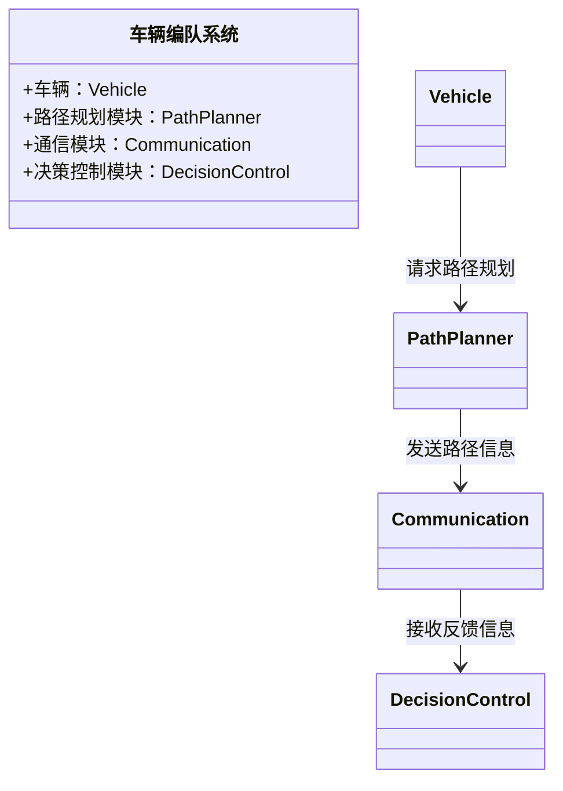
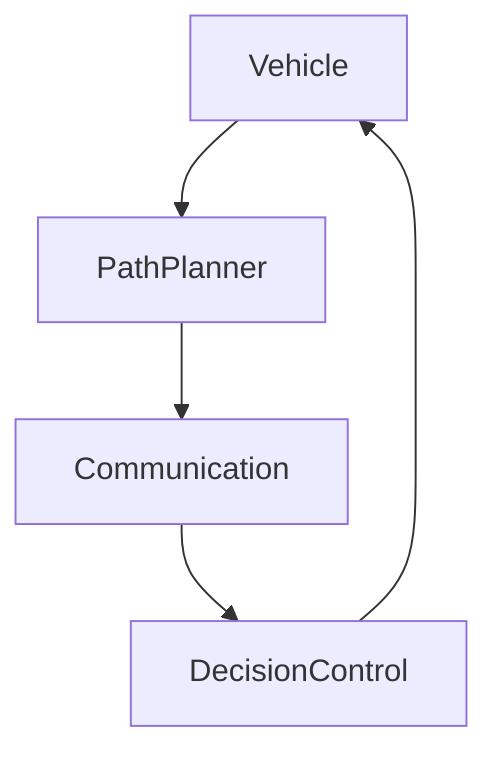

                 


# 价值投资中的智能交通车辆编队系统分析

> 关键词：智能交通系统、车辆编队系统、价值投资分析、优化算法、系统架构设计

> 摘要：本文从价值投资的角度分析智能交通车辆编队系统的技术与经济价值，探讨其在提升交通效率、降低成本和优化资源分配中的潜力。通过详细的技术分析和系统设计，结合实际案例和投资策略，为投资者和技术开发者提供深入的见解。

---

## 第1章: 智能交通车辆编队系统背景与概述

### 1.1 智能交通车辆编队系统的背景

#### 1.1.1 智能交通系统的概念与特点

智能交通系统（Intelligent Transportation Systems, ITS）是通过先进的信息技术、数据通信技术、传感器技术和计算机技术，对交通系统进行实时监控、管理和优化。其特点包括实时性、智能化、网络化和高效性。

#### 1.1.2 车辆编队系统的定义与技术基础

车辆编队系统是指一组车辆在智能控制下协同行驶，形成有序的车队。其技术基础包括车辆通信技术、传感器技术、自动控制技术和优化算法。

#### 1.1.3 车辆编队系统在智能交通中的作用

车辆编队系统能够提高道路利用率、减少交通拥堵、降低能源消耗和排放，从而提升整体交通系统的效率和可持续性。

### 1.2 价值投资视角下的编队系统分析

#### 1.2.1 价值投资的基本概念与原则

价值投资是一种投资策略，通过分析企业的内在价值，寻找被市场低估的投资机会。其核心原则包括长期投资、注重基本面和安全边际。

#### 1.2.2 编队系统在智能交通中的经济价值

编队系统通过提高交通效率，降低运营成本，提升用户体验，为企业带来经济效益。同时，其技术门槛和市场潜力也吸引了投资者的关注。

#### 1.2.3 编队系统对交通效率的提升与成本节约

通过优化车辆行驶间距和路径，编队系统能够减少交通拥堵，降低燃料消耗和维护成本，从而实现成本节约。

## 1.3 本章小结

本章介绍了智能交通车辆编队系统的背景、定义和作用，从价值投资的角度分析了其经济价值和对交通效率的提升作用。

---

## 第2章: 智能交通车辆编队系统的核心概念与系统架构

### 2.1 编队系统的核心概念

#### 2.1.1 车辆通信与协调控制

车辆通信是编队系统的核心，通过车车通信（V2V）和车路通信（V2I）实现车辆间的协调控制。

#### 2.1.2 路径规划与优化

路径规划是编队系统的重要组成部分，通过优化路径减少行驶距离和时间，提高效率。

#### 2.1.3 决策控制与安全机制

决策控制确保编队系统在复杂环境下的安全运行，安全机制包括障碍物检测、碰撞 avoidance 和自适应控制。

### 2.2 编队系统的关键技术

#### 2.2.1 车辆间通信技术

包括无线通信技术、车联网技术和自组织网络技术，确保车辆间的信息实时传输。

#### 2.2.2 多目标优化算法

如遗传算法、粒子群优化算法等，用于优化编队系统的性能指标。

#### 2.2.3 系统集成与测试

通过系统集成实现各模块的协同工作，测试确保系统的稳定性和可靠性。

### 2.3 编队系统的架构设计

#### 2.3.1 分层架构设计

包括感知层、决策层和执行层，各层协同工作实现编队控制。

#### 2.3.2 模块化设计与功能划分

模块化设计便于系统的扩展和维护，功能划分明确，确保各模块高效协作。

#### 2.3.3 系统扩展性与可维护性

通过模块化设计和标准化接口，提升系统的扩展性和可维护性。

## 2.4 本章小结

本章详细讲解了编队系统的核心概念和技术，分析了系统架构设计，为后续章节的深入分析奠定了基础。

---

## 第3章: 编队系统中的算法原理与数学模型

### 3.1 队列控制算法

#### 3.1.1 基于反馈的队列控制算法

通过实时反馈调整队列长度，保持交通流的稳定。

#### 3.1.2 队列长度的动态方程

$$ L(t+1) = L(t) + \Delta t \cdot (r - s) $$

其中，$L(t)$为队列长度，$\Delta t$为时间间隔，$r$为到达率，$s$为服务率。

#### 3.1.3 算法的收敛性分析

通过数学分析证明算法的收敛性，确保其在实际应用中的有效性。

### 3.2 路径规划算法

#### 3.2.1 基于Dijkstra算法的路径规划

使用Dijkstra算法寻找最短路径，适用于静态交通网络。

#### 3.2.2 基于A*算法的路径优化

结合启发式搜索，提高路径规划的效率和准确性。

#### 3.2.3 多目标优化模型

建立多目标优化模型，综合考虑时间、距离和能耗等因素，实现全局优化。

### 3.3 通信协议与同步机制

#### 3.3.1 时间同步算法

确保车辆间的时钟同步，保证通信和控制的准确性。

#### 3.3.2 数据传输协议

设计高效的通信协议，确保数据的可靠传输和实时性。

---

## 第4章: 系统分析与架构设计

### 4.1 系统分析

#### 4.1.1 问题场景介绍

分析编队系统在实际应用中的场景，如高速公路、城市道路等。

#### 4.1.2 项目介绍

介绍编队系统的开发目标、技术路线和实施计划。

### 4.2 系统功能设计

#### 4.2.1 领域模型类图

使用Mermaid绘制领域模型类图，展示系统的主要模块和交互关系。

```


```

#### 4.2.2 系统架构设计

使用Mermaid绘制系统架构图，展示各模块的交互关系。

```


```

#### 4.2.3 系统接口设计

定义系统接口，包括输入输出接口、通信接口和控制接口。

#### 4.2.4 系统交互流程

使用Mermaid绘制序列图，展示系统各模块的交互流程。

```
```mermaid
sequenceDiagram

参与者：用户
参与者：系统

用户 -> 系统：请求路径规划
系统 -> 用户：返回最优路径
用户 -> 系统：确认路径
系统 -> 用户：开始编队
```

```

---

## 第5章: 项目实战

### 5.1 环境安装

#### 5.1.1 开发环境配置

安装必要的开发工具，如Python、Git、IDE等。

#### 5.1.2 依赖库安装

安装numpy、pandas、scikit-learn等依赖库。

### 5.2 核心代码实现

#### 5.2.1 队列控制算法实现

```python
def queue_control(current_length, arrival_rate, service_rate, delta_t):
    return current_length + delta_t * (arrival_rate - service_rate)
```

#### 5.2.2 路径规划算法实现

```python
import numpy as np

def dijkstra(graph, start, end):
    dist = {node: np.inf for node in graph}
    dist[start] = 0
    while dist[end] == np.inf:
        # 找出距离最小的节点
        min_node = min(dist, key=lambda x: dist[x])
        # 更新相邻节点的距离
        for neighbor in graph[min_node]:
            if dist[neighbor] > dist[min_node] + graph[min_node][neighbor]:
                dist[neighbor] = dist[min_node] + graph[min_node][neighbor]
    return dist[end]
```

#### 5.2.3 通信协议实现

```python
import socket

def send_data(sock, data):
    sock.sendall(data.encode())

def receive_data(sock):
    return sock.recv(1024).decode()
```

### 5.3 案例分析与代码解读

#### 5.3.1 案例分析

分析一个实际案例，如某高速公路的车辆编队系统实施情况，展示系统的实际效果。

#### 5.3.2 代码实现

详细解读上述代码，说明其功能和实现原理。

### 5.4 项目小结

总结项目实施的经验和教训，提出改进建议。

---

## 第6章: 编队系统的价值评估与投资策略

### 6.1 系统经济效益分析

#### 6.1.1 成本节约分析

分析编队系统在运营中的成本节约，如燃料节省、维护成本降低等。

#### 6.1.2 效益提升分析

通过提高交通效率，增加收益，如通行费收入和时间节约的价值。

### 6.2 投资策略与风险管理

#### 6.2.1 项目投资分析

评估编队系统的投资回报周期和风险因素。

#### 6.2.2 市场潜力分析

分析智能交通系统的市场潜力和编队系统的发展前景。

#### 6.2.3 风险管理策略

制定风险管理策略，降低投资风险。

---

## 第7章: 总结与展望

### 7.1 本章总结

总结全文内容，重申编队系统的技术价值和经济价值。

### 7.2 未来展望

展望编队系统的发展方向，如新技术的应用、系统优化和市场扩展。

### 7.3 最佳实践 tips

提供一些实际操作的建议，帮助投资者和技术开发者更好地实施编队系统。

---

## 参考文献

列出本文参考的相关文献和资料，确保内容的准确性和权威性。

---

通过以上结构，文章详细分析了智能交通车辆编队系统的技术原理、系统架构、算法实现和投资价值，为投资者和技术开发者提供了全面的参考和指导。

