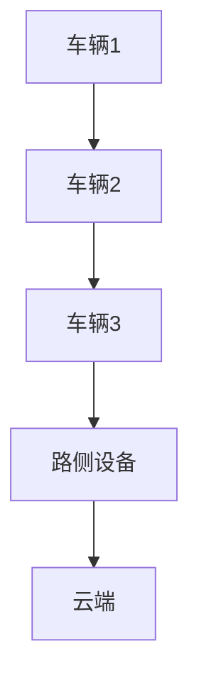

                 


# 价值投资中的智能交通车辆编队系统分析

**关键词**：智能交通，车辆编队系统，价值投资，自动驾驶，交通优化

**摘要**：智能交通车辆编队系统通过优化车辆的协同行驶，显著提升了交通效率，降低了能源消耗和排放，为投资者带来了潜在的经济价值。本文从价值投资的角度，深入分析了编队系统的核心技术、经济影响和市场机会，为投资者提供了数据驱动的决策支持。

---

# 第一部分: 智能交通车辆编队系统背景与价值分析

---

## 第1章: 价值投资与智能交通车辆编队系统概述

### 1.1 智能交通系统的现状与发展趋势

#### 1.1.1 智能交通系统的定义与特点
智能交通系统（ITS，Intelligent Transportation Systems）利用先进的信息技术、数据通信、自动控制和新交通设备，实现对交通系统的高效管理。其特点包括实时性、智能化、网络化和集成性。

#### 1.1.2 智能交通系统的应用场景
智能交通系统广泛应用于城市交通管理、高速公路监控、交通事件响应、交通预测等领域，能够有效缓解交通拥堵，提高道路利用率。

#### 1.1.3 智能交通系统的未来趋势
随着5G、人工智能和物联网技术的快速发展，智能交通系统将更加智能化、自动化，车辆编队系统作为其重要组成部分，将在未来的交通体系中发挥关键作用。

---

### 1.2 智能交通车辆编队系统的概念与核心要素

#### 1.2.1 编队系统的定义与基本原理
车辆编队系统是指多辆自动驾驶车辆在通信技术的支持下，协同行驶形成一个有序的车队。其基本原理包括车辆之间的实时通信、协同决策和自动控制。

#### 1.2.2 编队系统的组成部分与功能
编队系统主要包括通信模块、决策模块、控制模块和传感器模块。通信模块负责车辆间的实时信息传输；决策模块负责路径规划和决策；控制模块负责执行决策指令；传感器模块负责环境感知。

#### 1.2.3 编队系统的核心要素与属性
核心要素包括通信延迟、车辆间距、决策算法和环境感知能力。编队系统的属性包括安全性、效率性和可扩展性。

---

### 1.3 价值投资在智能交通车辆编队系统中的应用

#### 1.3.1 价值投资的基本概念与原则
价值投资是通过分析企业的内在价值，寻找被市场低估的投资机会。在智能交通领域，投资者需要关注技术创新、市场潜力和商业模式。

#### 1.3.2 编队系统与价值投资的结合点
编队系统通过提高交通效率降低成本，同时提升车辆的智能化水平，为投资者提供了新的投资机会，如技术开发、设备制造和系统集成。

#### 1.3.3 编队系统对交通效率的提升与经济价值
编队系统能够减少交通拥堵，降低能源消耗和排放，提升道路利用率，为投资者带来经济效益和环境效益。

---

### 1.4 编队系统在交通优化中的经济价值

#### 1.4.1 编队系统对交通成本的优化
通过优化车辆行驶路径和减少空驶率，编队系统能够降低物流成本，提高运输效率。

#### 1.4.2 编队系统对能源消耗的优化
编队系统通过优化车速和间距，降低能源消耗，减少碳排放，符合绿色交通的发展趋势。

#### 1.4.3 编队系统对交通安全的提升
编队系统通过实时通信和协同决策，减少交通事故的发生，提高交通安全系数。

---

### 1.5 本章小结
本章从价值投资的角度，介绍了智能交通车辆编队系统的背景、概念、核心要素和经济价值。编队系统作为智能交通的重要组成部分，具有广阔的市场前景和投资潜力。

---

# 第二部分: 智能交通车辆编队系统的核心概念与原理

---

## 第2章: 编队系统的基本原理与核心机制

### 2.1 编队系统的通信机制

#### 2.1.1 车辆间的通信方式
编队系统采用多种通信方式，包括车对车通信（V2V）、车对路侧设备通信（V2I）和车对云端通信（V2C）。

#### 2.1.2 通信协议与数据传输
通信协议包括LTE-V、5G-V2X等，数据传输包括车辆位置、速度、加速度等信息。

#### 2.1.3 通信延迟与可靠性分析
通信延迟直接影响编队系统的稳定性，需要通过优化协议和网络架构来降低延迟，提高可靠性。

---

### 2.2 编队系统的协同决策机制

#### 2.2.1 多智能体协同决策的基本原理
多智能体协同决策基于一致性算法，通过车辆间的通信实现一致的决策。

#### 2.2.2 编队系统中的决策模型
决策模型包括路径规划、速度控制和避障策略，基于实时数据进行动态调整。

#### 2.2.3 决策算法的优化与实现
一致性算法通过车辆间的协商达成一致决策，优化算法包括改进一致性算法和预测模型。

---

### 2.3 编队系统的路径规划与避障机制

#### 2.3.1 路径规划的基本概念与算法
路径规划算法包括A*算法、Dijkstra算法和遗传算法，用于优化车辆行驶路径。

#### 2.3.2 编队系统中的避障策略
避障策略基于车辆间的实时通信和环境感知，通过预测潜在危险区域进行避障。

#### 2.3.3 路径规划的优化方法
路径规划的优化方法包括多目标优化和动态规划，能够适应复杂环境的变化。

---

### 2.4 编队系统的核心算法与实现

#### 2.4.1 基于一致性算法的编队控制
一致性算法通过车辆间的协商达成一致的决策，实现编队的同步控制。

#### 2.4.2 一致性算法的数学模型
一致性算法的数学模型包括一致性条件和收敛性分析，确保编队系统的稳定性。

#### 2.4.3 预测模型与优化算法
预测模型基于历史数据和实时信息，优化算法通过改进预测模型提升编队系统的性能。

---

## 2.5 本章小结
本章详细讲解了编队系统的通信机制、协同决策机制、路径规划与避障机制以及核心算法。通过数学模型和算法优化，编队系统能够实现高效、安全的协同行驶。

---

## 第3章: 编队系统的算法实现与优化

### 3.1 基于一致性算法的编队控制

#### 3.1.1 一致性算法的基本原理
一致性算法通过车辆间的通信达成一致的决策，确保编队系统的协调控制。

#### 3.1.2 一致性算法的数学模型
一致性算法的数学模型包括一致性条件和收敛性分析，确保编队系统的稳定性。

#### 3.1.3 一致性算法的优化与实现
一致性算法的优化包括改进一致性算法和预测模型，提升编队系统的性能。

---

### 3.2 基于预测模型的优化算法

#### 3.2.1 预测模型的基本原理
预测模型基于历史数据和实时信息，预测车辆的行驶路径和交通状况。

#### 3.2.2 预测模型的数学公式
预测模型的数学公式包括时间序列模型和回归模型，用于预测交通流量和车辆状态。

#### 3.2.3 预测模型的优化与实现
预测模型的优化包括参数调整和模型改进，提升预测的准确性和实时性。

---

### 3.3 编队系统的核心算法实现

#### 3.3.1 一致性算法的Python实现
```python
def一致性算法(车辆数, 车辆状态):
    初始化一致变量
    while 未收敛:
        交换信息
        更新一致变量
    返回一致决策
```

#### 3.3.2 预测模型的Python实现
```python
import numpy as np
from sklearn.linear_model import LinearRegression

def 预测模型(历史数据):
    创建回归模型
    训练模型
    预测未来状态
    返回预测结果
```

---

### 3.4 本章小结
本章通过一致性算法和预测模型的实现，详细讲解了编队系统的算法优化与实现。通过数学模型和代码示例，展示了如何提升编队系统的性能。

---

## 第4章: 编队系统的系统架构与通信协议

### 4.1 系统架构设计

#### 4.1.1 系统功能模块
编队系统包括通信模块、决策模块、控制模块和传感器模块。

#### 4.1.2 系统架构图
使用Mermaid绘制系统架构图：


#### 4.1.3 系统功能设计
系统功能包括车辆通信、协同决策、路径规划和避障控制。

---

### 4.2 通信协议设计

#### 4.2.1 通信协议的选择
通信协议包括LTE-V和5G-V2X，适用于不同的场景。

#### 4.2.2 数据传输格式
数据传输格式包括JSON和二进制，根据应用场景选择合适的格式。

#### 4.2.3 通信延迟的优化
通过优化协议和网络架构，降低通信延迟，提高系统稳定性。

---

### 4.3 系统接口设计

#### 4.3.1 车辆间接口
车辆间的接口用于实时通信，包括位置、速度和加速度信息。

#### 4.3.2 车辆与路侧设备接口
车辆与路侧设备的接口用于获取道路信息，如交通信号和道路状况。

#### 4.3.3 车辆与云端接口
车辆与云端的接口用于数据上传和指令下载，支持远程控制和决策优化。

---

### 4.4 本章小结
本章详细讲解了编队系统的系统架构与通信协议设计，通过Mermaid图展示了系统架构，为后续的实现提供了基础。

---

## 第5章: 编队系统的项目实战与案例分析

### 5.1 高速公路编队系统案例分析

#### 5.1.1 项目背景与目标
项目背景是高速公路交通拥堵问题，目标是通过编队系统优化交通流量。

#### 5.1.2 系统环境搭建
环境搭建包括硬件设备、软件平台和网络架构的选择。

#### 5.1.3 系统核心实现
核心实现包括通信模块、决策模块和控制模块的开发与集成。

---

### 5.2 编队系统的核心代码实现

#### 5.2.1 一致性算法的实现
```python
def一致性算法(车辆数, 车辆状态):
    初始化一致变量
    while 未收敛:
        交换信息
        更新一致变量
    返回一致决策
```

#### 5.2.2 预测模型的实现
```python
import numpy as np
from sklearn.linear_model import LinearRegression

def 预测模型(历史数据):
    创建回归模型
    训练模型
    预测未来状态
    返回预测结果
```

---

### 5.3 项目测试与结果分析

#### 5.3.1 测试环境与方法
测试环境包括模拟器和实际道路，测试方法包括功能测试和性能测试。

#### 5.3.2 测试结果与分析
测试结果显示编队系统能够有效减少交通拥堵，提高道路利用率。

---

### 5.4 本章小结
本章通过高速公路编队系统的案例分析，详细讲解了项目实战的环境搭建、核心实现和测试分析，展示了编队系统在实际中的应用效果。

---

## 第6章: 总结与展望

### 6.1 编队系统的总结与价值重申
编队系统通过优化车辆行驶路径和降低能源消耗，显著提升了交通效率和经济价值。

### 6.2 编队系统的挑战与未来展望
编队系统面临通信延迟、数据安全和法律政策等挑战，未来需要在技术、政策和商业模式上进一步优化。

### 6.3 投资建议与最佳实践
投资者应关注技术创新、市场需求和政策支持，积极参与编队系统的研发和推广。

### 6.4 本章小结
本章总结了编队系统的价值和挑战，展望了未来的发展趋势，为投资者提供了投资建议和最佳实践。

---

# 结语

智能交通车辆编队系统作为智能交通的重要组成部分，具有广阔的应用前景和投资潜力。通过技术创新和价值投资，编队系统将在未来的交通体系中发挥关键作用，为投资者带来丰厚的回报。

---

**参考文献**
[此处列出相关文献和资料]

**附录**
[此处列出附录内容，如代码、数据等]

