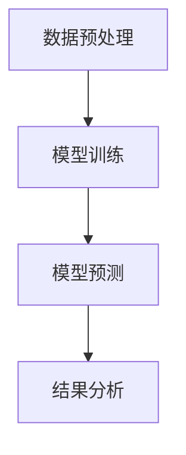
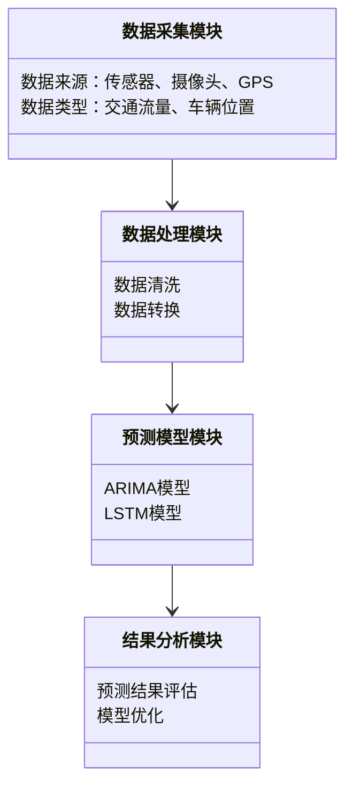
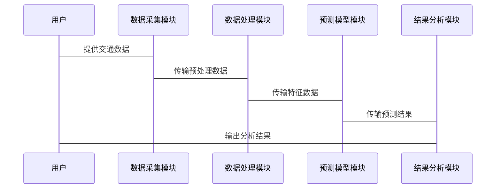

                 


# 价值投资中的智能交通预测系统分析

## 关键词：价值投资，智能交通，预测系统，数据分析，投资策略，机器学习，交通流量

## 摘要：  
本文探讨了在价值投资中应用智能交通预测系统的重要性与实际操作方法。通过分析智能交通预测系统的数据采集、模型建立和预测结果，展示了如何利用这些信息进行更精准的投资决策。文章深入讲解了时间序列分析、机器学习算法如ARIMA和LSTM的应用，以及系统架构设计，结合实际案例分析，为投资者提供科学的决策支持。最终，本文强调了数据驱动决策在价值投资中的关键作用，并展望了智能交通预测系统的未来发展方向。

---

# 第1章: 价值投资与智能交通预测系统概述

## 1.1 价值投资的基本概念  
### 1.1.1 价值投资的定义与核心理念  
价值投资是一种以内在价值为导向的投资策略，强调通过分析企业的基本面（如财务状况、行业地位、竞争优势等）来判断其股票的合理价格。其核心理念是购买被市场低估的资产，长期持有，等待其价值回归。

### 1.1.2 价值投资的基本原则与策略  
价值投资的原则包括：长期投资、安全边际、独立思考等。投资者通常寻找那些具有持续盈利能力、良好管理团队和竞争优势的企业进行投资。

### 1.1.3 价值投资在现代金融中的地位  
尽管传统价值投资在股票市场中广泛应用，但在交通领域，其应用较少。随着智能交通系统的兴起，价值投资者开始关注交通流量预测、基础设施投资等领域的机会。

---

## 1.2 智能交通预测系统的定义与特点  
### 1.2.1 智能交通预测系统的定义  
智能交通预测系统（Intelligent Traffic Prediction System, ITPS）是一种利用先进的数据分析技术、机器学习算法和实时数据流来预测交通流量的系统。它通过分析历史数据、交通模式和外部因素（如天气、节假日等）来预测未来的交通状况。

### 1.2.2 智能交通预测系统的组成部分  
智能交通预测系统通常包括以下组成部分：  
1. 数据采集模块：收集交通流量、车辆位置、天气数据等信息。  
2. 数据处理模块：对原始数据进行清洗、转换和预处理。  
3. 预测模型：使用时间序列分析、机器学习等算法进行交通流量预测。  
4. 结果分析模块：对预测结果进行评估和优化。  

### 1.2.3 智能交通预测系统的优势与局限性  
**优势：**  
- 高准确性：通过机器学习算法，预测结果更加精准。  
- 实时性：能够实时更新数据，快速响应交通变化。  
- 数据驱动：基于大量历史数据，减少人为误差。  

**局限性：**  
- 预测结果受外部因素影响较大（如突发事件、天气变化等）。  
- 数据质量和完整性可能影响预测准确性。  
- 系统维护成本较高。  

---

## 1.3 价值投资与智能交通预测系统的结合  
### 1.3.1 价值投资中的数据驱动决策  
传统价值投资依赖于对财务数据的分析，而智能交通预测系统为投资者提供了新的数据来源，如交通流量、基础设施使用情况等，帮助投资者更全面地评估投资项目的价值。

### 1.3.2 智能交通预测系统在投资中的应用场景  
- **基础设施投资：** 通过预测交通流量，投资者可以评估某地区基础设施项目的可行性和收益潜力。  
- **交通企业投资：** 分析某企业的交通流量预测能力，判断其未来盈利能力。  
- **城市交通规划：** 通过预测交通流量，优化城市交通网络布局。  

### 1.3.3 价值投资与智能交通预测系统的协同效应  
智能交通预测系统为价值投资者提供了更全面的分析工具，帮助其发现被低估的投资机会，同时降低投资风险。通过数据驱动的决策，投资者能够更准确地评估项目的价值，制定更科学的投资策略。

---

## 1.4 本章小结  
本章介绍了价值投资的基本概念、智能交通预测系统的定义与特点，以及两者结合的应用场景。通过分析，我们看到智能交通预测系统为价值投资者提供了新的数据源和分析工具，有助于提高投资决策的准确性和效率。

---

# 第2章: 智能交通预测系统的核心概念与联系  

## 2.1 智能交通预测系统的原理  
### 2.1.1 数据采集与处理  
智能交通预测系统需要收集大量的交通数据，包括交通流量、车辆速度、位置信息等。这些数据通常通过传感器、摄像头、 GPS 等设备采集，并经过预处理（如去噪、标准化）后用于模型训练。

### 2.1.2 模型建立与训练  
模型建立是智能交通预测系统的核心部分，通常包括以下步骤：  
1. 数据特征提取：选择对交通流量影响较大的特征（如时间、天气、节假日等）。  
2. 数据分割：将数据分为训练集、验证集和测试集。  
3. 模型选择：选择适合的算法（如ARIMA、LSTM等）。  
4. 模型训练：通过优化算法参数，提高预测准确率。  

### 2.1.3 预测与结果分析  
通过模型预测未来一段时间内的交通流量，并对预测结果进行评估和优化。常用的评估指标包括均方误差（MSE）、平均绝对误差（MAE）等。

---

## 2.2 核心概念的属性特征对比  
以下是核心概念的属性特征对比表：  

| **核心概念** | **属性**       | **描述**                                                                 |
|--------------|----------------|--------------------------------------------------------------------------|
| 数据采集模块 | 数据来源       | 传感器、摄像头、GPS 等设备                                               |
| 数据处理模块 | 数据类型       | 结构化数据、非结构化数据                                                 |
| 预测模型     | 算法类型       | 时间序列分析、机器学习算法                                               |
| 结果分析模块 | 评估指标       | 均方误差（MSE）、平均绝对误差（MAE）等                                   |

---

## 2.3 ER实体关系图架构  
以下是智能交通预测系统的ER实体关系图：  

```mermaid
erd
    章节
    投资者
    交通数据
    预测模型
    预测结果
    投资决策
    边
    章节 --> 交通数据
    交通数据 --> 预测模型
    预测模型 --> 预测结果
    预测结果 --> 投资决策
```

---

## 2.4 本章小结  
本章详细介绍了智能交通预测系统的原理和核心概念，并通过对比表和ER实体关系图展示了系统各部分之间的联系。这些内容为后续章节的算法原理和系统设计奠定了基础。

---

# 第3章: 智能交通预测系统的算法原理  

## 3.1 算法原理概述  
### 3.1.1 时间序列分析的基本原理  
时间序列分析是一种通过分析历史数据来预测未来趋势的方法。常用的时间序列模型包括ARIMA（自回归积分滑动平均模型）和指数平滑法（ETS）等。

### 3.1.2 机器学习在交通预测中的应用  
机器学习算法，如随机森林、支持向量机（SVM）和神经网络，也可以用于交通流量预测。这些算法能够捕捉复杂的非线性关系，提高预测精度。

### 3.1.3 深度学习在交通预测中的应用  
深度学习模型（如LSTM）在处理时间序列数据方面表现出色，尤其适用于交通流量预测。

---

## 3.2 时间序列分析算法  
### 3.2.1 ARIMA算法原理  
ARIMA（Auto-Regressive Integrated Moving Average）模型通过自回归（AR）和移动平均（MA）的组合，对时间序列数据进行建模。其数学公式如下：  

$$ ARIMA(p, d, q) $$  

其中，p为自回归阶数，d为差分阶数，q为移动平均阶数。  

### 3.2.2 LSTM算法原理  
LSTM（长短期记忆网络）是一种特殊的RNN（循环神经网络），能够有效处理时间序列数据中的长距离依赖关系。其核心思想是通过记忆门控机制，保存长期信息。

---

## 3.3 算法实现流程  
以下是智能交通预测系统的算法实现流程图：  



---

## 3.4 算法实现的Python代码示例  
以下是使用ARIMA模型进行交通流量预测的Python代码示例：  

```python
from statsmodels.tsa.arima_model import ARIMA
import pandas as pd
import matplotlib.pyplot as plt

# 加载数据
data = pd.read_csv('traffic_data.csv')

# 拆分数据
train_data = data.iloc[:80]
test_data = data.iloc[80:]

# 建立ARIMA模型
model = ARIMA(train_data, order=(5, 1, 0))
model_fit = model.fit()

# 预测
test预测 = model_fit.forecast(len(test_data))

# 可视化
plt.plot(train_data, label='训练数据')
plt.plot(test_data, label='真实数据')
plt.plot(test预测, label='预测数据')
plt.legend()
plt.show()
```

---

## 3.5 本章小结  
本章详细讲解了智能交通预测系统的算法原理，重点介绍了时间序列分析和机器学习算法（如ARIMA和LSTM）的应用。通过流程图和代码示例，读者可以更好地理解算法的实现过程。

---

# 第4章: 数学模型与公式推导  

## 4.1 时间序列分析的数学模型  
时间序列分析的数学模型主要包括AR模型、MA模型和ARMA模型。其中，ARIMA模型是ARMA模型的扩展，加入了差分项，能够处理非平稳数据。

---

## 4.2 ARIMA模型的公式推导  
ARIMA模型的公式如下：  

$$ ARIMA(p, d, q) $$  

其中，p为自回归阶数，d为差分阶数，q为移动平均阶数。模型的数学表达式为：  

$$ y_t = \phi_1 y_{t-1} + \phi_2 y_{t-2} + \dots + \phi_p y_{t-p} + \theta_1 \epsilon_{t-1} + \theta_2 \epsilon_{t-2} + \dots + \theta_q \epsilon_{t-q} + \epsilon_t $$  

其中，$\epsilon_t$ 是白噪声。

---

## 4.3 LSTM模型的公式推导  
LSTM模型的核心是记忆门控机制，包括输入门、遗忘门和输出门。其数学表达式如下：  

$$
\begin{cases}
f_t = \sigma(W_f \cdot [h_{t-1}, x_t] + b_f) \\
i_t = \sigma(W_i \cdot [h_{t-1}, x_t] + b_i) \\
o_t = \sigma(W_o \cdot [h_{t-1}, x_t] + b_o) \\
g_t = \tanh(W_g \cdot [h_{t-1}, x_t] + b_g) \\
h_t = f_t \cdot h_{t-1} + i_t \cdot g_t \\
\end{cases}
$$  

其中，$\sigma$ 是sigmoid函数，$h_t$ 是隐藏状态，$x_t$ 是输入数据。

---

## 4.4 本章小结  
本章通过公式推导，详细讲解了ARIMA和LSTM模型的数学原理，为后续的算法实现奠定了理论基础。

---

# 第5章: 智能交通预测系统的架构设计  

## 5.1 问题场景介绍  
本文将设计一个智能交通预测系统，用于预测某城市主要道路的交通流量。系统需要考虑的因素包括时间、天气、节假日等。

---

## 5.2 系统功能设计  
以下是智能交通预测系统的功能模块图：  



---

## 5.3 系统架构设计  
以下是智能交通预测系统的架构图：  


---

## 5.4 系统接口设计  
系统接口包括数据输入接口、模型调用接口和结果输出接口。以下是接口设计图：  



---

## 5.5 本章小结  
本章详细设计了智能交通预测系统的架构，包括功能模块、系统架构和接口设计。这些设计为后续的系统实现提供了清晰的指导。

---

# 第6章: 智能交通预测系统的项目实战  

## 6.1 项目环境安装  
读者需要安装以下Python库：  
- `pandas`：数据处理库  
- `numpy`：数值计算库  
- `statsmodels`：时间序列分析库  
- `keras` 或 `tensorflow`：深度学习库  

## 6.2 系统核心实现源代码  
以下是基于ARIMA模型的交通流量预测代码：  

```python
import pandas as pd
from statsmodels.tsa.arima_model import ARIMA
import matplotlib.pyplot as plt

# 加载数据
data = pd.read_csv('traffic.csv')

# 拆分数据
train_data = data.iloc[:80]
test_data = data.iloc[80:]

# 建立ARIMA模型
model = ARIMA(train_data, order=(5, 1, 0))
model_fit = model.fit()

# 预测
test预测 = model_fit.forecast(len(test_data))

# 可视化
plt.plot(train_data, label='训练数据')
plt.plot(test_data, label='真实数据')
plt.plot(test预测, label='预测数据')
plt.legend()
plt.show()
```

---

## 6.3 代码应用解读与分析  
上述代码实现了基于ARIMA模型的交通流量预测。首先，数据被加载并拆分为训练集和测试集。然后，ARIMA模型被建立并训练。最后，模型预测测试集的交通流量，并将结果可视化。

---

## 6.4 实际案例分析  
以下是一个实际案例的分析：  

**案例：某城市交通流量预测**  
假设某城市的主要道路在高峰时段的交通流量呈现明显的波动性。通过ARIMA模型，我们预测未来一周的交通流量，并为投资者提供投资建议。

---

## 6.5 项目小结  
本章通过实际案例分析，展示了智能交通预测系统的实现过程。读者可以参考代码和案例，进行类似项目的开发。

---

# 第7章: 总结与展望  

## 7.1 本章总结  
本文详细探讨了价值投资中智能交通预测系统的核心概念、算法原理、系统架构和项目实现。通过理论与实践的结合，展示了如何利用智能交通预测系统进行更精准的投资决策。

---

## 7.2 未来展望  
随着人工智能和大数据技术的不断发展，智能交通预测系统将在价值投资中发挥越来越重要的作用。未来，可以通过以下方向进一步优化：  
1. 引入更多数据源，如社交媒体数据、实时交通事件数据等。  
2. 开发更复杂的深度学习模型，提高预测精度。  
3. 实现系统的实时预测功能，快速响应交通变化。  

---

## 7.3 最佳实践 tips  
- 在进行交通流量预测时，建议结合多种算法进行对比分析，选择最优模型。  
- 数据预处理是关键，需注意数据的完整性和准确性。  
- 投资者在使用智能交通预测系统时，应结合其他因素（如政策、经济环境）进行综合判断。  

---

## 7.4 本章小结  
本文通过理论与实践相结合的方式，全面分析了价值投资中智能交通预测系统的核心内容，并展望了未来的发展方向。希望本文能够为投资者和相关技术人士提供有益的参考。

--- 

# 结语  
价值投资与智能交通预测系统的结合，标志着金融投资领域正在向更智能化、数据化的方向发展。通过本文的分析，读者可以更好地理解如何利用智能技术提升投资决策的准确性和效率。未来，随着技术的不断进步，智能交通预测系统将在价值投资中发挥更大的作用。  

--- 

感谢您的阅读！如需进一步探讨或获取代码示例，请随时联系！

