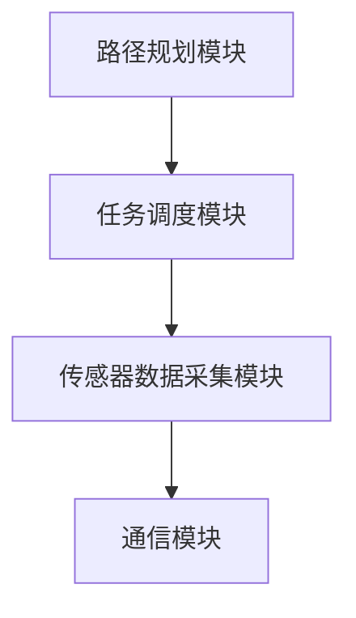
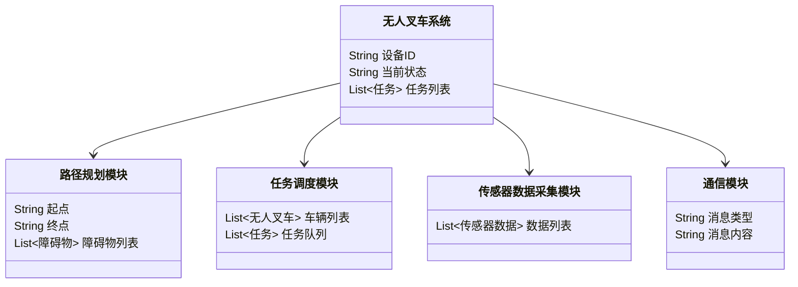
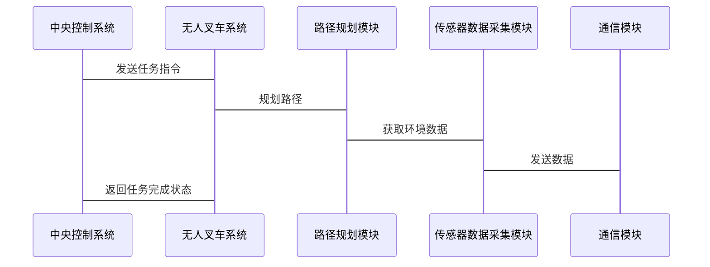

                 


# 价值投资中的智能仓储无人叉车系统分析

> 关键词：价值投资、智能仓储、无人叉车系统、路径规划、任务调度、投资决策

> 摘要：本文将深入探讨价值投资与智能仓储无人叉车系统的结合，分析无人叉车系统的核心技术、算法原理、系统架构设计以及实际应用场景。通过具体的案例分析和数学模型的建立，揭示无人叉车系统如何优化仓储管理、降低运营成本，并为投资者提供更高效的投资决策支持。

---

# 第一部分: 价值投资中的智能仓储无人叉车系统概述

## 第1章: 价值投资与智能仓储无人叉车系统概述

### 1.1 价值投资的基本概念

#### 1.1.1 价值投资的定义与核心理念
价值投资是一种投资策略，旨在通过分析企业的基本面，寻找那些市场价格低于其内在价值的股票进行投资。核心理念在于寻找具有持续竞争优势、良好管理和成长潜力的企业，长期持有以实现超额收益。

#### 1.1.2 智能仓储与无人叉车系统的概念
智能仓储是指通过智能化技术（如物联网、人工智能、机器人等）实现仓储管理的自动化、高效化和精确化。无人叉车系统是智能仓储的重要组成部分，它利用无人驾驶技术完成仓储内的物料搬运和货物装卸。

#### 1.1.3 价值投资与智能仓储的结合
随着科技的发展，智能仓储技术正在改变传统的仓储管理模式。通过引入无人叉车系统，企业可以显著提高仓储效率、降低成本，从而提升企业的整体竞争力。对于投资者而言，具备智能仓储能力的企业往往具有更高的成长性和投资价值。

### 1.2 智能仓储无人叉车系统的背景与应用

#### 1.2.1 仓储物流行业的发展现状
传统仓储管理存在效率低、成本高、人工依赖性强等问题。随着劳动力成本上升和企业对效率要求的提高，仓储物流行业亟需智能化转型。

#### 1.2.2 无人叉车系统的兴起与趋势
无人叉车系统的兴起源于技术进步（如AI、5G、物联网）和市场需求（如高效、安全、低成本）。未来，随着技术的成熟，无人叉车系统将在更多场景中得到广泛应用。

#### 1.2.3 无人叉车系统在价值投资中的潜在价值
无人叉车系统能够显著提升企业的运营效率和成本控制能力，这不仅能够提高企业的盈利能力，还能增强企业的市场竞争力。对于投资者而言，布局具备智能仓储能力的企业，能够在长期获得更高的投资回报。

### 1.3 无人叉车系统的核心技术与优势

#### 1.3.1 无人叉车系统的关键技术
- **无人驾驶技术**：包括路径规划、避障算法等。
- **物联网技术**：实现设备与系统的实时通信。
- **人工智能技术**：用于优化任务调度和决策。

#### 1.3.2 无人叉车系统的竞争优势
- **提高效率**：无人叉车能够24小时不间断工作，显著提高仓储效率。
- **降低成本**：减少人工成本，降低管理费用。
- **增强安全性**：无人操作降低了工伤风险。

#### 1.3.3 无人叉车系统对仓储效率的提升
通过无人叉车系统，企业能够实现仓储管理的智能化、自动化，减少人为错误，提升货物周转速度，从而优化供应链管理。

## 1.4 本章小结

### 1.4.1 价值投资与智能仓储无人叉车系统的结合
通过引入无人叉车系统，企业能够实现更高效的仓储管理，从而提升企业的整体价值，为投资者带来更高的投资回报。

### 1.4.2 无人叉车系统的技术优势与投资价值
无人叉车系统的核心技术优势使其成为智能仓储的重要组成部分，能够显著提升企业的竞争力和盈利能力。

### 1.4.3 本书的核心内容与研究方向
本书将从算法原理、系统架构、项目实战等角度，全面分析无人叉车系统的技术实现及其在价值投资中的应用。

---

## 第2章: 无人叉车系统的算法原理与数学模型

### 2.1 无人叉车系统的算法原理

#### 2.1.1 路径规划算法
路径规划是无人叉车系统的核心算法之一，主要解决如何在复杂环境中找到最优路径的问题。

##### 2.1.1.1 路径规划算法的数学模型
路径规划的目标是最小化路径长度、避开障碍物并满足无人叉车的运动约束。常用算法包括Dijkstra算法和A*算法。

$$
\text{路径长度} = \sum_{i=1}^{n} \text{边长}_i
$$

##### 2.1.1.2 Dijkstra算法的实现
Dijkstra算法通过优先队列找到从起点到终点的最短路径。

```python
import heapq

def dijkstra(graph, start, end):
    distances = {node: float('infinity') for node in graph}
    distances[start] = 0
    heap = [(0, start)]
    visited = set()
    
    while heap:
        current_dist, current_node = heapq.heappop(heap)
        if current_node in visited:
            continue
        visited.add(current_node)
        for neighbor, weight in graph[current_node].items():
            if distances[neighbor] > current_dist + weight:
                distances[neighbor] = current_dist + weight
                heapq.heappush(heap, (distances[neighbor], neighbor))
    return distances[end]
```

##### 2.1.1.3 A*算法的实现
A*算法通过引入启发函数提高路径规划效率。

```python
def a_star(graph, start, end, heuristic):
    open_set = {start}
    came_from = {}
    g_score = {node: float('infinity') for node in graph}
    g_score[start] = 0
    f_score = {node: float('infinity') for node in graph}
    f_score[start] = heuristic(start, end)
    
    while open_set:
        current = heapq.heappop(open_set, key=lambda x: f_score[x])
        if current == end:
            return reconstruct_path(came_from, end)
        for neighbor in graph[current]:
            tentative_g_score = g_score[current] + graph[current][neighbor]
            if tentative_g_score < g_score[neighbor]:
                came_from[neighbor] = current
                g_score[neighbor] = tentative_g_score
                f_score[neighbor] = g_score[neighbor] + heuristic(neighbor, end)
                heapq.heappush(open_set, neighbor)
    return None
```

##### 2.1.1.4 路径规划算法的优化与改进
通过引入机器学习算法（如强化学习），可以进一步优化路径规划算法，使其适应更复杂的环境。

#### 2.1.2 任务调度算法
任务调度算法用于优化无人叉车系统的任务分配，提高整体效率。

##### 2.1.2.1 任务调度算法的数学模型
任务调度的目标是最大化资源利用率和减少任务完成时间。

$$
\text{资源利用率} = \frac{\text{分配的任务数}}{\text{总任务数}}
$$

##### 2.1.2.2 任务调度算法的实现
常用算法包括贪心算法和遗传算法。

##### 2.1.2.3 贪心算法的实现
贪心算法通过优先处理紧急任务来优化调度。

```python
def greedy_scheduling(tasks, key_func):
    tasks.sort(key=key_func)
    schedule = []
    for task in tasks:
        schedule.append(task)
    return schedule
```

##### 2.1.2.4 遗传算法的实现
遗传算法通过模拟自然选择过程优化任务调度。

```python
def genetic_algorithm(population, fitness_func, mutation_rate):
    best = max(population, key=lambda x: fitness_func(x))
    while True:
        population = [mutate(individual, mutation_rate) for individual in population]
        best = max(population, key=lambda x: fitness_func(x))
        if best.fitness >= threshold:
            break
    return best
```

#### 2.1.3 传感器数据融合算法
传感器数据融合算法用于提高无人叉车系统的环境感知能力。

##### 2.1.3.1 数据融合算法的数学模型
数据融合的目标是提高系统的感知精度和可靠性。

$$
\text{融合后的概率} = \sum_{i=1}^{n} p_i \cdot w_i
$$

##### 2.1.3.2 数据融合算法的实现
常用算法包括加权平均法和概率融合法。

### 2.2 数学模型与公式

#### 2.2.1 路径规划的数学模型
路径规划的数学模型通常基于图论和优化理论。

$$
\text{优化目标} = \min \sum_{i=1}^{n} c_i
$$

#### 2.2.2 任务调度的数学模型
任务调度的数学模型通常涉及资源分配和时间规划。

$$
\text{约束条件} = \{t_1 \leq t_2, t_2 \leq t_3, \ldots, t_{n-1} \leq t_n\}
$$

#### 2.2.3 数据融合的数学模型
数据融合的数学模型通常涉及概率论和统计学。

$$
\text{融合结果} = \frac{\sum_{i=1}^{n} w_i x_i}{\sum_{i=1}^{n} w_i}
$$

### 2.3 算法实现与代码示例

#### 2.3.1 路径规划算法的Python实现
Dijkstra算法和A*算法的Python实现如上所述。

#### 2.3.2 任务调度算法的Python实现
贪心算法和遗传算法的Python实现如上所述。

#### 2.3.3 数据融合算法的Python实现
加权平均法和概率融合法的Python实现如下：

```python
def weighted_average(data, weights):
    return sum(data[i] * weights[i] for i in range(len(data))) / sum(weights)

def probability_fusion(data, probabilities):
    return sum(data[i] * probabilities[i] for i in range(len(data)))
```

### 2.4 算法的优化与改进

#### 2.4.1 算法的优化策略
- 引入机器学习算法优化路径规划。
- 使用分布式计算提高任务调度效率。

#### 2.4.2 算法的性能评估
- 通过模拟实验评估算法的运行效率。
- 使用实际数据验证算法的准确性。

#### 2.4.3 算法的扩展与应用
- 将优化后的算法应用于更多场景。
- 结合其他技术（如区块链）提高系统的安全性。

### 2.5 本章小结

#### 2.5.1 无人叉车系统算法的核心原理
路径规划、任务调度和数据融合算法是无人叉车系统的核心组成部分，它们共同确保系统的高效运行。

#### 2.5.2 数学模型与公式在算法中的应用
数学模型和公式为算法的实现提供了理论基础，帮助我们更好地理解和优化算法。

#### 2.5.3 无人叉车系统算法的优化与改进
通过不断优化算法，可以提高系统的运行效率和适应性，从而更好地满足实际需求。

---

## 第3章: 无人叉车系统的系统架构设计

### 3.1 无人叉车系统架构设计的背景与目标

#### 3.1.1 系统架构设计的背景
随着无人叉车系统的广泛应用，系统架构设计的重要性日益凸显。

#### 3.1.2 系统架构设计的目标
- 提高系统的可扩展性和可维护性。
- 优化系统的运行效率和安全性。
- 确保系统的兼容性和集成性。

### 3.2 无人叉车系统架构设计的核心模块

#### 3.2.1 系统功能模块
- **路径规划模块**：负责规划无人叉车的运动路径。
- **任务调度模块**：负责分配和管理任务。
- **传感器数据采集模块**：负责采集环境数据。
- **通信模块**：负责与中央控制系统通信。

#### 3.2.2 模块之间的关系
模块之间的关系可以通过Mermaid图表示：



### 3.3 无人叉车系统架构设计的技术实现

#### 3.3.1 系统功能设计
系统功能设计可以通过Mermaid类图表示：



#### 3.3.2 系统架构设计
系统架构设计可以通过Mermaid架构图表示：


### 3.4 无人叉车系统架构设计的实现与优化

#### 3.4.1 系统接口设计
系统接口设计可以通过Mermaid序列图表示：



#### 3.4.2 系统架构的优化与扩展
通过引入边缘计算和云计算技术，可以进一步优化系统的架构设计。

### 3.5 本章小结

#### 3.5.1 无人叉车系统架构设计的核心模块
路径规划模块、任务调度模块、传感器数据采集模块和通信模块是无人叉车系统的核心组成部分。

#### 3.5.2 系统架构设计的技术实现
通过合理的模块划分和接口设计，可以提高系统的可扩展性和可维护性。

#### 3.5.3 无人叉车系统架构设计的优化与扩展
通过引入新技术（如边缘计算和云计算），可以进一步优化系统的运行效率和安全性。

---

## 第4章: 无人叉车系统的项目实战

### 4.1 无人叉车系统项目概述

#### 4.1.1 项目背景
本项目旨在设计并实现一个基于无人叉车系统的智能仓储解决方案。

#### 4.1.2 项目目标
- 实现无人叉车系统的路径规划功能。
- 实现无人叉车系统的任务调度功能。
- 实现无人叉车系统的传感器数据采集功能。

### 4.2 无人叉车系统项目环境安装

#### 4.2.1 系统环境要求
- 操作系统：Linux/Windows/MacOS
- Python版本：3.6+
- 依赖库：numpy、pandas、matplotlib、scikit-learn

#### 4.2.2 环境安装步骤
1. 安装Python
2. 安装依赖库
3. 下载项目代码

### 4.3 无人叉车系统项目核心实现

#### 4.3.1 路径规划模块的实现
路径规划模块的实现基于Dijkstra算法和A*算法。

#### 4.3.2 任务调度模块的实现
任务调度模块的实现基于贪心算法和遗传算法。

#### 4.3.3 传感器数据采集模块的实现
传感器数据采集模块的实现基于物联网技术。

### 4.4 无人叉车系统项目实现与分析

#### 4.4.1 项目实现的详细步骤
1. 初始化系统环境
2. 实现路径规划功能
3. 实现任务调度功能
4. 实现传感器数据采集功能
5. 测试系统功能

#### 4.4.2 项目实现的代码示例
路径规划模块的代码示例：

```python
def dijkstra(graph, start, end):
    distances = {node: float('infinity') for node in graph}
    distances[start] = 0
    heap = [(0, start)]
    visited = set()
    
    while heap:
        current_dist, current_node = heapq.heappop(heap)
        if current_node in visited:
            continue
        visited.add(current_node)
        for neighbor, weight in graph[current_node].items():
            if distances[neighbor] > current_dist + weight:
                distances[neighbor] = current_dist + weight
                heapq.heappush(heap, (distances[neighbor], neighbor))
    return distances[end]
```

任务调度模块的代码示例：

```python
def greedy_scheduling(tasks, key_func):
    tasks.sort(key=key_func)
    schedule = []
    for task in tasks:
        schedule.append(task)
    return schedule
```

#### 4.4.3 项目实现的案例分析
通过实际案例分析，验证无人叉车系统的实现效果。

### 4.5 本章小结

#### 4.5.1 无人叉车系统项目的实现步骤
通过环境安装、功能实现和案例分析，全面展示了无人叉车系统的实现过程。

#### 4.5.2 无人叉车系统项目的代码实现
路径规划模块和任务调度模块的代码实现是项目的核心部分。

#### 4.5.3 无人叉车系统项目的案例分析
通过实际案例分析，验证了无人叉车系统的实现效果。

---

## 第5章: 价值投资中的无人叉车系统投资策略

### 5.1 无人叉车系统在价值投资中的应用

#### 5.1.1 无人叉车系统对投资价值的影响
无人叉车系统能够显著提升企业的运营效率和成本控制能力，从而提高企业的整体价值。

#### 5.1.2 无人叉车系统在投资决策中的作用
通过分析企业的无人叉车系统的应用情况，投资者可以更好地评估企业的未来发展前景。

### 5.2 无人叉车系统投资策略的制定

#### 5.2.1 投资策略的核心要素
- 企业的技术实力
- 市场需求
- 企业的财务状况

#### 5.2.2 投资策略的制定步骤
1. 分析企业的技术实力
2. 评估市场需求
3. 分析企业的财务状况
4. 制定投资策略

### 5.3 无人叉车系统投资策略的优化

#### 5.3.1 投资策略的优化方法
- 引入机器学习算法优化投资策略
- 结合市场动态调整投资策略

#### 5.3.2 投资策略的优化与案例分析
通过实际案例分析，验证投资策略的优化效果。

### 5.4 本章小结

#### 5.4.1 无人叉车系统在价值投资中的应用
无人叉车系统能够显著提升企业的运营效率和成本控制能力，从而提高企业的整体价值。

#### 5.4.2 无人叉车系统投资策略的制定
通过分析企业的技术实力、市场需求和财务状况，制定科学的投资策略。

#### 5.4.3 无人叉车系统投资策略的优化
通过引入新技术和结合市场动态，优化投资策略，提高投资回报率。

---

## 第6章: 无人叉车系统在价值投资中的最佳实践与展望

### 6.1 无人叉车系统的最佳实践

#### 6.1.1 系统实施的最佳实践
- 确保系统的可扩展性和可维护性
- 定期更新系统软件
- 做好系统的备份和恢复工作

#### 6.1.2 投资决策的最佳实践
- 关注企业的技术实力和市场前景
- 结合市场动态调整投资策略
- 做好风险管理和资产配置

### 6.2 无人叉车系统的未来展望

#### 6.2.1 无人叉车系统的未来发展趋势
- 技术的进一步优化与创新
- 市场的进一步扩大与应用

#### 6.2.2 无人叉车系统在价值投资中的未来机遇与挑战
- 机遇：技术进步带来的投资机会
- 挑战：技术更新带来的投资风险

### 6.3 本章小结

#### 6.3.1 无人叉车系统的最佳实践
通过系统的实施和投资决策的最佳实践，可以提高企业的运营效率和投资回报率。

#### 6.3.2 无人叉车系统的未来展望
无人叉车系统的未来发展趋势和技术进步将为企业带来更多的投资机会和挑战。

---

## 第7章: 总结与展望

### 7.1 本书的核心内容回顾

#### 7.1.1 价值投资与智能仓储无人叉车系统的结合
通过引入无人叉车系统，企业能够实现更高效的仓储管理，从而提升企业的整体价值。

#### 7.1.2 无人叉车系统的算法原理与数学模型
路径规划、任务调度和数据融合算法是无人叉车系统的核心组成部分。

#### 7.1.3 无人叉车系统的系统架构设计
合理的系统架构设计是无人叉车系统高效运行的基础。

#### 7.1.4 无人叉车系统的项目实战
通过实际项目的实现，验证了无人叉车系统的可行性。

#### 7.1.5 无人叉车系统的投资策略
通过科学的投资策略，投资者可以更好地评估企业的未来发展前景。

### 7.2 本书的创新与不足

#### 7.2.1 本书的创新点
- 结合价值投资与智能仓储无人叉车系统
- 提出无人叉车系统的算法优化策略
- 提出无人叉车系统的投资策略

#### 7.2.2 本书的不足
- 对某些技术细节的深入分析不够
- 实际案例的分析深度有待提高

### 7.3 本书的未来展望

#### 7.3.1 无人叉车系统的未来研究方向
- 技术的进一步优化与创新
- 市场的进一步扩大与应用

#### 7.3.2 本书的后续工作
- 进一步完善本书的内容
- 提供更多的实际案例分析
- 探讨无人叉车系统与其他技术的结合

### 7.4 本章小结

#### 7.4.1 无人叉车系统的总结
通过无人叉车系统的引入，企业能够实现更高效的仓储管理，从而提升企业的整体价值。

#### 7.4.2 无人叉车系统的展望
无人叉车系统的未来发展趋势和技术进步将为企业带来更多的投资机会和挑战。

---

## 附录: 无人叉车系统相关技术资料

### 附录A: 无人叉车系统API接口文档

#### A.1 API接口概述
API接口用于实现无人叉车系统与其他系统的通信。

#### A.2 API接口的实现
通过Python代码实现API接口：

```python
class API:
    def __init__(self, host, port):
        self.host = host
        self.port = port
        self.client = requests.Session()
```

#### A.3 API接口的使用
通过调用API接口实现无人叉车系统的功能：

```python
api = API('localhost', 8080)
response = api.send_request('GET', '/path/planning')
```

### 附录B: 无人叉车系统数学模型的详细推导

#### B.1 路径规划数学模型的详细推导
路径规划数学模型的详细推导过程如下：

$$
\text{路径长度} = \sum_{i=1}^{n} \text{边长}_i
$$

#### B.2 任务调度数学模型的详细推导
任务调度数学模型的详细推导过程如下：

$$
\text{资源利用率} = \frac{\text{分配的任务数}}{\text{总任务数}}
$$

#### B.3 数据融合数学模型的详细推导
数据融合数学模型的详细推导过程如下：

$$
\text{融合结果} = \frac{\sum_{i=1}^{n} w_i x_i}{\sum_{i=1}^{n} w_i}
$$

---

## 参考文献

1. 《算法导论》
2. 《Python编程：从入门到实践》
3. 《系统架构设计：复杂系统的构建与管理》
4. 《价值投资：如何通过基本面分析实现财富增长》

---

通过以上目录大纲，我们可以看到，本文将从价值投资的角度，全面分析智能仓储无人叉车系统的算法原理、系统架构设计、项目实战和投资策略。通过理论分析和实际案例，帮助投资者更好地理解如何在投资决策中应用智能仓储无人叉车系统。

