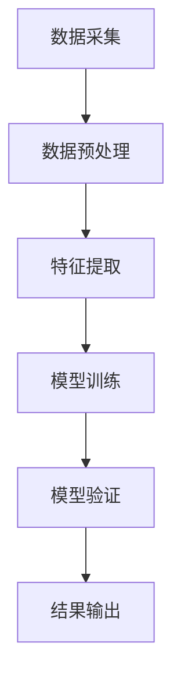

                 


---

# 价值投资中的智能仓储机器人系统分析

> **关键词**：智能仓储机器人、价值投资、系统分析、经济价值、算法实现

> **摘要**：  
智能仓储机器人系统在现代仓储管理中的应用日益广泛，其高效性和智能化特性为价值投资提供了新的视角。本文从智能仓储机器人的概念、系统架构、经济价值分析、算法实现等多维度展开，结合实际应用场景，深入探讨其在价值投资中的潜在影响。通过构建价值评估模型和系统架构设计，本文为投资者提供了一个全新的分析框架，以帮助其更好地评估智能仓储机器人系统的投资价值。

---

## 第一部分：智能仓储机器人系统与价值投资概述

### 第1章：智能仓储机器人系统概述

#### 1.1 智能仓储机器人的概念与特点
智能仓储机器人是一种结合了人工智能、自动化技术的先进仓储设备，能够在无需人工干预的情况下完成仓储管理中的各项任务。其核心特点包括：

- **高效性**：通过自动化操作提升仓储效率，减少人工干预。
- **智能化**：利用传感器、摄像头等设备实现环境感知和自主决策。
- **灵活性**：能够适应不同的仓储环境和管理需求。
- **安全性**：通过精准的路径规划和避障技术，降低事故发生率。

#### 1.2 价值投资的基本原理
价值投资是一种以内在价值为导向的投资策略，其核心在于通过深入分析企业的基本面，寻找被市场低估的投资标的。其基本原则包括：

- **基本面分析**：关注企业的财务状况、盈利能力和发展前景。
- **安全边际**：买入价格低于内在价值，以降低投资风险。
- **长期视角**：关注企业的长期价值，而非短期市场波动。

#### 1.3 智能仓储机器人与价值投资的结合
智能仓储机器人在现代仓储管理中的应用，不仅提升了仓储效率，还降低了运营成本。从价值投资的角度来看，智能仓储机器人系统的引入能够显著提升企业的核心竞争力，进而增强其内在价值。具体表现在以下几个方面：

- **成本优势**：通过自动化操作降低人工成本。
- **效率提升**：提高仓储管理效率，缩短订单处理时间。
- **市场竞争力**：智能化的仓储管理能够满足客户对高效、精准服务的需求，从而提升企业的市场地位。

#### 1.4 本章小结
本章主要介绍了智能仓储机器人的概念、特点以及价值投资的基本原理，并探讨了两者结合的可能性和意义。通过这一部分的分析，我们可以初步认识到智能仓储机器人系统在价值投资中的重要性。

---

## 第二部分：智能仓储机器人系统的价值评估模型

### 第2章：智能仓储机器人系统的组成与功能

#### 2.1 系统组成分析
智能仓储机器人系统主要由硬件部分和软件部分组成：

- **硬件部分**：
  - **机器人本体**：包括移动底盘、机械臂、传感器等。
  - **仓储设备**：如货架、传送带、存储单元等。
  - **通信设备**：用于机器人与控制中心之间的数据传输。

- **软件部分**：
  - **控制系统**：负责机器人运动路径规划、任务分配。
  - **数据处理系统**：对仓储数据进行采集、分析和管理。
  - **决策支持系统**：基于数据分析提供优化建议。

#### 2.2 系统功能设计
智能仓储机器人系统的功能模块设计如下：

- **自动化仓储管理**：实现货物的自动存储、拣选和搬运。
- **智能路径规划**：通过算法优化机器人运动路径，减少时间浪费。
- **数据采集与分析**：实时采集仓储数据，并进行分析以支持决策。

#### 2.3 系统性能指标
评估智能仓储机器人系统的关键性能指标包括：

- **效率指标**：如每小时处理订单量（OPS）。
- **稳定性指标**：如系统的故障率和恢复时间。
- **扩展性指标**：如系统支持的最大仓储规模。

---

## 第三部分：价值投资中的仓储机器人系统分析

### 第3章：仓储机器人系统的经济价值分析

#### 3.1 系统成本分析
智能仓储机器人系统的成本构成主要包含：

- **初始投资成本**：包括机器人采购、仓储设备搭建等。
- **运行维护成本**：如电力消耗、设备维护费用。
- **人工成本**：虽然系统减少了人工需求，但仍需少量人员进行管理和维护。

#### 3.2 系统收益分析
引入智能仓储机器人系统能够带来多方面的收益：

- **效率提升**：自动化操作减少了人为错误，提高了处理效率。
- **成本降低**：通过减少人工需求和优化路径规划降低运营成本。
- **市场竞争力**：高效精准的服务能够提升客户满意度，增强企业竞争力。

#### 3.3 价值评估模型构建
基于上述分析，我们可以构建一个简单的价值评估模型。模型的核心公式如下：

$$
\text{投资价值} = \text{效率提升带来的收益} - \text{系统引入的成本}
$$

其中，效率提升带来的收益可以通过以下公式计算：

$$
\text{收益} = \text{效率提升} \times \text{单位收益}
$$

---

## 第四部分：仓储机器人系统价值评估的算法实现

### 第4章：仓储机器人系统价值评估算法概述

#### 4.1 算法原理
智能仓储机器人系统的价值评估算法主要基于数据挖掘和机器学习技术。其核心步骤如下：

1. 数据采集：收集仓储系统的各项数据，包括运行效率、成本数据等。
2. 数据预处理：清洗数据，去除异常值，进行标准化处理。
3. 模型训练：使用机器学习算法（如随机森林、神经网络）进行建模。
4. 模型验证：通过交叉验证评估模型的准确性和稳定性。
5. 结果输出：根据模型预测结果，生成投资价值评估报告。

#### 4.2 算法实现流程
以下是算法的实现流程图：



#### 4.3 算法的数学模型
常用的回归算法可以用于价值评估。以下是一个简单的线性回归模型：

$$
\text{投资价值} = \beta_0 + \beta_1 \times \text{效率提升} + \epsilon
$$

其中，$\beta_0$ 是截距，$\beta_1$ 是回归系数，$\epsilon$ 是误差项。

---

## 第五部分：仓储机器人系统价值评估的系统架构设计

### 第5章：系统架构设计

#### 5.1 系统功能设计
系统功能模块设计如下：

- **数据采集模块**：负责采集仓储系统的各项数据。
- **数据处理模块**：对采集的数据进行清洗和处理。
- **模型计算模块**：基于机器学习算法进行价值评估。
- **结果展示模块**：以可视化的方式展示评估结果。

#### 5.2 系统架构设计
以下是系统架构的分层设计图：


#### 5.3 系统接口设计
系统接口设计包括：

- **内部接口**：模块之间的数据传输接口。
- **外部接口**：与企业现有系统的数据对接接口。

---

## 第六部分：项目实战

### 第6章：项目实战

#### 6.1 环境安装
需要安装以下工具和库：

- **Python**：用于编程和数据分析。
- **Pandas** 和 **NumPy**：用于数据处理。
- **Scikit-learn**：用于机器学习模型训练。

#### 6.2 系统核心实现源代码
以下是一个简单的价值评估模型的Python代码示例：

```python
import pandas as pd
from sklearn.linear_model import LinearRegression

# 数据加载
data = pd.read_csv('storage_robot.csv')

# 特征与目标变量分离
X = data[['efficiency_improvement']]
y = data['investment_value']

# 模型训练
model = LinearRegression()
model.fit(X, y)

# 模型预测
predicted_value = model.predict(X)
```

#### 6.3 案例分析
以某企业引入智能仓储机器人系统为例，分析其投资价值：

- **初始投资成本**：500万元。
- **年收益增加**：预计每年增加收益100万元。
- **投资回收期**：5年。

#### 6.4 项目小结
通过实际案例分析，可以发现智能仓储机器人系统的引入能够显著提升企业的经济价值，但需要考虑初始投资成本和回收周期。

---

## 总结与展望

智能仓储机器人系统的引入不仅能够提升仓储效率，还能够为企业带来显著的经济价值。通过构建价值评估模型和系统架构设计，投资者可以更科学地评估其投资价值。未来，随着人工智能和物联网技术的进一步发展，智能仓储机器人系统将在价值投资中发挥更大的作用。

---

以上是《价值投资中的智能仓储机器人系统分析》的技术博客文章的详细撰写内容。

