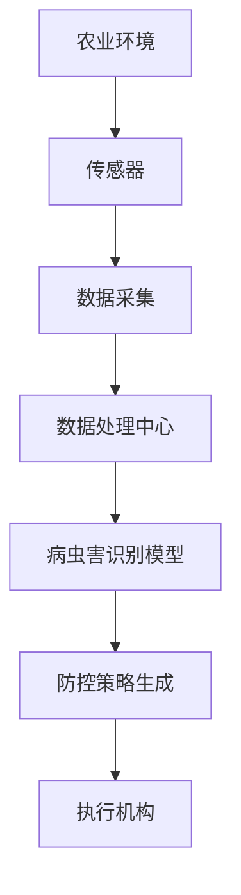
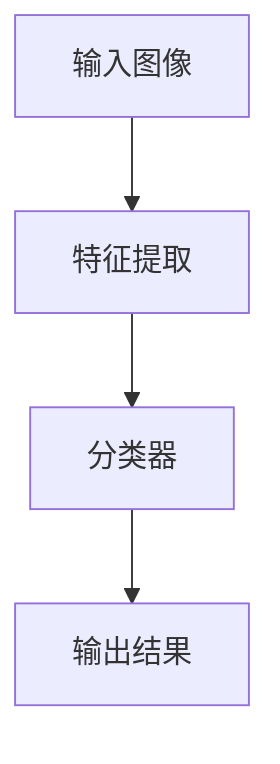
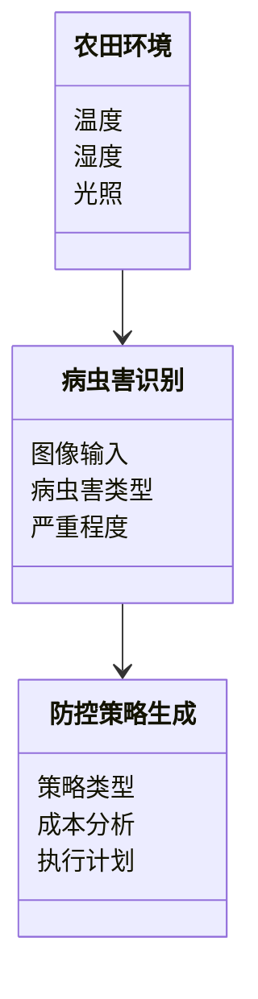
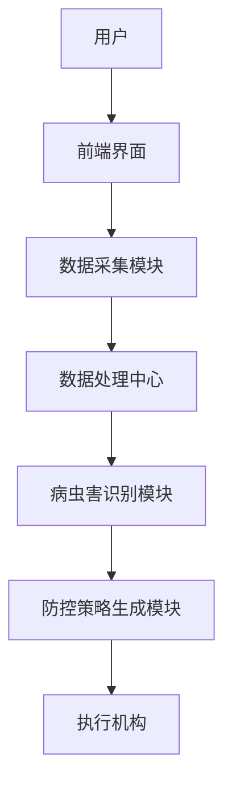
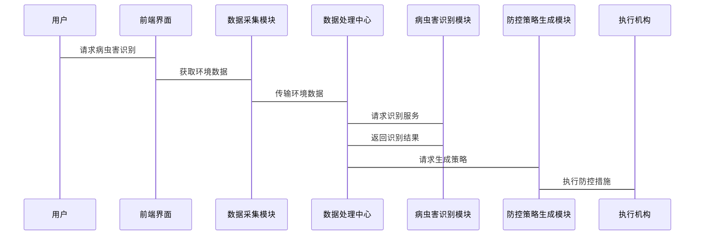

                 


# 价值投资中的智能农业病虫害防控系统分析

> 关键词：智能农业，病虫害防控，价值投资，机器学习，系统设计，经济效益

> 摘要：本文从价值投资的角度分析智能农业病虫害防控系统的经济价值和投资潜力。通过介绍系统的核心概念、算法原理、系统架构和实际应用案例，探讨其在农业生产和经济效益中的作用，为投资者提供决策参考。

---

# 第一部分: 智能农业病虫害防控系统背景与价值投资概述

## 第1章: 智能农业与病虫害防控系统背景

### 1.1 问题背景与挑战

#### 1.1.1 农业生产中的病虫害问题
- 病虫害对农作物产量和质量的威胁
- 传统病虫害防控的局限性：成本高、效率低、环境影响

#### 1.1.2 传统病虫害防控的挑战
- 依赖人工经验，缺乏数据支持
- 药剂滥用导致环境污染和病虫害抗药性
- 农业生产效率低下，成本增加

#### 1.1.3 智能化防控的需求与趋势
- 数据驱动的精准农业需求
- 人工智能技术在农业中的应用趋势
- 病虫害防控智能化的必要性

### 1.2 病虫害防控系统的定义与目标

#### 1.2.1 系统定义
- 病虫害防控系统：利用传感器、人工智能和大数据分析，实现对病虫害的实时监测、识别和精准防控的系统。

#### 1.2.2 系统的核心目标
- 实时监测农田环境数据
- 准确识别病虫害类型和严重程度
- 优化防控策略，降低农业损失

#### 1.2.3 系统的边界与外延
- 边界：农田环境监测、病虫害识别、防控策略生成
- 外延：农业供应链优化、农产品质量提升、农业可持续发展

### 1.3 智能农业与价值投资的关联

#### 1.3.1 智能农业的经济价值
- 提高农业生产效率
- 降低生产成本
- 提升农产品质量

#### 1.3.2 病虫害防控的经济效益
- 减少因病虫害造成的损失
- 节省农药使用成本
- 提高农产品市场竞争力

#### 1.3.3 价值投资视角下的农业系统优化
- 通过技术手段优化农业系统，提升投资回报率
- 病虫害防控系统的市场潜力和投资价值

### 1.4 本章小结

---

# 第二部分: 智能农业病虫害防控系统的核心概念与价值分析

## 第2章: 系统核心概念与价值链分析

### 2.1 系统核心概念

#### 2.1.1 农业环境感知
- 传感器技术：温度、湿度、光照、土壤 pH 值等环境参数的实时监测
- 数据采集：通过物联网技术收集农田环境数据

#### 2.1.2 病虫害识别与预测
- 图像识别技术：利用深度学习模型识别病虫害类型和严重程度
- 数据分析：基于历史数据和实时数据预测病虫害发生概率

#### 2.1.3 防控策略优化
- 算法优化：根据病虫害识别结果制定最优防控策略
- 系统执行：通过自动化设备执行防控措施

### 2.2 核心概念的属性特征对比

| 概念 | 属性 | 特征 |
|------|------|------|
| 农业环境感知 | 数据采集 | 实时性、准确性 |
| 病虫害识别 | 图像分析 | 高精度、快速响应 |
| 防控策略优化 | 算法优化 | 精准性、经济性 |

### 2.3 系统实体关系图



### 2.4 本章小结

---

# 第三部分: 病虫害防控系统的算法原理与数学模型

## 第3章: 病虫害识别算法原理

### 3.1 病虫害识别的算法选择

#### 3.1.1 传统机器学习算法
- 支持向量机（SVM）
- 决策树（Decision Tree）

#### 3.1.2 深度学习算法
- 卷积神经网络（CNN）
- 循环神经网络（RNN）

#### 3.1.3 算法选择的依据
- 数据量大小
- 计算资源
- 模型复杂度

### 3.2 病虫害识别的数学模型

#### 3.2.1 分类模型的数学表达
$$ P(y|x) = \frac{P(x|y)P(y)}{P(x)} $$

#### 3.2.2 神经网络模型的数学表达
$$ y = f(Wx + b) $$

### 3.3 算法实现流程



---

# 第四部分: 系统分析与架构设计方案

## 第4章: 系统功能设计

### 4.1 问题场景介绍

#### 4.1.1 农田环境监测
- 温度、湿度、光照等环境参数的实时监测

#### 4.1.2 病虫害识别
- 利用图像识别技术识别病虫害类型

#### 4.1.3 防控策略生成
- 根据识别结果制定最优防控策略

### 4.2 系统功能设计

#### 4.2.1 领域模型


#### 4.2.2 系统架构设计


### 4.3 系统接口设计

#### 4.3.1 数据采集接口
- 接口名称：`get_environment_data`
- 请求参数：无
- 返回参数：温度、湿度、光照等环境数据

#### 4.3.2 病虫害识别接口
- 接口名称：`identify_disease`
- 请求参数：图像数据
- 返回参数：病虫害类型、严重程度

### 4.4 系统交互流程



---

# 第五部分: 项目实战与经济效益分析

## 第5章: 项目实战

### 5.1 环境安装

#### 5.1.1 系统依赖
- Python 3.8+
- TensorFlow 2.0+
- OpenCV 4.0+
- 网络连接

#### 5.1.2 安装步骤
```bash
pip install tensorflow
pip install numpy
pip install opencv-python
```

### 5.2 系统核心实现

#### 5.2.1 病虫害识别模型实现
```python
import tensorflow as tf
from tensorflow.keras import layers

model = tf.keras.Sequential([
    layers.Conv2D(32, (3,3), activation='relu', input_shape=(224, 224, 3)),
    layers.MaxPooling2D((2,2)),
    layers.Conv2D(64, (3,3), activation='relu'),
    layers.MaxPooling2D((2,2)),
    layers.Flatten(),
    layers.Dense(128, activation='relu'),
    layers.Dense(10, activation='softmax')
])
```

#### 5.2.2 数据预处理
```python
import cv2

def preprocess_image(image_path):
    image = cv2.imread(image_path)
    image = cv2.resize(image, (224, 224))
    image = image / 255.0
    return image
```

### 5.3 实际案例分析

#### 5.3.1 种植业应用
- 案例背景：某地区水稻田的病虫害监测
- 案例分析：通过系统识别稻飞虱，生成精准喷洒方案，减少农药使用量 30%，增产 15%

#### 5.3.2 养殖业应用
- 案例背景：某养殖场的虫害防控
- 案例分析：通过系统识别蝇蛆，优化防控策略，减少经济损失 20%

### 5.4 项目小结

---

# 第六部分: 总结与展望

## 第6章: 总结与展望

### 6.1 本章总结
- 系统的核心功能和价值
- 算法实现和优化建议
- 系统架构设计的合理性

### 6.2 投资价值分析
- 系统的经济效益和市场潜力
- 投资回报周期和风险分析
- 行业发展趋势和投资机会

### 6.3 未来展望
- 新技术的应用：如区块链在农业供应链中的应用
- 系统的扩展性：如多作物病虫害识别
- 智能农业的未来发展

### 6.4 最佳实践 tips
- 选择合适的算法和模型
- 注重数据质量和实时性
- 系统的可扩展性和易用性

---

# 结语

智能农业病虫害防控系统的价值投资潜力巨大。通过技术创新和系统优化，不仅能够提升农业生产效率，还能带来显著的经济效益。投资者应关注这一领域的技术发展和市场动态，抓住投资机会，实现共赢。

