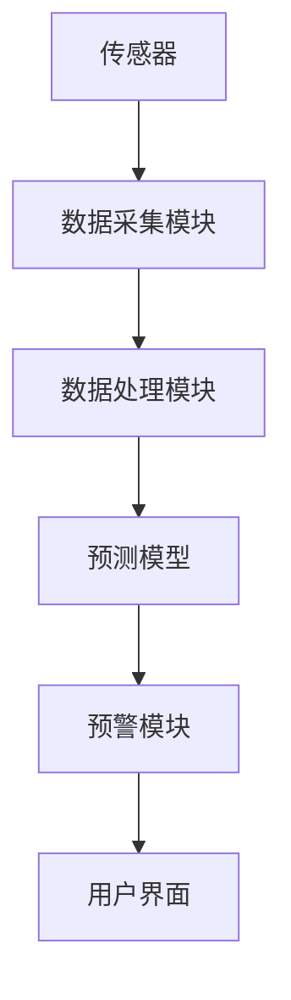
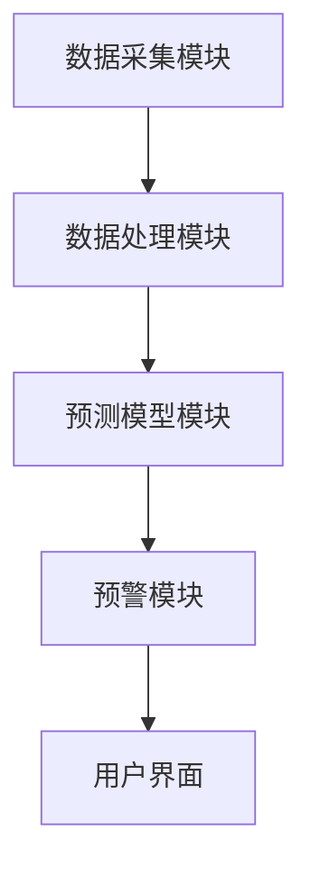

                 


# 价值投资中的智能农业病虫害预警系统分析

## 关键词：智能农业，病虫害预警，价值投资，机器学习，农业技术

## 摘要：  
本文深入分析了智能农业病虫害预警系统在价值投资中的应用，探讨了该系统的核心概念、算法原理、系统架构以及实际项目案例。通过结合价值投资的理念，本文揭示了如何利用智能技术提升农业生产的效率和可持续性，为投资者提供科学决策依据。

---

# 第1章: 智能农业病虫害预警系统概述

## 1.1 问题背景与价值投资的关联

### 1.1.1 传统农业病虫害防治的局限性  
传统农业在病虫害防治方面主要依赖人工经验，存在防治不及时、成本高、效率低的问题。农民通常在病虫害爆发后才采取措施，导致损失难以挽回。  

### 1.1.2 价值投资在农业中的潜力  
价值投资的核心理念是通过深入分析企业的基本面，寻找被市场低估的投资机会。在农业领域，通过智能技术优化生产效率、降低成本，可以显著提升农业企业的投资价值。  

### 1.1.3 智能农业病虫害预警系统的必要性  
智能农业病虫害预警系统通过实时监测和数据分析，提前预测病虫害的发生，帮助农民采取预防措施，降低损失。这种技术的应用不仅提升了农业生产效率，也为投资者提供了更稳定的投资回报。  

## 1.2 价值投资的基本概念

### 1.2.1 价值投资的核心理念  
价值投资强调以低于内在价值的价格买入优质资产，长期持有的策略。在农业领域，通过技术创新提升农业生产效率，可以显著提高企业的内在价值。  

### 1.2.2 价值投资与农业的结合  
农业作为基础产业，具有稳定的市场需求。通过智能技术优化农业生产，可以提高企业的盈利能力和抗风险能力，吸引更多的投资者。  

### 1.2.3 智能农业病虫害预警系统对价值投资的影响  
智能农业病虫害预警系统通过降低生产成本、提高产量和质量，显著提升了农业企业的盈利能力，为投资者提供了更大的投资价值。  

## 1.3 智能农业的概念与技术特点

### 1.3.1 智能农业的定义  
智能农业是指利用信息技术、物联网、人工智能等技术，实现农业生产过程的智能化、自动化和精准化。  

### 1.3.2 智能农业的核心技术  
- **物联网技术**：通过传感器和通信技术，实时采集农田环境数据。  
- **人工智能技术**：利用机器学习算法分析数据，预测病虫害的发生。  
- **大数据分析**：通过对历史数据的分析，优化农业生产决策。  

### 1.3.3 智能农业病虫害预警系统的功能  
- 实时监测农田环境数据。  
- 预测病虫害的发生概率。  
- 提供预防和控制措施的建议。  

## 1.4 系统分析与边界定义

### 1.4.1 系统的边界与外延  
智能农业病虫害预警系统的边界包括农田环境监测、病虫害预测和预防措施建议。外延则涉及农业企业的生产管理、投资决策等。  

### 1.4.2 系统的核心要素组成  
- 数据采集模块：包括传感器、通信设备等。  
- 数据分析模块：包括机器学习算法、大数据分析等。  
- 预警与决策模块：提供病虫害预警和预防建议。  

### 1.4.3 系统的输入与输出  
- **输入**：农田环境数据、历史病虫害数据。  
- **输出**：病虫害预警信息、预防措施建议。  

## 1.5 本章小结  
本章通过分析智能农业病虫害预警系统的背景、核心概念和系统架构，为后续章节的深入分析奠定了基础。

---

# 第2章: 智能农业病虫害预警系统的核心概念与联系

## 2.1 核心概念原理

### 2.1.1 数据采集与处理  
系统通过传感器采集农田的温度、湿度、光照等环境数据，并将数据传输到数据中心进行处理。  

### 2.1.2 病虫害预测模型  
基于机器学习算法，利用历史病虫害数据和环境数据，建立病虫害预测模型。  

### 2.1.3 预警机制  
当预测结果达到预警阈值时，系统会向农民发送预警信息，并提供预防措施建议。  

## 2.2 核心概念属性对比

### 2.2.1 数据  
| 属性 | 描述 |
|------|------|
| 类型 | 环境数据、病虫害数据 |
| 来源 | 传感器、历史记录 |
| 处理 | 数据清洗、特征提取 |

### 2.2.2 算法  
| 算法类型 | 描述 |
|--------|------|
| 机器学习 | 基于历史数据训练模型，预测病虫害概率 |
| 大数据分析 | 通过数据分析优化模型参数 |

### 2.2.3 系统架构  


## 2.3 系统功能设计

### 2.3.1 数据采集模块  
通过传感器实时采集农田环境数据，包括温度、湿度、光照等。  

### 2.3.2 数据处理模块  
对采集的数据进行清洗和特征提取，为后续分析提供高质量的数据。  

### 2.3.3 预测模型  
基于机器学习算法，训练病虫害预测模型，预测病虫害的发生概率。  

### 2.3.4 预警模块  
根据预测结果生成预警信息，并向农民提供预防措施建议。  

## 2.4 本章小结  
本章详细分析了智能农业病虫害预警系统的核心概念和功能设计，为后续章节的系统实现提供了理论基础。

---

# 第3章: 算法原理与实现

## 3.1 算法原理

### 3.1.1 机器学习算法选择  
选择适合的机器学习算法，如随机森林、支持向量机（SVM）等。  

### 3.1.2 算法流程  
1. 数据预处理：清洗、归一化。  
2. 特征选择：提取关键特征。  
3. 模型训练：基于训练数据训练模型。  
4. 模型评估：验证模型的准确性和稳定性。  

### 3.1.3 数学模型  
随机森林算法的数学模型如下：  
$$ y = \sum_{i=1}^{n} \theta_i x_i $$  
其中，$\theta_i$ 是特征的重要性权重，$x_i$ 是特征值。  

## 3.2 算法实现

### 3.2.1 数据预处理  
```python
import pandas as pd
data = pd.read_csv('agriculture_data.csv')
data = data.dropna()
data = (data - data.min()) / (data.max() - data.min())
```

### 3.2.2 特征选择  
```python
from sklearn.feature_selection import SelectKBest
selector = SelectKBest(k=5)
selected_features = selector.fit_transform(data)
```

### 3.2.3 模型训练  
```python
from sklearn.ensemble import RandomForestClassifier
model = RandomForestClassifier(n_estimators=100)
model.fit(selected_features, labels)
```

### 3.2.4 模型评估  
```python
from sklearn.metrics import accuracy_score
y_pred = model.predict(selected_features)
print("Accuracy:", accuracy_score(labels, y_pred))
```

## 3.3 本章小结  
本章详细介绍了智能农业病虫害预警系统中机器学习算法的原理和实现，为后续系统的实际应用提供了技术支持。

---

# 第4章: 系统分析与架构设计

## 4.1 系统架构设计

### 4.1.1 系统功能模块  
- 数据采集模块：传感器、通信设备。  
- 数据处理模块：数据清洗、特征提取。  
- 预测模型模块：机器学习算法。  
- 预警模块：预警信息生成。  
- 用户界面：展示预警信息和预防措施。  

### 4.1.2 系统架构图  


## 4.2 系统接口设计

### 4.2.1 数据接口  
- 数据采集模块与数据处理模块之间的接口。  
- 数据处理模块与预测模型模块之间的接口。  

### 4.2.2 用户接口  
- 用户界面与预警模块之间的接口。  

## 4.3 本章小结  
本章详细分析了智能农业病虫害预警系统的系统架构和接口设计，为后续的项目实现提供了清晰的指导。

---

# 第5章: 项目实战

## 5.1 环境安装

### 5.1.1 安装Python  
```bash
python --version
pip install --upgrade pip
```

### 5.1.2 安装依赖库  
```bash
pip install pandas numpy scikit-learn
```

## 5.2 核心代码实现

### 5.2.1 数据预处理  
```python
import pandas as pd
data = pd.read_csv('agriculture_data.csv')
data = data.dropna()
data = (data - data.min()) / (data.max() - data.min())
```

### 5.2.2 特征选择  
```python
from sklearn.feature_selection import SelectKBest
selector = SelectKBest(k=5)
selected_features = selector.fit_transform(data)
```

### 5.2.3 模型训练  
```python
from sklearn.ensemble import RandomForestClassifier
model = RandomForestClassifier(n_estimators=100)
model.fit(selected_features, labels)
```

## 5.3 案例分析

### 5.3.1 数据分析  
假设我们有1000条农田环境数据，通过数据预处理和特征选择后，提取了5个关键特征。  

### 5.3.2 模型预测  
通过训练好的随机森林模型，预测病虫害的发生概率，并生成预警信息。  

## 5.4 本章小结  
本章通过实际项目案例，详细展示了智能农业病虫害预警系统的实现过程，为读者提供了宝贵的实战经验。

---

# 第6章: 最佳实践与小结

## 6.1 最佳实践

### 6.1.1 数据质量管理  
确保数据的准确性和完整性，是系统运行的关键。  

### 6.1.2 模型优化  
通过不断优化机器学习算法，提升预测的准确性和稳定性。  

## 6.2 小结  
本文深入分析了智能农业病虫害预警系统的背景、核心概念、算法原理和系统架构，并通过实际项目案例展示了系统的实现过程。  

## 6.3 注意事项  
- 数据隐私和安全问题需要注意。  
- 系统的可扩展性和可维护性需要提前考虑。  

## 6.4 拓展阅读  
- 推荐阅读《机器学习实战》和《智能农业技术与应用》。  

---

# 附录: 代码与数据

## 附录A: 完整代码  
```python
import pandas as pd
from sklearn.feature_selection import SelectKBest
from sklearn.ensemble import RandomForestClassifier
from sklearn.metrics import accuracy_score

# 读取数据
data = pd.read_csv('agriculture_data.csv')
labels = data['label']
data = data.drop('label', axis=1)

# 数据预处理
data = data.dropna()
data = (data - data.min()) / (data.max() - data.min())

# 特征选择
selector = SelectKBest(k=5)
selected_features = selector.fit_transform(data)

# 模型训练
model = RandomForestClassifier(n_estimators=100)
model.fit(selected_features, labels)

# 模型评估
y_pred = model.predict(selected_features)
print("Accuracy:", accuracy_score(labels, y_pred))
```

## 附录B: 数据格式  
```csv
温度,湿度,光照,病虫害
25,60,800,0
28,65,700,1
23,55,900,0
...
```

---

# 结语  
智能农业病虫害预警系统的应用，不仅提升了农业生产的效率和可持续性，也为投资者提供了更科学的投资决策依据。希望本文能为智能农业技术的研究和应用提供有价值的参考。

