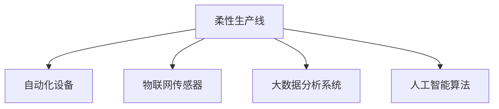

                 


# 价值投资中的智能制造柔性生产线分析

> 关键词：智能制造，柔性生产线，价值投资，数据分析，生产优化，投资策略

> 摘要：本文从价值投资的角度，深入分析了智能制造中的柔性生产线。通过背景介绍、核心概念、算法原理、系统架构设计、项目实战和最佳实践等多方面，详细探讨了柔性生产线对制造业价值的影响及投资策略。文章结合实际案例，展示了如何通过技术手段提升生产效率和降低成本，为投资者提供了科学的决策依据。

---

## 第一部分: 智能制造与价值投资的背景

### 第1章: 智能制造与价值投资的背景

#### 1.1 智能制造的背景与现状

##### 1.1.1 制造业的数字化转型
制造业的数字化转型是当前全球制造业发展的主要趋势。随着信息技术（IT）和运营技术（OT）的深度融合，企业通过数字化技术实现生产过程的智能化和自动化，从而提高生产效率、降低成本，并增强市场竞争力。

##### 1.1.2 智能制造的核心技术
智能制造的核心技术包括：
- **自动化技术**：如工业机器人、自动化设备等。
- **物联网（IoT）**：通过传感器和设备连接，实现设备间的数据互通。
- **大数据分析**：通过对生产数据的分析，优化生产流程。
- **人工智能（AI）**：用于预测性维护、质量检测等。

##### 1.1.3 柔性生产线的定义与特点
柔性生产线是指能够快速适应市场需求变化，灵活调整生产流程和产品种类的生产线。其特点包括：
- **灵活性**：能够快速调整生产计划。
- **高效性**：通过自动化技术提高生产效率。
- **智能化**：利用AI和大数据技术实现智能决策。

#### 1.2 价值投资的基本概念

##### 1.2.1 价值投资的定义
价值投资是一种投资策略，强调以低于内在价值的价格买入优质资产。其核心在于寻找被市场低估的企业，长期持有，等待其价值回归。

##### 1.2.2 价值投资的核心原则
- **长期视角**：关注企业的长期价值，而非短期波动。
- **安全边际**：买入价格低于企业的内在价值。
- **优质企业**：选择具有强大竞争优势的企业。

##### 1.2.3 价值投资与制造业的结合
制造业是实体经济的重要组成部分，其价值主要体现在生产效率、成本控制和技术创新等方面。通过价值投资，投资者可以关注那些具有竞争优势、管理优秀且估值合理的制造企业。

#### 1.3 智能制造与价值投资的结合

##### 1.3.1 柔性生产线在智能制造中的作用
柔性生产线能够快速适应市场需求变化，降低库存成本，提高生产效率。这使得企业在面对市场波动时更具灵活性，从而增强企业的长期价值。

##### 1.3.2 价值投资在智能制造中的应用
价值投资者可以通过分析企业的生产效率、成本控制和技术创新能力，寻找那些具有竞争优势的智能制造企业。柔性生产线作为智能制造的重要组成部分，是投资者评估企业价值的重要指标。

##### 1.3.3 柔性生产线对制造业价值的影响
柔性生产线能够降低生产成本、提高生产效率，并增强企业的市场响应能力。这些因素都会提升企业的内在价值，从而为投资者带来更高的回报。

---

## 第二部分: 柔性生产线的核心概念与分析

### 第2章: 柔性生产线的核心概念

#### 2.1 柔性生产线的定义与特点

##### 2.1.1 柔性生产线的定义
柔性生产线是指能够根据市场需求快速调整生产流程和产品种类的生产线。它通过自动化技术、物联网和大数据分析实现高效生产。

##### 2.1.2 柔性生产线的核心特点
- **灵活性**：能够快速调整生产计划。
- **高效性**：通过自动化技术提高生产效率。
- **智能化**：利用AI和大数据技术实现智能决策。

##### 2.1.3 柔性生产线与传统生产线的对比

| 特性      | 柔性生产线          | 传统生产线          |
|-----------|---------------------|---------------------|
| 灵活性     | 高                  | 低                  |
| 效率       | 高                  | 中                  |
| 成本       | 低                  | 高                  |
| 响应时间   | 快                  | 慢                  |

##### 2.1.4 柔性生产线的实体关系图



#### 2.2 柔性生产线的关键技术

##### 2.2.1 自动化技术
自动化技术是柔性生产线的核心技术之一。通过工业机器人和自动化设备，企业可以实现生产过程的自动化，提高生产效率。

##### 2.2.2 智能传感器
智能传感器用于实时监测生产过程中的各种参数，如温度、压力、振动等。通过这些数据，企业可以实现预测性维护，降低设备故障率。

##### 2.2.3 数据分析技术
数据分析技术用于对生产数据进行挖掘和分析，发现生产过程中的瓶颈，并提出优化建议。

#### 2.3 柔性生产线的系统架构

##### 2.3.1 系统架构的组成
柔性生产线的系统架构通常包括以下几个部分：
- **数据采集层**：负责采集生产过程中的各种数据。
- **数据处理层**：对采集到的数据进行处理和分析。
- **决策层**：根据分析结果做出决策。
- **执行层**：根据决策执行具体操作。

##### 2.3.2 系统架构的层次


##### 2.3.3 系统架构的优缺点

| 特性      | 优点                  | 缺点                  |
|-----------|-----------------------|-----------------------|
| 可扩展性   | 高                    | 需要较高的技术投入    |
| 可维护性   | 高                    | 维护成本较高          |
| 灵活性     | 高                    | 初始投资较大          |

---

### 第3章: 柔性生产线的数学模型与分析

#### 3.1 柔性生产线的数学模型

##### 3.1.1 生产线的数学建模
柔性生产线的数学建模通常包括以下几个步骤：
1. **确定目标**：明确建模的目标。
2. **收集数据**：收集生产过程中的各种数据。
3. **建立模型**：根据数据建立数学模型。
4. **验证模型**：验证模型的准确性。
5. **优化模型**：根据实际情况优化模型。

##### 3.1.2 生产线的优化模型
优化模型的目标是通过优化生产流程，降低生产成本，提高生产效率。

##### 3.1.3 生产线的成本模型
成本模型用于分析生产过程中的各种成本，并提出降低成本的建议。

#### 3.2 数据分析与预测

##### 3.2.1 数据分析的基本方法
数据分析的基本方法包括：
- **描述性分析**：对数据进行总结和描述。
- **预测性分析**：利用数据进行预测。
- **诊断性分析**：分析数据背后的原因。
- **规范性分析**：提出优化建议。

##### 3.2.2 数据预测的数学模型
常用的数据预测模型包括线性回归模型、决策树模型等。

##### 3.2.3 数据预测的案例分析
通过具体案例分析，展示如何利用数据分析技术优化生产流程。

#### 3.3 数学公式与案例分析

##### 3.3.1 生产线的优化公式
$$ \text{总成本} = \text{固定成本} + \text{可变成本} $$

##### 3.3.2 成本模型的公式
$$ \text{单位成本} = \frac{\text{总成本}}{\text{产量}} $$

##### 3.3.3 数据预测的公式
$$ y = a + bx $$

---

## 第三部分: 柔性生产线的系统分析与架构设计

### 第4章: 柔性生产线的系统分析

#### 4.1 系统分析的基本方法

##### 4.1.1 需求分析
需求分析是系统分析的第一步，通过与企业相关人员沟通，明确系统的需求。

##### 4.1.2 功能分析
功能分析是通过分析系统的需求，明确系统需要实现的功能。

##### 4.1.3 性能分析
性能分析是通过分析系统的功能，明确系统需要达到的性能指标。

#### 4.2 系统分析的案例

##### 4.2.1 柔性生产线的系统分析
通过具体案例分析，展示如何进行柔性生产线的系统分析。

---

### 第5章: 柔性生产线的架构设计

#### 5.1 架构设计的基本原则

##### 5.1.1 模块化设计
模块化设计是将系统划分为多个模块，每个模块负责特定的功能。

##### 5.1.2 可扩展性设计
可扩展性设计是通过设计模块化架构，使系统能够方便地扩展功能。

##### 5.1.3 可维护性设计
可维护性设计是通过设计清晰的架构，使系统易于维护。

#### 5.2 架构设计的案例

##### 5.2.1 柔性生产线的架构设计
通过具体案例分析，展示如何进行柔性生产线的架构设计。

---

## 第四部分: 柔性生产线的项目实战

### 第6章: 项目实战

#### 6.1 环境安装

##### 6.1.1 系统环境
需要安装的系统环境包括：
- **操作系统**：Windows、Linux或macOS。
- **编程语言**：Python、Java等。
- **工具**：Visual Studio、Eclipse等。

##### 6.1.2 数据库安装
需要安装的数据库包括：
- **MySQL**
- **PostgreSQL**

##### 6.1.3 开发工具安装
需要安装的开发工具包括：
- **Jupyter Notebook**
- **PyCharm**

#### 6.2 系统核心实现

##### 6.2.1 核心代码实现
以下是柔性生产线的核心代码实现：

```python
import pandas as pd
import numpy as np

# 数据预处理
data = pd.read_csv('production_data.csv')
data_cleaned = data.dropna()

# 数据分析
from sklearn.linear_model import LinearRegression
model = LinearRegression()
model.fit(data_cleaned[['temperature', 'pressure']], data_cleaned['output'])

# 模型预测
predicted_output = model.predict([[25, 100]])
print(predicted_output)
```

##### 6.2.2 代码功能解读
上述代码实现了一个简单的线性回归模型，用于预测生产过程中的输出。

#### 6.3 实际案例分析

##### 6.3.1 案例背景
以某汽车制造企业的柔性生产线为例，分析其生产过程中的数据。

##### 6.3.2 数据分析与优化
通过对生产数据的分析，优化生产流程，降低生产成本。

#### 6.4 项目小结
通过项目实战，展示了如何利用数据分析技术优化生产流程，降低生产成本。

---

## 第五部分: 最佳实践与总结

### 第7章: 最佳实践

#### 7.1 小结
通过本文的分析，我们了解了智能制造中的柔性生产线对制造业价值的影响，以及如何通过价值投资策略选择优质企业。

#### 7.2 注意事项
在进行价值投资时，需要注意以下几点：
- **长期视角**：关注企业的长期价值，而非短期波动。
- **安全边际**：买入价格低于企业的内在价值。
- **优质企业**：选择具有强大竞争优势的企业。

#### 7.3 拓展阅读
推荐以下几本书籍和文章，供读者进一步学习：
- 《The Intelligent Investor》
- 《Manufacturing Execution Systems》
- 《Smart Factory: Industry 4.0》

---

通过本文的分析，我们了解了智能制造中的柔性生产线对制造业价值的影响，以及如何通过价值投资策略选择优质企业。希望本文能为投资者和企业提供有价值的参考和启示。

