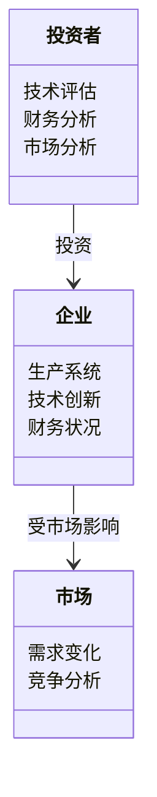
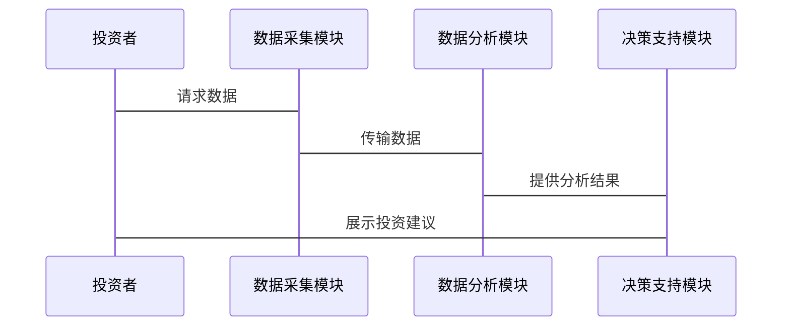

                 


# 价值投资中的智能制造趋势分析

## 关键词：价值投资、智能制造、趋势分析、投资策略、行业分析

## 摘要：  
智能制造作为工业革命的重要组成部分，正在全球范围内重塑制造业的未来。本文将从智能制造的定义、核心技术、行业趋势、投资逻辑、风险管理等方面展开分析，结合实际案例，为投资者提供深入的洞察和策略建议。通过系统化的分析框架，本文旨在帮助投资者在智能制造领域找到具有长期价值的投资机会。

---

## 第1章: 智能制造的定义与价值投资的结合

### 1.1 智能制造的定义与核心要素  
智能制造是一种通过数字化技术、自动化系统和数据分析来优化生产过程、提高效率和灵活性的制造模式。其核心要素包括：  
- **智能化生产**：利用人工智能和大数据进行实时决策。  
- **数字化转型**：通过工业互联网和物联网实现设备与数据的互联互通。  
- **精益管理**：通过数据驱动优化生产流程。  

**核心概念对比表：**  

| 要素       | 特征描述                                                                 |
|------------|------------------------------------------------------------------------|
| 数字化     | 数据采集、传输和处理的全过程数字化。                                    |
| 智能化     | 利用AI和机器学习进行预测性维护和优化。                                  |
| 自动化     | 通过机器人和自动化设备减少人工干预。                                  |
| 精益管理   | 以数据驱动实现资源的最优配置和流程优化。                              |

**ER实体关系图：**  
```mermaid
er
  %% 智能制造系统的核心实体关系
  actor 投资者
  actor 企业
  actor 政府
  actor 消费者
  class 技术
  class 市场
  class 竞争对手
  class 财务指标
  
  投资者 --> 技术: 投资于技术创新
  企业 --> 技术: 应用技术提升效率
  政府 --> 企业: 提供政策支持
  消费者 --> 市场: 影响市场需求
  企业 --> 竞争对手: 分析竞争对手动态
  企业 --> 财务指标: 优化财务表现
```

### 1.2 价值投资的核心理念与结合  
价值投资强调以低于内在价值的价格买入优质资产。在智能制造领域，这意味着关注那些具有技术领先性、市场竞争力和可持续盈利能力的企业。  
**投资逻辑总结：**  
1. **技术驱动**：投资于具备核心技术优势的企业。  
2. **市场需求**：关注行业需求增长和市场渗透率。  
3. **财务健康**：评估企业的盈利能力和财务稳定性。  

---

## 第2章: 智能制造的行业趋势分析  

### 2.1 全球制造业的现状与挑战  
当前制造业面临的主要挑战包括：  
1. **成本上升**：原材料和人工成本的上涨。  
2. **效率低下**：传统生产模式的低效问题。  
3. **竞争加剧**：全球化的竞争压力。  

**解决方案：**  
智能制造通过数字化和自动化技术，帮助企业在成本、效率和灵活性方面实现突破。  

### 2.2 智能制造的核心技术与应用领域  
智能制造的核心技术包括：  
- **工业互联网**：实现设备、数据和系统的互联互通。  
- **大数据分析**：从海量数据中提取洞察。  
- **人工智能**：用于预测性维护和质量控制。  

**技术应用领域：**  
1. **生产优化**：实时监控和调整生产流程。  
2. **质量控制**：通过AI检测提升产品品质。  
3. **供应链管理**：优化原材料采购和库存管理。  

---

## 第3章: 智能制造行业的投资价值评估  

### 3.1 行业分析与投资逻辑  
智能制造行业的投资逻辑包括：  
1. **需求驱动**：全球制造业升级的需求推动行业增长。  
2. **技术驱动**：技术创新是行业发展的核心动力。  
3. **政策支持**：各国政府的政策扶持为行业发展提供了保障。  

**行业生命周期分析：**  
智能制造行业目前处于高速成长阶段，未来几年将进入成熟期。  

### 3.2 企业基本面分析  
在选择投资标的时，重点关注企业的：  
- **财务指标**：ROE（净资产收益率）、净利润率等。  
- **技术优势**：是否拥有核心专利和技术。  
- **管理团队**：是否有丰富的行业经验和战略规划能力。  

**案例分析：**  
以某智能制造企业为例，通过对其财务数据、技术实力和市场表现的分析，评估其投资价值。  

---

## 第4章: 智能制造领域的投资策略与风险管理  

### 4.1 投资策略的制定与实施  
1. **长期投资策略**：选择具有持续增长潜力的企业。  
2. **短期交易策略**：关注市场波动和事件驱动的机会。  

**风险管理：**  
1. **市场风险**：行业政策变化或市场需求下降的风险。  
2. **技术风险**：技术创新失败或被替代的风险。  
3. **财务风险**：企业财务状况恶化的影响。  

### 4.2 投资组合的构建与优化  
1. **分散投资**：避免过度集中于单一企业或行业。  
2. **动态调整**：根据市场变化及时优化投资组合。  

---

## 第5章: 智能制造系统的架构与实现  

### 5.1 系统功能设计  
智能制造系统的功能模块包括：  
- **数据采集模块**：实时采集生产数据。  
- **数据分析模块**：处理和分析数据。  
- **决策支持模块**：基于数据提供决策支持。  

**领域模型：**  


### 5.2 系统架构设计  
智能制造系统的架构包括：  
- **前端**：用户界面和数据可视化。  
- **后端**：数据处理和业务逻辑。  
- **数据库**：存储生产数据和分析结果。  

**系统架构图：**  


### 5.3 系统接口与交互设计  
系统接口包括：  
- **API接口**：数据传输和系统集成。  
- **用户交互**：投资者与系统之间的操作界面。  

**交互流程图：**  


---

## 第6章: 项目实战与案例分析  

### 6.1 项目环境安装与配置  
1. **工具安装**：安装Python、Jupyter Notebook等开发工具。  
2. **数据获取**：收集相关企业的财务数据和行业数据。  

### 6.2 核心算法实现与分析  
**算法实现：**  
```python
import pandas as pd
import numpy as np

# 示例：计算企业的ROE（净资产收益率）
def calculate_roe(net_income, equity):
    return net_income / equity * 100

# 读取数据
data = pd.read_csv('financial_data.csv')
data['ROE'] = data.apply(lambda x: calculate_roe(x['净利润'], x['净资产']), axis=1)
```

**数学模型：**  
$$ \text{ROE} = \frac{\text{净利润}}{\text{净资产}} \times 100 $$  

### 6.3 投资策略与实际应用  
**实际案例分析：**  
分析某智能制造企业的ROE和行业地位，评估其投资价值。  

---

## 第7章: 总结与未来展望  

### 7.1 核心观点总结  
智能制造作为未来制造业的核心驱动力，为投资者提供了丰富的投资机会。通过深入分析行业趋势、企业基本面和技术优势，投资者可以在智能制造领域找到具有长期价值的投资标的。  

### 7.2 未来趋势展望  
随着技术的不断进步和行业政策的完善，智能制造将在全球范围内继续快速发展。投资者应密切关注技术创新和市场需求的变化，灵活调整投资策略。  

### 7.3 最佳实践 Tips  
1. **长期视角**：关注企业的核心竞争力和长期增长潜力。  
2. **风险管理**：合理分散投资，避免过度集中。  
3. **持续学习**：保持对行业动态和技术发展的敏感性。  

---

## 小结  
智能制造不仅是技术的进步，更是商业模式和投资逻辑的深刻变革。通过系统化的分析和实战案例的分享，本文为投资者提供了在智能制造领域进行价值投资的实用指南。未来，随着技术的进一步发展，智能制造的投资机会将更加丰富多样，值得投资者持续关注和深入研究。

