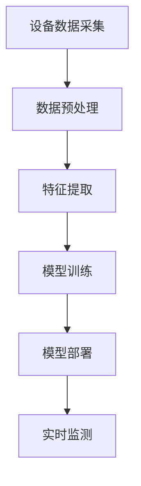

                 


# 价值投资中的智能制造预测性维护分析

> 关键词：价值投资，智能制造，预测性维护，机器学习，算法原理，系统架构

> 摘要：本文探讨了在智能制造背景下，如何利用预测性维护技术进行价值投资分析。通过结合机器学习算法和系统架构设计，提出了一种创新的预测性维护分析框架，帮助投资者在智能制造领域做出更明智的决策。文章详细分析了预测性维护的核心概念、算法原理、系统架构设计以及实际项目案例，为读者提供了全面的技术解读和实践指导。

---

## 第1章: 预测性维护的核心概念与背景

### 1.1 智能制造与预测性维护的定义

智能制造是指通过物联网、大数据和人工智能等技术，实现生产过程的智能化、数字化和自动化。预测性维护则是通过预测设备的故障概率，提前安排维护计划，以减少设备故障停机时间，提高生产效率。

### 1.2 价值投资的基本概念

价值投资是一种投资策略，通过分析企业的基本面，寻找被市场低估的投资标的。在智能制造领域，价值投资需要结合技术分析和市场趋势，寻找具有长期增长潜力的企业。

### 1.3 预测性维护与价值投资的结合

在智能制造中，预测性维护可以帮助企业降低设备维护成本，提高生产效率。对于投资者来说，预测性维护数据可以作为评估企业价值的重要依据，从而做出更精准的投资决策。

---

## 第2章: 预测性维护的算法原理

### 2.1 机器学习在预测性维护中的应用

机器学习算法（如XGBoost、随机森林）可以基于历史数据，预测设备的故障概率。通过训练模型，可以实现设备状态的实时监测和预测。

### 2.2 价值投资中的数学模型

价值投资的数学模型通常包括财务指标分析、市场趋势预测等。通过结合预测性维护数据，可以构建更全面的企业价值评估模型。

### 2.3 预测性维护的数学公式

在机器学习模型中，预测性维护的概率可以通过以下公式计算：

$$ P(failure) = \frac{1}{1 + e^{- (w \cdot x + b)}} $$

其中，$w$ 是权重，$x$ 是输入特征，$b$ 是偏置。

---

## 第3章: 系统架构设计

### 3.1 系统功能设计

预测性维护系统需要包括数据采集、模型训练、实时监测等功能模块。

### 3.2 系统架构图



### 3.3 接口设计与交互流程

系统通过API接口与企业生产系统对接，实现设备数据的实时采集和分析。

---

## 第4章: 项目实战

### 4.1 环境安装

需要安装Python、scikit-learn、XGBoost等库。

### 4.2 核心代码实现

```python
import xgboost as xgb
from sklearn.model_selection import train_test_split

# 数据预处理
X_train, X_test, y_train, y_test = train_test_split(X, y, test_size=0.2)

# 模型训练
model = xgb.XGBClassifier()
model.fit(X_train, y_train)

# 模型预测
y_pred = model.predict(X_test)
```

### 4.3 实际案例分析

通过分析某制造企业的设备数据，验证模型的预测准确性，并评估其对投资决策的影响。

---

## 第5章: 总结与展望

### 5.1 全文总结

本文提出了结合预测性维护和价值投资的分析框架，为投资者提供了新的决策工具。

### 5.2 未来展望

未来的研究可以进一步优化算法，拓展更多应用场景，如供应链优化和绿色制造。

---

通过本文的分析，读者可以深入了解智能制造中的预测性维护技术，并将其应用于价值投资分析中，为企业创造更大的价值。

