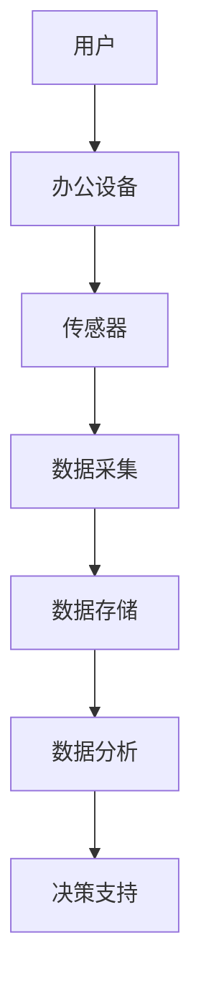
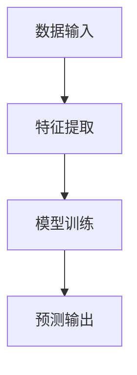
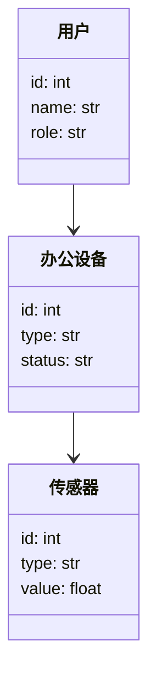
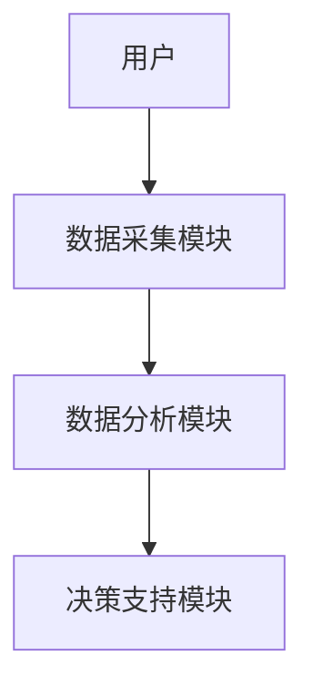
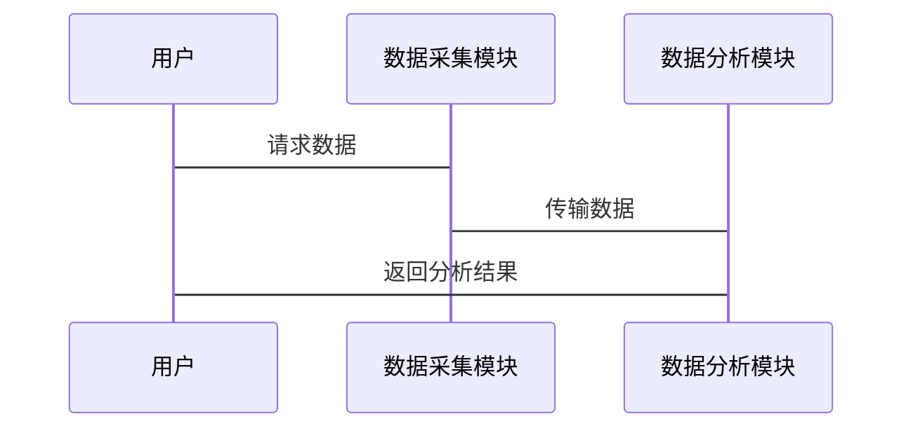

                 


# 价值投资中的智能办公空间技术趋势

> 关键词：价值投资，智能办公空间，技术趋势，物联网，大数据分析，人工智能，云计算

> 摘要：本文深入分析了智能办公空间在价值投资中的技术发展趋势，探讨了物联网、大数据分析、人工智能和云计算等技术在智能办公空间中的应用及其对投资决策的影响。通过详细的技术背景介绍、核心概念分析、算法原理解析、系统架构设计以及实际项目案例，本文为投资者提供了智能办公空间技术趋势的全面洞察，帮助读者更好地理解如何在技术驱动的办公环境中做出明智的投资决策。

---

# 第一章: 智能办公空间与价值投资的背景介绍

## 1.1 价值投资的基本概念

### 1.1.1 价值投资的定义与核心理念
- 价值投资是一种长期投资策略，强调以合理价格投资于具有持续竞争优势的公司。
- 核心理念：寻找市场低估的优质资产，关注企业的内在价值而非短期市场波动。

### 1.1.2 价值投资与智能办公空间的结合
- 智能办公空间通过技术手段优化办公效率和成本，成为企业价值的重要组成部分。
- 投资者可以通过分析智能办公技术的应用情况，评估企业的长期发展潜力。

### 1.1.3 价值投资在现代企业中的应用现状
- 当前企业普遍采用智能办公技术，如远程办公、自动化办公工具等。
- 价值投资者 increasingly focus on企业的技术创新能力和技术驱动的盈利能力。

## 1.2 智能办公空间的定义与特点

### 1.2.1 智能办公空间的定义
- 智能办公空间是通过物联网、大数据分析、人工智能等技术实现的智能化办公环境。
- 其特点是高效、灵活、可持续，能够根据用户需求动态调整办公环境。

### 1.2.2 智能办公空间的核心技术特点
- **物联网技术**：实现办公设备的智能化连接与数据采集。
- **大数据分析**：通过对办公数据的分析，优化资源分配和办公流程。
- **人工智能**：提供智能化的办公辅助工具，提升办公效率。
- **云计算**：支持办公数据的存储与共享，实现远程办公。

### 1.2.3 智能办公空间与传统办公模式的对比
| 对比维度 | 智能办公空间 | 传统办公空间 |
|----------|--------------|---------------|
| 灵活性   | 高           | 低           |
| 成本     | 低           | 高           |
| 效率     | 高           | 低           |
| 可扩展性 | 高           | 低           |

## 1.3 价值投资中的技术趋势分析

### 1.3.1 技术趋势的定义与分类
- **技术趋势**：指在一定时期内，技术发展的主要方向和重点领域。
- **分类**：根据技术的应用领域和技术成熟度进行分类。

### 1.3.2 智能办公空间技术趋势的现状
- **物联网技术**：广泛应用，推动办公设备的智能化。
- **大数据分析**：帮助企业优化资源分配，提升效率。
- **人工智能**：提供智能化的办公辅助工具，如智能日历、自动化流程。
- **云计算**：支持远程办公，实现数据的实时共享。

### 1.3.3 未来智能办公空间技术的趋势预测
- **智能化升级**：进一步增强人工智能的应用，实现办公环境的全自动化。
- **绿色办公**：推动可持续发展，采用节能技术，降低碳排放。
- **虚拟现实**：虚拟办公空间的普及，实现沉浸式远程办公体验。

---

# 第二章: 智能办公空间的核心技术与价值分析

## 2.1 智能办公空间的核心技术

### 2.1.1 物联网技术
- **定义**：通过传感器和通信技术，实现办公设备的智能化连接。
- **应用**：设备状态监测、环境监测、资源管理。

### 2.1.2 大数据分析技术
- **定义**：通过对大量办公数据的分析，挖掘潜在价值。
- **应用**：办公效率分析、资源优化配置、决策支持。

### 2.1.3 人工智能技术
- **定义**：通过机器学习、自然语言处理等技术，实现智能化办公。
- **应用**：智能客服、自动化流程、个性化推荐。

### 2.1.4 云计算技术
- **定义**：通过云服务器实现数据的存储与共享。
- **应用**：远程办公、数据备份、资源共享。

## 2.2 智能办公空间技术的属性特征对比

### 2.2.1 技术属性对比表格
| 技术       | 优点                     | 缺点                     |
|------------|--------------------------|--------------------------|
| 物联网      | 实时监测，数据准确        | 布置成本高               |
| 大数据分析  | 数据挖掘能力强           | 数据隐私问题             |
| 人工智能    | 提高效率，智能化          | 需要大量数据支持          |
| 云计算      | 资源共享，灵活性高        | 依赖网络，存在安全隐患    |

### 2.2.2 技术特征的优劣势分析
- **物联网技术**：优点是实时性和准确性，缺点是部署成本较高。
- **大数据分析**：优点是数据挖掘能力强，缺点是数据隐私问题突出。
- **人工智能技术**：优点是提高效率和智能化，缺点是需要大量数据支持。
- **云计算技术**：优点是资源共享和灵活性，缺点是依赖网络，存在安全隐患。

## 2.3 智能办公空间的ER实体关系图



---

# 第三章: 智能办公空间技术的算法原理

## 3.1 数据采集与处理算法

### 3.1.1 数据采集流程
- 数据采集是智能办公空间技术的核心环节，包括传感器数据采集、日志数据采集、用户行为数据采集等。

### 3.1.2 数据清洗算法
- **定义**：通过去除噪声数据，确保数据的准确性和完整性。
- **流程**：
  1. 去除重复数据
  2. 填补缺失值
  3. 处理异常值

### 3.1.3 数据预处理方法
- **数据转换**：将原始数据转换为适合分析的形式。
- **数据标准化**：将数据归一化处理，消除量纲的影响。

## 3.2 数据分析与预测算法

### 3.2.1 时间序列分析
- **定义**：通过对时间序列数据的分析，预测未来的趋势。
- **ARIMA模型**：
  - **公式**：$$ARIMA(p, d, q)$$
  - **流程**：
    1. 数据平稳化
    2. 确定模型参数
    3. 模型拟合
    4. 模型预测

### 3.2.2 机器学习算法
- **随机森林**：
  - **优势**：抗过拟合能力强，适合多分类问题。
  - **流程**：
    1. 数据特征提取
    2. 模型训练
    3. 模型预测

## 3.3 算法实现与优化

### 3.3.1 算法流程图


### 3.3.2 算法实现的Python代码示例
```python
import pandas as pd
from sklearn.ensemble import RandomForestClassifier

# 数据加载
data = pd.read_csv('data.csv')

# 特征提取
features = data[['feature1', 'feature2', 'feature3']]
label = data['label']

# 模型训练
model = RandomForestClassifier()
model.fit(features, label)

# 模型预测
predicted = model.predict(features)
```

### 3.3.3 算法优化
- **超参数调优**：通过网格搜索优化模型参数。
- **数据增强**：增加数据量，提高模型的泛化能力。

---

# 第四章: 智能办公空间系统架构设计

## 4.1 问题场景介绍
- 某企业希望通过智能办公空间技术优化办公效率和成本。

## 4.2 系统功能设计
### 4.2.1 系统功能模块
- **数据采集模块**：负责采集办公设备和用户行为数据。
- **数据分析模块**：对数据进行处理和分析，生成决策支持信息。
- **用户界面模块**：提供友好的用户界面，展示分析结果。

### 4.2.2 领域模型Mermaid类图


## 4.3 系统架构设计
### 4.3.1 系统架构图


### 4.3.2 系统接口设计
- **API接口**：提供RESTful API，实现数据的采集、分析和展示。

### 4.3.3 系统交互Mermaid序列图


---

# 第五章: 智能办公空间技术的应用案例

## 5.1 项目介绍
- **项目名称**：某企业智能办公空间优化项目。
- **项目目标**：通过技术手段优化办公效率和成本。

## 5.2 核心代码实现

### 5.2.1 数据采集代码
```python
import serial

# 串口配置
ser = serial.Serial('COM1', 9600)

# 数据采集
while True:
    data = ser.readline()
    print(data)
```

### 5.2.2 数据分析代码
```python
import pandas as pd
from sklearn.

