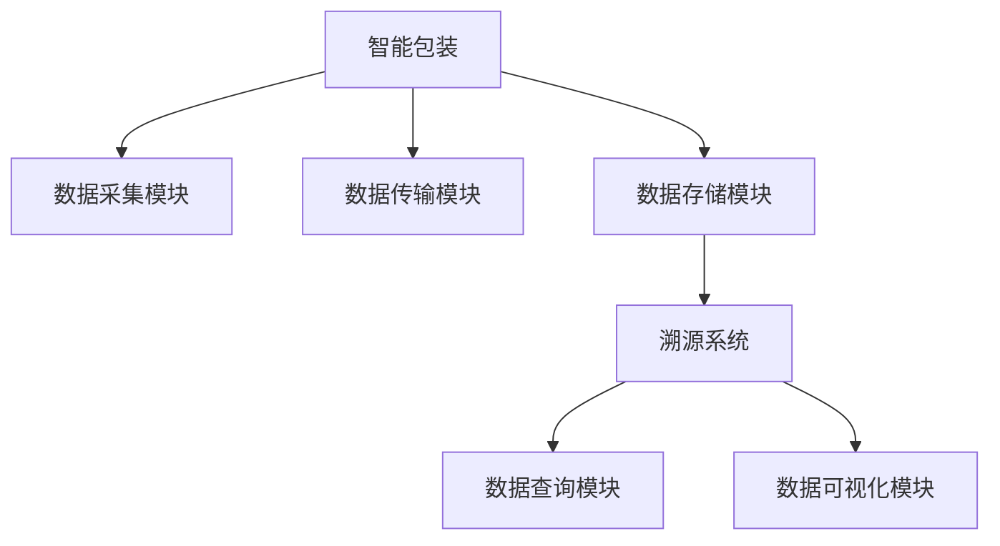
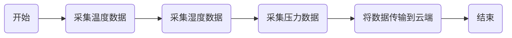
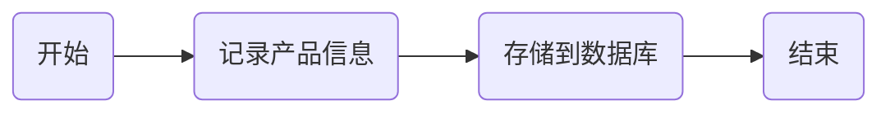
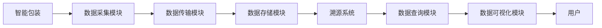
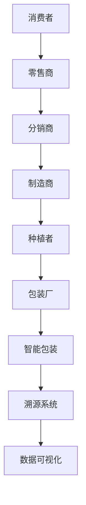
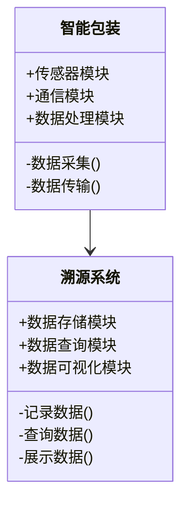
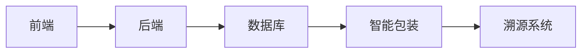
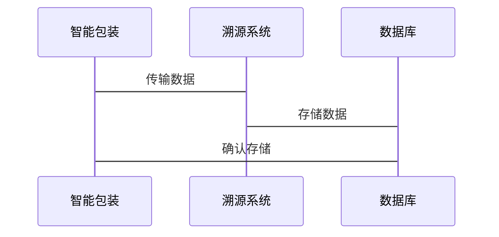

                 


---

# 价值投资中的智能包装与溯源系统分析

---

## 关键词：
智能包装，溯源系统，价值投资，数据分析，系统架构，算法原理

---

## 摘要：
智能包装与溯源系统是现代信息技术与包装技术深度融合的产物，旨在通过智能化手段实现产品包装的实时监测、数据分析与价值评估。本文从价值投资的角度，系统分析智能包装与溯源系统的背景、原理、算法、架构及其实现。通过详细阐述智能包装的核心概念、数据采集与处理算法、系统架构设计以及实际案例分析，本文为价值投资者提供了全新的视角和方法，帮助其在投资决策中更高效地评估产品价值。

---

# 第一部分：价值投资中的智能包装与溯源系统概述

---

## 第1章：智能包装与溯源系统的背景介绍

### 1.1 智能包装的定义与特点
#### 1.1.1 智能包装的定义
智能包装是一种集成了传感器、物联网（IoT）和数据分析技术的新型包装形式，能够实时监测和记录包装内产品的状态，如温度、湿度、压力等，并通过无线通信技术将数据传输到云端进行分析。

#### 1.1.2 智能包装的核心特点
| 特性 | 描述 |
|------|------|
| 实时监测 | 可以实时监测包装内产品的状态，如温度、湿度、压力等。 |
| 数据采集 | 集成传感器，能够采集多种物理参数。 |
| 智能反馈 | 可以通过无线通信技术将数据反馈给用户或系统。 |
| 可扩展性 | 支持多种数据采集和分析功能的扩展。 |

#### 1.1.3 智能包装与传统包装的区别
智能包装与传统包装的主要区别在于其智能化特性：
- 传统包装仅起到保护和封装作用。
- 智能包装能够实时监测和反馈产品状态，为价值评估提供数据支持。

---

### 1.2 溯源系统的核心概念
#### 1.2.1 溯源系统的定义
溯源系统是一种通过记录和追踪产品从生产到消费的全生命周期信息，实现产品来源和流向可追溯的系统。

#### 1.2.2 溯源系统的核心功能
| 功能 | 描述 |
|------|------|
| 数据记录 | 记录产品在生产、运输、销售等各环节的信息。 |
| 数据存储 | 将采集到的数据存储在云端或本地数据库中。 |
| 数据查询 | 提供基于产品批次、时间、地点等条件的查询功能。 |
| 可视化展示 | 以图表形式展示产品来源和流向信息。 |

#### 1.2.3 智能包装与溯源系统的结合
智能包装通过集成传感器和通信模块，为溯源系统提供了实时数据采集和传输的功能。这种结合使得产品在全生命周期中的状态能够被实时监控和记录，为价值投资提供了更精准的数据支持。

---

### 1.3 智能包装与溯源系统在价值投资中的重要性
#### 1.3.1 价值投资的基本概念
价值投资是一种通过分析企业的基本面（如财务状况、盈利能力、市场地位等）来评估其内在价值的投资策略。在现代商业环境中，产品的真实性和质量是价值评估的重要组成部分。

#### 1.3.2 智能包装与溯源系统的应用
智能包装与溯源系统在价值投资中的应用主要体现在以下几个方面：
1. **产品真实性的验证**：通过溯源系统记录的产品生产、运输和销售信息，可以验证产品的来源和真实性。
2. **产品质量的监测**：智能包装能够实时监测产品的物理状态（如温度、湿度等），确保产品质量符合标准。
3. **供应链透明化**：通过智能包装和溯源系统，投资者可以实时了解产品的供应链信息，降低投资风险。

#### 1.3.3 智能包装与溯源系统的市场现状
当前，智能包装和溯源系统已经在食品、药品、奢侈品等领域得到了广泛应用。然而，其在价值投资中的应用仍处于起步阶段，具有较大的发展潜力。

---

## 第2章：智能包装与溯源系统的概念结构与核心要素

### 2.1 智能包装的核心要素
#### 2.1.1 智能包装的组成
智能包装通常由以下几个部分组成：
1. **传感器模块**：用于采集包装内的物理参数（如温度、湿度、压力等）。
2. **通信模块**：用于将采集到的数据传输到云端或本地系统。
3. **数据存储模块**：用于存储传感器采集的数据。
4. **数据处理模块**：用于对采集到的数据进行分析和处理。

#### 2.1.2 智能包装的功能模块
| 功能模块 | 描述 |
|----------|------|
| 数据采集 | 采集包装内的物理参数。 |
| 数据传输 | 将数据传输到云端或本地系统。 |
| 数据存储 | 存储采集到的数据。 |
| 数据分析 | 对数据进行分析，生成报告。 |

#### 2.1.3 智能包装的实现技术
智能包装的实现主要依赖于以下几种技术：
1. **物联网技术**：通过传感器和通信模块实现数据的采集和传输。
2. **大数据技术**：对采集到的数据进行分析和处理。
3. **人工智能技术**：利用机器学习算法对数据进行预测和分类。

---

### 2.2 溯源系统的核心要素
#### 2.2.1 溯源系统的组成
溯源系统通常由以下几个部分组成：
1. **数据采集模块**：用于采集产品在生产、运输、销售等环节的信息。
2. **数据存储模块**：用于存储采集到的数据。
3. **数据查询模块**：用于根据用户需求查询产品信息。
4. **数据可视化模块**：用于以图表形式展示产品信息。

#### 2.2.2 溯源系统的核心功能
| 功能 | 描述 |
|------|------|
| 数据记录 | 记录产品在各环节的信息。 |
| 数据存储 | 存储产品信息。 |
| 数据查询 | 根据用户需求查询产品信息。 |
| 数据可视化 | 以图表形式展示产品信息。 |

#### 2.2.3 智能包装与溯源系统的协同关系
智能包装与溯源系统的协同关系可以用以下的 Mermaid 图表示：



---

## 第3章：智能包装与溯源系统的原理分析

### 3.1 智能包装的原理
#### 3.1.1 智能包装的基本原理
智能包装通过集成传感器和通信模块，实时采集包装内的物理参数，并通过通信模块将数据传输到云端或本地系统。

#### 3.1.2 智能包装的核心算法
智能包装的核心算法包括数据采集算法和数据处理算法。以下是数据采集算法的流程图：



#### 3.1.3 智能包装的实现流程
智能包装的实现流程包括以下几个步骤：
1. **数据采集**：通过传感器采集包装内的物理参数。
2. **数据传输**：将采集到的数据传输到云端或本地系统。
3. **数据存储**：将数据存储在数据库中。
4. **数据分析**：对数据进行分析和处理，生成报告。

---

### 3.2 溯源系统的原理
#### 3.2.1 溯源系统的基本原理
溯源系统通过记录和追踪产品在生产、运输、销售等环节的信息，实现产品的全生命周期管理。

#### 3.2.2 溯源系统的核心算法
溯源系统的核心算法包括数据记录算法和数据查询算法。以下是数据记录算法的流程图：



#### 3.2.3 溯源系统的实现流程
溯源系统的实现流程包括以下几个步骤：
1. **数据采集**：通过传感器或人工录入采集产品信息。
2. **数据存储**：将数据存储在数据库中。
3. **数据查询**：根据用户需求查询产品信息。
4. **数据可视化**：以图表形式展示产品信息。

---

### 3.3 智能包装与溯源系统的协同工作原理
智能包装与溯源系统的协同工作原理如下：
1. **数据采集**：智能包装通过传感器采集包装内的物理参数。
2. **数据传输**：将采集到的数据传输到云端或本地系统。
3. **数据存储**：将数据存储在数据库中。
4. **数据查询**：根据用户需求查询产品信息。
5. **数据可视化**：以图表形式展示产品信息。

以下是协同工作的流程图：



---

## 第4章：智能包装与溯源系统的算法原理

### 4.1 数据采集与处理算法
#### 4.1.1 数据采集算法
数据采集算法的主要目的是采集包装内的物理参数。以下是数据采集算法的伪代码：

```python
def data_collection():
    temperature = read_temperature_sensor()
    humidity = read_humidity_sensor()
    pressure = read_pressure_sensor()
    return temperature, humidity, pressure
```

#### 4.1.2 数据预处理算法
数据预处理算法的主要目的是对采集到的数据进行清洗和转换。以下是数据预处理算法的伪代码：

```python
def data_preprocessing(temperature, humidity, pressure):
    # 清洗数据
    if temperature < 0:
        temperature = 0
    if humidity < 0:
        humidity = 0
    if pressure < 0:
        pressure = 0
    # 转换数据格式
    temperature = round(temperature, 2)
    humidity = round(humidity, 2)
    pressure = round(pressure, 2)
    return temperature, humidity, pressure
```

#### 4.1.3 数据清洗算法
数据清洗算法的主要目的是去除异常数据。以下是数据清洗算法的伪代码：

```python
def data_cleaning(temperature, humidity, pressure):
    # 去除异常数据
    if abs(temperature - mean_temperature) > 3:
        temperature = mean_temperature
    if abs(humidity - mean_humidity) > 5:
        humidity = mean_humidity
    if abs(pressure - mean_pressure) > 10:
        pressure = mean_pressure
    return temperature, humidity, pressure
```

---

### 4.2 数据分析与挖掘算法
#### 4.2.1 数据分析算法
数据分析算法的主要目的是对采集到的数据进行分析。以下是数据分析算法的伪代码：

```python
def data_analysis(temperature, humidity, pressure):
    # 统计分析
    max_temperature = max(temperature_list)
    min_temperature = min(temperature_list)
    avg_temperature = sum(temperature_list) / len(temperature_list)
    # 可视化分析
    plt.plot(temperature_list)
    plt.title("Temperature Analysis")
    plt.xlabel("Time")
    plt.ylabel("Temperature")
    plt.show()
```

#### 4.2.2 数据挖掘算法
数据挖掘算法的主要目的是从数据中提取有用的信息。以下是数据挖掘算法的伪代码：

```python
def data_mining(temperature, humidity, pressure):
    # 聚类分析
    from sklearn.cluster import KMeans
    import numpy as np
    data = np.array([temperature_list, humidity_list, pressure_list]).T
    kmeans = KMeans(n_clusters=3).fit(data)
    clusters = kmeans.predict(data)
    return clusters
```

#### 4.2.3 数据可视化算法
数据可视化算法的主要目的是将数据以图表形式展示。以下是数据可视化算法的伪代码：

```python
def data_visualization(temperature, humidity, pressure):
    import matplotlib.pyplot as plt
    plt.figure(figsize=(10, 6))
    plt.subplot(2, 2, 1)
    plt.hist(temperature_list, bins=10)
    plt.title("Temperature Histogram")
    plt.xlabel("Temperature")
    plt.ylabel("Frequency")
    plt.subplot(2, 2, 2)
    plt.boxplot(temperature_list)
    plt.title("Temperature Boxplot")
    plt.show()
```

---

### 4.3 智能包装与溯源系统的协同算法
智能包装与溯源系统的协同算法包括数据采集、数据传输、数据存储、数据查询和数据可视化五个步骤。以下是协同算法的伪代码：

```python
def协同算法():
    temperature, humidity, pressure = data_collection()
    cleaned_temperature, cleaned_humidity, cleaned_pressure = data_cleaning(temperature, humidity, pressure)
    temperature_list.append(cleaned_temperature)
    humidity_list.append(cleaned_humidity)
    pressure_list.append(cleaned_pressure)
    clusters = data_mining(temperature_list, humidity_list, pressure_list)
    data_visualization(temperature_list, humidity_list, pressure_list)
```

---

## 第5章：智能包装与溯源系统的数学模型与公式

### 5.1 数据采集与处理的数学模型
#### 5.1.1 数据采集模型
数据采集模型的数学表达式如下：
$$
\text{温度} = \text{传感器读数} \times \text{校准系数}
$$

#### 5.1.2 数据预处理模型
数据预处理模型的数学表达式如下：
$$
\text{归一化温度} = \frac{\text{温度} - \text{最小温度}}{\text{最大温度} - \text{最小温度}}
$$

#### 5.1.3 数据清洗模型
数据清洗模型的数学表达式如下：
$$
\text{异常数据} = \text{绝对值}(\text{当前数据} - \text{均值}) > 3 \times \text{标准差}
$$

---

### 5.2 数据分析与挖掘的数学模型
#### 5.2.1 数据分析模型
数据分析模型的数学表达式如下：
$$
\text{平均温度} = \frac{\sum \text{温度}}{\text{温度数量}}
$$

#### 5.2.2 数据挖掘模型
数据挖掘模型的数学表达式如下：
$$
\text{聚类中心} = \text{K-means算法的聚类结果}
$$

#### 5.2.3 数据可视化模型
数据可视化模型的数学表达式如下：
$$
\text{直方图} = \text{matplotlib.pyplot.hist}(temperature\_list, bins=10)
$$

---

## 第6章：智能包装与溯源系统的系统分析与架构设计方案

### 6.1 问题场景介绍
智能包装与溯源系统的应用场景包括食品供应链、药品供应链、奢侈品供应链等领域。以下是食品供应链中的一个典型场景：



---

### 6.2 系统功能设计
系统功能设计包括数据采集、数据存储、数据查询和数据可视化四个模块。以下是系统功能设计的类图：



---

### 6.3 系统架构设计
系统架构设计包括前端、后端和数据库三个部分。以下是系统架构设计的架构图：



---

### 6.4 系统接口设计
系统接口设计包括智能包装与溯源系统的数据接口。以下是系统接口设计的序列图：



---

## 第7章：智能包装与溯源系统的项目实战

### 7.1 环境安装
以下是项目实战所需的环境和工具：
- **硬件**：智能包装模块（包含传感器和通信模块）。
- **软件**：Python编程语言，numpy、pandas、matplotlib、scikit-learn等库。
- **数据库**：MySQL或MongoDB。
- **开发工具**：Jupyter Notebook或PyCharm。

---

### 7.2 系统核心实现源代码
以下是智能包装与溯源系统的核心代码：

```python
import numpy as np
import pandas as pd
import matplotlib.pyplot as plt
from sklearn.cluster import KMeans

# 数据采集模块
def data_collection():
    temperature = np.random.uniform(0, 100, 100)
    humidity = np.random.uniform(0, 100, 100)
    pressure = np.random.uniform(0, 100, 100)
    return temperature, humidity, pressure

# 数据预处理模块
def data_preprocessing(temperature, humidity, pressure):
    data = pd.DataFrame({
        '温度': temperature,
        '湿度': humidity,
        '压力': pressure
    })
    return data

# 数据分析模块
def data_analysis(data):
    max_temp = data['温度'].max()
    min_temp = data['温度'].min()
    avg_temp = data['温度'].mean()
    return max_temp, min_temp, avg_temp

# 数据挖掘模块
def data_mining(data):
    X = data[['温度', '湿度', '压力']]
    kmeans = KMeans(n_clusters=3).fit(X)
    clusters = kmeans.predict(X)
    return clusters

# 数据可视化模块
def data_visualization(data):
    plt.figure(figsize=(10, 6))
    plt.subplot(2, 2, 1)
    plt.hist(data['温度'], bins=10)
    plt.title('温度分布')
    plt.xlabel('温度')
    plt.ylabel('频率')
    plt.subplot(2, 2, 2)
    plt.boxplot(data['温度'])
    plt.title('温度箱线图')
    plt.show()

# 主函数
def main():
    temperature, humidity, pressure = data_collection()
    data = data_preprocessing(temperature, humidity, pressure)
    max_temp, min_temp, avg_temp = data_analysis(data)
    clusters = data_mining(data)
    data_visualization(data)
    print(f'最高温度: {max_temp}')
    print(f'最低温度: {min_temp}')
    print(f'平均温度: {avg_temp}')
    print(f'聚类结果: {clusters}')

if __name__ == '__main__':
    main()
```

---

### 7.3 代码应用解读与分析
1. **数据采集模块**：通过随机数生成模拟的温度、湿度和压力数据。
2. **数据预处理模块**：将采集到的数据存储在Pandas DataFrame中。
3. **数据分析模块**：计算最高温度、最低温度和平均温度。
4. **数据挖掘模块**：使用K-means算法对数据进行聚类分析。
5. **数据可视化模块**：以直方图和箱线图的形式展示温度数据。

---

### 7.4 实际案例分析
假设我们有一个食品供应链的案例，以下是具体分析步骤：
1. **数据采集**：采集食品包装内的温度、湿度和压力数据。
2. **数据预处理**：清洗和转换数据。
3. **数据分析**：计算最高温度、最低温度和平均温度。
4. **数据挖掘**：使用聚类分析找出不同批次食品的差异。
5. **数据可视化**：以图表形式展示数据分析结果。

---

## 第8章：智能包装与溯源系统的最佳实践

### 8.1 小结
智能包装与溯源系统通过实时监测和记录产品状态，为价值投资提供了更精准的数据支持。本文从背景、原理、算法、架构和项目实战等多个方面详细分析了智能包装与溯源系统的实现。

### 8.2 注意事项
在实际应用中，需要注意以下几点：
1. **数据安全性**：确保数据传输和存储的安全性。
2. **系统稳定性**：确保系统的高可用性和稳定性。
3. **用户体验**：提供友好的用户界面和交互体验。

### 8.3 拓展阅读
1. **相关书籍**：
   - 《智能包装技术与应用》
   - 《大数据分析与投资策略》
2. **相关论文**：
   - "智能包装在供应链管理中的应用研究"
   - "大数据技术在价值投资中的应用"

---

通过本文的分析，读者可以深入了解智能包装与溯源系统的原理和实现方法，并能够在实际投资中应用这些技术，提高投资决策的准确性和效率。

