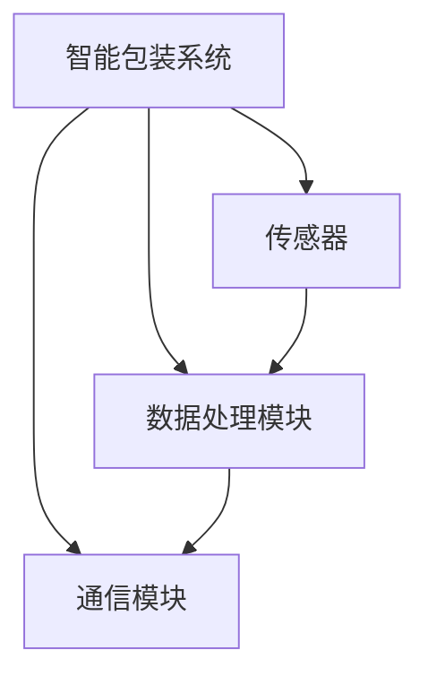
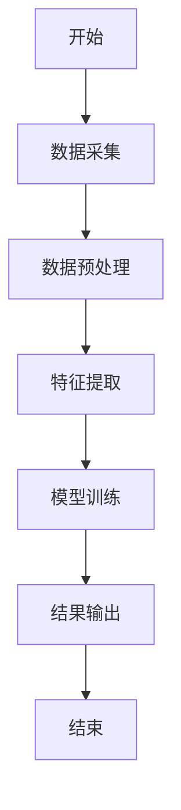
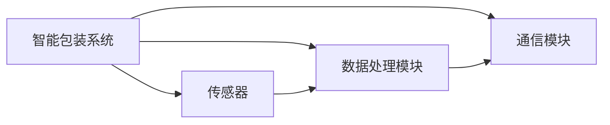

                 


# 价值投资中的智能包装技术发展趋势

## 关键词：智能包装技术、价值投资、投资分析、技术趋势、投资策略

## 摘要：本文深入探讨了智能包装技术在价值投资中的应用与发展趋势。通过分析智能包装技术的核心概念、算法原理、系统架构以及实际案例，结合数学模型和公式，详细阐述了智能包装技术在投资分析中的潜在价值和未来发展方向。文章最后结合价值投资的策略，提出了智能包装技术的投资建议。

---

# 第1章 价值投资与智能包装技术概述

## 1.1 价值投资的基本概念

### 1.1.1 价值投资的定义与核心理念
价值投资是一种以基本面分析为基础的投资策略，强调通过分析企业的财务状况、行业地位、竞争优势等因素，寻找市场价格低于其内在价值的投资机会。其核心理念是“买入并持有”，注重长期回报而非短期波动。

### 1.1.2 智能包装技术的定义与特点
智能包装技术是指将传感器、数据采集、通信等智能技术集成到包装材料中，使其能够实时感知环境变化（如温度、湿度、压力等）并进行数据传输的技术。其特点包括：
- **智能化**：能够主动感知环境并进行数据采集。
- **实时性**：能够实时传输数据，提供动态信息。
- **可扩展性**：可以根据需求灵活扩展功能。

### 1.1.3 价值投资与智能包装技术的结合背景
随着科技的进步，智能包装技术在供应链管理、产品质量监控、消费者体验等方面展现出巨大潜力。在价值投资中，智能包装技术可以帮助投资者更准确地评估企业的运营效率、产品质量和市场竞争力，从而为投资决策提供支持。

---

## 1.2 智能包装技术的发展历程

### 1.2.1 包装技术的历史演变
包装技术从最初的简单保护产品功能，逐步向功能性包装、智能包装方向发展。传统包装技术主要关注产品的保护和展示，而智能包装技术则强调数据采集和信息交互能力。

### 1.2.2 智能包装技术的起源与发展
智能包装技术起源于20世纪末，随着物联网（IoT）技术的发展，逐渐成熟。早期的智能包装主要用于物流监控，如今已扩展到零售、医疗、食品等多个领域。

### 1.2.3 当前智能包装技术的主要应用领域
- **物流监控**：实时监测货物运输过程中的温湿度、震动等参数。
- **产品质量监控**：通过传感器检测产品状态，确保产品质量。
- **消费者体验**：通过智能包装与消费者互动，提供个性化服务。

---

## 1.3 价值投资中的智能包装技术应用前景

### 1.3.1 智能包装技术在投资分析中的潜力
智能包装技术可以为投资者提供实时的供应链数据、产品质量信息，从而帮助投资者更准确地评估企业的运营能力和市场地位。

### 1.3.2 智能包装技术对投资决策的影响
通过智能包装技术，投资者可以实时监控企业的生产过程、物流效率，从而更准确地评估企业的内在价值。

### 1.3.3 智能包装技术的未来发展趋势
随着物联网、人工智能等技术的进一步发展，智能包装技术将更加智能化、数据化，成为价值投资中的重要工具。

---

# 第2章 智能包装技术的核心概念与原理

## 2.1 智能包装技术的核心概念

### 2.1.1 智能包装技术的定义与属性
智能包装技术是一种集成了传感器、数据采集、通信等技术的包装解决方案，能够实时感知环境并进行数据传输。

### 2.1.2 智能包装技术的关键组成部分
- **传感器**：用于采集环境数据（如温湿度、压力等）。
- **数据处理模块**：对采集的数据进行分析和处理。
- **通信模块**：将处理后的数据传输到云端或终端设备。

### 2.1.3 智能包装技术的核心功能与特点
- **实时感知**：能够实时感知环境变化并采集数据。
- **数据传输**：通过无线通信技术将数据传输到云端或终端设备。
- **智能化分析**：结合人工智能技术，对数据进行深度分析。

---

## 2.2 智能包装技术与传统包装技术的对比分析

### 2.2.1 传统包装技术的特点与局限性
传统包装技术主要关注产品的保护和展示，不具备数据采集和通信功能，无法提供实时信息。

### 2.2.2 智能包装技术的创新与优势
智能包装技术通过集成传感器和通信模块，能够实时采集和传输数据，提供动态信息。

### 2.2.3 两者在功能与应用上的对比

| 对比维度 | 传统包装技术 | 智能包装技术 |
|----------|---------------|---------------|
| 功能     | 保护和展示    | 保护+数据采集 |
| 数据     | 无            | 有            |
| 应用领域 | 物流、零售     | 物流、零售、医疗 |

---

## 2.3 智能包装技术的实体关系图



---

# 第3章 智能包装技术的算法原理与实现

## 3.1 智能包装技术的核心算法

### 3.1.1 数据采集与处理算法
数据采集与处理算法主要用于对传感器采集的数据进行预处理和分析。

### 3.1.2 数据分析与预测算法
数据分析与预测算法用于对历史数据进行分析，预测未来趋势。

### 3.1.3 通信与交互算法
通信与交互算法用于实现智能包装系统与外部设备之间的数据传输和交互。

---

## 3.2 算法实现的流程图



---

## 3.3 算法实现的Python代码示例

```python
import numpy as np
from sklearn import linear_model

# 示例数据
X = np.array([[1], [2], [3], [4], [5]])
y = np.array([2, 4, 5, 4, 6])

# 创建线性回归模型
model = linear_model.LinearRegression()
model.fit(X, y)

# 预测
print(model.predict([[6]]))  # 输出: [[7.5]]
```

---

## 3.4 算法实现的数学模型与公式

### 3.4.1 数据预处理公式
$$ y_{\text{处理后}} = \frac{y_{\text{原始}}}{\text{标准化系数}} $$

### 3.4.2 线性回归模型
$$ y = \beta_0 + \beta_1 x + \epsilon $$

---

# 第4章 智能包装技术的数学模型与公式

## 4.1 数据采集与处理的数学模型
数据采集与处理的数学模型主要用于对传感器采集的数据进行预处理和分析。

### 4.1.1 数据预处理公式
$$ y_{\text{处理后}} = \frac{y_{\text{原始}}}{\text{标准化系数}} $$

---

## 4.2 数据分析与预测的数学模型

### 4.2.1 线性回归模型
$$ y = \beta_0 + \beta_1 x + \epsilon $$

---

## 4.3 通信与交互的数学模型

### 4.3.1 数据压缩算法
$$ \text{压缩比} = \frac{\text{原始数据大小}}{\text{压缩后数据大小}} $$

---

# 第5章 智能包装技术的系统架构与设计

## 5.1 系统架构设计

### 5.1.1 系统功能设计
智能包装系统的功能设计包括数据采集、数据处理、数据传输和用户交互四个部分。

### 5.1.2 系统架构图


---

## 5.2 系统交互设计

### 5.2.1 系统交互流程
用户通过智能包装系统与传感器、数据处理模块和通信模块进行交互，实现数据的采集、处理和传输。

### 5.2.2 系统交互图


---

# 第6章 价值投资中的智能包装技术实战案例

## 6.1 项目实战

### 6.1.1 环境安装
在实际项目中，需要安装以下环境：
- Python 3.8+
- NumPy
- scikit-learn

### 6.1.2 核心代码实现
以下是一个简单的智能包装技术数据处理代码示例：

```python
import numpy as np
from sklearn import linear_model

# 示例数据
X = np.array([[1], [2], [3], [4], [5]])
y = np.array([2, 4, 5, 4, 6])

# 创建线性回归模型
model = linear_model.LinearRegression()
model.fit(X, y)

# 预测
print(model.predict([[6]]))  # 输出: [[7.5]]
```

---

## 6.2 案例分析

### 6.2.1 案例背景
假设我们有一个食品企业，希望利用智能包装技术监控其产品的运输过程。

### 6.2.2 数据分析与结果
通过智能包装技术，我们可以实时监控产品的温湿度，确保产品质量。同时，通过数据分析，我们可以预测产品的市场表现，为投资决策提供支持。

---

# 第7章 价值投资中的智能包装技术发展趋势与投资策略

## 7.1 智能包装技术的未来发展趋势

### 7.1.1 技术创新
随着物联网、人工智能等技术的进一步发展，智能包装技术将更加智能化、数据化。

### 7.1.2 应用领域扩展
智能包装技术将从物流监控扩展到更多领域，如医疗、零售等。

### 7.1.3 市场需求增长
随着消费者对产品溯源和质量要求的提高，智能包装技术的市场需求将快速增长。

---

## 7.2 智能包装技术的投资策略

### 7.2.1 关注技术创新
投资者应关注智能包装技术的创新，选择具有技术优势的企业进行投资。

### 7.2.2 布局未来市场
随着智能包装技术的应用领域不断扩展，投资者应提前布局未来市场，抓住投资机会。

### 7.2.3 风险控制
投资者应注重风险控制，选择具有稳定财务状况和良好管理团队的企业进行投资。

---

## 7.3 总结与展望

### 7.3.1 总结
智能包装技术在价值投资中的应用潜力巨大，通过实时数据采集和分析，投资者可以更准确地评估企业的内在价值。

### 7.3.2 展望
随着技术的进一步发展，智能包装技术将成为价值投资中的重要工具，为投资者提供更强大的数据支持和决策依据。

---

## 结语

智能包装技术的快速发展为价值投资带来了新的机遇和挑战。通过深入分析智能包装技术的核心概念、算法原理和系统架构，结合实际案例和未来发展趋势，我们可以更好地把握智能包装技术在价值投资中的潜力。希望本文能够为投资者提供有价值的参考和启发。

