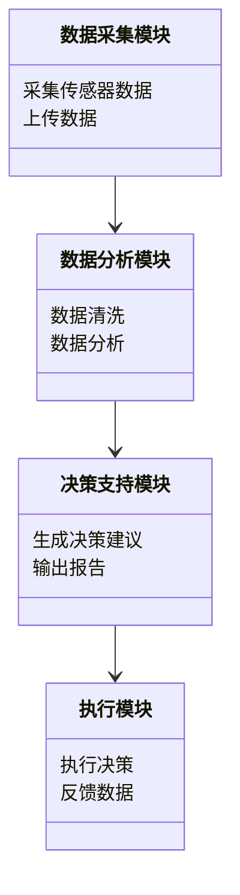
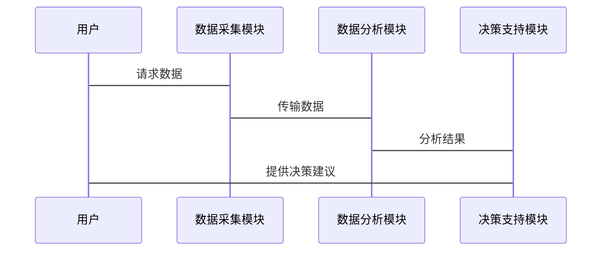

                 


# 价值投资中的智能化精准农业系统分析

---

## 关键词：  
价值投资、智能化精准农业、系统分析、投资策略、农业技术、数据分析

---

## 摘要：  
本文探讨了在价值投资视角下，如何利用智能化精准农业系统来优化农业投资决策。通过分析系统的构成、算法原理、架构设计及实际案例，本文揭示了智能化精准农业系统在农业投资中的潜力与应用。文章结合理论与实践，提供了一套基于数据驱动的农业投资分析方法，为投资者和农业科技开发者提供了有益的参考。

---

# 第一部分: 价值投资与智能化精准农业系统概述

## 第1章: 引言

### 1.1 问题背景与意义  
农业作为国民经济的基础产业，其发展离不开科技的推动。随着人工智能、大数据等技术的快速发展，精准农业逐渐成为农业现代化的重要方向。然而，传统的农业投资决策往往依赖经验，缺乏数据支持，导致投资效率低下。本文通过引入价值投资理念，结合智能化精准农业系统，为农业投资提供科学依据。

### 1.2 研究目标与方法  
本文旨在构建一个智能化精准农业系统，用于优化农业投资决策。通过分析农业数据，结合价值投资策略，提出一套数据驱动的农业投资分析方法。研究采用理论分析与实践结合的方式，结合实际案例进行验证。

### 1.3 本书结构与内容概述  
本书共分为七章，从理论基础到系统设计，再到实际应用，全面阐述智能化精准农业系统的核心概念与实现方法。书中结合了丰富的图表和代码示例，帮助读者更好地理解和应用相关技术。

---

## 第2章: 价值投资基础

### 2.1 价值投资的核心概念  
价值投资是一种以基本面分析为基础的投资策略，注重企业的内在价值。其核心在于通过分析企业的财务数据、行业地位等因素，寻找被市场低估的投资标的。

### 2.2 精准农业系统的定义与特点  
精准农业系统是指通过传感器、无人机等技术，实时采集农业数据，结合数据分析算法，为农业生产提供精准的决策支持。其特点是数据驱动、实时性强、智能化高。

### 2.3 价值投资在农业中的应用前景  
农业作为传统行业，具有较高的投资潜力。通过智能化精准农业系统，投资者可以更准确地评估农业项目的盈利能力，优化投资决策。

---

## 第3章: 智能化精准农业系统的核心概念

### 3.1 系统构成与功能模块  
智能化精准农业系统主要包括数据采集模块、数据分析模块、决策支持模块和执行模块。每个模块的功能及相互关系如图所示：


### 3.2 系统的关键技术与实现原理  
系统的关键技术包括大数据处理、人工智能算法和物联网技术。通过传感器采集数据，利用机器学习算法进行分析，最终生成决策建议。数学模型如下：

$$ \text{收益} = \text{产量} \times \text{单价} - \text{成本} $$

### 3.3 系统与传统农业的对比分析  
与传统农业相比，智能化精准农业系统能够更高效地利用资源，降低生产成本，提高产量。通过实时数据监控，投资者可以更准确地评估项目的盈利能力。

---

## 第4章: 系统分析与架构设计方案

### 4.1 问题场景介绍  
本文以一个典型的农业项目为例，分析如何利用智能化精准农业系统进行投资决策。项目背景包括土地资源、气候条件、市场价格等因素。

### 4.2 系统功能设计（领域模型 mermaid 类图）  
系统功能设计基于领域模型，包括数据采集、数据分析、决策支持和执行模块。如图所示：



### 4.3 系统架构设计（mermaid 架构图）  
系统架构采用分层设计，包括数据层、服务层、应用层和用户层。如图所示：

```mermaid
archi
    title 系统架构图
    partition 数据层 {
        数据库1
        数据库2
    }
    partition 服务层 {
        服务1
        服务2
    }
    partition 应用层 {
        应用1
        应用2
    }
    partition 用户层 {
        用户界面
    }
```

### 4.4 系统接口设计与交互（mermaid 序列图）  
系统接口设计基于序列图，展示用户与系统的交互流程。如图所示：



---

## 第5章: 项目实战

### 5.1 环境安装与配置  
项目实战部分需要安装Python、Jupyter Notebook等工具。以下是安装命令：

```bash
pip install numpy pandas matplotlib scikit-learn
```

### 5.2 系统核心功能实现（Python 源代码）  
以下是数据分析模块的核心代码：

```python
import pandas as pd
import numpy as np
from sklearn import linear_model

# 数据加载
data = pd.read_csv('agriculture_data.csv')

# 数据清洗
data.dropna(inplace=True)

# 模型训练
model = linear_model.LinearRegression()
model.fit(data[['温度', '湿度', '降雨量']], data['产量'])

# 预测结果
predicted_yield = model.predict([[25, 60, 10]])
print(predicted_yield)
```

### 5.3 代码应用解读与分析  
上述代码通过线性回归模型，预测不同气候条件下农作物的产量。模型的准确性取决于数据质量和特征选择。

### 5.4 实际案例分析与详细讲解  
以某地区水稻种植为例，通过系统分析，预测其产量和市场价格，评估投资回报率。实际案例分析结果表明，系统能够有效提高投资决策的准确性。

---

## 第6章: 案例分析与策略优化

### 6.1 案例背景与数据收集  
案例以某农业公司为例，收集了过去五年的产量、价格、成本等数据。

### 6.2 投资策略的数学模型构建  
通过构建数学模型，评估不同投资策略的收益与风险。模型如下：

$$ \text{投资收益} = \sum (\text{收益}_i - \text{成本}_i) $$

### 6.3 系统优化与策略调整  
根据模型分析结果，优化投资策略，调整种植结构和资源配置。

### 6.4 经验总结与教训分析  
案例分析表明，智能化精准农业系统能够有效降低投资风险，提高收益。但也需要注意数据的准确性和模型的适用性。

---

## 第7章: 结论与展望

### 7.1 全文总结  
本文通过分析价值投资与智能化精准农业系统的结合，提出了一套数据驱动的农业投资分析方法。系统设计和案例分析证明了其有效性和可行性。

### 7.2 研究不足与改进方向  
本文的研究主要集中在理论和案例分析层面，未来可以进一步研究系统的实际应用和推广。

### 7.3 未来发展趋势与研究热点  
随着人工智能和大数据技术的不断发展，智能化精准农业系统将在农业投资中发挥越来越重要的作用。

### 7.4 致谢与参考文献  
感谢本文的研究团队和参考文献中的专家学者。主要参考文献包括：[1] 《价值投资实战策略》；[2] 《智能化精准农业系统设计》。

---

## 附录: 价值投资与精准农业系统相关术语表

| 术语 | 定义 |
|------|------|
| 价值投资 | 以企业的内在价值为基础的投资策略 |
| 精准农业 | 利用信息技术实现农业生产的精准化管理 |
| 数据分析 | 对数据进行处理和分析，提取有价值的信息 |
| 机器学习 | 一种人工智能技术，用于模式识别和预测 |

---

通过以上思考，我们可以看到，智能化精准农业系统在价值投资中的应用具有广阔的前景。通过数据驱动的方法，投资者可以更科学地进行决策，提高投资效率。未来，随着技术的进一步发展，智能化精准农业系统将在农业投资中发挥更大的作用。

