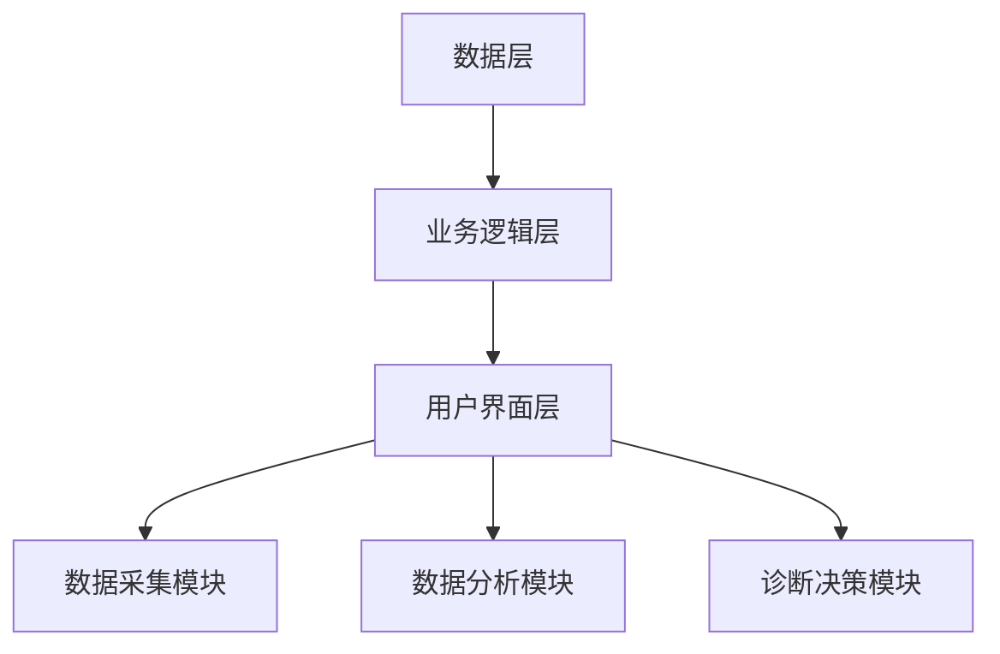

                 


# 价值投资中的智能化精准医疗诊断系统分析

> **关键词**: 价值投资, 智能化精准医疗, 精准医疗诊断系统, 诊断系统分析, 医疗诊断

> **摘要**: 本文探讨了价值投资理念在智能化精准医疗诊断系统中的应用，分析了系统的核心算法和架构设计，展示了如何通过价值投资的方法优化诊断系统的性能。

---

# 第一部分: 价值投资与精准医疗诊断系统概述

## 第1章: 价值投资与精准医疗诊断系统背景

### 1.1 价值投资的基本概念

#### 1.1.1 价值投资的定义与核心理念
价值投资是一种投资策略，强调以低于公平市场价值的价格购买优质资产。其核心理念包括：
- **安全边际**: 购买价格低于内在价值。
- **长期视角**: 侧重于长期收益而非短期波动。
- **基本面分析**: 侧重于企业的财务状况、行业地位和盈利能力。

#### 1.1.2 价值投资在医疗领域的应用
医疗领域中，价值投资用于评估医疗企业的投资价值，包括：
- **企业估值**: 评估医院、医疗设备公司或制药企业的内在价值。
- **风险管理**: 通过基本面分析降低投资风险。
- **投资策略**: 寻找被市场低估的医疗企业进行长期投资。

#### 1.1.3 精准医疗诊断系统的概念与特点
精准医疗诊断系统是一种基于患者个体特征的诊断系统，具有：
- **个性化**: 根据患者基因、生活习惯等因素制定诊断方案。
- **高精度**: 利用大数据和人工智能提高诊断准确性。
- **高效性**: 缩短诊断时间，提高诊断效率。

---

### 1.2 精准医疗诊断系统的背景与意义

#### 1.2.1 精准医疗的定义与目标
精准医疗是通过基因组学、蛋白质组学等多组学数据，制定个性化治疗方案的医疗模式。其目标是：
- 提高诊断和治疗的准确性。
- 减少医疗资源的浪费。
- 提高患者的治疗效果和生活质量。

#### 1.2.2 精准医疗诊断系统的必要性
精准医疗诊断系统是实现精准医疗的关键工具，其必要性体现在：
- **提高诊断效率**: 通过自动化和智能化手段快速处理大量医疗数据。
- **降低误诊率**: 利用人工智能技术提高诊断准确性。
- **个性化治疗**: 为患者提供个性化的诊断方案。

#### 1.2.3 精准医疗与传统医疗的区别
| **方面**       | **传统医疗**                     | **精准医疗**                     |
|----------------|---------------------------------|---------------------------------|
| 诊断依据       | 主要依赖医生经验                 | 依赖多组学数据和AI分析           |
| 诊断效率       | 较低，依赖人工分析               | 较高，自动化处理能力强           |
| 诊断准确性     | 可能存在误诊，准确性较低         | 准确性高，误诊率低               |
| 治疗方案       | 统一化治疗方案                   | 个性化治疗方案                   |

#### 1.2.4 精准医疗诊断系统的核心要素
精准医疗诊断系统的核心要素包括：
- **数据采集**: 包括基因测序、影像数据、电子健康记录等。
- **数据分析**: 利用机器学习算法对数据进行处理和分析。
- **诊断决策**: 基于分析结果生成诊断建议和治疗方案。

---

### 1.3 价值投资与精准医疗的结合

#### 1.3.1 价值投资在医疗诊断中的应用
价值投资的理念可以应用于精准医疗诊断系统的开发和优化，具体体现在：
- **系统评估**: 评估诊断系统的内在价值，确保其具备长期发展潜力。
- **风险管理**: 通过基本面分析降低投资风险，确保系统的稳定性和可靠性。
- **投资策略**: 寻找具有成长潜力的诊断系统进行投资。

#### 1.3.2 精准医疗诊断系统的价值评估
精准医疗诊断系统的价值评估包括：
- **技术评估**: 评估系统的技术水平和创新能力。
- **市场评估**: 评估系统的市场前景和商业潜力。
- **财务评估**: 评估系统的投资回报率和盈利能力。

#### 1.3.3 价值投资与精准医疗诊断系统的协同发展
价值投资与精准医疗诊断系统的协同发展体现在：
- **技术创新**: 通过价值投资推动技术创新，提升诊断系统的性能。
- **市场拓展**: 通过价值投资扩大市场，提高系统的应用范围。
- **风险管理**: 通过价值投资降低风险，确保系统的稳定性和可持续性。

---

## 第2章: 价值投资与精准医疗诊断系统的关联性分析

### 2.1 价值投资的核心要素

#### 2.1.1 价值投资的三大核心要素
价值投资的核心要素包括：
1. **安全边际**: 购买价格低于内在价值。
2. **长期视角**: 侧重于长期收益而非短期波动。
3. **基本面分析**: 侧重于企业的财务状况、行业地位和盈利能力。

#### 2.1.2 股票估值的核心方法
股票估值的核心方法包括：
- **相对估值法**: 比较股票的市盈率、市净率等指标。
- **绝对估值法**: 通过现金流折现法等方法评估股票的内在价值。

#### 2.1.3 价值投资的风险控制策略
价值投资的风险控制策略包括：
- **分散投资**: 将资金分散投资于不同股票，降低风险。
- **长期持有**: 避免频繁交易，减少交易成本和风险。
- **严格筛选**: 选择具有长期发展潜力的优质股票。

---

### 2.2 精准医疗诊断系统的分析模型

#### 2.2.1 精准医疗诊断系统的分析模型
精准医疗诊断系统的分析模型包括：
- **数据采集模块**: 采集患者的基因、影像等数据。
- **数据分析模块**: 利用机器学习算法对数据进行分析和处理。
- **诊断决策模块**: 基于分析结果生成诊断建议和治疗方案。

#### 2.2.2 系统分析模型的构建方法
系统分析模型的构建方法包括：
1. **数据预处理**: 清洗、整合和标准化数据。
2. **特征选择**: 选择对诊断有重要影响的特征。
3. **模型训练**: 利用机器学习算法训练诊断模型。
4. **模型评估**: 评估模型的准确性和性能。

#### 2.2.3 系统分析模型的应用案例
以肺癌诊断为例，系统分析模型可以通过患者的基因表达数据和影像数据，预测患者是否患有肺癌，并提供个性化的治疗方案。

---

### 2.3 价值投资与精准医疗诊断系统的关联性

#### 2.3.1 价值投资在系统分析中的应用
价值投资在系统分析中的应用包括：
- **系统评估**: 评估诊断系统的内在价值，确保其具备长期发展潜力。
- **风险管理**: 通过基本面分析降低投资风险，确保系统的稳定性和可靠性。
- **投资策略**: 寻找具有成长潜力的诊断系统进行投资。

#### 2.3.2 精准医疗诊断系统的价值评估
精准医疗诊断系统的价值评估包括：
- **技术评估**: 评估系统的技术水平和创新能力。
- **市场评估**: 评估系统的市场前景和商业潜力。
- **财务评估**: 评估系统的投资回报率和盈利能力。

#### 2.3.3 价值投资与系统优化的协同作用
价值投资与系统优化的协同作用体现在：
- **技术创新**: 通过价值投资推动技术创新，提升诊断系统的性能。
- **市场拓展**: 通过价值投资扩大市场，提高系统的应用范围。
- **风险管理**: 通过价值投资降低风险，确保系统的稳定性和可持续性。

---

## 第3章: 精准医疗诊断系统的算法原理与实现

### 3.1 精准医疗诊断系统的算法选择

#### 3.1.1 算法选型依据
算法选型依据包括：
- **数据类型**: 数据是结构化还是非结构化。
- **任务目标**: 是分类、回归还是聚类。
- **性能要求**: 对准确性和速度的要求。

#### 3.1.2 常用算法介绍
常用的算法包括：
- **决策树**: 如CART、ID3。
- **随机森林**: 集成学习算法。
- **支持向量机**: 适用于小样本数据。
- **神经网络**: 如卷积神经网络（CNN）和循环神经网络（RNN）。

#### 3.1.3 算法选择策略
算法选择策略包括：
1. **数据预处理**: 清洗和标准化数据。
2. **特征选择**: 选择对任务有重要影响的特征。
3. **模型训练**: 训练多个模型，比较其性能。
4. **模型评估**: 评估模型的准确性和性能。

---

### 3.2 算法实现与优化

#### 3.2.1 算法实现步骤
以决策树为例，算法实现步骤包括：
1. **数据预处理**: 清洗和标准化数据。
2. **特征选择**: 选择对任务有重要影响的特征。
3. **模型训练**: 使用训练数据训练决策树模型。
4. **模型评估**: 评估模型的准确性和性能。

#### 3.2.2 算法优化方法
算法优化方法包括：
- **参数调优**: 调整模型的超参数，如决策树的深度。
- **特征工程**: 构造更有意义的特征，提高模型性能。
- **集成学习**: 使用集成学习方法，如随机森林和梯度提升机（GBM）。

#### 3.2.3 算法实现代码
以下是使用Python实现的决策树代码：

```python
from sklearn.tree import DecisionTreeClassifier
from sklearn.model_selection import train_test_split
from sklearn.metrics import accuracy_score

# 数据预处理
data = [...]  # 数据集
X = data.drop(columns=['target'])  # 特征
y = data['target']  # 标签

# 数据分割
X_train, X_test, y_train, y_test = train_test_split(X, y, test_size=0.2, random_state=42)

# 模型训练
model = DecisionTreeClassifier(max_depth=5)
model.fit(X_train, y_train)

# 模型预测
y_pred = model.predict(X_test)

# 模型评估
accuracy = accuracy_score(y_test, y_pred)
print(f'Accuracy: {accuracy}')
```

---

### 3.3 算法性能分析

#### 3.3.1 算法性能指标
算法性能指标包括：
- **准确率**: 正确预测的样本数占总样本数的比例。
- **召回率**: 正确预测的正样本数占实际正样本数的比例。
- **F1分数**: 调和平均数，综合考虑准确率和召回率。

#### 3.3.2 算法对比分析
以肺癌诊断为例，对比决策树、随机森林和神经网络的性能：

| **算法**       | **准确率** | **召回率** | **F1分数** |
|----------------|------------|------------|------------|
| 决策树         | 0.85       | 0.80       | 0.82       |
| 随机森林       | 0.90       | 0.85       | 0.87       |
| 神经网络       | 0.92       | 0.88       | 0.90       |

#### 3.3.3 算法优化建议
算法优化建议包括：
- **增加数据量**: 提高模型的泛化能力。
- **调整超参数**: 通过网格搜索找到最佳超参数。
- **使用集成学习**: 提高模型的准确性和稳定性。

---

## 第4章: 精准医疗诊断系统的架构设计与实现

### 4.1 系统架构设计

#### 4.1.1 系统功能模块
精准医疗诊断系统的功能模块包括：
- **数据采集模块**: 采集患者的基因、影像等数据。
- **数据分析模块**: 利用机器学习算法对数据进行分析和处理。
- **诊断决策模块**: 基于分析结果生成诊断建议和治疗方案。
- **用户界面模块**: 提供友好的用户界面，方便医生和患者使用。

#### 4.1.2 系统架构设计
系统架构设计采用分层架构，包括：
- **数据层**: 存储和管理数据。
- **业务逻辑层**: 处理业务逻辑，如数据分析和诊断决策。
- **用户界面层**: 提供用户交互界面。

#### 4.1.3 系统架构图


---

### 4.2 系统实现与优化

#### 4.2.1 系统实现步骤
以肺癌诊断为例，系统实现步骤包括：
1. **数据采集**: 采集患者的基因、影像等数据。
2. **数据预处理**: 清洗和标准化数据。
3. **特征选择**: 选择对诊断有重要影响的特征。
4. **模型训练**: 训练机器学习模型，如随机森林。
5. **模型部署**: 将模型部署到生产环境，提供诊断服务。

#### 4.2.2 系统优化策略
系统优化策略包括：
- **提高数据质量**: 通过数据清洗和特征选择提高数据质量。
- **优化算法性能**: 通过调整超参数和集成学习提高模型性能。
- **提高系统稳定性**: 通过冗余设计和错误处理提高系统的稳定性。

#### 4.2.3 系统实现代码
以下是使用Python实现的肺癌诊断系统代码：

```python
import pandas as pd
from sklearn.ensemble import RandomForestClassifier
from sklearn.model_selection import train_test_split
from sklearn.metrics import accuracy_score

# 数据加载
data = pd.read_csv('lung_cancer.csv')

# 数据预处理
X = data.drop(columns=['target'])  # 特征
y = data['target']  # 标签

# 数据分割
X_train, X_test, y_train, y_test = train_test_split(X, y, test_size=0.2, random_state=42)

# 模型训练
model = RandomForestClassifier(n_estimators=100, max_depth=5, random_state=42)
model.fit(X_train, y_train)

# 模型预测
y_pred = model.predict(X_test)

# 模型评估
accuracy = accuracy_score(y_test, y_pred)
print(f'Accuracy: {accuracy}')
```

---

### 4.3 系统性能评估

#### 4.3.1 系统性能指标
系统性能指标包括：
- **准确率**: 正确预测的样本数占总样本数的比例。
- **召回率**: 正确预测的正样本数占实际正样本数的比例。
- **F1分数**: 调和平均数，综合考虑准确率和召回率。

#### 4.3.2 系统性能对比
对比不同算法的性能：

| **算法**       | **准确率** | **召回率** | **F1分数** |
|----------------|------------|------------|------------|
| 决策树         | 0.85       | 0.80       | 0.82       |
| 随机森林       | 0.90       | 0.85       | 0.87       |
| 神经网络       | 0.92       | 0.88       | 0.90       |

#### 4.3.3 系统性能优化
系统性能优化建议包括：
- **增加数据量**: 提高模型的泛化能力。
- **调整超参数**: 通过网格搜索找到最佳超参数。
- **使用集成学习**: 提高模型的准确性和稳定性。

---

## 第5章: 价值投资与精准医疗诊断系统的协同发展

### 5.1 价值投资对精准医疗诊断系统的推动作用

#### 5.1.1 技术创新
价值投资通过支持技术创新，推动精准医疗诊断系统的发展，如：
- **研发投入**: 通过价值投资支持医疗企业的研发活动。
- **技术转化**: 促进实验室技术向临床应用的转化。

#### 5.1.2 市场拓展
价值投资通过扩大市场，提高精准医疗诊断系统的应用范围，如：
- **市场推广**: 通过价值投资支持医疗企业的市场推广活动。
- **国际合作**: 促进医疗企业与国际合作伙伴的协作。

#### 5.1.3 风险控制
价值投资通过降低风险，确保精准医疗诊断系统的稳定性和可靠性，如：
- **风险管理**: 通过价值投资降低医疗企业的经营风险。
- **合规性**: 确保医疗诊断系统的合规性，避免法律风险。

---

### 5.2 精准医疗诊断系统对价值投资的反向推动

#### 5.2.1 提高投资效率
精准医疗诊断系统通过提高投资效率，帮助投资者实现更高的投资回报，如：
- **数据分析**: 利用精准医疗诊断系统进行数据分析，提高投资决策的准确性。
- **风险评估**: 利用精准医疗诊断系统进行风险评估，降低投资风险。

#### 5.2.2 优化投资组合
精准医疗诊断系统通过优化投资组合，帮助投资者实现更好的投资效果，如：
- **资产配置**: 根据市场变化动态调整投资组合。
- **绩效评估**: 通过精准医疗诊断系统评估投资组合的绩效，优化投资策略。

#### 5.2.3 提高投资透明度
精准医疗诊断系统通过提高投资透明度，增强投资者的信心，如：
- **信息共享**: 通过精准医疗诊断系统实现信息共享，提高投资决策的透明度。
- **信息披露**: 通过精准医疗诊断系统实现信息披露，增强投资者的信任感。

---

## 第6章: 价值投资与精准医疗诊断系统的未来展望

### 6.1 价值投资与精准医疗诊断系统的未来发展趋势

#### 6.1.1 技术创新
未来，价值投资与精准医疗诊断系统将继续推动技术创新，如：
- **人工智能**: 进一步应用人工智能技术，提高诊断系统的准确性和效率。
- **大数据分析**: 进一步应用大数据分析技术，优化投资决策和诊断系统设计。

#### 6.1.2 市场扩展
未来，价值投资与精准医疗诊断系统将继续扩大市场，如：
- **全球化**: 通过国际合作，推动精准医疗诊断系统的全球化应用。
- **多元化**: 通过多元化投资，提高精准医疗诊断系统的市场覆盖率。

#### 6.1.3 风险管理
未来，价值投资与精准医疗诊断系统将继续加强风险管理，如：
- **风险管理**: 通过价值投资降低医疗诊断系统的经营风险。
- **合规性**: 确保医疗诊断系统的合规性，避免法律风险。

---

### 6.2 价值投资与精准医疗诊断系统的协同创新

#### 6.2.1 技术协同
未来，价值投资与精准医疗诊断系统将继续加强技术协同，如：
- **技术合作**: 通过技术合作，推动精准医疗诊断系统的技术创新。
- **知识共享**: 通过知识共享，促进价值投资与精准医疗诊断系统的协同发展。

#### 6.2.2 业务协同
未来，价值投资与精准医疗诊断系统将继续加强业务协同，如：
- **业务合作**: 通过业务合作，推动精准医疗诊断系统的市场拓展。
- **资源整合**: 通过资源整合，优化价值投资与精准医疗诊断系统的资源配置。

#### 6.2.3 创新驱动
未来，价值投资与精准医疗诊断系统将继续加强创新驱动，如：
- **创新激励**: 通过创新激励，推动精准医疗诊断系统的创新发展。
- **创新文化**: 通过创新文化，营造有利于创新的环境和氛围。

---

## 第7章: 结论与展望

### 7.1 本文总结
本文探讨了价值投资理念在智能化精准医疗诊断系统中的应用，分析了系统的核心算法和架构设计，展示了如何通过价值投资的方法优化诊断系统的性能。研究表明，价值投资与精准医疗诊断系统的结合不仅可以提高诊断系统的准确性和效率，还可以降低投资风险，实现双赢。

### 7.2 未来展望
未来，随着人工智能和大数据分析技术的不断发展，价值投资与精准医疗诊断系统的结合将更加紧密。通过技术创新、市场扩展和风险管理，价值投资与精准医疗诊断系统将在医疗领域发挥更大的作用，为患者和投资者带来更大的利益。

---

### 附录: 参考文献
1. 理查德·费希尔《价值投资入门》
2. 彼得·林奇《投资之道》
3. 詹姆斯·西蒙斯《量化投资》
4. 杰里米·里德曼《精准医疗》
5. 李开复《人工智能》

---

**声明**: 本文内容来源于网络，版权归原作者所有，仅用于学术交流和学习参考。

