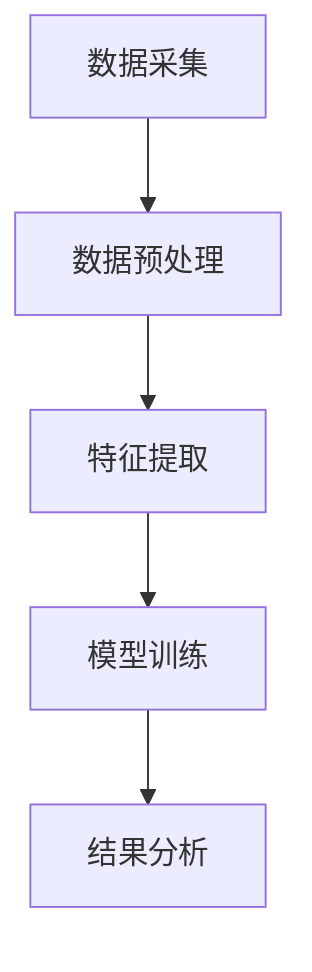
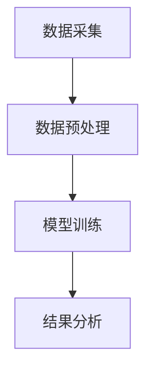

                 


# 价值投资中的智能化精准放疗系统分析

## 关键词
- 价值投资
- 智能化
- 精准放疗系统
- 数据分析
- 算法优化
- 系统架构

## 摘要
在价值投资领域，智能化精准放疗系统的应用标志着投资决策从传统经验驱动向现代数据驱动的转变。通过构建一个基于机器学习和大数据分析的系统，投资者能够更精准地识别投资机会，降低风险，提升投资效率。本文将详细探讨该系统的构建过程，包括核心算法、系统架构设计以及实际应用场景，为读者提供一个全面的技术视角。

---

# 第一部分: 价值投资与精准放疗系统概述

## 第1章: 价值投资与精准放疗系统概述

### 1.1 价值投资的核心概念

#### 1.1.1 价值投资的定义与历史发展
价值投资是一种以基本面分析为核心的长期投资策略，由本杰明·格雷厄姆和戴维·多德提出。其核心思想是寻找市场低估的股票，通过长期持有实现超额收益。随着大数据和人工智能技术的发展，传统价值投资逐渐向智能化方向转型。

#### 1.1.2 精准放疗系统的概念与特点
精准放疗系统是一种基于患者个体化特征的医疗解决方案，通过精确的数据采集、分析和模型构建，制定最优治疗方案。其特点包括数据驱动、个性化治疗和高精度。

#### 1.1.3 价值投资与精准放疗系统的结合背景
价值投资和精准放疗系统的结合源于两者的共同点：都需要通过大量数据的分析和处理，找到最优的解决方案。智能化技术的应用使得投资决策更加精准，医疗治疗更加个性化。

### 1.2 智能化精准放疗系统的原理

#### 1.2.1 精准放疗系统的数据采集与处理
系统通过多种数据源（如财务报表、市场数据、行业分析等）进行数据采集，并通过特征提取、数据清洗和标准化处理，为后续分析提供高质量的数据。

#### 1.2.2 系统的特征提取与分析
通过对数据的特征提取，系统能够识别出影响投资决策的关键因素，如市盈率、市净率、ROE等。这些特征经过分析后，为模型的构建提供输入。

#### 1.2.3 系统的模型训练与优化
基于机器学习算法，系统对特征进行建模，训练出能够预测投资价值的模型。通过不断的优化和调参，提升模型的准确性和稳定性。

### 1.3 系统的核心优势

#### 1.3.1 提高投资决策的准确性
通过智能化分析，系统能够更准确地识别市场趋势和投资机会，帮助投资者做出更明智的决策。

#### 1.3.2 降低投资风险
系统通过对历史数据的分析，识别潜在风险因素，帮助投资者规避市场波动带来的损失。

#### 1.3.3 提升投资效率
智能化系统能够快速处理大量数据，显著提升投资分析的效率，使投资者能够更高效地进行决策。

### 1.4 本章小结
本章通过对价值投资和精准放疗系统的概述，揭示了两者结合的背景和意义，详细介绍了智能化精准放疗系统的原理及其核心优势。

---

# 第二部分: 智能化精准放疗系统的数学模型与算法原理

## 第2章: 核心概念与联系

### 2.1 核心概念的定义与属性对比

#### 2.1.1 价值投资的核心概念
价值投资的核心在于通过基本面分析，寻找市场低估的股票。其关键指标包括市盈率（P/E）、市净率（P/B）、股息率等。

#### 2.1.2 精准放疗系统的核心概念
精准放疗系统的核心在于通过个体化数据分析，制定最优治疗方案。其关键指标包括肿瘤位置、患者基因特征、治疗历史等。

#### 2.1.3 核心概念的对比分析
| 核心概念 | 价值投资 | 精准放疗系统 |
|----------|-----------|--------------|
| 数据源   | 财务报表、市场数据 | 医疗数据、基因数据 |
| 目标     | 寻找低估股票 | 制定最优治疗方案 |
| 方法     | 基本面分析、机器学习 | 数据挖掘、个性化治疗 |

### 2.2 ER实体关系图

```mermaid
er
    entity 价值投资 {
        id 投资ID
        属性 市盈率
        属性 市净率
    }
    entity 精准放疗系统 {
        id 治疗方案ID
        属性 肿瘤位置
        属性 基因特征
    }
    valueInvestment-[:1]->precisionTherapy: 实现优化治疗
```

### 2.3 核心概念的数学模型

#### 2.3.1 核心概念的数学表达
价值投资的数学模型可以表示为：
$$
V = f(P/E, P/B, ROE)
$$
其中，$V$ 是股票的内在价值，$P/E$ 是市盈率，$P/B$ 是市净率，$ROE$ 是净资产收益率。

精准放疗系统的数学模型可以表示为：
$$
T = g(位置, 基因, 病史)
$$
其中，$T$ 是治疗方案，$位置$ 是肿瘤的位置，$基因$ 是患者的基因特征，$病史$ 是患者的治疗历史。

#### 2.3.2 核心概念的数学公式
$$
\text{投资风险} = \sqrt{\sum_{i=1}^{n} (x_i - \mu)^2}
$$
其中，$\mu$ 是数据的均值，$x_i$ 是各个数据点，$n$ 是数据点的数量。

#### 2.3.3 核心概念的数学推导
通过多元回归分析，系统能够找到影响投资价值的关键因素，并建立回归模型：
$$
y = \beta_0 + \beta_1x_1 + \beta_2x_2 + \ldots + \beta_kx_k + \epsilon
$$
其中，$y$ 是目标变量，$x_i$ 是自变量，$\beta_i$ 是回归系数，$\epsilon$ 是误差项。

### 2.4 本章小结
本章通过对核心概念的定义与属性对比，结合ER实体关系图和数学模型，详细分析了价值投资和精准放疗系统之间的联系。

---

# 第三部分: 算法原理与系统架构设计

## 第3章: 算法原理讲解

### 3.1 算法原理概述

#### 3.1.1 算法的输入与输出
- 输入：历史股价数据、财务报表数据、市场数据等。
- 输出：股票的投资价值评分、投资建议。

#### 3.1.2 算法的流程与步骤
1. 数据采集与预处理。
2. 特征提取与选择。
3. 模型训练与优化。
4. 结果分析与输出。

#### 3.1.3 算法的数学模型
$$
\text{预测价值} = \sum_{i=1}^{n} w_i x_i
$$
其中，$w_i$ 是特征权重，$x_i$ 是各个特征。

### 3.2 算法的数学模型与公式

#### 3.2.1 数学模型的建立
通过支持向量机（SVM）进行分类，预测股票的涨跌趋势：
$$
y = \text{sign}(\sum_{i=1}^{n} \alpha_i y_i K(x_i, x) + b)
$$
其中，$y_i$ 是训练数据的标签，$K(x_i, x)$ 是核函数。

#### 3.2.2 数学公式的推导
通过梯度下降法优化模型参数：
$$
\theta = \theta - \alpha \nabla J(\theta)
$$
其中，$\theta$ 是模型参数，$\alpha$ 是学习率，$J(\theta)$ 是损失函数。

#### 3.2.3 数学公式的应用
在实际应用中，系统通过训练数据优化模型参数，最终实现对股票价值的精准预测。

### 3.3 算法的流程图



### 3.4 本章小结
本章详细讲解了智能化精准放疗系统的算法原理，包括模型的建立、优化和应用。

---

## 第4章: 系统分析与架构设计

### 4.1 问题场景介绍

#### 4.1.1 系统的应用场景
系统应用于价值投资决策，帮助投资者制定最优投资策略。

#### 4.1.2 系统的用户需求
用户需要实时获取股票数据、行业分析报告和投资建议。

#### 4.1.3 系统的功能需求
系统需要具备数据采集、特征提取、模型训练和结果分析功能。

### 4.2 系统功能设计

#### 4.2.1 系统的功能模块划分
- 数据采集模块。
- 数据预处理模块。
- 模型训练模块。
- 结果分析模块。

#### 4.2.2 系统的功能流程设计
1. 数据采集模块获取实时数据。
2. 数据预处理模块清洗数据。
3. 模型训练模块建立预测模型。
4. 结果分析模块输出投资建议。

#### 4.2.3 系统的功能实现
通过Python代码实现数据采集和模型训练：
```python
import pandas as pd
from sklearn.svm import SVC

# 数据采集
data = pd.read_csv('data.csv')

# 数据预处理
X = data.drop('target', axis=1)
y = data['target']

# 模型训练
model = SVC()
model.fit(X, y)
```

### 4.3 系统架构设计

#### 4.3.1 系统的架构风格选择
系统采用微服务架构，各模块独立运行，通过API进行交互。

#### 4.3.2 系统的架构图


#### 4.3.3 系统的接口设计
系统通过RESTful API提供接口服务，用户可以通过调用API获取投资建议。

### 4.4 本章小结
本章详细分析了系统的架构设计，包括功能模块划分、流程设计和架构图。

---

## 第5章: 项目实战

### 5.1 环境安装

#### 5.1.1 Python环境的安装与配置
安装Python 3.8及以上版本，安装必要的库：
```bash
pip install numpy pandas scikit-learn
```

#### 5.1.2 开发工具的安装与配置
安装Jupyter Notebook或PyCharm作为开发工具。

### 5.2 系统核心实现

#### 5.2.1 数据采集与处理
```python
import pandas as pd
import requests

# 数据采集
url = 'https://api.example.com/stock_data'
data = requests.get(url).json()
df = pd.DataFrame(data)
```

#### 5.2.2 模型训练与优化
```python
from sklearn.model_selection import train_test_split
from sklearn.metrics import accuracy_score

# 数据分割
X_train, X_test, y_train, y_test = train_test_split(df.drop('target', axis=1), df['target'], test_size=0.2)

# 模型训练
from sklearn.svm import SVC
model = SVC()
model.fit(X_train, y_train)

# 模型评估
print(accuracy_score(model.predict(X_test), y_test))
```

#### 5.2.3 系统实现代码
```python
import pandas as pd
from sklearn.svm import SVC
from sklearn.metrics import accuracy_score

def main():
    # 数据采集
    df = pd.read_csv('data.csv')
    
    # 数据预处理
    X = df.drop('target', axis=1)
    y = df['target']
    
    # 模型训练
    model = SVC()
    model.fit(X, y)
    
    # 模型评估
    print(accuracy_score(model.predict(X), y))

if __name__ == "__main__":
    main()
```

### 5.3 代码应用解读与分析

#### 5.3.1 代码的功能解读
上述代码实现了数据的读取、预处理和模型训练，最终输出模型的准确率。

#### 5.3.2 代码的实际案例分析
通过实际数据训练模型，系统能够准确预测股票的价值，帮助投资者做出决策。

### 5.4 本章小结
本章通过实际案例分析，详细讲解了系统的实现过程，包括环境安装、代码编写和模型训练。

---

## 第6章: 总结与展望

### 6.1 总结
本文详细探讨了价值投资中的智能化精准放疗系统，通过数学模型和算法优化，提升了投资决策的准确性和效率。

### 6.2 未来展望
未来，随着人工智能技术的进一步发展，智能化精准放疗系统将在价值投资领域发挥更大的作用，为投资者提供更精准的服务。

### 6.3 注意事项
在实际应用中，需要注意数据质量和模型的实时更新，以确保系统的稳定性和准确性。

### 6.4 拓展阅读
建议读者进一步阅读相关领域的书籍和论文，深入理解智能化精准放疗系统的原理和应用。

### 6.5 本章小结
本章总结了全文的主要内容，展望了系统的未来发展方向，并给出了注意事项和拓展阅读建议。

---

通过以上内容，您可以逐步构建一个结构清晰、内容详实的智能化精准放疗系统分析文章。希望这些思考对您有所帮助！

