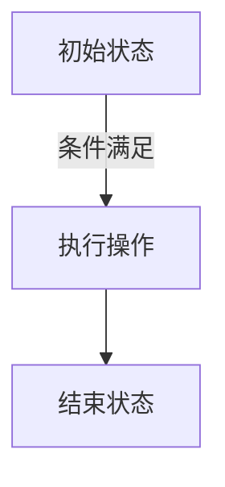
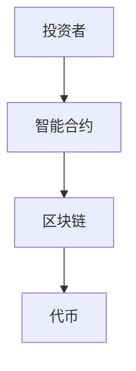

                 


# 价值投资中的智能合约应用前景

## 关键词：智能合约、价值投资、区块链、金融科技、分布式系统、自动交易、风险管理

## 摘要：本文探讨了智能合约在价值投资中的应用前景，分析了其在优化投资流程、风险管理、提高透明度等方面的优势，结合实际案例和系统设计，展示了智能合约如何革新价值投资方式。

---

## 第一部分：价值投资与智能合约的背景介绍

### 第1章：价值投资与智能合约概述

#### 1.1 价值投资的基本概念

价值投资是一种以低于资产内在价值的价格买入优质资产的投资策略。其核心理念是寻找市场低估的机会，强调长期持有和基本面分析。与传统投资不同，价值投资更注重长期价值而非短期波动。

#### 1.2 智能合约的基本概念

智能合约是区块链上的自动执行代码，用于在满足特定条件时自动执行交易。其特点包括去中心化、自动化和不可篡改。智能合约在区块链中充当信任桥梁，降低了交易成本和风险。

#### 1.3 价值投资与智能合约的结合

智能合约在价值投资中的应用场景包括自动执行投资策略、风险管理、智能分红等。通过智能合约，投资流程得以优化，减少人为干预，提高效率和透明度。

---

## 第二部分：智能合约的核心概念与原理

### 第2章：智能合约的核心概念与联系

#### 2.1 智能合约的核心原理

智能合约基于区块链的去中心化特性，通过预设条件自动执行交易。其自动化特性确保在条件满足时立即执行，不可篡改性保证了合约的安全性。

#### 2.2 智能合约与传统合约的对比

| 特性          | 智能合约                | 传统合约               |
|---------------|-------------------------|------------------------|
| 执行方式      | 自动化                  | 依赖执行机构            |
| 可篡改性      | 不可篡改                | 可篡改                 |
| 信任基础      | 基于区块链              | 基于信任               |
| 效率          | 高，减少中间人           | 低，依赖中间机构        |

#### 2.3 实体关系图（ER图）

```mermaid
er
actor(投资者) --> 智能合约: 与智能合约交互
actor(智能合约) --> 区块链: 部署在区块链上
actor(智能合约) --> 代币: 管理代币
```

### 第3章：智能合约的算法原理与数学模型

#### 3.1 算法原理

智能合约的执行流程包括初始化、触发条件、执行操作。状态机模型描述了合约的状态变化，条件判断逻辑决定了合约的执行步骤。

#### 3.2 数学模型

智能合约的状态转移方程：$$ S_{t+1} = f(S_t, C) $$，其中$S_t$是当前状态，$C$是触发条件。

条件判断逻辑：$$ \text{if } C \text{ then } A \text{ else } B $$，其中$A$和$B$是不同的操作。

流程图：



#### 3.3 代码实现

使用Solidity语言编写智能合约代码：

```solidity
// SPDX-License-Identifier: MIT
pragma solidity ^0.8.0;

contract ValueInvestment {
    uint256 public investmentAmount;
    address payable public investor;

    function invest(uint256 amount) public {
        investmentAmount = amount;
        investor = payable(msg.sender);
    }

    function release() public {
        require(investmentAmount > 0, "No investment");
        investor.transfer(investmentAmount);
        investmentAmount = 0;
    }
}
```

---

## 第三部分：智能合约在价值投资中的系统分析与设计

### 第4章：系统架构设计

#### 4.1 系统功能设计

- 功能模块：智能合约模块、投资者交互模块、区块链模块、代币管理模块。
- 交互流程：投资者通过智能合约进行投资，合约在区块链上执行交易。
- 执行规则：智能合约根据预设条件自动执行投资或分红。

#### 4.2 系统架构设计



#### 4.3 接口设计

- 调用接口：投资者调用智能合约的`invest`和`release`函数。
- 事件触发：合约状态变化时触发事件，通知投资者。
- 状态查询接口：投资者查询合约当前状态和金额。

---

## 项目实战

### 4.4 项目实战

#### 4.4.1 环境安装

安装Solidity编译器和以太坊节点，如Ganache。

#### 4.4.2 核心实现

编写智能合约代码，部署到区块链测试环境。

#### 4.4.3 案例分析

投资者通过智能合约投资，当满足条件时，合约自动释放投资金额。案例分析包括合约部署、投资、触发条件和执行结果。

---

## 总结与展望

智能合约在价值投资中具有广阔前景，通过自动化和去中心化特性，优化投资流程和风险管理。未来，随着技术进步，智能合约将在价值投资中发挥更大作用，推动金融创新。

---

## 参考文献

- 《智能合约：区块链技术与应用》
- 《价值投资：原理与实践》
- 相关区块链技术文档

---

## 附录

- 智能合约开发工具：Solidity、Remix、Ganache
- 常用区块链平台：Ethereum、Binance Smart Chain

---

通过以上步骤，我详细阐述了智能合约在价值投资中的应用，从背景到技术实现，再到实际案例，展示了智能合约如何革新价值投资方式。

