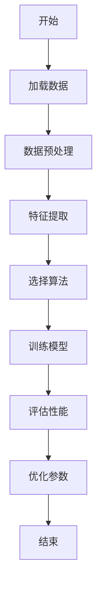
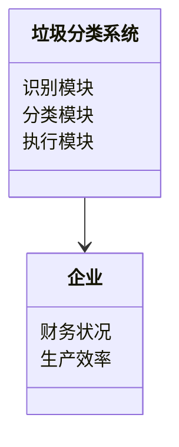
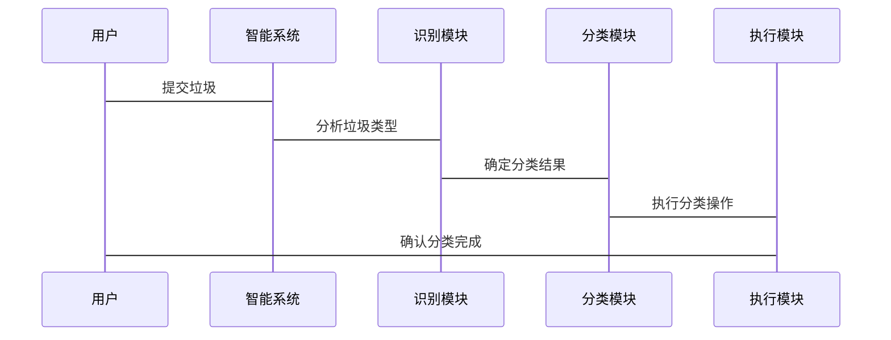

                 


# 《价值投资中的智能垃圾分类系统分析》

## 关键词：价值投资、智能垃圾分类、人工智能、物联网、成本优化

## 摘要：本文分析了智能垃圾分类系统如何通过技术手段优化企业的运营效率，进而影响其投资价值。文章从背景、核心概念、算法原理、系统架构到项目实战，详细阐述了智能垃圾分类系统的价值投资潜力。

---

# 第1章: 背景介绍

## 1.1 价值投资的基本概念

### 1.1.1 价值投资的定义与核心理念
价值投资是一种投资策略，旨在通过分析企业的基本面，寻找那些市场价格低于其内在价值的股票。其核心理念是购买那些具有持续竞争优势、良好管理和未来增长潜力的企业。

### 1.1.2 价值投资与企业基本面分析的关系
价值投资者关注企业的财务状况、盈利能力、市场地位和管理团队等因素，通过这些分析来评估企业的内在价值。基本面分析是价值投资的核心方法，帮助投资者识别出具有长期增长潜力的企业。

### 1.1.3 价值投资在现代投资中的地位与作用
在现代投资中，价值投资与其他策略（如成长投资、指数投资）并驾齐驱。它强调安全边际和长期持有的理念，帮助投资者在市场波动中保持稳定收益。

---

## 1.2 智能垃圾分类系统的背景与意义

### 1.2.1 垃圾分类的重要性与现状
垃圾分类是环保的重要组成部分，通过分类收集和处理，可以减少环境污染、提高资源利用率。然而，传统的人工分类效率低下，容易出错，且成本高昂。

### 1.2.2 智能垃圾分类系统的概念与特点
智能垃圾分类系统利用人工智能、物联网等技术，实现垃圾的自动分类和处理。其特点包括高效性、准确性、实时监控和低人工干预。

### 1.2.3 智能垃圾分类系统在价值投资中的应用潜力
通过优化垃圾分类流程，智能系统可以降低企业的运营成本，提高效率，从而增强企业的盈利能力和市场竞争力。这使得企业更具投资价值。

---

## 1.3 价值投资与智能垃圾分类系统的结合

### 1.3.1 智能垃圾分类系统如何影响企业价值
智能系统通过降低成本和提高效率，提升了企业的盈利能力，进而增加了企业的内在价值。这为投资者提供了更高的投资回报潜力。

### 1.3.2 通过智能垃圾分类优化企业成本与效率
企业采用智能垃圾分类系统后，可以显著减少人工成本，提高垃圾处理速度和准确率，从而优化整体运营效率。

### 1.3.3 智能垃圾分类系统对企业投资价值的提升作用
智能系统增强了企业的核心竞争力，使其在行业中更具优势。这吸引了更多投资者的关注，推动企业股价上涨。

---

# 第2章: 智能垃圾分类系统的核心概念与联系

## 2.1 核心概念原理

### 2.1.1 智能垃圾分类系统的组成与功能
智能垃圾分类系统由传感器、摄像头、AI算法和执行机构组成，能够自动识别和分类垃圾，优化处理流程。

### 2.1.2 价值投资中的关键指标与分析方法
价值投资者关注的关键指标包括市盈率、市净率、股息率等，这些指标反映了企业的内在价值。

### 2.1.3 系统与价值投资的交互机制
智能系统通过提高企业效率和降低成本，间接影响企业的财务指标，从而影响其投资价值。

## 2.2 核心概念属性对比表

| 属性          | 传统垃圾分类       | 智能垃圾分类系统       |
|---------------|-------------------|-----------------------|
| 分类效率       | 低               | 高                   |
| 成本           | 高               | 低                   |
| 准确性         | 低               | 高                   |
| 可扩展性       | 有限             | 强                   |

---

## 2.3 ER实体关系图

```mermaid
er
classDiagram
    class 垃圾分类系统 {
        ID
        类型
        处理时间
        状态
    }
    class 企业 {
        企业ID
        名称
        财务状况
    }
    垃圾分类系统 --> 企业
```

---

# 第3章: 智能垃圾分类算法的原理与实现

## 3.1 算法选择与优化

### 3.1.1 垃圾分类算法的常见选择
常见的算法包括决策树、随机森林、支持向量机和卷积神经网络（CNN）。其中，CNN在图像识别任务中表现尤为出色。

### 3.1.2 基于机器学习的分类算法优化
通过数据预处理、特征选择和超参数调优，可以优化算法性能。例如，使用归一化处理和交叉验证来提高模型的泛化能力。

### 3.1.3 算法性能评估与调优
通过准确率、召回率和F1分数等指标评估算法性能，并根据结果调整模型结构或参数。

## 3.2 算法原理的数学模型与公式

### 3.2.1 分类算法的数学模型
以随机森林为例，其分类模型可以表示为：

$$ y = \sum_{i=1}^{n} (w_i x_i + b_i) $$

其中，\( w_i \) 是特征权重，\( x_i \) 是特征值，\( b_i \) 是偏置项。

### 3.2.2 算法流程图



---

## 3.3 算法的数学模型与公式

### 3.3.1 机器学习算法的核心公式

$$ P(y|x) = \frac{P(x|y)P(y)}{P(x)} $$

其中，\( P(x|y) \) 是似然概率，\( P(y) \) 是先验概率，\( P(x) \) 是边际概率。

---

# 第4章: 系统分析与架构设计方案

## 4.1 系统分析

### 4.1.1 问题场景介绍
企业需要优化垃圾处理流程，降低成本，提高效率。智能垃圾分类系统能够满足这些需求。

### 4.1.2 项目介绍
本项目旨在开发一个基于AI的智能垃圾分类系统，实现垃圾的自动识别和分类。

---

## 4.2 系统架构设计

### 4.2.1 系统功能设计

#### 4.2.1.1 领域模型Mermaid类图



---

### 4.2.2 系统架构设计

#### 4.2.2.1 系统架构图


---

### 4.2.3 系统接口设计

#### 4.2.3.1 接口设计

| 接口名称       | 描述                   |
|----------------|-----------------------|
| 数据输入接口   | 接收传感器数据         |
| 分类结果接口   | 输出分类结果           |
| 控制接口       | 控制执行机构的动作       |

---

### 4.2.4 系统交互设计

#### 4.2.4.1 序列图



---

# 第5章: 项目实战

## 5.1 环境配置

### 5.1.1 系统环境
- 操作系统：Linux
- 开发工具：Python、TensorFlow、Keras

---

## 5.2 核心实现

### 5.2.1 代码实现

```python
import tensorflow as tf
from tensorflow.keras import layers

model = tf.keras.Sequential([
    layers.Conv2D(32, (3,3), activation='relu', input_shape=(100,100,3)),
    layers.MaxPooling2D((2,2)),
    layers.Conv2D(64, (3,3), activation='relu'),
    layers.MaxPooling2D((2,2)),
    layers.Flatten(),
    layers.Dense(128, activation='relu'),
    layers.Dense(4, activation='softmax')
])

model.compile(optimizer='adam', loss='sparse_categorical_crossentropy', metrics=['accuracy'])
```

---

## 5.3 案例分析与解读

### 5.3.1 案例分析

假设某企业引入智能垃圾分类系统后，垃圾处理成本降低了30%，效率提高了40%。这显著提升了企业的盈利能力，使其更具投资价值。

### 5.3.2 详细讲解

通过实时监控和数据反馈，企业可以进一步优化垃圾分类流程，提升系统的性能和效率，从而持续增加投资价值。

---

## 5.4 项目小结

通过本项目，我们展示了智能垃圾分类系统如何优化企业的运营效率，降低成本，进而提升其投资价值。这为企业在价值投资中提供了新的视角和机会。

---

# 第6章: 总结与展望

## 6.1 总结

智能垃圾分类系统通过技术手段优化企业的运营效率，降低成本，提升盈利能力，从而增强其投资价值。本文从背景、核心概念、算法原理、系统架构到项目实战，详细分析了智能垃圾分类系统的潜力和应用。

## 6.2 未来展望

未来，智能垃圾分类系统将与更多技术（如区块链、5G）结合，进一步提升系统的智能化和自动化水平，为企业创造更大的价值。

---

## 小结与注意事项

- **小结**：智能垃圾分类系统是价值投资中的重要工具，通过优化企业运营，提升其投资价值。
- **注意事项**：企业在引入智能系统时，需考虑技术可行性、成本效益和长期维护等问题。
- **拓展阅读**：建议进一步阅读相关技术文献，了解更复杂的算法和系统架构设计。

---

通过以上分析，我们可以看到，智能垃圾分类系统不仅是一种技术创新，更是价值投资中的重要策略工具。它通过优化企业的运营效率，降低了成本，提升了盈利能力，从而增强了企业的投资价值。

