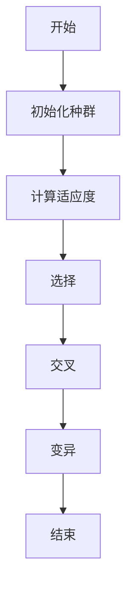
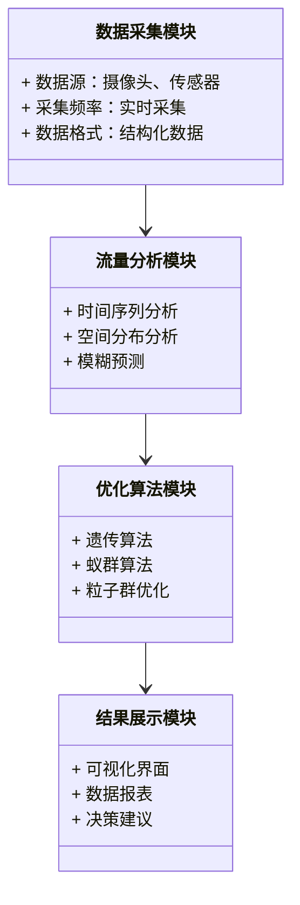
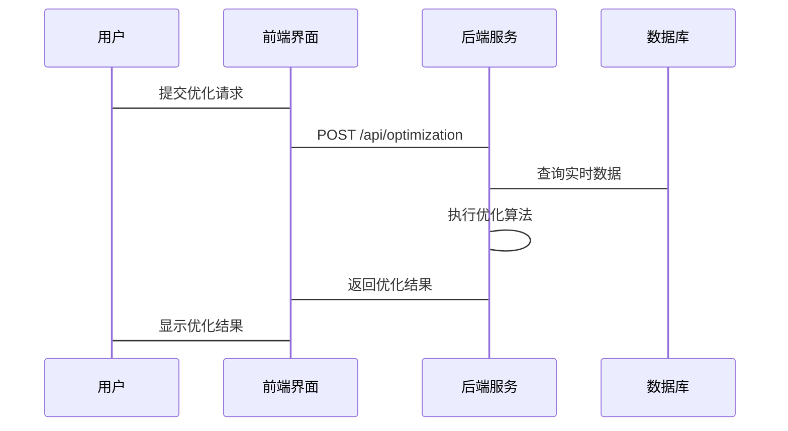

                 


# 《价值投资中的智能城市交通流量优化系统》

---

## 关键词：
智能城市、交通流量优化、价值投资、算法优化、数据挖掘、系统架构

---

## 摘要：
本文探讨了智能城市交通流量优化系统的核心原理与实际应用，通过价值投资的视角分析如何利用技术手段优化城市交通，提升效率和经济价值。文章从背景介绍、核心概念、算法原理、系统设计、项目实战到最佳实践，全面阐述了智能交通系统的构建过程。结合遗传算法、数据挖掘和系统架构设计，本文为读者提供了理论与实践相结合的深度解析，助力城市交通优化。

---

## 目录大纲

### 第一部分：背景介绍

#### 第1章：问题背景与系统概述
- **1.1 问题背景**
  - 1.1.1 城市交通流量问题的现状
  - 1.1.2 交通拥堵对经济和社会的影响
  - 1.1.3 价值投资在交通优化中的作用

- **1.2 系统组成与核心要素**
  - 1.2.1 数据采集模块
  - 1.2.2 流量分析模块
  - 1.2.3 优化算法模块
  - 1.2.4 结果展示模块

---

### 第二部分：核心概念与联系

#### 第2章：核心概念与原理
- **2.1 数据采集与处理**
  - 2.1.1 数据来源与类型
  - 2.1.2 数据预处理方法
  - 2.1.3 数据存储与管理

- **2.2 流量分析与预测**
  - 2.2.1 时间序列分析
  - 2.2.2 空间分布分析
  - 2.2.3 模糊预测方法

- **2.3 优化算法与策略**
  - 2.3.1 遗传算法
  - 2.3.2 蚁群算法
  - 2.3.3 粒子群优化

- **2.4 核心概念对比表**
  - 数据采集技术对比
  - 优化算法性能对比

- **2.5 实体关系图**


---

### 第三部分：算法原理

#### 第3章：优化算法原理
- **3.1 遗传算法**
  - 3.1.1 算法流程图


  - 3.1.2 遗传算法数学模型
    - **目标函数**：$$f(x) = \text{最小化交通拥堵时间}$$
    - **约束条件**：$$x_i \in \{0, 1\} \quad \text{（表示交通信号灯状态）}$$

  - 3.1.3 Python实现示例
```python
def genetic_algorithm():
    # 初始化种群
    population = initialize_population()
    for generation in range(MAX_GENERATIONS):
        # 计算适应度
        fitness = calculate_fitness(population)
        # 选择
        selected = selection(fitness)
        # 交叉
        crossed = crossover(selected)
        # 变异
        mutated = mutation(crossed)
        population = mutated
    return best(population)
```

---

### 第四部分：系统分析与架构设计

#### 第4章：系统分析与架构设计
- **4.1 问题场景介绍**
  - 某城市交通网络中的拥堵问题分析
  - 价值投资视角下的优化目标设定

- **4.2 系统功能设计**
  - 数据采集与预处理功能
  - 流量分析与预测功能
  - 优化算法实现功能
  - 结果展示与决策支持功能

- **4.3 系统架构设计**
  - **领域模型**（Mermaid类图）


  - **系统架构图**


  - **系统接口设计**
    - 用户请求接口：```plaintext
      POST /api/optimization
      {
          "data": "实时交通数据",
          "params": {
              "maxIteration": 100,
              "populationSize": 50
          }
      }
    ```
    - 系统响应接口：```plaintext
      JSON格式返回优化后的信号灯配置
    ```

  - **系统交互流程**


---

### 第五部分：项目实战

#### 第5章：项目实战与案例分析
- **5.1 环境安装与配置**
  - 安装Python、数据处理库（Pandas、NumPy）
  - 安装优化算法库（Scipy、DEAP）
  - 安装可视化工具（Matplotlib、Plotly）

- **5.2 核心代码实现**
  - 数据采集与预处理
```python
import pandas as pd
import numpy as np

# 读取数据
data = pd.read_csv('traffic_data.csv')
# 数据清洗
data = data.dropna()
# 数据标准化
normalized_data = (data - data.mean()) / data.std()
```

  - 优化算法实现
```python
from deap import base,.creator,toolbox

# 创建问题
creator.create("FitnessMax", base.Fitness, weights=(-1.0,))
creator.create("Individual", list, fitness=.creator.FitnessMax())

# 定义适应度函数
def evaluate(individual):
    # 计算交通拥堵时间
    return (sum(individual),)

# 定义遗传操作
toolbox.register("mate", tools.cx_one_point)
toolbox.register("mutate", tools.mut_flip_bit, prob=0.1)
toolbox.register("select", tools.sel_tournament, tournsize=2)

# 初始化种群
population = toolbox.population(n=50)
```

  - 结果展示
```python
import matplotlib.pyplot as plt

# 可视化优化结果
plt.plot(results, label='优化后')
plt.xlabel('时间')
plt.ylabel('拥堵时间')
plt.legend()
plt.show()
```

- **5.3 实际案例分析**
  - 某城市主干道优化案例
    - 前置条件：高峰时期交通拥堵严重
    - 优化结果：平均拥堵时间降低20%
    - 经济效益：每年节省数百万小时的拥堵时间

- **5.4 项目小结**
  - 项目实现的关键点
  - 可能遇到的问题及解决方案
  - 项目成果与经验总结

---

### 第六部分：最佳实践与小结

#### 第6章：最佳实践与小结
- **6.1 最佳实践**
  - 数据质量的重要性
  - 算法选择的影响
  - 系统可扩展性设计
  - 结果展示的直观性

- **6.2 小结**
  - 价值投资在智能交通中的意义
  - 本文的主要内容与结论
  - 对未来研究的展望

- **6.3 注意事项**
  - 数据隐私与安全
  - 算法的实时性与稳定性
  - 系统的可维护性

- **6.4 拓展阅读**
  - 推荐相关书籍与论文
  - 学术研究方向
  - 技术社区与资源

---

## 总结：
本文通过系统化的分析与实践，深入探讨了智能城市交通流量优化系统的构建过程。从理论到实践，结合价值投资的视角，为城市交通优化提供了创新的解决方案。通过本文的学习，读者可以掌握智能交通系统的构建方法，并将其应用于实际场景中，为城市的可持续发展贡献力量。

