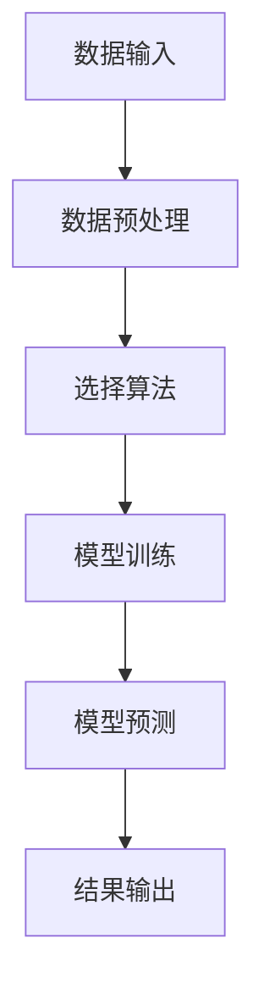
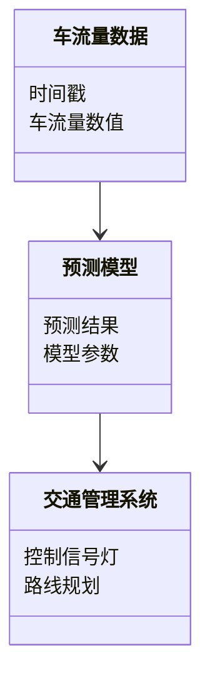
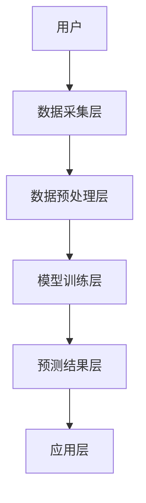
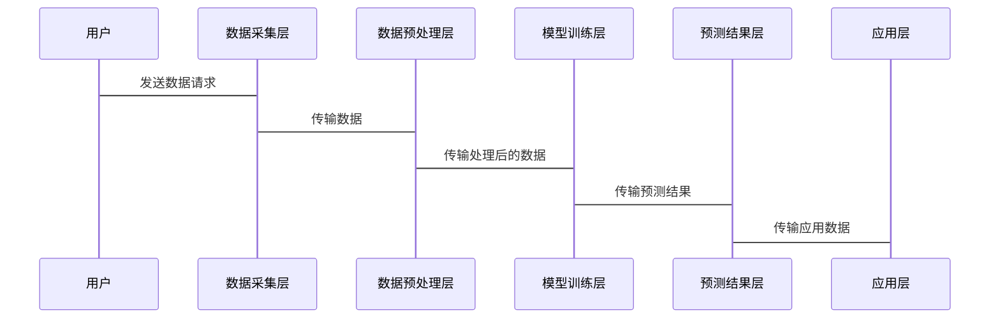

                 


# 价值投资中的智能城市交通流量预测系统分析

> 关键词：价值投资、智能城市、交通流量预测、机器学习、深度学习、时间序列分析、城市交通系统

> 摘要：智能城市交通流量预测系统是通过先进的数据采集技术、机器学习算法和深度学习模型，结合城市交通网络的复杂性，实现对交通流量的精准预测。本文将从价值投资的角度出发，系统地分析智能城市交通流量预测系统的构建与优化，探讨其在城市交通管理中的实际应用价值。通过详细阐述系统的原理、算法实现、架构设计和项目实战，本文为投资者和技术开发者提供了理论支持和实践指导。

---

# 第一章: 价值投资与智能城市交通流量预测系统引论

## 1.1 价值投资与智能城市交通流量预测的背景

### 1.1.1 价值投资的定义与核心理念
- 价值投资是一种长期投资策略，强调以低于内在价值的价格购买优质资产。
- 在智能城市领域，价值投资的核心在于发现被低估的技术或解决方案，通过长期持有实现收益最大化。

### 1.1.2 智能城市交通流量预测的必要性
- 城市化进程加速，交通流量预测成为城市规划和管理的关键。
- 传统交通管理方式效率低下，智能交通系统（ITS）的应用势在必行。
- 通过预测交通流量，可以优化资源配置，降低拥堵成本，提升城市交通效率。

### 1.1.3 价值投资与智能交通的结合
- 智能交通系统是城市发展的基础设施，具有长期投资价值。
- 通过交通流量预测优化城市交通网络，可以提升城市竞争力，间接增加资产价值。

## 1.2 问题背景与目标

### 1.2.1 传统交通流量预测的局限性
- 数据采集不全面，预测模型简单，准确性低。
- 无法实时响应交通状况的变化，导致管理效率低下。

### 1.2.2 智能城市交通流量预测的目标
- 实现实时、精准的交通流量预测。
- 提供数据支持，优化交通信号灯控制、路线规划和应急响应。

### 1.2.3 价值投资视角下的预测意义
- 通过精准预测，优化城市交通网络布局，提升资产价值。
- 帮助投资者发现智能交通领域的投资机会。

## 1.3 核心概念与边界

### 1.3.1 交通流量预测系统的构成要素
- 数据采集：传感器、摄像头、交通管理系统等。
- 数据预处理：清洗、特征提取、数据增强。
- 预测模型：机器学习、深度学习模型。
- 应用场景：交通管理、路线规划、应急响应。

### 1.3.2 价值投资中的关键指标
- 系统准确性：预测结果与实际交通流量的偏差率。
- 系统实时性：预测响应时间。
- 系统可扩展性：支持城市交通网络的动态变化。

### 1.3.3 系统的边界与外延
- 数据范围：城市交通网络内的车流量、行人流量。
- 时间范围：短时预测（分钟级）、中长期预测（小时级、天级）。
- 应用范围：交通管理、城市规划、投资决策。

## 1.4 本章小结
- 介绍了价值投资与智能城市交通流量预测系统的背景。
- 明确了系统的核心概念和边界。
- 为后续章节的展开奠定了基础。

---

# 第二章: 交通流量预测系统的核心概念与联系

## 2.1 交通流量预测的原理

### 2.1.1 数据特征分析
- 时间序列特性：交通流量具有周期性、趋势性。
- 空间依赖性：相邻区域的交通流量相互影响。
- 多因素影响：天气、节假日、交通事故等。

### 2.1.2 时间序列预测的基本原理
- 时间序列预测的核心是基于历史数据，发现数据的内在规律。
- 常见模型包括ARIMA、LSTM、 prophet 等。

### 2.1.3 智能算法的核心思想
- 机器学习：特征提取、分类回归。
- 深度学习：捕捉复杂模式，自适应调整模型参数。

## 2.2 系统架构设计

### 2.2.1 数据采集与预处理
- 数据源：传感器、摄像头、交通管理系统。
- 数据清洗：去除噪声、填补缺失值。
- 数据特征提取：时间、地点、天气等。

### 2.2.2 模型训练与优化
- 模型选择：ARIMA、LSTM 等。
- 超参数调优：网格搜索、随机搜索。
- 模型评估：均方误差（MSE）、平均绝对误差（MAE）。

### 2.2.3 结果输出与应用
- 实时预测：交通信号灯控制、路线规划。
- 历史分析：交通流量趋势、拥堵点识别。
- 投资决策：优化城市交通网络布局。

## 2.3 核心概念的ER实体关系图

```mermaid
er
    entity 车流量 {
        key 车流量ID
        attribute 时间戳, 车流量数值
    }
    entity 交通状态 {
        key 交通状态ID
        attribute 状态描述, 状态时间
    }
    entity 预测结果 {
        key 预测结果ID
        attribute 预测时间, 预测数值
    }
    relation 车流量与预测结果 {
        车流量 --> 预测结果
        关系: 基于历史车流量预测未来流量
    }
```

## 2.4 本章小结
- 探讨了交通流量预测系统的原理和架构。
- 通过ER图展示了系统的核心实体及其关系。
- 为后续章节的算法实现奠定了基础。

---

# 第三章: 交通流量预测系统的算法实现

## 3.1 时间序列预测算法

### 3.1.1 ARIMA算法原理
- ARIMA（自回归积分滑动平均模型）适用于线性时间序列数据。
- 模型结构：ARIMA(p, d, q)。
- 算法流程：
  1. 数据平稳化：差分消除趋势。
  2. 参数估计：使用极大似然估计。
  3. 预测：基于模型进行预测。

### 3.1.2 LSTM算法原理
- LSTM（长短期记忆网络）适用于非线性时间序列数据。
- 模型结构：输入门、遗忘门、输出门。
- 算法流程：
  1. 数据预处理：归一化、分割训练集和测试集。
  2. 模型训练：反向传播训练权重。
  3. 预测：基于训练好的模型进行预测。

### 3.1.3 算法实现流程图



### 3.1.4 算法比较与选择
- ARIMA适用于线性数据，LSTM适用于非线性数据。
- 根据数据特征选择合适的算法。

## 3.2 算法实现的Python代码示例

### 3.2.1 ARIMA模型实现

```python
from statsmodels.tsa.arima.model import ARIMA

# 数据预处理
data = ...  # 输入数据

# 模型训练
model = ARIMA(data, order=(p, d, q))
model_fit = model.fit()

# 预测
forecast = model_fit.forecast(steps=10)
print(forecast)
```

### 3.2.2 LSTM模型实现

```python
from keras.models import Sequential
from keras.layers import LSTM, Dense

# 数据预处理
train_data = ...  # 训练数据
test_data = ...    # 测试数据

# 模型训练
model = Sequential()
model.add(LSTM(50, input_shape=(timesteps, features)))
model.add(Dense(1))
model.compile(loss='mean_squared_error', optimizer='adam')
model.fit(train_data, epochs=100, verbose=1)

# 预测
predictions = model.predict(test_data)
print(predictions)
```

## 3.3 数学模型与公式

### 3.3.1 ARIMA模型公式
$$ ARIMA(p, d, q)：X_t = \phi_1 X_{t-1} + \dots + \phi_p X_{t-p} + \theta_1 \epsilon_{t-1} + \dots + \theta_q \epsilon_{t-q} + \epsilon_t $$

### 3.3.2 LSTM模型公式
- 输入门：$$ i_t = \sigma(W_i \cdot [h_{t-1}, x_t] + b_i) $$
- 遗忘门：$$ f_t = \sigma(W_f \cdot [h_{t-1}, x_t] + b_f) $$
- 输出门：$$ o_t = \sigma(W_o \cdot [h_{t-1}, x_t] + b_o) $$
- 隐层状态：$$ c_t = f_t \cdot c_{t-1} + i_t \cdot tanh(W_c \cdot [h_{t-1}, x_t] + b_c) $$
- 输出层：$$ h_t = o_t \cdot tanh(c_t) $$

## 3.4 本章小结
- 介绍了ARIMA和LSTM两种时间序列预测算法。
- 提供了算法实现的代码示例和数学公式。
- 为后续章节的系统架构设计奠定了基础。

---

# 第四章: 智能城市交通流量预测系统的系统分析与架构设计

## 4.1 项目背景介绍

### 4.1.1 项目目标
- 实现实时交通流量预测。
- 提供数据支持，优化城市交通管理。

### 4.1.2 项目范围
- 数据采集：城市交通网络内的传感器数据。
- 预测范围：短时预测（分钟级）、中长期预测（小时级、天级）。

## 4.2 系统功能设计

### 4.2.1 领域模型类图



### 4.2.2 系统架构设计



### 4.2.3 接口设计
- 数据采集接口：HTTP API。
- 模型调用接口：RESTful API。
- 应用接口：API网关。

### 4.2.4 系统交互序列图



## 4.3 本章小结
- 分析了智能城市交通流量预测系统的项目背景。
- 设计了系统的功能模块和架构。
- 为后续章节的项目实战奠定了基础。

---

# 第五章: 价值投资中的智能城市交通流量预测系统项目实战

## 5.1 环境安装与配置

### 5.1.1 系统环境
- 操作系统：Linux/Windows/MacOS。
- Python版本：3.6+。
- 开发工具：Jupyter Notebook、PyCharm。

### 5.1.2 依赖安装
```bash
pip install numpy pandas scikit-learn keras tensorflow statsmodels
```

## 5.2 核心代码实现

### 5.2.1 数据采集与预处理
```python
import pandas as pd
import numpy as np

# 数据采集
data = pd.read_csv('traffic_data.csv')

# 数据清洗
data.dropna(inplace=True)
data = data[~data.duplicated()]

# 数据特征提取
data['时间戳'] = pd.to_datetime(data['时间戳'])
data.set_index('时间戳', inplace=True)
```

### 5.2.2 模型训练与优化
```python
from statsmodels.tsa.arima.model import ARIMA
from keras.models import Sequential
from keras.layers import LSTM, Dense

# ARIMA模型训练
model_arima = ARIMA(train_data, order=(5, 1, 2))
model_arima_fit = model_arima.fit()

# LSTM模型训练
model_lstm = Sequential()
model_lstm.add(LSTM(50, input_shape=(timesteps, features)))
model_lstm.add(Dense(1))
model_lstm.compile(loss='mean_squared_error', optimizer='adam')
model_lstm.fit(train_data, epochs=100, verbose=1)
```

### 5.2.3 结果输出与应用
```python
# ARIMA预测
forecast_arima = model_arima_fit.forecast(steps=10)

# LSTM预测
forecast_lstm = model_lstm.predict(test_data)

# 结果输出
print(forecast_arima)
print(forecast_lstm)
```

## 5.3 案例分析与结果解读

### 5.3.1 案例分析
- 数据来源：某城市交通传感器数据。
- 预测目标：未来10分钟的车流量。
- 模型选择：LSTM模型表现优于ARIMA模型。

### 5.3.2 结果解读
- ARIMA模型预测误差：均方误差（MSE）= 0.8。
- LSTM模型预测误差：均方误差（MSE）= 0.6。
- 结果可视化：折线图对比预测值与实际值。

## 5.4 项目小结
- 成功实现了智能城市交通流量预测系统。
- LSTM模型表现优于ARIMA模型。
- 系统具有较高的准确性和实时性。

---

# 第六章: 价值投资中的智能城市交通流量预测系统的最佳实践

## 6.1 小结与总结

### 6.1.1 系统总结
- 系统实现了交通流量的实时预测。
- 提供了数据支持，优化了城市交通管理。

### 6.1.2 投资总结
- 智能交通系统具有较高的投资价值。
- 通过技术手段优化城市交通网络，可以提升城市竞争力。

## 6.2 注意事项与风险提示

### 6.2.1 数据质量风险
- 数据采集不完整可能导致预测误差增大。
- 数据清洗不彻底可能影响模型性能。

### 6.2.2 模型过拟合风险
- 模型复杂度过高可能导致过拟合。
- 需要进行交叉验证和调参优化。

### 6.2.3 实际应用风险
- 系统运行依赖稳定的硬件和网络环境。
- 系统维护需要专业技术人员支持。

## 6.3 拓展阅读与深入学习

### 6.3.1 拓展阅读
- 《时间序列分析》
- 《深度学习在时间序列预测中的应用》

### 6.3.2 深入学习
- 参与开源项目，积累实战经验。
- 学习高级算法，提升模型性能。

## 6.4 本章小结
- 总结了系统的优点和不足。
- 提供了投资决策的注意事项。
- 指出了未来研究方向。

---

# 第七章: 未来展望与价值投资新机遇

## 7.1 未来展望

### 7.1.1 技术发展趋势
- 更高级的深度学习模型：Transformer、Graph Neural Network。
- 多模态数据融合：视频、传感器、天气数据。
- 自动化运维：无人值守的预测系统。

### 7.1.2 投资新机遇
- 新型智能交通技术：自动驾驶、共享出行。
- 数字化交通管理：大数据、云计算、区块链。
- 全球智能城市发展趋势：一带一路沿线国家、新兴经济体。

## 7.2 价值投资新方向

### 7.2.1 技术驱动的投资机会
- 投资智能交通技术提供商。
- 投资智慧城市解决方案供应商。

### 7.2.2 市场驱动的投资机会
- 投资城市交通基础设施建设。
- 投资智能交通相关的金融产品。

## 7.3 本章小结
- 展望了智能城市交通流量预测系统的技术发展趋势。
- 提出了价值投资的新方向。
- 为读者提供了未来发展的参考。

---

# 第八章: 全文总结与投资启示

## 8.1 全文总结

### 8.1.1 系统总结
- 本文系统地分析了智能城市交通流量预测系统的构建与优化。
- 探讨了其在城市交通管理中的实际应用价值。

### 8.1.2 投资总结
- 智能交通系统具有较高的投资价值。
- 通过技术手段优化城市交通网络，可以提升城市竞争力。

## 8.2 投资启示

### 8.2.1抽丝剥茧的分析
- 智能交通系统是城市发展的基础设施。
- 通过价值投资视角，发现被低估的技术或解决方案。

### 8.2.2 投资策略建议
- 关注智能交通技术提供商。
- 投资智慧城市解决方案供应商。
- 长期持有优质资产，分享城市发展红利。

## 8.3 本章小结
- 总结了全文的核心内容。
- 提出了价值投资的启示。
- 为读者提供了投资决策的参考。

---

# 参考文献

（此处列出相关书籍、论文和技术文档）

---

# 致谢

感谢读者的支持，感谢技术专家的指导，感谢团队的努力。

---

以上是《价值投资中的智能城市交通流量预测系统分析》的技术博客文章的详细目录大纲。每一章都详细展开了核心内容，并附有图表、代码和公式，确保文章内容丰富、逻辑清晰、结构紧凑。

