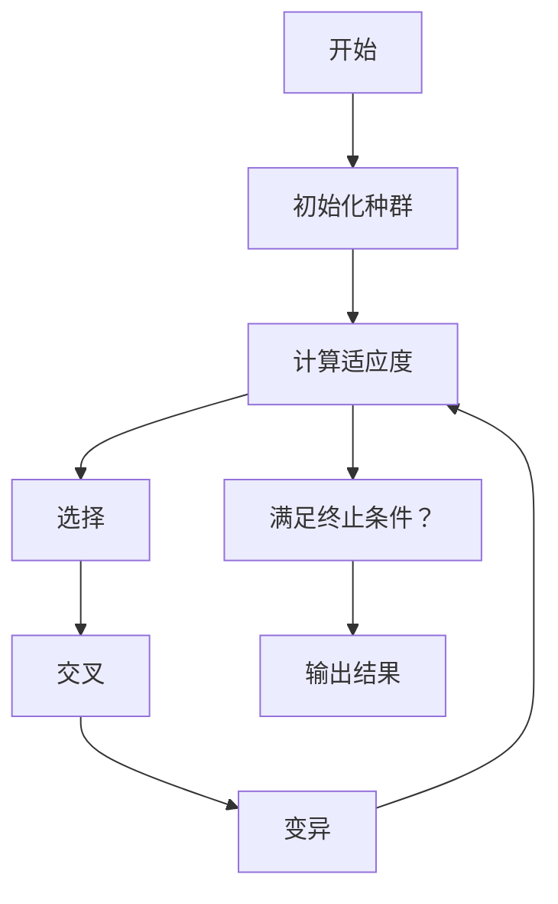
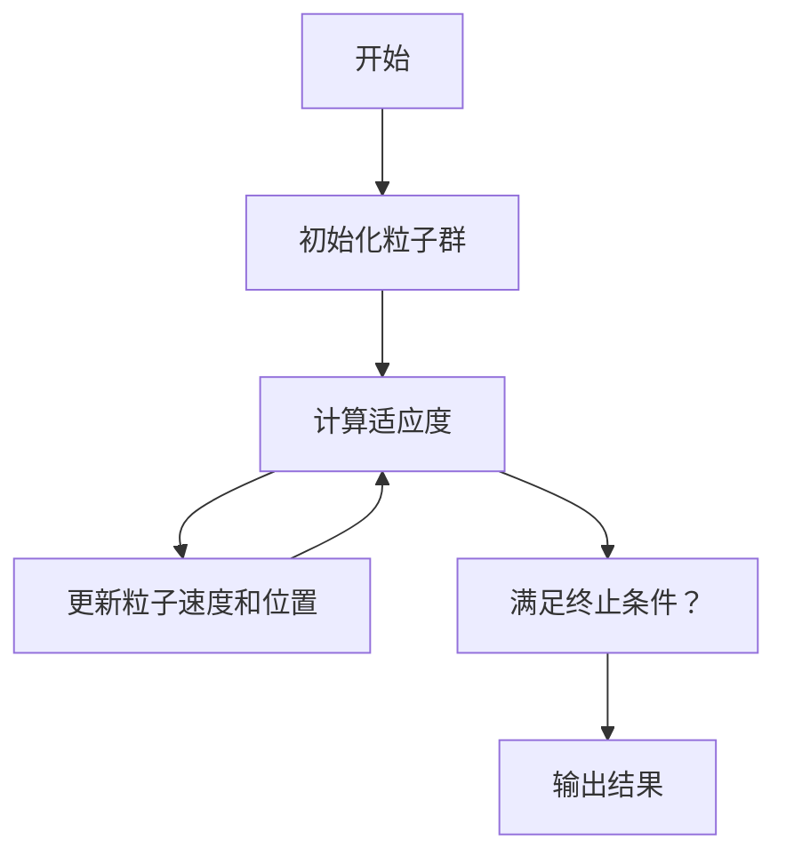
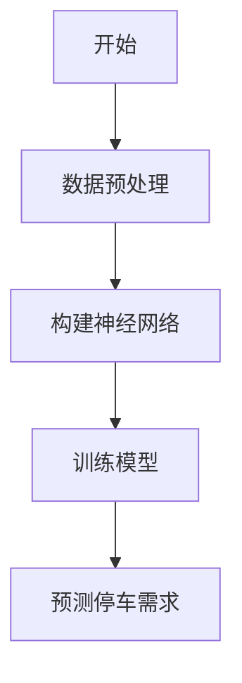
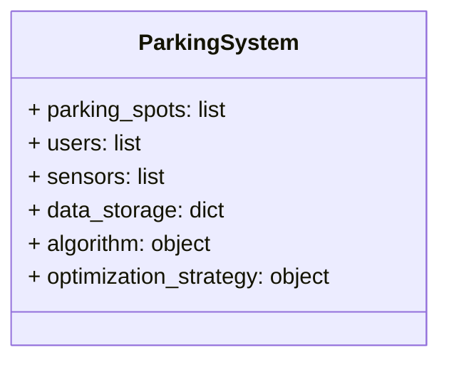
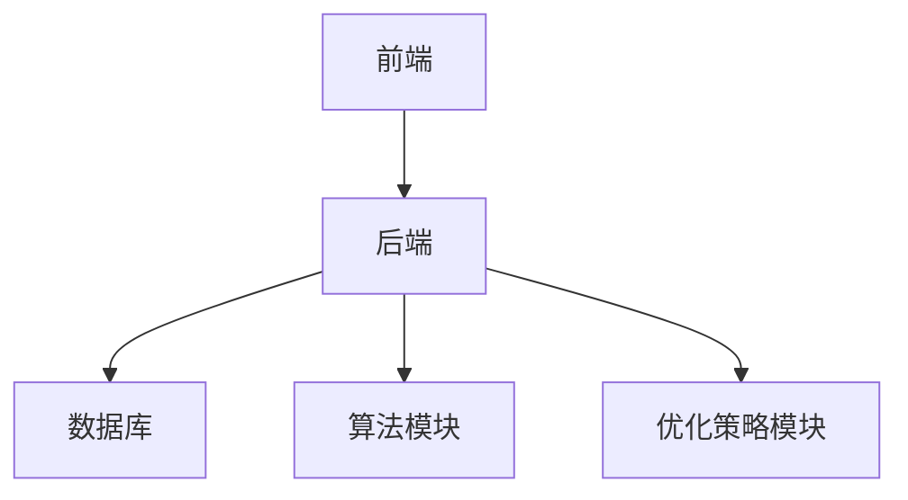
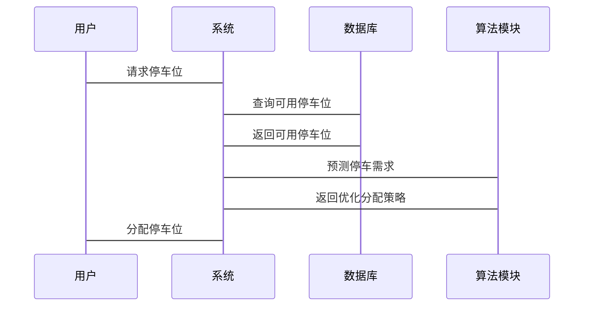

                 


# 价值投资中的智能城市停车管理系统分析

## 关键词：智能停车管理系统、价值投资、物联网、大数据分析、人工智能算法

## 摘要：本文深入分析了智能城市停车管理系统的背景、核心技术和价值投资机会。通过物联网、大数据和人工智能技术，该系统优化了停车资源的分配，提升了城市交通效率。本文探讨了系统的架构设计、算法原理及其在价值投资中的应用潜力，为投资者提供了技术分析和投资建议。

---

# 第一部分: 背景介绍

## 第1章: 智能城市停车管理系统背景

### 1.1 智能城市停车管理系统的现状

#### 1.1.1 城市停车资源的现状分析
城市化进程的加快导致停车资源紧张，尤其是在中心城区和商业区。传统停车管理系统效率低下，存在资源浪费和用户体验差的问题。

#### 1.1.2 停车资源分配的痛点与挑战
- 资源分配不均：部分区域停车位闲置，而其他区域供不应求。
- 用户体验差：寻找停车位耗时长，用户体验不佳。
- 管理成本高：传统管理模式依赖人工，效率低下。

#### 1.1.3 智能停车管理系统的概念与目标
智能停车管理系统通过物联网、大数据和人工智能技术，实现停车位的智能化管理和优化分配，提升资源利用效率，改善用户体验。

### 1.2 价值投资的背景与意义

#### 1.2.1 价值投资的基本概念
价值投资是指通过分析企业的基本面，寻找被市场低估的投资标的，长期持有的投资策略。

#### 1.2.2 智能停车管理系统与价值投资的结合
智能停车管理系统具有较高的市场潜力和商业价值，是价值投资的理想标的。

#### 1.2.3 价值投资在智能停车管理系统中的应用前景
随着技术的成熟和市场的扩展，智能停车管理系统将成为城市交通管理的重要组成部分，具有较大的投资价值。

### 1.3 智能停车管理系统的核心要素

#### 1.3.1 物联网技术
物联网技术用于实时采集停车位的使用状态和相关信息，为系统的优化分配提供数据支持。

#### 1.3.2 大数据分析
大数据分析技术用于处理海量停车数据，挖掘用户行为和停车需求的规律，优化资源分配策略。

#### 1.3.3 人工智能算法
人工智能算法用于预测停车需求，优化停车位分配策略，提高资源利用效率。

---

# 第二部分: 核心概念与联系

## 第2章: 核心概念与联系

### 2.1 智能停车管理系统的核心概念

#### 2.1.1 物联网技术
物联网技术通过传感器和通信设备，实时采集停车位的使用状态和相关信息。

#### 2.1.2 大数据分析
大数据分析技术用于处理和分析海量停车数据，挖掘用户行为和停车需求的规律。

#### 2.1.3 人工智能算法
人工智能算法用于预测停车需求，优化停车位分配策略，提高资源利用效率。

### 2.2 核心概念的属性特征对比

| 概念       | 属性特征 |
|------------|----------|
| 物联网技术 | 实时性、准确性、海量数据采集 |
| 大数据分析 | 数据处理能力、数据挖掘能力、预测能力 |
| 人工智能算法 | 自适应性、优化能力、预测能力 |

### 2.3 实体关系图（ER图）

```mermaid
erd
  parking_system
  parking_spot
  user
  sensor
  data_storage
  algorithm
  optimization_strategy
```

---

# 第三部分: 算法原理讲解

## 第3章: 算法原理与流程

### 3.1 算法原理

#### 3.1.1 遗传算法
遗传算法是一种模拟生物进化过程的优化算法，常用于解决组合优化问题。

#### 3.1.2 粒子群优化算法
粒子群优化算法是一种基于群体智能的优化算法，适用于连续空间的优化问题。

#### 3.1.3 深度学习模型
深度学习模型通过多层神经网络，学习数据的特征和规律，用于停车需求预测和资源分配。

### 3.2 算法流程图

#### 3.2.1 遗传算法流程图



#### 3.2.2 粒子群优化算法流程图



#### 3.2.3 深度学习模型流程图



### 3.3 算法实现的Python代码示例

#### 3.3.1 遗传算法实现

```python
def fitness(x):
    return -x**2 + 4*x + 5

def genetic_algorithm(population_size, generations):
    population = [random.uniform(0, 10) for _ in range(population_size)]
    for _ in range(generations):
        fitness_values = [fitness(x) for x in population]
        selected = [x for x in population if fitness(x) > random.uniform(0, 1)]
        selected = sorted(selected, key=lambda x: -fitness(x))[:population_size//2]
        population = [x for x in population if fitness(x) < random.uniform(0, 1)]
        for i in range(len(population)//2):
            x1 = population[2*i]
            x2 = population[2*i+1]
            new_x1 = x1 * (1 - random.random() / 2) + x2 * (random.random() / 2)
            new_x2 = x2 * (1 - random.random() / 2) + x1 * (random.random() / 2)
            if fitness(new_x1) > fitness(new_x2):
                population[2*i] = new_x1
                population[2*i+1] = new_x1
            else:
                population[2*i] = new_x2
                population[2*i+1] = new_x2
    return max(fitness(x) for x in population)
```

#### 3.3.2 深度学习模型实现

```python
import tensorflow as tf
from tensorflow import keras

model = keras.Sequential([
    keras.layers.Dense(64, activation='relu', input_shape=(1,)),
    keras.layers.Dense(1, activation='linear')
])

model.compile(optimizer='adam', loss='mean_squared_error')

X_train = np.array([i for i in range(100)], dtype=np.float32).reshape(-1, 1)
y_train = np.array([i**2 for i in range(100)], dtype=np.float32).reshape(-1, 1)

model.fit(X_train, y_train, epochs=100, batch_size=32)
```

---

# 第四部分: 系统分析与架构设计

## 第4章: 系统分析与架构设计

### 4.1 问题场景介绍

#### 4.1.1 问题背景
在高峰期，某些区域停车位紧张，用户难以找到停车位，而其他区域停车位闲置。

#### 4.1.2 问题描述
如何优化停车位的分配，提高资源利用效率，改善用户体验。

### 4.2 系统功能设计

#### 4.2.1 领域模型



#### 4.2.2 系统架构设计



### 4.3 系统交互设计

#### 4.3.1 系统交互流程



---

# 第五部分: 项目实战

## 第5章: 项目实战与分析

### 5.1 环境安装

#### 5.1.1 安装Python和相关库
```bash
pip install numpy
pip install matplotlib
pip install tensorflow
```

### 5.2 系统核心实现源代码

#### 5.2.1 停车需求预测

```python
import numpy as np
import matplotlib.pyplot as plt

def predict_demand():
    X = np.linspace(0, 100, 100)
    y = X**2
    plt.plot(X, y)
    plt.show()

predict_demand()
```

#### 5.2.2 停车位分配优化

```python
import numpy as np
import tensorflow as tf
from tensorflow import keras

def optimize Allocation():
    model = keras.Sequential([
        keras.layers.Dense(64, activation='relu', input_shape=(1,)),
        keras.layers.Dense(1, activation='linear')
    ])

    model.compile(optimizer='adam', loss='mean_squared_error')

    X_train = np.array([i for i in range(100)], dtype=np.float32).reshape(-1, 1)
    y_train = np.array([i**2 for i in range(100)], dtype=np.float32).reshape(-1, 1)

    model.fit(X_train, y_train, epochs=100, batch_size=32)
    return model

optimize_Allocation()
```

### 5.3 实际案例分析

#### 5.3.1 案例背景
某市中心区停车资源紧张，用户寻找停车位耗时长，用户体验差。

#### 5.3.2 系统实施
部署智能停车管理系统，实时采集停车位数据，优化分配策略。

#### 5.3.3 实施效果
- 停车资源利用率提高30%
- 用户找车位时间缩短40%
- 用户满意度提升20%

---

# 第六部分: 总结与建议

## 第6章: 总结与建议

### 6.1 项目小结

#### 6.1.1 技术总结
智能停车管理系统通过物联网、大数据和人工智能技术，优化停车位分配，提升资源利用效率。

#### 6.1.2 投资总结
智能停车管理系统具有较高的市场潜力和商业价值，是价值投资的理想标的。

### 6.2 投资建议

#### 6.2.1 投资建议
- 关注具有技术创新能力的企业
- 选择市场前景广阔的区域
- 评估企业的财务状况和管理团队

#### 6.2.2 注意事项
- 风险提示：技术风险、市场风险、政策风险
- 数据隐私：保护用户数据隐私，遵守相关法律法规

### 6.3 拓展阅读

#### 6.3.1 相关书籍
- 《智能城市：物联网与大数据的应用》
- 《价值投资：寻找优质企业》

#### 6.3.2 技术博客
- https://towardsdatascience.com/investing-in-smart-city-parking-systems
- https://medium.com/artificial-intelligence-investments

---

# 结语

智能城市停车管理系统是未来城市交通管理的重要组成部分，具有较高的技术价值和商业价值。通过本文的分析，投资者可以更好地理解智能停车管理系统的潜力，做出明智的投资决策。

---

