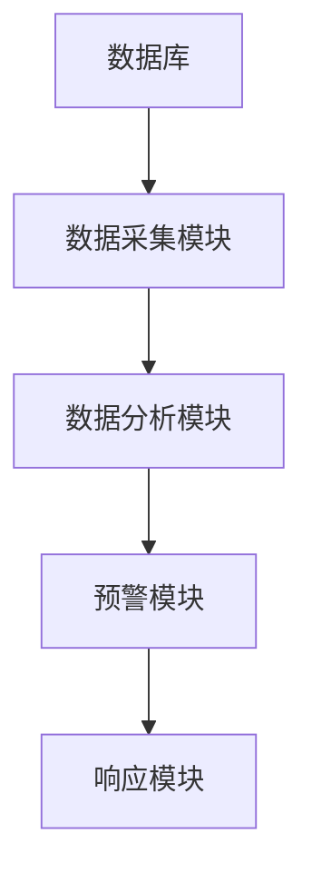
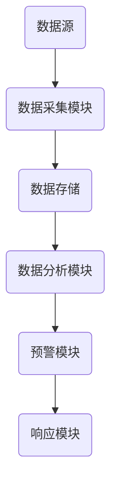
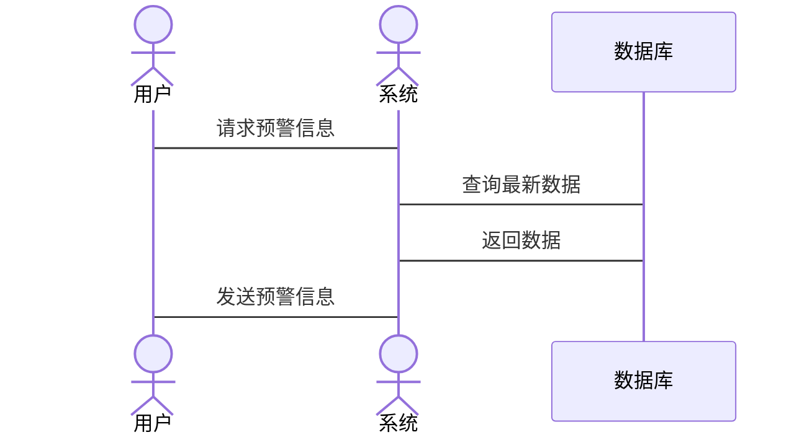

                 


# 价值投资中的智能城市公共安全预警系统分析

> **关键词**：价值投资、智能城市、公共安全、预警系统、人工智能、数据分析

> **摘要**：  
本文深入分析了智能城市公共安全预警系统在价值投资中的应用。通过结合城市安全与投资策略，探讨了系统的核心概念、算法原理、架构设计以及实际案例，展示了如何利用智能化手段提升城市安全水平并实现投资收益的最大化。文章从背景介绍到系统实现，逐步剖析，为读者提供了一套完整的理论与实践结合的解决方案。

---

# 目录大纲：《价值投资中的智能城市公共安全预警系统分析》

## 第一部分：背景介绍

### 第1章：智能城市公共安全预警系统概述

#### 1.1 问题背景
- **1.1.1 智慧城市建设的现状与挑战**
  - 智慧城市建设的背景与目标
  - 当前城市公共安全的主要问题
  - 智能化预警系统的需求
- **1.1.2 价值投资的基本原理**
  - 价值投资的核心理念
  - 投资者在智慧城市中的角色

#### 1.2 问题描述
- **1.2.1 城市公共安全的主要风险因素**
  - 自然灾害、刑事案件、公共设施故障等
- **1.2.2 传统安全预警系统的局限性**
  - 数据采集不全面、预警不及时、响应机制不足
- **1.2.3 价值投资在城市安全中的作用**
  - 通过技术手段降低投资风险
  - 提高城市安全的经济效益

#### 1.3 问题解决
- **1.3.1 智能化预警系统的解决方案**
  - 数据驱动的安全预警
  - 人工智能在风险评估中的应用
- **1.3.2 价值投资在系统构建中的逻辑**
  - 系统建设的经济可行性
  - 投资回报的评估方法

#### 1.4 系统边界与外延
- **1.4.1 系统的组成与功能边界**
  - 数据采集、分析、预警、响应模块
- **1.4.2 外部接口与数据来源**
  - 政府数据、企业数据、公众数据
- **1.4.3 系统的可扩展性与适应性**
  - 系统升级与功能扩展

#### 1.5 核心概念与组成要素
- **1.5.1 数据采集与处理**
  - 多源数据的融合与清洗
- **1.5.2 风险评估与预测模型**
  - 风险评估指标的构建
- **1.5.3 预警机制与响应策略**
  - 预警级别的划分与响应流程

---

## 第二部分：核心概念与联系

### 第2章：智能城市公共安全预警系统的核心原理

#### 2.1 核心概念原理
- **2.1.1 数据驱动的安全预警**
  - 数据的重要性与应用场景
- **2.1.2 人工智能在风险评估中的应用**
  - 机器学习算法在风险预测中的作用
- **2.1.3 价值投资在系统构建中的逻辑**
  - 投资策略与系统功能的结合

#### 2.2 核心概念对比
- **2.2.1 不同预警系统的对比分析**
  - 传统预警系统与智能预警系统的优缺点对比
- **2.2.2 传统与智能系统的性能对比**
  - 数据处理能力、预警准确率、响应速度
- **2.2.3 价值投资与传统投资策略的差异**
  - 投资目标、风险评估、回报周期

#### 2.3 ER实体关系图
```mermaid
erDiagram
    actor 投资者 {
        <属性> 资金投入
        <属性> 投资目标
    }
    actor 政府机构 {
        <属性> 政策支持
        <属性> 数据提供
    }
    actor 技术供应商 {
        <属性> 技术提供
        <属性> 服务支持
    }
    entity 系统平台 {
        <属性> 数据采集
        <属性> 预警模型
    }
    entity 预警信息 {
        <属性> 风险等级
        <属性> 预警时间
    }
    entity 投资回报 {
        <属性> 投资收益
        <属性> 投资风险
    }
    投资者 --> 系统平台 :  提供资金
    政府机构 --> 系统平台 :  提供数据
    技术供应商 --> 系统平台 :  提供技术支持
    系统平台 --> 预警信息 :  发布预警
    预警信息 --> 投资回报 :  影响投资收益
```

---

## 第三部分：算法原理

### 第3章：智能城市公共安全预警系统的算法原理

#### 3.1 数据驱动的风险预测模型
- **3.1.1 时间序列分析模型**
  - ARIMA模型的原理与应用
  - $$ ARIMA(p, d, q) $$
- **3.1.2 随机森林算法**
  - 随机森林在风险评估中的应用
  - Python代码实现

#### 3.2 人工智能驱动的预警算法
- **3.2.1 基于LSTM的时间序列预测**
  - LSTM网络的结构与优势
  - $$ LSTM(t, h, c) $$
- **3.2.2 算法实现与优化**
  - 使用Python代码实现LSTM模型
  - 模型调优与评估指标

#### 3.3 预警系统的数学模型
- **3.3.1 风险评估公式**
  - $$ R = \sum_{i=1}^{n} w_i x_i $$
  - 其中，$w_i$为权重，$x_i$为风险因子
- **3.3.2 预警级别的划分**
  - $$ Level = \text{quantile}(R, 0.95) $$

---

## 第四部分：系统分析与架构设计

### 第4章：智能城市公共安全预警系统的架构设计

#### 4.1 问题场景介绍
- **4.1.1 城市安全预警的核心问题**
  - 多源数据的融合与处理
  - 实时预警与快速响应
- **4.1.2 系统建设的目标**
  - 提高预警准确率，降低安全事件的发生率

#### 4.2 系统功能设计
- **4.2.1 数据采集模块**
  - 数据来源：传感器、摄像头、公众报告
  - 数据类型：结构化、半结构化、非结构化数据
- **4.2.2 数据分析模块**
  - 数据清洗、特征提取、模型训练
- **4.2.3 预警模块**
  - 风险评估、预警发布、响应策略
- **4.2.4 响应模块**
  - 应急预案启动、资源调度、事件跟踪

#### 4.3 系统架构设计
- **4.3.1 系统架构图**

- **4.3.2 数据流图**


#### 4.4 系统接口设计
- **4.4.1 API接口**
  - 数据接口：RESTful API
  - 预警接口：WebSocket实时推送
- **4.4.2 交互流程**


---

## 第五部分：项目实战

### 第5章：智能城市公共安全预警系统的实现

#### 5.1 环境安装
- **5.1.1 系统运行环境**
  - 操作系统：Linux/Windows
  - 数据库：MySQL/PostgreSQL
  - 开发工具：Python、Jupyter Notebook
- **5.1.2 依赖安装**
  - Python库：numpy、pandas、scikit-learn、keras
  - 安装命令：pip install numpy pandas scikit-learn keras

#### 5.2 核心代码实现
- **5.2.1 数据处理代码**
```python
import pandas as pd
import numpy as np

# 数据加载
data = pd.read_csv('safety_data.csv')
# 数据清洗
data.dropna(inplace=True)
# 特征提取
features = data[['temperature', 'humidity', 'crime_rate']]
labels = data['risk_level']
```

- **5.2.2 预警模型实现**
```python
from sklearn.ensemble import RandomForestClassifier
from keras.models import Sequential
from keras.layers import LSTM, Dense

# 随机森林模型
rf_model = RandomForestClassifier()
rf_model.fit(features, labels)

# LSTM模型
model = Sequential()
model.add(LSTM(64, input_shape=(features.shape[1], 1)))
model.add(Dense(1))
model.compile(loss='binary_crossentropy', optimizer='adam', metrics=['accuracy'])
model.fit(features, labels, epochs=10, batch_size=32)
```

- **5.2.3 预警信息推送**
```python
import requests

# 推送预警信息
def send_warning(level):
    payload = {'level': level}
    response = requests.post('http://localhost:8000/warning', json=payload)
    return response.status_code

send_warning(3)
```

#### 5.3 案例分析
- **5.3.1 实际案例**
  - 城市交通拥堵预警与缓解
  - 火灾风险预测与应急响应
- **5.3.2 分析与总结**
  - 系统在实际应用中的效果
  - 投资回报的评估与优化建议

---

## 第六部分：最佳实践

### 第6章：智能城市公共安全预警系统的优化与扩展

#### 6.1 优化建议
- **6.1.1 系统性能优化**
  - 数据处理速度提升
  - 模型训练效率优化
- **6.1.2 系统功能扩展**
  - 增加更多的风险因子
  - 引入更多智能算法

#### 6.2 小结
- 价值投资在智能城市公共安全预警系统中的重要性
- 技术与经济的结合对城市安全的提升作用

#### 6.3 注意事项
- 数据隐私与安全保护
- 系统稳定性和容错能力
- 投资风险与收益平衡

#### 6.4 拓展阅读
- 推荐书籍与论文
- 关键技术的学习资源
- 行业动态与发展趋势

---

# 结语

智能城市公共安全预警系统的建设不仅是技术的进步，更是价值投资的新机遇。通过本文的分析与实践，我们展示了如何将技术与经济逻辑相结合，实现城市安全的智能化管理与投资收益的最大化。未来，随着技术的不断进步和投资策略的优化，智能城市公共安全预警系统将发挥更大的作用，为城市的安全与发展保驾护航。

