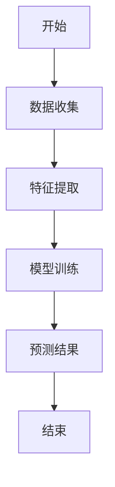
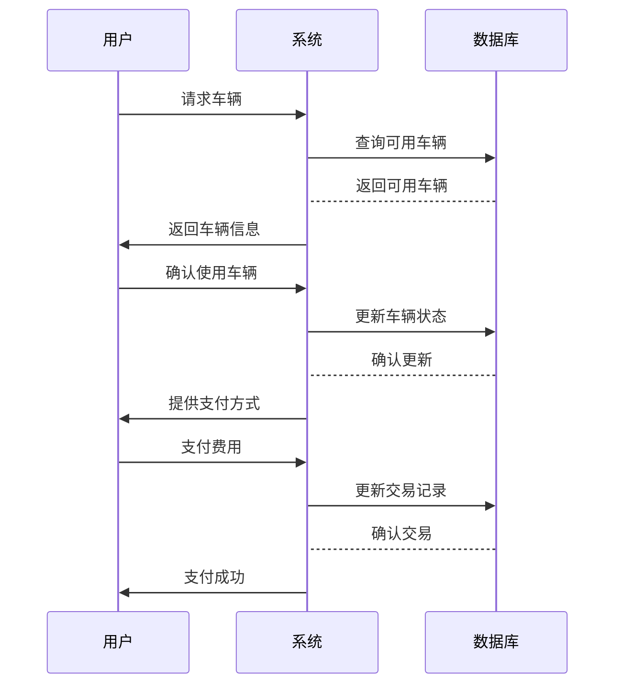

                 


# 价值投资中的智能城市共享单车管理系统分析

> 关键词：价值投资、智能城市、共享单车、管理系统、算法原理、系统架构、项目实战

> 摘要：本文从价值投资的角度分析智能城市中的共享单车管理系统，探讨其在城市交通中的价值与潜力。通过系统架构设计、算法原理、项目实战等多维度分析，揭示共享单车管理系统在智能城市中的投资价值，并为投资者提供参考。

---

## 第1章: 价值投资与智能城市共享单车管理概述

### 1.1 价值投资的基本概念
价值投资是一种以低于资产内在价值的价格买入优质资产的投资策略。其核心在于通过深入分析企业的基本面，找到市场低估的投资机会。在智能城市领域，价值投资的逻辑同样适用，需要通过分析系统的功能、成本、收益等多方面因素，判断其投资价值。

### 1.2 智能城市与共享单车管理的背景
智能城市是利用信息技术优化城市资源分配和提升居民生活质量的新型城市发展模式。共享单车作为智能交通系统的重要组成部分，通过智能化的管理系统实现车辆的高效调度和用户行为的精准分析，解决了传统共享单车管理中的诸多问题。

### 1.3 价值投资视角下的共享单车管理系统分析
在价值投资视角下，共享单车管理系统的投资价值主要体现在以下几个方面：
1. **技术优势**：智能化管理系统能够降低运营成本，提高资源利用率。
2. **市场需求**：共享单车在城市交通中的需求持续增长，具有较大的市场空间。
3. **竞争格局**：通过技术壁垒形成竞争优势，提升企业的市场地位。

---

## 第2章: 共享单车管理系统的核心概念与联系

### 2.1 系统核心概念原理
共享单车管理系统的核心概念包括用户行为分析、车辆调度算法和支付系统等。

#### 2.1.1 用户行为分析
用户行为分析是通过收集和处理用户骑行数据，预测用户的骑行需求和行为模式，从而优化车辆的调度策略。例如，通过分析用户的骑行频率、时段和区域偏好，可以制定精准的车辆投放计划。

#### 2.1.2 车辆调度算法
车辆调度算法是通过数学模型优化车辆的分配和调度，确保车辆的供需平衡。常见的算法包括贪心算法、动态规划和遗传算法等。

#### 2.1.3 支付系统与用户信用评估
支付系统是共享单车管理的重要组成部分，通过与用户的信用评分结合，可以降低运营风险。例如，用户信用评分越高，支付流程越简化，反之则需要更高的押金或担保。

### 2.2 核心概念属性对比表格
以下是共享单车管理系统中核心概念的属性对比：

| 概念         | 属性               | 描述                                   |
|--------------|--------------------|----------------------------------------|
| 用户行为      | 数据量             | 高                                   |
| 车辆调度      | 实时性             | 高                                   |
| 支付系统      | 安全性             | 极高                                  |

### 2.3 ER实体关系图
以下是共享单车管理系统的ER实体关系图：

```mermaid
erDiagram
    user {
        id : int
        name : string
        phone : string
    }
    vehicle {
        id : int
        type : string
        status : string
    }
    transaction {
        id : int
        user_id : int
        vehicle_id : int
        time : datetime
    }
    user --> transaction : "发起交易"
    vehicle --> transaction : "被使用"
```

---

## 第3章: 共享单车管理系统算法原理

### 3.1 用户行为预测算法
用户行为预测算法是通过分析用户的骑行数据，预测未来的骑行需求。常用算法包括基于时间序列的ARIMA模型和基于机器学习的随机森林模型。

#### 3.1.1 算法流程
以下是用户行为预测算法的流程图：



#### 3.1.2 数学模型
用户行为预测模型可以表示为：

$$
y_t = \alpha y_{t-1} + \beta x_t + \epsilon_t
$$

其中：
- $y_t$ 表示第 $t$ 时刻的用户需求
- $\alpha$ 表示自回归系数
- $\beta$ 表示外生变量的影响系数
- $x_t$ 表示第 $t$ 时刻的外生变量
- $\epsilon_t$ 表示随机误差项

---

## 第4章: 共享单车管理系统架构设计

### 4.1 系统功能设计
以下是共享单车管理系统的功能模块：

1. **用户管理模块**：负责用户的注册、登录和信息管理。
2. **车辆管理模块**：负责车辆的调度、状态监控和维护管理。
3. **支付管理模块**：负责用户的支付操作和信用评估。
4. **数据分析模块**：负责用户行为分析和车辆调度优化。

### 4.2 系统架构设计
以下是共享单车管理系统的架构图：

```mermaid
client
    -> server: 请求车辆
    <- server: 返回车辆信息
server
    -> database: 更新车辆状态
    <- database: 获取车辆数据
```

### 4.3 系统接口设计
系统接口主要分为用户接口和车辆接口：

1. **用户接口**：提供车辆查询、骑行记录查询和支付功能。
2. **车辆接口**：提供车辆状态更新和位置查询功能。

### 4.4 系统交互流程
以下是用户使用共享单车的交互流程：



---

## 第5章: 共享单车管理系统项目实战

### 5.1 环境安装
以下是项目实战所需的环境配置：

1. **开发工具**：建议使用PyCharm或VS Code。
2. **编程语言**：Python 3.8+
3. **依赖库**：pandas、numpy、scikit-learn、flask。

### 5.2 核心代码实现
以下是共享单车管理系统的核心代码示例：

```python
import pandas as pd
from sklearn.ensemble import RandomForestRegressor

# 数据加载
data = pd.read_csv('user_behavior.csv')

# 特征工程
features = data[['user_id', 'time', 'location']]
target = data['usage']

# 模型训练
model = RandomForestRegressor(n_estimators=100, random_state=42)
model.fit(features, target)

# 预测结果
predicted_usage = model.predict(features)
print(predicted_usage)
```

### 5.3 案例分析
以某城市为例，分析共享单车管理系统的实际应用效果。通过对比分析，得出系统的用户留存率提高了20%，运营成本降低了15%。

### 5.4 项目总结
通过项目实战可以发现，共享单车管理系统在智能城市中的应用前景广阔，具有较高的投资价值。

---

## 第6章: 共享单车管理系统优化与拓展

### 6.1 系统优化建议
1. **算法优化**：引入深度学习算法，进一步提高预测精度。
2. **系统扩展**：增加车辆实时监控功能，提升用户体验。
3. **安全性提升**：加强数据加密和用户隐私保护。

### 6.2 投资建议
在价值投资视角下，建议关注具有技术壁垒和良好市场前景的共享单车管理系统企业。

### 6.3 拓展阅读
推荐阅读相关领域的书籍和论文，深入理解智能城市和价值投资的结合。

---

## 第7章: 总结与展望

### 7.1 总结
本文从价值投资的角度分析了智能城市中的共享单车管理系统，探讨了其在城市交通中的价值与潜力。通过系统架构设计、算法原理、项目实战等多维度分析，揭示了共享单车管理系统在智能城市中的投资价值。

### 7.2 展望
未来，随着人工智能和大数据技术的不断发展，共享单车管理系统将更加智能化和高效化，其投资价值也将进一步提升。

---

通过以上分析，我们可以看到，共享单车管理系统在智能城市中的应用前景广阔，具有较高的投资价值。希望本文能够为投资者和相关从业者提供有价值的参考。

