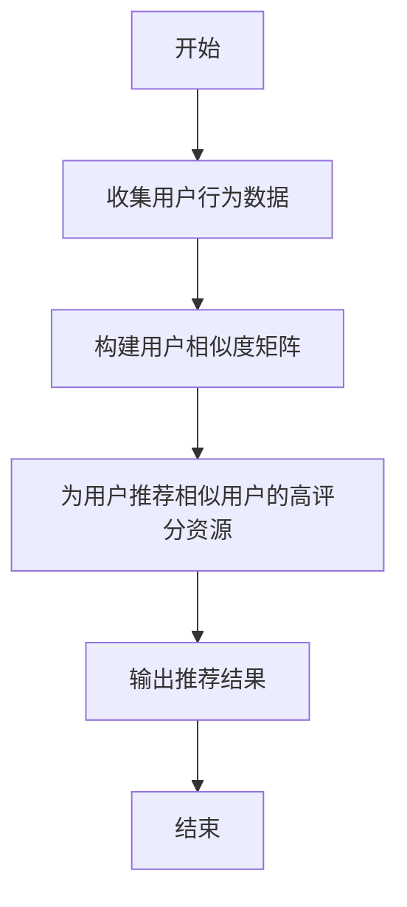
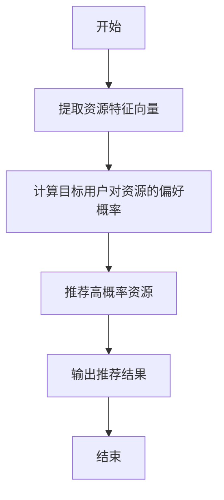
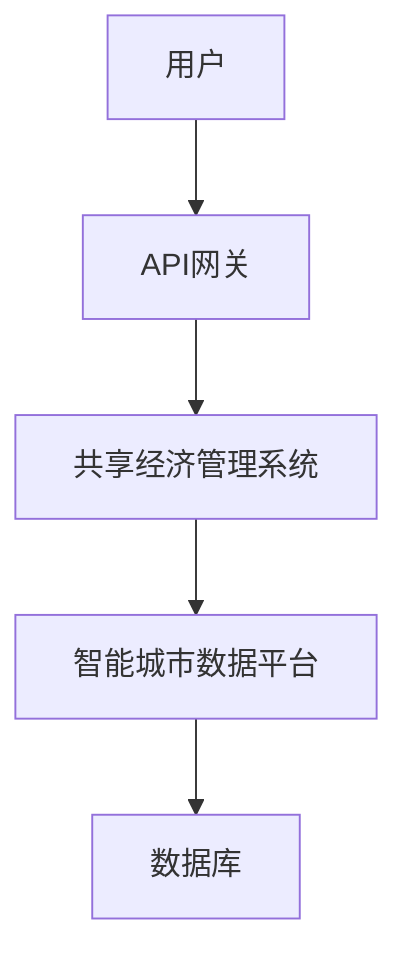
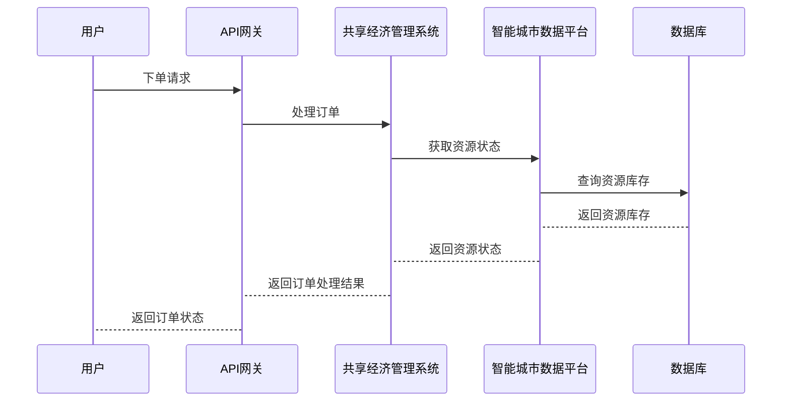

                 


# 价值投资中的智能城市共享经济管理系统分析

## 关键词：价值投资，智能城市，共享经济，管理系统，数据分析，推荐算法

## 摘要：  
本文深入分析了智能城市背景下共享经济管理系统的价值投资策略，探讨了共享经济与智能城市融合的技术架构，提出了基于数据分析和推荐算法的共享经济管理系统优化方案。通过实际案例分析，展示了如何利用智能城市数据资源，构建高效的共享经济管理系统，实现资源优化配置和价值最大化。

---

# 第1章 背景介绍

## 1.1 问题背景

### 1.1.1 共享经济的定义与特点
共享经济是一种通过数字化平台实现资源使用权共享的经济模式，其特点包括去中心化、按需分配、资源高效利用和降低交易成本。

### 1.1.2 智能城市的发展现状
智能城市利用物联网、大数据、人工智能等技术，将城市中的各个系统有机连接，实现资源优化配置和智能化管理。

### 1.1.3 价值投资在共享经济中的重要性
价值投资通过分析共享经济系统的运行效率和收益潜力，帮助投资者找到具有长期增值潜力的项目。

## 1.2 问题描述

### 1.2.1 共享经济系统中的资源分配问题
资源分配不均可能导致系统效率低下，影响用户体验和收益。

### 1.2.2 智能城市中的数据共享与隐私保护
数据共享是智能城市的核心，但隐私保护和数据安全问题亟待解决。

### 1.2.3 价值投资与共享经济的结合点
如何在共享经济中找到具有投资价值的项目，是价值投资者关注的重点。

## 1.3 问题解决

### 1.3.1 共享经济管理系统的核心功能
包括资源分配、用户匹配、数据分析和收益预测等功能。

### 1.3.2 智能城市中的数据整合与分析
通过大数据技术整合城市资源数据，优化资源配置效率。

### 1.3.3 价值投资的策略优化
基于共享经济系统的运行数据，优化投资策略，提高投资回报率。

## 1.4 边界与外延

### 1.4.1 共享经济的边界条件
包括资源池规模、用户需求和平台技术能力等因素。

### 1.4.2 智能城市的外延范围
涵盖交通、能源、医疗等多个领域。

### 1.4.3 价值投资的适用范围
适用于共享经济平台、智能城市基础设施建设和相关技术创新项目。

## 1.5 核心要素组成

### 1.5.1 共享经济的核心要素
资源池、平台技术、用户需求和收益分配机制。

### 1.5.2 智能城市的核心技术
物联网、大数据分析、人工智能和区块链技术。

### 1.5.3 价值投资的关键指标
收益潜力、市场竞争力和技术创新能力。

---

# 第2章 核心概念与联系

## 2.1 核心概念原理

### 2.1.1 共享经济的运作机制
通过平台匹配供给与需求，实现资源的高效利用。

### 2.1.2 智能城市的系统架构
由感知层、网络层和应用层构成，实现城市资源的智能化管理。

### 2.1.3 价值投资的数学模型
基于共享经济系统的运行数据，构建收益预测模型。

## 2.2 概念属性特征对比表格

| 概念      | 特征1：去中心化 | 特征2：数据驱动 | 特征3：资源优化 |
|-----------|----------------|----------------|----------------|
| 共享经济  | 是             | 是             | 是             |
| 智能城市  | 否             | 是             | 是             |
| 价值投资  | 否             | 是             | 是             |

## 2.3 ER实体关系图

```mermaid
erd
    entity 用户 {
        id 用户ID
        名称
        邮箱
    }
    entity 资源 {
        id 资源ID
        类型
        数量
    }
    entity 订单 {
        id 订单ID
        用户ID
        资源ID
        时间
    }
    用户 - 订单：下单
    资源 - 订单：被预约
```

---

# 第3章 算法原理讲解

## 3.1 推荐算法

### 3.1.1 协同过滤推荐算法
基于用户行为数据，找到相似用户的偏好，推荐资源。

### 3.1.2 基于内容的推荐算法
基于资源的属性特征，推荐相似资源。

### 3.1.3 混合推荐算法
结合协同过滤和基于内容的推荐，提高推荐精度。

## 3.2 算法流程图

### 协同过滤推荐算法流程图



### 基于内容的推荐算法流程图



## 3.3 Python源代码实现

### 协同过滤推荐算法代码

```python
def collaborative_filtering(user_id, user_dict):
    # 找到与目标用户相似的用户
    similar_users = [u for u in user_dict if u != user_id]
    # 计算相似用户的评分均值
    avg_ratings = {}
    for u in similar_users:
        avg_ratings[u] = sum(user_dict[u].values()) / len(user_dict[u])
    # 为目标用户推荐资源
    recommendations = {}
    for u in similar_users:
        for resource in user_dict[u]:
            if resource not in recommendations:
                recommendations[resource] = user_dict[u][resource]
    # 按评分排序
    sorted_recommendations = sorted(recommendations.items(), key=lambda x: x[1], reverse=True)
    return sorted_recommendations
```

### 基于内容的推荐算法代码

```python
from sklearn.feature_extraction.text import TfidfVectorizer
from sklearn.metrics.pairwise import cosine_similarity

def content_based_recommendation(resources, target_resource):
    # 提取资源特征向量
    vectorizer = TfidfVectorizer()
    resource_features = vectorizer.fit_transform([r.description for r in resources])
    # 计算余弦相似度
    similarity = cosine_similarity(resource_features)
    # 找到最相似的资源
    similar_resources = sorted(range(len(similarity[target_resource])), key=lambda i: similarity[target_resource][i], reverse=True)
    return [resources[i] for i in similar_resources[:5]]
```

## 3.4 算法优缺点对比

| 算法类型       | 优点                               | 缺点                               |
|----------------|------------------------------------|------------------------------------|
| 协同过滤       | 考虑了用户行为数据，推荐结果精准    | 对新用户（cold start）处理不好   |
| 基于内容的     | 对资源属性分析深入，推荐结果丰富   | 忽略了用户行为数据                |
| 混合推荐        | 结合了两种算法的优点，推荐效果好   | 实现复杂，计算成本高             |

---

# 第4章 数学模型与公式

## 4.1 收益预测模型

### 4.1.1 线性回归模型
$$ \text{收益} = \beta_0 + \beta_1 \times \text{资源利用率} + \epsilon $$

### 4.1.2 逻辑回归模型
$$ P(\text{投资成功}) = \frac{1}{1 + e^{- (\beta_0 + \beta_1 \times \text{市场风险})}} $$

### 4.1.3 时间序列模型
$$ \text{预测收益}_t = \alpha \times \text{历史收益}_{t-1} + \beta \times \text{市场趋势}_{t-1} + \gamma \times \epsilon_t $$

---

# 第5章 系统分析与架构设计方案

## 5.1 问题场景介绍

### 5.1.1 共享经济管理系统的核心目标
实现资源的高效分配和用户需求的精准匹配。

### 5.1.2 智能城市中的数据共享需求
需要整合城市中的多源数据，实现跨部门协作。

## 5.2 系统功能设计

### 5.2.1 领域模型类图

```mermaid
classDiagram
    class 用户 {
        用户ID
        名称
        邮箱
    }
    class 资源 {
        资源ID
        类型
        数量
    }
    class 订单 {
        订单ID
        用户ID
        资源ID
        时间
    }
    用户 --> 订单：下单
    资源 --> 订单：被预约
```

### 5.2.2 系统架构设计



### 5.2.3 系统接口设计
- 用户接口：下单、查询订单状态。
- 管理系统接口：处理订单、分配资源。
- 数据平台接口：提供实时数据支持。

### 5.2.4 系统交互序列图



---

# 第6章 项目实战

## 6.1 环境安装

### 6.1.1 安装Python和必要的库
- Python 3.8+
- 安装库：`pip install numpy pandas scikit-learn`

### 6.1.2 安装Jupyter Notebook
用于数据可视化和算法实现。

## 6.2 系统核心实现源代码

### 6.2.1 数据预处理代码

```python
import pandas as pd

# 读取数据
data = pd.read_csv('resources.csv')

# 数据清洗
data.dropna(inplace=True)
data['price'] = data['price'].astype(int)
```

### 6.2.2 算法实现代码

```python
from sklearn.model_selection import train_test_split
from sklearn.linear_model import LinearRegression

# 分割数据
X = data[['utilization']]
y = data['revenue']
X_train, X_test, y_train, y_test = train_test_split(X, y, test_size=0.2)

# 训练模型
model = LinearRegression()
model.fit(X_train, y_train)

# 预测结果
y_pred = model.predict(X_test)
print('预测收益:', y_pred)
```

### 6.2.3 系统功能实现代码

```python
def allocate_resource(user_id, resources_available):
    # 根据用户需求和资源可用性分配资源
    allocated = {}
    for resource in resources_available:
        if resource not in allocated:
            allocated[resource] = resources_available[resource]
    return allocated
```

## 6.3 代码应用解读与分析

### 6.3.1 数据预处理
清洗数据，确保数据质量。

### 6.3.2 模型训练
使用线性回归模型预测收益，为投资决策提供依据。

### 6.3.3 系统功能实现
实现资源分配功能，优化资源利用率。

## 6.4 实际案例分析

### 6.4.1 案例背景
某智能城市中的共享办公空间管理系统。

### 6.4.2 数据分析
分析用户使用数据，优化资源分配策略。

### 6.4.3 算法实现
使用协同过滤算法推荐空闲资源给用户。

## 6.5 项目小结

### 6.5.1 项目总结
通过数据分析和算法实现，优化了共享经济管理系统的资源分配效率。

### 6.5.2 成果展示
展示了系统的实际运行效果和投资回报率。

### 6.5.3 经验教训
数据质量对算法效果影响显著，需加强数据预处理。

---

# 第7章 总结、最佳实践、注意事项、拓展阅读

## 7.1 总结

### 7.1.1 核心观点回顾
通过智能城市数据和价值投资策略，优化共享经济管理系统。

### 7.1.2 重点内容总结
数据分析、算法实现和系统优化是关键。

## 7.2 最佳实践

### 7.2.1 数据处理
确保数据质量和完整性。

### 7.2.2 算法选择
根据具体场景选择合适的算法。

### 7.2.3 系统优化
定期优化系统架构和功能。

## 7.3 注意事项

### 7.3.1 数据隐私
保护用户数据隐私。

### 7.3.2 系统安全
防止数据泄露和网络攻击。

### 7.3.3 投资风险
评估投资风险，避免盲目投资。

## 7.4 拓展阅读

### 7.4.1 推荐书籍
《智能城市的构建与管理》、《共享经济的商业模式创新》。

### 7.4.2 技术博客
推荐关注技术博客和GitHub项目，获取最新技术动态。

---

# 结语

通过本文的分析，我们深入探讨了智能城市共享经济管理系统的价值投资策略，提出了基于数据分析和推荐算法的优化方案。未来，随着技术的不断发展，共享经济管理系统将更加智能化和高效化，为投资者带来更大的价值。

---

