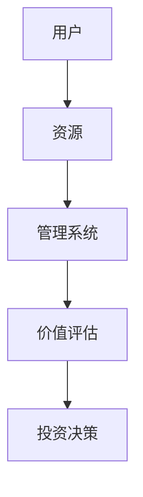
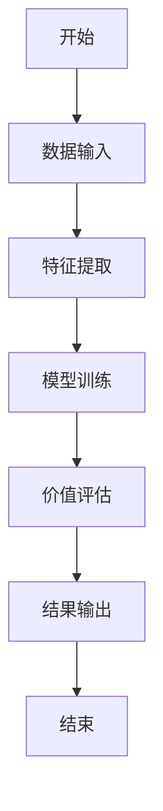
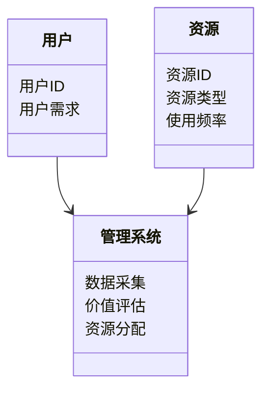
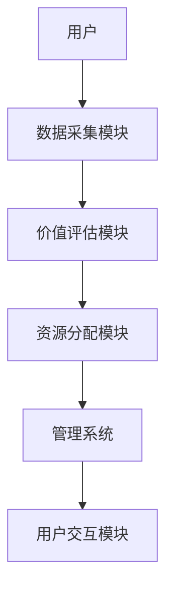

                 


# 价值投资中的智能城市共享经济管理系统分析

> 关键词：价值投资，智能城市，共享经济，管理系统，算法原理，系统架构

> 摘要：本文详细分析了智能城市背景下共享经济管理系统的价值投资问题，从系统背景、核心概念、算法原理到系统架构、项目实战，结合实际案例，深入探讨了价值投资在智能城市共享经济管理中的应用与实现。

---

# 第1章: 价值投资中的智能城市共享经济管理系统背景

## 1.1 问题背景

### 1.1.1 智慧城市的发展现状
智慧城市建设是全球城市化进程中的重要趋势，旨在通过信息技术和数据驱动的方式优化资源配置、提升城市运行效率。然而，随着共享经济的快速发展，资源分配不均、利益分配不公等问题逐渐显现，亟需一种高效的管理系统来协调各方利益。

### 1.1.2 共享经济的兴起与挑战
共享经济通过互联网平台，将闲置资源进行共享，提高了资源利用率。然而，共享经济的兴起也带来了诸多挑战，例如资源分配的公平性、利益分配的透明性以及如何通过价值投资实现长期收益。

### 1.1.3 价值投资在共享经济中的作用
价值投资是一种以长期收益为导向的投资策略，通过深入分析资源的价值潜力，优化资源配置，实现收益最大化。在智能城市共享经济管理系统中，价值投资是实现资源高效配置的关键手段。

## 1.2 问题描述

### 1.2.1 智慧城市中的共享经济痛点
1. 资源分配不均，导致部分用户无法获得所需资源。
2. 利益分配不透明，用户对资源的价值评估缺乏信任。
3. 缺乏统一的管理系统，导致资源浪费和管理成本增加。

### 1.2.2 价值投资在共享经济中的应用需求
1. 如何通过价值投资实现资源的最优配置。
2. 如何构建一个高效的管理系统，支持价值投资的实施。
3. 如何通过技术手段确保价值投资的公平性和透明性。

## 1.3 问题解决

### 1.3.1 智能城市共享经济管理系统的解决方案
通过构建智能城市共享经济管理系统，实现资源的智能分配和价值评估，支持价值投资的实施。

### 1.3.2 价值投资在系统中的实现路径
1. 数据采集：收集共享资源的特征数据，包括资源类型、使用频率、用户需求等。
2. 价值评估：基于数据构建价值评估模型，计算每种资源的价值潜力。
3. 资源分配：根据价值评估结果，优化资源分配策略，实现资源的高效利用。

## 1.4 系统边界与外延

### 1.4.1 系统边界
智能城市共享经济管理系统的核心功能包括资源数据采集、价值评估、资源分配和用户交互。

### 1.4.2 系统外延
系统外延包括与智能城市其他子系统的接口，例如交通管理系统、能源管理系统等，实现资源的协同优化。

## 1.5 核心要素组成

### 1.5.1 核心要素
1. 用户：系统的主要参与者，包括资源提供者和需求者。
2. 资源：共享资源，包括设备、空间、服务等。
3. 管理系统：实现资源的智能化管理，支持价值投资的实施。
4. 价值评估模型：基于数据的数学模型，计算资源的价值潜力。

---

# 第2章: 核心概念与系统联系

## 2.1 智能城市与共享经济的定义与特点

### 2.1.1 智能城市的定义与核心特征
智能城市是通过信息技术和数据驱动的方式，优化城市资源配置，提升城市运行效率。其核心特征包括数据驱动、智能化、协同化和可持续性。

### 2.1.2 共享经济的定义与核心特征
共享经济是一种通过互联网平台，将闲置资源进行共享的经济模式。其核心特征包括资源利用效率高、用户参与度高、灵活性强。

### 2.1.3 两者的联系与区别
智能城市为共享经济提供了技术平台和基础设施，而共享经济则为智能城市提供了资源优化配置的手段。两者的区别在于，智能城市侧重于城市整体的优化，而共享经济侧重于资源的具体分配。

## 2.2 核心概念对比分析

### 2.2.1 智能城市与共享经济的属性对比
| 属性 | 智能城市 | 共享经济 |
|------|----------|----------|
| 核心目标 | 优化城市资源配置 | 提高资源利用率 |
| 技术支撑 | 大数据、人工智能 | 互联网平台 |
| 参与主体 | 政府、企业、用户 | 用户、平台 |

### 2.2.2 价值投资在两者中的作用对比
| 作用 | 智能城市 | 共享经济 |
|------|----------|----------|
| 资源分配 | 实现资源的最优配置 | 支持资源的高效利用 |
| 利益分配 | 优化利益分配 | 提高用户收益 |

## 2.3 系统实体关系图

### 2.3.1 ER实体关系图


---

# 第3章: 价值评估与预测算法

## 3.1 算法原理

### 3.1.1 价值评估的基本原理
价值评估是通过分析资源的特征数据，计算其价值潜力的过程。核心步骤包括数据采集、特征提取、模型训练和价值计算。

### 3.1.2 共享经济数据的特征提取
特征提取是价值评估的关键步骤，主要包括资源类型、使用频率、用户需求、市场供需等特征。

## 3.2 算法流程图

### 3.2.1 算法流程


## 3.3 数学模型与公式

### 3.3.1 价值评估模型
$$ V = \alpha \cdot x + \beta \cdot y $$
其中，$V$ 表示资源价值，$x$ 表示使用频率，$y$ 表示市场供需。

---

# 第4章: 系统架构设计

## 4.1 问题场景介绍

### 4.1.1 系统目标
实现资源的智能化管理，支持价值投资的实施，优化资源分配。

## 4.2 系统功能设计

### 4.2.1 系统功能模块
1. 数据采集模块：采集共享资源的特征数据。
2. 价值评估模块：基于数据计算资源价值。
3. 资源分配模块：根据价值评估结果优化资源分配。
4. 用户交互模块：提供用户查询和资源分配的界面。

### 4.2.2 领域模型图


## 4.3 系统架构设计

### 4.3.1 系统架构图


---

# 第5章: 项目实战

## 5.1 环境安装

### 5.1.1 开发环境
1. 操作系统：Linux/Windows/MacOS
2. 开发工具：PyCharm
3. 依赖库：numpy, pandas, scikit-learn

## 5.2 核心代码实现

### 5.2.1 数据采集模块
```python
import numpy as np
import pandas as pd

# 数据采集
data = pd.read_csv('resources.csv')
```

### 5.2.2 价值评估模块
```python
from sklearn.linear_model import LinearRegression

# 训练模型
model = LinearRegression()
model.fit(X, y)

# 预测价值
predicted_value = model.predict(X_new)
```

## 5.3 实际案例分析

### 5.3.1 案例分析
假设我们有一个共享办公空间的资源数据，包括使用频率、市场供需等特征，我们可以通过价值评估模型计算其价值潜力，优化资源分配策略。

---

# 第6章: 最佳实践与小结

## 6.1 最佳实践

### 6.1.1 系统设计建议
1. 确保系统的可扩展性，便于后续功能的添加。
2. 提供透明的用户交互界面，增强用户信任。
3. 定期更新模型，确保价值评估的准确性。

## 6.2 小结
智能城市共享经济管理系统通过价值投资的实施，优化了资源分配，提高了资源利用率，为智能城市的建设提供了重要支持。

## 6.3 注意事项
1. 数据的准确性和完整性是价值评估的关键。
2. 系统的安全性和稳定性是用户信任的基础。

## 6.4 拓展阅读
1. 智慧城市相关书籍
2. 共享经济相关研究论文
3. 价值投资的经典案例分析

---

通过本文的分析，我们深入探讨了智能城市共享经济管理系统中价值投资的应用与实现，结合实际案例，为读者提供了系统的解决方案和实践指导。希望本文能为智能城市的建设和发展提供有价值的参考。

