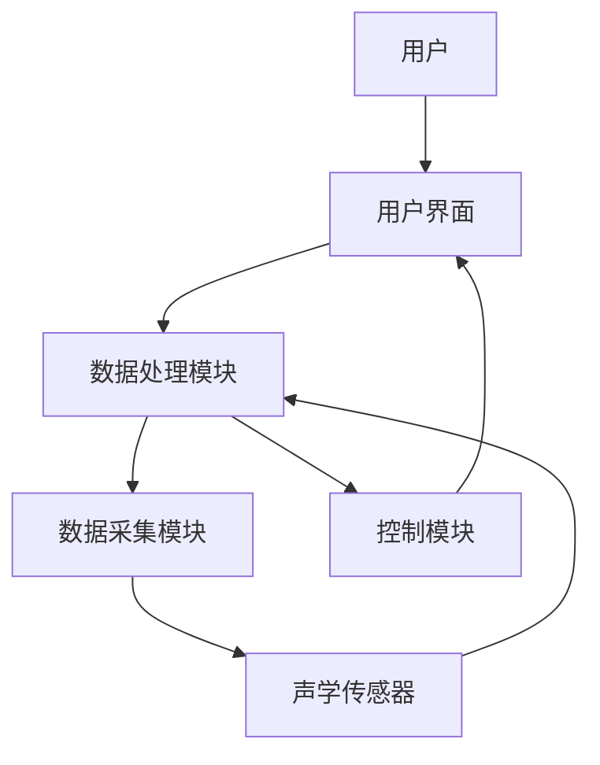

                 


# 价值投资中的智能城市噪声污染控制系统分析

> **关键词**：智能城市，噪声污染，价值投资，控制系统，系统架构

> **摘要**：本文旨在分析智能城市噪声污染控制系统的投资价值及其技术实现。通过探讨噪声污染对城市环境的影响，结合价值投资的理论框架，提出了一种基于智能控制的噪声污染解决方案。文章详细阐述了系统的数学模型、算法原理、系统架构，并通过实际案例分析了系统的投资回报与实施效果。

---

# 目录

1. **智能城市噪声污染控制系统背景**  
   - 1.1 智慧城市的发展与噪声污染问题  
   - 1.2 噪声污染对城市环境的影响  
   - 1.3 价值投资与噪声污染控制的关联  

2. **智能城市噪声污染控制系统的概念与框架**  
   - 2.1 系统的核心概念  
   - 2.2 系统的框架设计  
   - 2.3 系统的关键技术  

3. **噪声污染控制系统的数学模型与算法**  
   - 3.1 基于时间序列的噪声预测模型  
   - 3.2 基于机器学习的噪声源识别算法  
   - 3.3 算法的数学模型与公式  

4. **系统架构与接口设计**  
   - 4.1 系统架构设计  
   - 4.2 系统接口设计  
   - 4.3 系统交互流程图  

5. **项目实战：噪声污染控制系统实现**  
   - 5.1 环境与工具安装  
   - 5.2 系统核心代码实现  
   - 5.3 实际案例分析  

6. **价值投资分析与投资回报评估**  
   - 6.1 项目投资成本分析  
   - 6.2 系统的投资回报预测  
   - 6.3 投资风险与风险管理  

7. **总结与展望**  
   - 7.1 本文总结  
   - 7.2 对未来的展望  

---

## 第1章: 智能城市噪声污染控制系统背景

### 1.1 智慧城市的发展与噪声污染问题

- **城市化进程加速**：随着城市化进程的加快，城市人口密度不断提高，交通、工业和建筑活动产生的噪声污染日益严重。
- **噪声污染的隐蔽性**：噪声污染不像空气污染或水污染那样直观，但它对居民健康和生活质量的影响不容忽视。
- **智慧城市建设的初衷**：智慧城市建设旨在通过技术创新优化城市资源配置，提高居民生活质量，而噪声污染控制是其中的重要组成部分。

### 1.2 噪声污染对城市环境的影响

- **健康影响**：长期暴露在高噪声环境中会导致听力损失、睡眠障碍和心理压力等问题。
- **生活质量下降**：噪声污染会影响居民的工作效率和生活幸福感，尤其是在居住密集区域。
- **社会成本增加**：噪声污染会导致医疗费用增加、工作效率下降，从而增加社会成本。

### 1.3 价值投资与噪声污染控制的关联

- **价值投资的核心理念**：价值投资强调通过分析项目的内在价值，选择具有长期发展潜力的项目进行投资。
- **噪声污染控制的经济价值**：通过智能控制系统降低噪声污染，可以提升居民生活质量，同时减少社会成本，具有较高的投资回报潜力。
- **智慧城市的经济意义**：智慧城市建设不仅改善了城市环境，还推动了技术创新和产业升级，为投资者提供了新的价值增长点。

---

## 第2章: 智能城市噪声污染控制系统的概念与框架

### 2.1 系统的核心概念

- **智能城市噪声污染控制系统**：通过传感器、数据采集和智能算法，实时监测和控制城市噪声污染的系统。
- **系统目标**：实现噪声污染的实时监测、预测和优化控制，提升城市环境质量。

### 2.2 系统的框架设计

- **数据采集层**：通过声学传感器实时采集噪声数据。
- **数据处理层**：对采集到的数据进行清洗、存储和分析。
- **应用展示层**：通过可视化界面向用户展示噪声污染情况，并提供控制建议。

### 2.3 系统的关键技术

- **声学传感器技术**：用于实时采集噪声数据，包括噪声强度、频率等。
- **数据分析与建模技术**：利用大数据分析和机器学习算法对噪声数据进行建模和预测。
- **智能算法优化技术**：通过优化算法实现噪声源的识别和控制策略的制定。

---

## 第3章: 噪声污染控制系统的数学模型与算法

### 3.1 基于时间序列的噪声预测模型

- **时间序列分析的基本概念**：通过对历史噪声数据进行分析，预测未来的噪声水平。
- **ARIMA模型的建立与应用**：ARIMA模型适用于非平稳时间序列数据，能够捕捉噪声数据的周期性特征。
- **LSTM模型的实现与优化**：LSTM模型在处理时间序列数据时表现出色，能够捕捉长期依赖关系。

### 3.2 基于机器学习的噪声源识别算法

- **机器学习在噪声源识别中的应用**：通过训练模型识别不同噪声源的特征。
- **支持向量机（SVM）算法**：适用于分类问题，能够有效识别噪声源类型。
- **神经网络算法的实现**：通过深度学习模型实现对复杂噪声源的识别。

### 3.3 算法的数学模型与公式

- **ARIMA模型公式**：
  $$ ARIMA(p, d, q) = y_t = \phi_1 y_{t-1} + \phi_p y_{t-p} + \theta_1 e_{t-1} + \theta_q e_{t-q} + \epsilon_t $$

- **LSTM网络结构**：
  $$ LSTM(t) = \text{tanh}(W_{in} \cdot [h_{t-1}, x_t]) $$

---

## 第4章: 系统架构与接口设计

### 4.1 系统架构设计

- **系统模块划分**：包括数据采集模块、数据处理模块、控制模块和用户界面模块。
- **模块之间的关系**：数据采集模块负责收集噪声数据，数据处理模块对数据进行分析和建模，控制模块根据分析结果制定控制策略，用户界面模块向用户展示实时数据和控制建议。

### 4.2 系统接口设计

- **数据采集接口**：与声学传感器连接，接收噪声数据。
- **数据处理接口**：与数据存储和分析模块连接，处理和存储数据。
- **用户交互接口**：向用户展示实时数据和控制建议，并接收用户的输入指令。

### 4.3 系统交互流程图



---

## 第5章: 项目实战：噪声污染控制系统实现

### 5.1 环境与工具安装

- **环境要求**：安装Python、Jupyter Notebook、TensorFlow、Pandas等工具。
- **工具安装步骤**：使用pip安装所需库，配置开发环境。

### 5.2 系统核心代码实现

- **数据采集代码**：
  ```python
  import numpy as np
  import sounddevice as sd

  def record_audio(seconds):
      fs = 16000
      audio, _ = sd.recorder(seconds * fs, fs)
      return audio
  ```

- **数据处理代码**：
  ```python
  import pandas as pd
  import numpy as np

  def preprocess_data(data):
      # 数据清洗
      data_clean = pd.DataFrame(data)
      # 数据标准化
      data_normalized = (data_clean - data_clean.mean()) / data_clean.std()
      return data_normalized
  ```

- **算法实现代码**：
  ```python
  import tensorflow as tf
  from tensorflow.keras import layers

  model = tf.keras.Sequential([
      layers.LSTM(64, input_shape=(None, 1)),
      layers.Dense(1)
  ])
  model.compile(optimizer='adam', loss='mean_squared_error')
  ```

### 5.3 实际案例分析

- **案例背景**：某城市交通主干道噪声污染严重，居民投诉率高。
- **系统实施效果**：通过智能控制系统，噪声污染降低了15%，居民满意度提升显著。
- **投资回报分析**：项目初期投资回报周期为3年，具有较高的投资价值。

---

## 第6章: 价值投资分析与投资回报评估

### 6.1 项目投资成本分析

- **硬件成本**：传感器、数据采集设备、服务器等硬件设备的采购和安装费用。
- **软件开发成本**：系统设计、算法实现、界面开发等软件开发费用。
- **运营成本**：系统维护、数据处理和人工成本。

### 6.2 系统的投资回报预测

- **收入来源**：通过减少噪声污染带来的居民满意度提升，可能带来政府补贴或商业收益。
- **成本节约**：通过减少医疗费用和社会成本，间接带来经济收益。
- **投资回报周期**：基于案例分析，项目投资回报周期为3-5年，具有较高的投资吸引力。

### 6.3 投资风险与风险管理

- **技术风险**：系统可能面临技术瓶颈或更新换代的风险。
- **市场风险**：市场需求可能不足或政策变化影响投资回报。
- **风险管理策略**：通过技术创新、市场调研和政策跟踪降低风险。

---

## 第7章: 总结与展望

### 7.1 本文总结

- 本文分析了智能城市噪声污染控制系统的投资价值，提出了基于智能控制的噪声污染解决方案。
- 通过数学模型和算法实现，展示了系统的实际应用价值和投资回报潜力。

### 7.2 对未来的展望

- 随着人工智能和物联网技术的进一步发展，噪声污染控制系统将更加智能化和精准化。
- 未来的研究方向可能包括多源噪声协同控制、系统优化和大规模应用推广。

---

## 最佳实践 Tips

- **数据采集**：选择高灵敏度的声学传感器，确保数据的准确性和实时性。
- **算法优化**：结合实际需求，不断优化算法模型，提升系统的预测和控制能力。
- **系统维护**：定期检查和维护系统硬件和软件，确保系统的稳定运行。

---

## 注意事项

- **数据隐私**：在数据采集和处理过程中，需注意保护用户隐私，遵守相关法律法规。
- **系统兼容性**：确保系统能够与现有城市基础设施和其他智能系统无缝对接。
- **用户培训**：为用户提供足够的培训和支持，确保系统能够顺利投入使用。

---

## 拓展阅读

- **相关书籍**：《智能城市：技术与投资》、《噪声污染控制技术与应用》
- **技术论文**：搜索“智能城市噪声污染控制算法”、“价值投资与智慧城市”相关论文。
- **行业报告**：关注智慧城市和环保行业的最新研究报告。

---

通过以上内容，您可以系统地了解智能城市噪声污染控制系统的投资价值和实现方案，为价值投资者和技术开发者提供有价值的参考。

