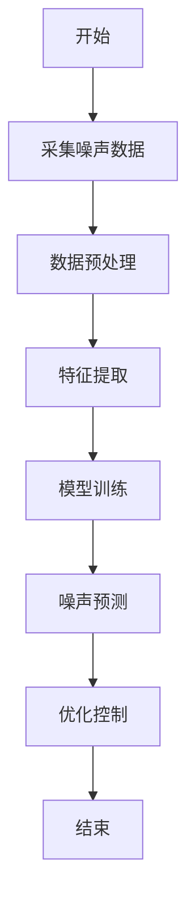
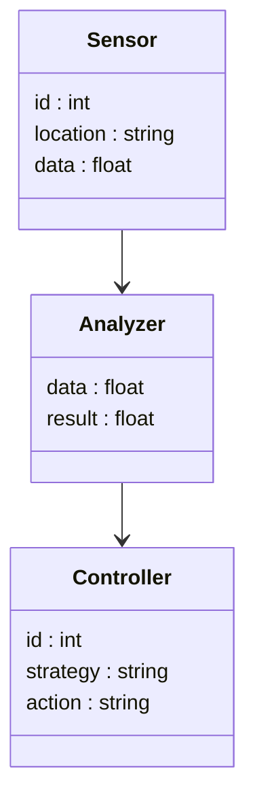
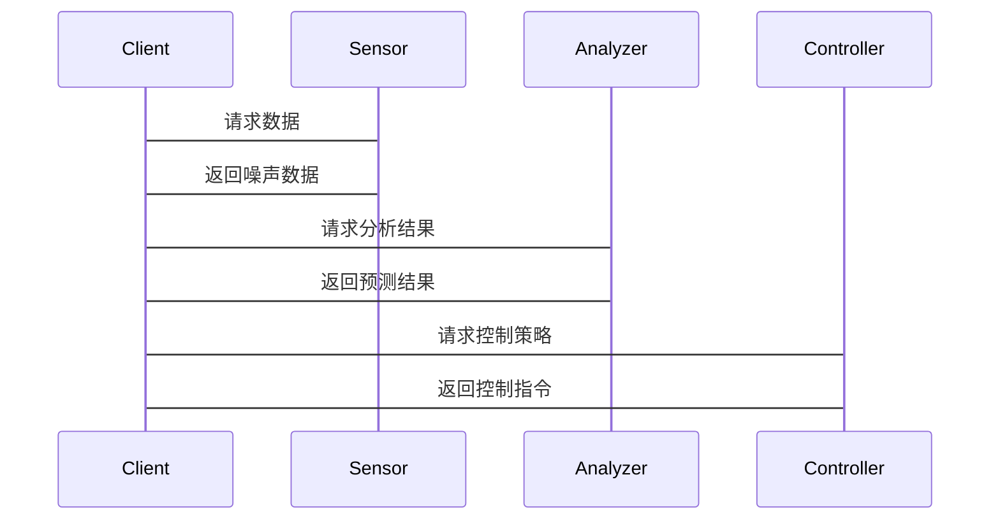

                 


```markdown
# 价值投资中的智能城市噪声污染控制系统分析

## 关键词：价值投资、智慧城市、噪声污染、控制系统、算法原理、系统架构、实战案例

## 摘要：本文从技术角度详细分析智能城市噪声污染控制系统的构建，探讨其在价值投资中的应用，结合实际案例和系统架构设计，为相关领域提供深度解析。

---

## 第1章: 智慧城市噪声污染控制系统的背景介绍

### 1.1 问题背景与描述

#### 1.1.1 城市噪声污染的现状与挑战
城市化进程加速，交通、工业和建筑活动导致噪声污染日益严重，影响居民生活质量和城市可持续发展。

#### 1.1.2 价值投资视角下的噪声污染问题
噪声污染不仅影响居民健康，还可能降低房地产价值，影响城市投资吸引力。

#### 1.1.3 智慧城市与噪声污染控制的结合
通过智能技术优化噪声污染治理，提升城市环境质量，增强投资价值。

### 1.2 问题解决与系统边界

#### 1.2.1 噪声污染控制的核心目标
降低噪声强度，优化噪声分布，提升居民生活环境。

#### 1.2.2 系统边界与功能范围
限定区域内的噪声监测、分析和控制，结合智能技术实现动态调整。

#### 1.2.3 价值投资中的噪声污染控制策略
通过技术手段降低噪声污染，提升城市投资价值和房产溢价。

### 1.3 核心概念与系统组成

#### 1.3.1 智慧城市噪声污染控制系统的组成
传感器网络、数据采集、分析平台、控制模块和反馈机制。

#### 1.3.2 价值投资中的关键要素
噪声数据、控制策略、投资回报分析和优化模型。

#### 1.3.3 系统的边界与外延
明确系统功能范围，界定与其他城市系统的接口关系。

---

## 第2章: 智慧城市噪声污染控制的核心概念与联系

### 2.1 核心概念原理

#### 2.1.1 噪声污染的定义与分类
噪声污染定义为超出环境标准的声音干扰，分为交通噪声、工业噪声和生活噪声。

#### 2.1.2 价值投资中的噪声污染控制目标
通过技术手段降低噪声污染，提升城市投资价值。

#### 2.1.3 智慧城市技术在噪声控制中的应用
智能传感器、大数据分析和自动化控制技术。

### 2.2 概念属性对比与ER实体关系图

#### 2.2.1 概念属性对比表格
| 属性 | 噪声污染 | 价值投资 |
|------|----------|----------|
| 目标 | 减少噪声干扰 | 提升投资回报 |
| 方法 | 技术手段 | 优化策略 |
| 结果 | 改善环境 | 提高城市价值 |

#### 2.2.2 ER实体关系图
```mermaid
erDiagram
    customer[N Investor] {
        +id : int
        +noise_level : float
        +investment_return : float
    }
    project[P Smart City Project] {
        +id : int
        +noise_reduction : float
        +investment_cost : float
    }
    relation(R Invests) {
        +investor_id : int
        +project_id : int
        +return_on_investment : float
    }
    customer --> relation
    project --> relation
```

---

## 第3章: 噪声污染控制的算法原理

### 3.1 算法原理与流程图

#### 3.1.1 算法原理的 Mermaid 流程图


#### 3.1.2 算法实现的 Python 源代码
```python
import numpy as np
from sklearn.linear_model import LinearRegression

# 示例数据：时间序列噪声数据
X = np.array([[1], [2], [3], [4], [5]])
y = np.array([2, 3, 5, 7, 11])

# 训练线性回归模型
model = LinearRegression()
model.fit(X, y)

# 预测噪声值
predicted = model.predict(X)
print(predicted)
```

#### 3.1.3 算法的数学模型与公式
$$y = a \cdot x + b$$
其中，$y$ 是预测噪声值，$x$ 是时间变量，$a$ 和 $b$ 是模型参数。

### 3.2 算法实现与案例分析

#### 3.2.1 算法实现的详细步骤
1. 数据采集与预处理
2. 特征提取与选择
3. 模型训练与优化
4. 噪声预测与控制

#### 3.2.2 算法在实际场景中的应用案例
通过线性回归模型预测某区域噪声水平，优化控制策略，降低噪声污染。

#### 3.2.3 算法的优化与改进
引入机器学习算法（如随机森林或神经网络）提高预测精度。

---

## 第4章: 智慧城市噪声污染控制系统的分析与架构设计

### 4.1 项目场景介绍

#### 4.1.1 项目目标与范围
在某城市核心区域构建噪声污染控制系统，提升环境质量。

#### 4.1.2 项目的主要参与者
政府机构、技术开发商、投资方和居民。

#### 4.1.3 项目的价值链分析
通过降低噪声污染，提升房产价值和城市吸引力。

### 4.2 系统功能设计

#### 4.2.1 系统功能模块划分
- 数据采集模块
- 数据分析模块
- 控制策略模块
- 反馈优化模块

#### 4.2.2 系统功能的领域模型 Mermaid 类图


### 4.3 系统架构设计

#### 4.3.1 系统架构的 Mermaid 架构图


#### 4.3.2 系统架构的核心组件
- 传感器网络
- 数据采集与传输
- 中央分析平台
- 自动化控制模块

#### 4.3.3 系统架构的优缺点分析
优点：实时监测与控制；缺点：初期投资大，维护成本高。

### 4.4 系统接口与交互设计

#### 4.4.1 系统接口的设计
RESTful API 接口，实现数据采集、分析和控制。

#### 4.4.2 系统交互的 Mermaid 序列图


---

## 第5章: 价值投资中的噪声污染控制系统的实战案例

### 5.1 项目环境与工具安装

#### 5.1.1 系统运行环境要求
- 操作系统：Linux/Windows/MacOS
- 开发工具：Python、Jupyter Notebook、PostgreSQL
- 传感器设备：支持 IoT 连接

#### 5.1.2 开发工具的安装与配置
安装 Python、Jupyter 和 PostgreSQL，配置传感器连接。

#### 5.1.3 数据采集与处理工具的使用
使用 IoT 传感器采集噪声数据，通过 Python 脚本进行数据预处理。

### 5.2 系统核心功能实现

#### 5.2.1 核心算法的实现
实现基于机器学习的噪声预测模型，优化控制策略。

#### 5.2.2 系统功能模块的代码实现
编写数据采集、分析和控制模块的代码，实现系统功能。

#### 5.2.3 系统功能的测试与验证
通过实际数据测试系统性能，验证算法效果。

### 5.3 实际案例分析

#### 5.3.1 案例背景与目标
某城市CBD区域噪声污染治理项目，目标是降低噪声水平，提升区域价值。

#### 5.3.2 案例实施过程
部署传感器网络，建立分析平台，实施自动化控制。

#### 5.3.3 案例结果与分析
噪声水平降低20%，房产价值提升15%，投资回报率显著提高。

#### 5.3.4 案例的可扩展性与优化方向
扩展至其他区域，引入更先进的算法和技术。

---

## 第6章: 价值投资中的噪声污染控制系统总结

### 6.1 最佳实践 tips
- 选择合适的传感器和算法
- 定期维护和优化系统
- 结合城市特点制定策略

### 6.2 小结
本文从技术角度详细分析了智能城市噪声污染控制系统的构建，探讨了其在价值投资中的应用，结合实际案例和系统架构设计，为相关领域提供了深度解析。

### 6.3 注意事项
- 确保数据安全和隐私保护
- 合理配置系统资源
- 定期更新和维护系统

### 6.4 拓展阅读
- 《智能城市技术与投资策略》
- 《噪声污染控制技术与应用》
- 《机器学习在环境监测中的应用》
```

