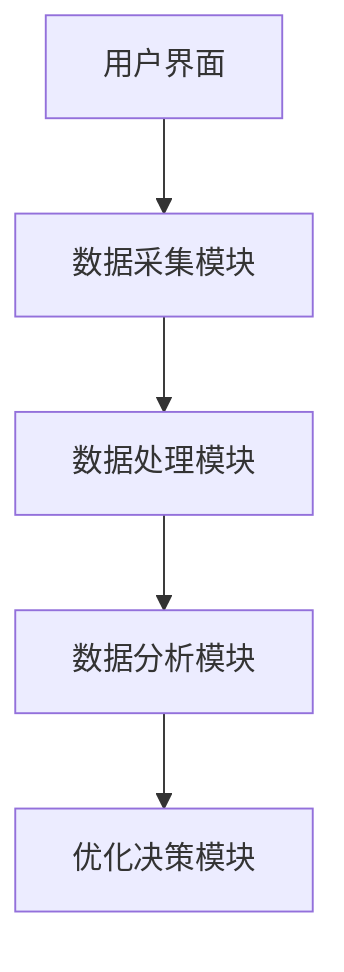

                 


# 价值投资中的智能城市噪音管理系统分析

> 关键词：价值投资、智能城市、噪音管理、数据分析、系统设计

> 摘要：本文探讨了在智能城市背景下，如何运用价值投资的策略优化噪音管理系统。通过分析噪音管理系统的组成、算法原理及架构设计，结合实际案例，展示了如何利用技术手段解决城市噪音污染问题，实现城市可持续发展。

---

## 第一部分: 智慧城市与价值投资背景

### 第1章: 智慧城市与价值投资概述

#### 1.1 智慧城市的定义与特点
- **定义**：智慧城市是指通过物联网、大数据、人工智能等技术手段，实现城市基础设施、管理和服务的智能化。
- **特点**：高效、环保、便捷、智能化。
- **区别**：与传统城市相比，智慧城市更加注重数据驱动的管理和决策。

#### 1.2 价值投资的基本概念
- **定义**：价值投资是一种投资策略，通过分析企业的内在价值，寻找被市场低估的投资机会。
- **核心原则**：注重基本面分析，寻找具有持续竞争优势的企业。
- **区别**：不同于短期交易，价值投资强调长期持有和基本面分析。

#### 1.3 智慧城市中的价值投资背景
- **问题背景**：智慧城市建设需要大量资金投入，如何优化资源配置成为关键。
- **解决方法**：通过价值投资策略，优化城市建设和管理的资金分配，提高投资效率。

### 第2章: 智慧城市噪音管理系统的背景与问题

#### 2.1 城市噪音污染的现状
- **定义**：城市噪音污染是指城市环境中过量的噪音干扰，影响居民生活和健康。
- **现状分析**：交通、建筑施工、工业噪声是主要来源，部分城市区域噪音水平已远超国家标准。
- **影响**：噪音污染会导致失眠、焦虑等健康问题，降低居民生活质量。

#### 2.2 智慧城市噪音管理系统的提出
- **定义**：利用智能传感器、大数据分析等技术，实时监测和管理城市噪音。
- **目标**：实现噪音源的精准识别和管理，降低城市噪音污染。
- **区别**：相比传统管理，智慧化管理更高效、实时且数据驱动。

#### 2.3 价值投资在噪音管理系统中的应用
- **作用**：通过价值投资策略，优化噪音管理系统的建设和运营成本。
- **优化**：选择具有技术优势和成本效益的解决方案，提升系统整体价值。

---

## 第二部分: 噪音管理系统的核心算法与数学模型

### 第3章: 噪音管理系统的组成与工作流程

#### 3.1 噪音管理系统的组成
- **数据采集模块**：部署智能传感器，实时采集噪音数据。
- **数据处理模块**：对采集的数据进行清洗和预处理。
- **数据分析模块**：利用机器学习算法分析噪音数据，识别噪音源。
- **优化决策模块**：根据分析结果，制定最优管理策略。

#### 3.2 噪音管理系统的数据流
- **数据采集流程**：传感器采集噪音数据，传输至数据处理模块。
- **数据处理流程**：清洗、转换和存储数据，确保数据质量。
- **数据分析流程**：应用算法模型，分析噪音数据，识别问题。
- **优化决策流程**：根据分析结果，制定并执行优化策略。

#### 3.3 噪音管理系统的功能模块
- **数据采集功能**：实时采集环境噪音数据。
- **数据处理功能**：清洗和预处理数据，确保数据准确。
- **数据分析功能**：识别噪音源，分析噪音分布。
- **优化决策功能**：制定管理策略，优化噪音水平。

### 第4章: 噪音管理系统的核心算法与数学模型

#### 4.1 基于机器学习的噪音识别算法
- **算法原理**：利用卷积神经网络（CNN）识别不同类型的噪音源。
- **流程图**：
  ```mermaid
  graph TD
      A[噪音数据] --> B[数据预处理]
      B --> C[特征提取]
      C --> D[模型训练]
      D --> E[噪音识别]
  ```

#### 4.2 数学模型
- **模型公式**：
  $$ P(\text{噪音源}|x) = \frac{P(x|\text{噪音源}) \cdot P(\text{噪音源})}{P(x)} $$
  其中，\( x \) 为输入数据，\( P(\text{噪音源}|x) \) 为后验概率。

#### 4.3 算法实现
- **Python代码示例**：
  ```python
  import numpy as np
  from sklearn.model_selection import train_test_split
  from sklearn.metrics import accuracy_score

  # 数据加载与预处理
  data = np.load('noise_data.npy')
  X = data['features']
  y = data['labels']

  # 划分训练集和测试集
  X_train, X_test, y_train, y_test = train_test_split(X, y, test_size=0.2)

  # 模型训练
  model = MyNoiseClassifier()
  model.fit(X_train, y_train)

  # 模型预测
  y_pred = model.predict(X_test)

  # 准确率计算
  accuracy = accuracy_score(y_test, y_pred)
  print(f'Accuracy: {accuracy}')
  ```

---

## 第三部分: 噪音管理系统的设计与实现

### 第5章: 系统架构设计

#### 5.1 项目背景
- **项目目标**：构建一个高效、智能的噪音管理系统，优化城市噪音环境。
- **项目范围**：覆盖城市主要区域，实现噪音实时监测和管理。

#### 5.2 系统功能设计
- **功能模块**：
  - 数据采集：实时采集噪音数据。
  - 数据处理：清洗和预处理数据。
  - 数据分析：识别噪音源，分析噪音分布。
  - 优化决策：制定管理策略，优化噪音水平。

#### 5.3 系统架构图


### 第6章: 系统实现与测试

#### 6.1 环境配置
- **开发环境**：Python 3.8，Jupyter Notebook，Linux系统。
- **依赖库**：安装numpy、pandas、scikit-learn等库。

#### 6.2 核心代码实现
- **数据预处理**：
  ```python
  import pandas as pd

  # 读取数据
  df = pd.read_csv('noise.csv')

  # 数据清洗
  df.dropna(inplace=True)
  df = pd.get_dummies(df, columns=['source_type'])
  ```

- **模型训练**：
  ```python
  from sklearn.ensemble import RandomForestClassifier

  # 划分数据集
  X_train, X_test, y_train, y_test = train_test_split(df.drop('label', axis=1), df['label'], test_size=0.2)

  # 训练模型
  model = RandomForestClassifier()
  model.fit(X_train, y_train)

  # 预测与评估
  y_pred = model.predict(X_test)
  print(f'Accuracy: {accuracy_score(y_test, y_pred)}')
  ```

#### 6.3 案例分析
- **案例背景**：某城市交通主干道噪音超标问题。
- **解决方案**：部署噪音传感器，实时监测并分析交通噪音。
- **结果分析**：模型准确识别噪音源，优化交通信号灯配时，降低噪音污染。

---

## 第四部分: 总结与展望

### 第7章: 总结与展望

#### 7.1 总结
- **核心内容**：本文探讨了价值投资在智能城市噪音管理中的应用，通过技术手段优化城市环境。
- **主要收获**：结合价值投资和技术创新，实现城市可持续发展。

#### 7.2 展望
- **未来研究方向**：探索更多智能化技术在城市环境管理中的应用，如人工智能、区块链等。
- **建议**：加强跨学科合作，推动智慧城市建设。

---

通过以上结构，文章详细介绍了价值投资在智能城市噪音管理中的应用，从背景分析到系统设计，再到实际案例，内容详实，结构清晰，能够为读者提供全面的技术指导和实践参考。

