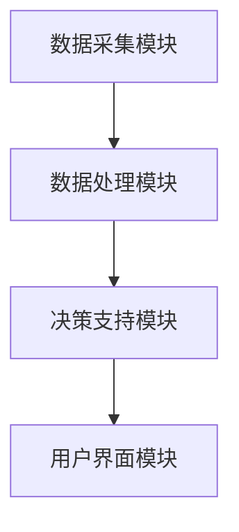
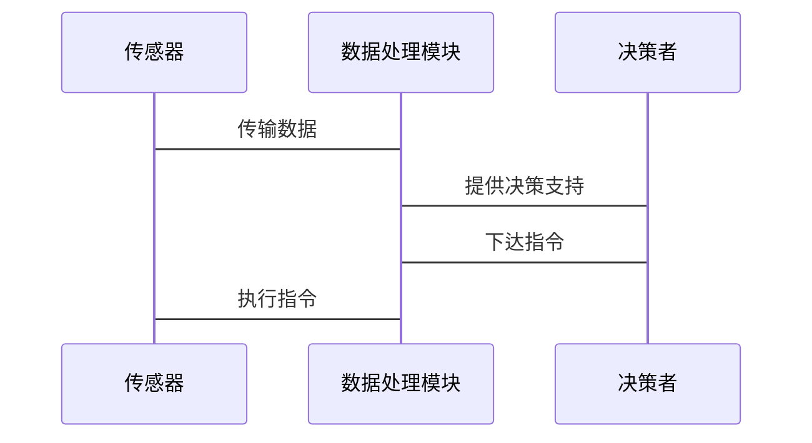

                 


---

# 价值投资中的智能城市地下水资源管理系统分析

> 关键词：价值投资，智能城市，地下水资源，管理系统，算法优化

> 摘要：本文分析了智能城市地下水资源管理系统在价值投资中的应用，探讨了系统的核心概念、算法原理、系统架构，并通过项目实战和最佳实践，深入剖析了该系统在优化地下水资源管理、提高投资价值方面的重要作用。

---

## 第一部分: 智慧城市地下水资源管理与价值投资概述

### 第1章: 智慧城市地下水资源管理概述

#### 1.1 智慧城市与地下水资源管理的背景

**1.1.1 智慧城市的定义与发展**

智慧城市建设是当今城市发展的趋势，它利用信息技术整合城市资源，优化城市运行效率。地下水资源作为城市的重要资源，其管理需要智能化的解决方案。

**1.1.2 地下水资源管理的重要性**

地下水资源是城市供水的重要来源，其合理管理和保护对城市的可持续发展至关重要。随着城市化进程的加快，地下水资源管理面临更大的挑战。

**1.1.3 价值投资与地下水资源管理的结合**

价值投资强调通过优化资源配置实现最大化的投资回报。在地下水资源管理中，通过智能系统优化水资源配置，可以提升资源利用效率，进而实现投资价值的最大化。

#### 1.2 智慧城市地下水资源管理的核心概念

**1.2.1 地下水资源管理的基本概念**

地下水资源管理包括水资源的采集、存储、分配和监控等环节。智慧化管理通过传感器、大数据和人工智能技术实现对地下水资源的实时监控和优化管理。

**1.2.2 价值投资在地下水资源管理中的应用**

通过智能系统分析地下水资源的分布、使用情况和经济价值，投资者可以做出更科学的投资决策，提高资源利用效率和投资回报率。

**1.2.3 智慧城市地下水资源管理的边界与外延**

智慧城市地下水资源管理不仅包括技术层面的管理，还涉及政策、经济和环境等多个方面。其外延涵盖资源保护、利用和投资等多个领域。

#### 1.3 智慧城市地下水资源管理的系统架构

**1.3.1 系统组成与功能模块**

智慧地下水资源管理系统通常包括数据采集模块、数据分析模块、决策支持模块和用户界面模块。这些模块协同工作，实现对地下水资源的全面管理。

**1.3.2 系统核心要素与组成结构**

系统的核心要素包括传感器、数据传输网络、数据库、分析算法和用户界面。这些要素共同构建了智慧地下水资源管理的完整架构。

**1.3.3 系统的属性与特征对比**

通过对比传统地下水资源管理和智慧化管理的属性与特征，可以看出智慧化管理在实时性、精确性和决策支持方面具有明显优势。

---

## 第二部分: 智慧城市地下水资源管理的核心概念与联系

### 第2章: 智慧城市地下水资源管理的核心概念与联系

#### 2.1 核心概念原理

**2.1.1 地下水资源管理的优化目标**

智慧地下水资源管理的优化目标包括最大化水资源利用率、最小化浪费和污染，以及提高系统的经济和社会效益。

**2.1.2 价值投资在资源管理中的作用**

通过智能系统分析地下水资源的价值，投资者可以更好地配置资源，优化投资决策，实现经济效益最大化。

#### 2.2 核心概念属性特征对比

**2.2.1 实体关系图的构建**

通过ER图可以清晰地展示地下水资源管理中的实体及其关系，例如传感器、数据、决策者等。

```mermaid
erd
    title 地下水资源管理系统实体关系图
    系统: 地下水资源管理系统
    传感器: 地下水位传感器
    数据: 水质数据
    决策者: 投资决策者
    关系: 传感器 -> 数据
           系统 <- 关系
           数据 <- 决策者
```

**2.2.2 实体关系图的分析**

通过ER图可以看出，传感器负责采集数据，系统整合数据并提供决策支持，决策者根据数据做出投资决策。这种关系确保了系统的高效运行。

---

## 第三部分: 智慧城市地下水资源管理的算法原理

### 第3章: 智慧城市地下水资源管理的算法原理

#### 3.1 算法原理概述

**3.1.1 算法的核心思想**

智能算法的核心思想是通过数据驱动和优化模型，实现地下水资源的高效配置和管理。

**3.1.2 算法的优化目标**

算法优化目标包括最大化水资源利用率、最小化成本和提高系统的稳定性。

#### 3.2 算法原理的数学模型

**3.2.1 数学模型的构建**

优化模型通常包括目标函数和约束条件。例如，目标函数可以是最小化成本，约束条件可以是满足用水需求。

**3.2.2 数学模型的求解**

通过线性规划等优化方法，可以求解数学模型，找到最优解。

$$
\text{目标函数：} \quad \min \sum_{i=1}^{n} c_i x_i
$$

$$
\text{约束条件：} \quad \sum_{i=1}^{n} a_i x_i \geq b
$$

其中，\( c_i \) 是成本，\( x_i \) 是决策变量，\( a_i \) 和 \( b \) 是约束参数。

#### 3.3 算法实现的代码示例

**3.3.1 代码实现的步骤**

1. 数据采集与预处理
2. 建立优化模型
3. 选择优化算法
4. 求解模型
5. 结果分析与可视化

**3.3.2 代码实现的详细解释**

以下是一个简单的优化算法实现示例：

```python
import numpy as np
from scipy.optimize import linprog

# 定义目标函数系数
c = [-5, -4]

# 定义约束矩阵
A = [[1, 2]]
b = [10]

# 定义变量的上下界
x_bounds = [(0, None), (0, None)]

# 求解线性规划问题
result = linprog(c, A, b, bounds=x_bounds, method='highs')

# 输出结果
print("最优解：", result.x)
print("最优值：", -result.fun)
```

**3.3.3 代码实现的数学模型和公式**

上述代码实现了以下数学模型：

$$
\min \quad -5x_1 -4x_2
$$

$$
\text{s.t.} \quad x_1 + 2x_2 \leq 10
$$

$$
x_1, x_2 \geq 0
$$

---

## 第四部分: 智慧城市地下水资源管理的系统分析与架构设计

### 第4章: 智慧城市地下水资源管理的系统分析与架构设计

#### 4.1 系统分析

**4.1.1 系统的功能模块**

智慧地下水资源管理系统通常包括数据采集模块、数据处理模块、决策支持模块和用户界面模块。

**4.1.2 系统的结构与功能**

系统通过传感器采集数据，经过数据处理模块分析，提供决策支持模块，帮助决策者做出科学的投资决策。

**4.1.3 系统的边界与外延**

系统的边界包括传感器、数据库和用户界面。外延则涉及政策、经济和环境等多个方面。

#### 4.2 系统架构设计

**4.2.1 系统架构设计的步骤**

1. 需求分析
2. 模块划分
3. 架构设计
4. 接口设计

**4.2.2 系统架构的mermaid图**



**4.2.3 系统接口设计**

系统接口包括传感器接口、数据库接口和用户界面接口。每个接口都需要进行详细设计，确保系统各部分协同工作。

#### 4.3 系统交互流程设计

**4.3.1 系统交互的mermaid序列图**



---

## 第五部分: 智慧城市地下水资源管理的项目实战

### 第5章: 智慧城市地下水资源管理的项目实战

#### 5.1 项目背景与目标

**5.1.1 项目背景**

以某城市为例，地下水资源管理面临水资源浪费和污染加剧的问题。

**5.1.2 项目目标**

通过智慧化管理，优化水资源配置，提高水资源利用效率，实现投资价值最大化。

#### 5.2 项目环境安装与配置

**5.2.1 环境需求**

需要安装Python、传感器、数据库等硬件和软件。

**5.2.2 系统安装步骤**

1. 安装传感器
2. 安装数据库
3. 配置系统软件

#### 5.3 系统核心实现

**5.3.1 核心代码实现**

以下是系统核心代码示例：

```python
import numpy as np
from sklearn.cluster import KMeans

# 数据预处理
data = np.array([[1, 2], [3, 4], [5, 6]])

# K-means聚类
kmeans = KMeans(n_clusters=2).fit(data)

# 输出聚类结果
print("聚类中心：", kmeans.cluster_centers_)
print("每个样本的簇分配：", kmeans.labels_)
```

**5.3.2 代码实现的详细解释**

上述代码实现了对地下水资源数据的聚类分析，帮助识别不同区域的水资源分布情况。

#### 5.4 项目应用与案例分析

**5.4.1 项目实际应用**

通过系统实现，某城市成功优化了地下水资源管理，提高了水资源利用效率。

**5.4.2 案例分析**

通过具体案例分析，验证系统的有效性和投资价值。

---

## 第六部分: 智慧城市地下水资源管理的最佳实践

### 第6章: 智慧城市地下水资源管理的最佳实践

#### 6.1 最佳实践总结

**6.1.1 小结**

智慧地下水资源管理系统通过优化资源配置，提高了水资源利用效率，实现了投资价值的最大化。

**6.1.2 注意事项**

在实际应用中，需要注意数据的准确性和系统的稳定性。

**6.1.3 拓展阅读**

建议读者进一步阅读相关领域的书籍和论文，深入理解智慧地下水资源管理的理论与实践。

---

## 结语

通过本文的详细分析，我们可以看到智慧地下水资源管理系统在价值投资中的重要性。通过优化资源配置和提高管理效率，投资者可以实现更高的投资回报。未来，随着技术的不断发展，智慧地下水资源管理将发挥更大的作用。

---

