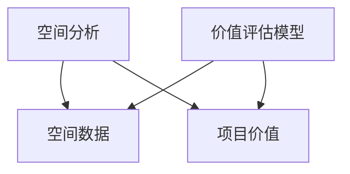
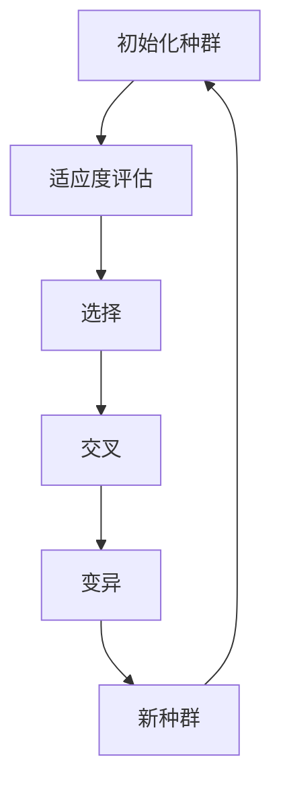
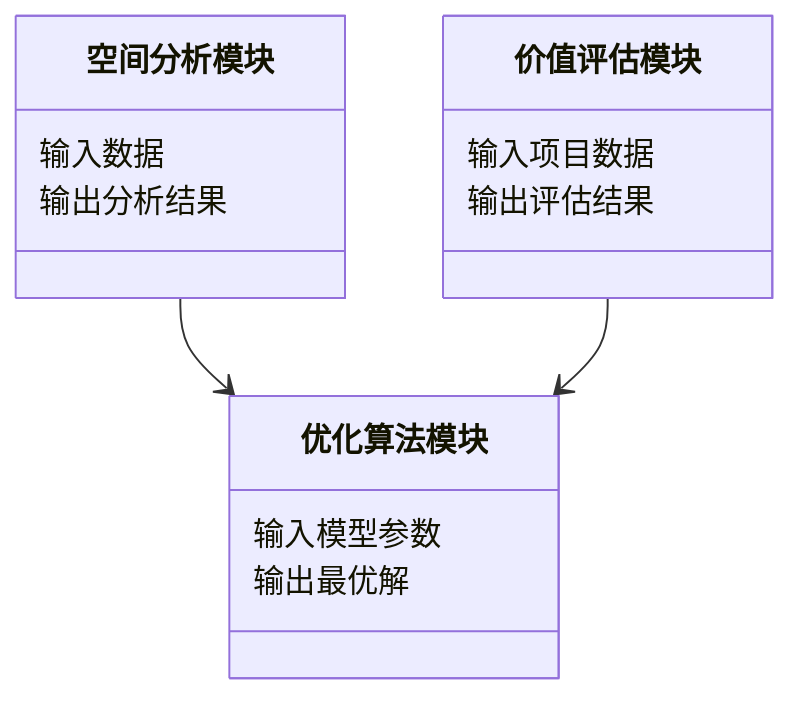
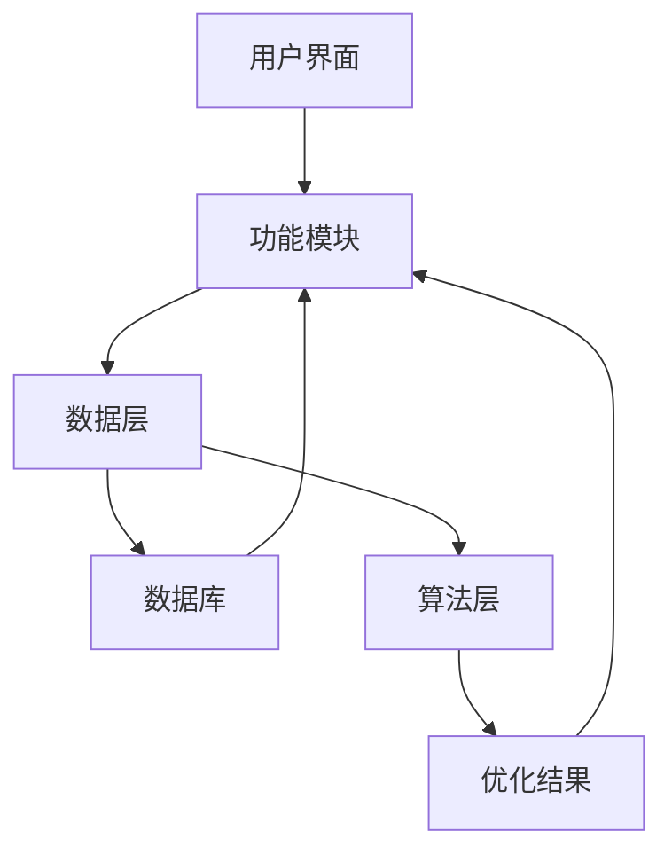

                 


# 价值投资中的智能城市地下空间规划系统分析

## 关键词：价值投资，智能城市，地下空间规划，优化算法，系统架构，项目实战

## 摘要：本文探讨了如何将价值投资的理念应用于智能城市地下空间规划系统中。通过分析系统的背景、核心概念、算法原理、系统架构，并结合项目实战，展示了如何利用技术手段优化地下空间规划，实现长期价值投资的目标。

---

## 第一章: 价值投资的背景与意义

### 1.1 价值投资的核心概念
#### 1.1.1 价值投资的定义
价值投资是一种长期投资策略，关注资产的内在价值，寻找市场价格低于其内在价值的投资标的。其核心理念是通过深入分析企业的基本面，寻找具有持续竞争优势和良好管理的公司。

#### 1.1.2 价值投资的基本原理
价值投资的基本原理包括：
1. **安全边际**：购买价格低于内在价值，确保有一定的安全空间。
2. **长期视角**：关注企业的长期价值，而非短期市场波动。
3. **基本面分析**：通过财务报表、行业地位等因素评估企业的内在价值。

#### 1.1.3 价值投资在现代经济中的应用
价值投资广泛应用于股票、房地产、基础设施等领域。在智能城市背景下，价值投资的理念可以延伸至地下空间规划，通过技术手段优化资源配置，实现长期价值。

---

## 第二章: 智能城市地下空间规划的背景

### 2.1 智能城市的定义与特征
#### 2.1.1 智能城市的定义
智能城市是通过先进的信息技术和数据驱动的方法，优化城市资源分配、提升城市管理效率和居民生活质量的城市发展模式。

#### 2.1.2 智能城市的特征
1. **数据驱动**：依赖大数据和人工智能进行决策。
2. **智能化管理**：利用自动化技术提高城市管理效率。
3. **可持续发展**：注重资源节约和环境保护。

#### 2.1.3 智能城市与传统城市的区别
智能城市借助新技术手段，实现城市管理的智能化和高效化，而传统城市主要依赖人工管理和经验。

### 2.2 地下空间规划的重要性
#### 2.2.1 地下空间的定义
地下空间是指城市地表以下的空间，包括地下建筑、隧道、地铁站等。

#### 2.2.2 地下空间规划的意义
1. **释放地表压力**：缓解地面上的土地紧张问题。
2. **提升城市功能**：提供交通、商业、居住等多种功能。
3. **优化城市布局**：通过地下空间的合理规划，提升城市整体效率。

#### 2.2.3 地下空间规划的挑战
1. **技术复杂性**：地下空间的规划涉及复杂的地质条件和工程技术。
2. **成本高昂**：地下空间的开发和维护成本较高。
3. **法律法规**：需要符合相关法律法规和标准。

---

## 第三章: 价值投资与智能城市地下空间规划的结合

### 3.1 价值投资在城市规划中的应用
#### 3.1.1 价值投资与城市发展的关系
价值投资关注长期的内在价值，与城市发展的可持续性高度契合。通过价值投资的视角，可以优化城市规划和资源配置。

#### 3.1.2 价值投资在城市规划中的作用
1. **优化资源配置**：通过价值评估，合理分配城市资源。
2. **提升项目价值**：通过长期规划和投资，提升城市项目的内在价值。
3. **降低投资风险**：通过安全边际和基本面分析，降低投资风险。

### 3.2 智能城市地下空间规划系统的概念
#### 3.2.1 系统的定义
智能城市地下空间规划系统是一种利用信息技术和数据分析方法，优化地下空间规划和管理的系统。

#### 3.2.2 系统的功能
1. **数据采集与分析**：收集地下空间相关数据，进行分析和建模。
2. **规划优化**：通过算法优化地下空间的布局和功能。
3. **可视化与决策支持**：提供可视化界面，辅助决策者进行规划决策。

#### 3.2.3 系统的组成部分
1. **数据层**：包括地质数据、空间数据等。
2. **算法层**：包括优化算法、数据挖掘算法等。
3. **应用层**：包括规划工具、决策支持系统等。

---

## 第四章: 智能城市地下空间规划系统的核心概念与联系

### 4.1 空间分析与优化
#### 4.1.1 空间分析的定义
空间分析是对地理空间数据进行分析，以提取空间信息和模式的过程。

#### 4.1.2 空间分析的类型
1. **空间统计分析**：分析空间数据的分布特征。
2. **空间预测分析**：预测未来空间变化趋势。
3. **空间优化分析**：优化空间布局和资源配置。

#### 4.1.3 空间优化的原理
通过数学模型和优化算法，寻找最优的空间布局方案，最大化资源利用效率和系统效益。

### 4.2 价值评估模型
#### 4.2.1 价值评估模型的定义
价值评估模型是用于评估地下空间项目内在价值的数学模型。

#### 4.2.2 价值评估模型的类型
1. **收益法模型**：基于项目未来收益进行评估。
2. **成本法模型**：基于项目开发成本进行评估。
3. **市场法模型**：基于市场可比项目进行评估。

#### 4.2.3 价值评估模型的构建
价值评估模型需要结合项目的具体情况，综合考虑收益、成本和市场因素，构建适合的评估模型。

### 4.3 核心概念的联系
#### 4.3.1 核心概念属性对比
| 概念       | 定义                                   | 特征             |
|------------|--------------------------------------|------------------|
| 空间分析   | 对地理空间数据进行分析的过程         | 数据驱动、模型化 |
| 价值评估模型 | 评估项目内在价值的数学模型         | 可量化、可对比   |

#### 4.3.2 实体关系图（ER图）


---

## 第五章: 智能城市地下空间规划系统的算法原理

### 5.1 优化算法的选择
#### 5.1.1 遗传算法
遗传算法是一种模拟自然选择和遗传的优化算法，适用于复杂的非线性优化问题。

#### 5.1.2 模拟退火算法
模拟退火算法是一种全局优化算法，适用于解决组合优化问题。

#### 5.1.3 蚁群算法
蚁群算法是一种基于蚂蚁行为的优化算法，适用于解决路径优化问题。

### 5.2 算法原理的数学模型

#### 5.2.1 遗传算法的流程


#### 5.2.2 遗传算法的数学模型
目标函数：
$$
f(x) = \sum_{i=1}^{n} w_i x_i
$$
约束条件：
$$
g_i(x) \geq 0, \quad i = 1, 2, \ldots, m
$$

---

## 第六章: 智能城市地下空间规划系统的架构设计

### 6.1 系统功能设计
#### 6.1.1 领域模型图


### 6.2 系统架构设计


---

## 第七章: 项目实战与案例分析

### 7.1 项目背景
本项目旨在开发一个智能城市地下空间规划系统，利用价值投资的理念和技术手段，优化地下空间的规划和管理。

### 7.2 核心代码实现
#### 7.2.1 价值评估模型的实现
```python
def value_assessment_model(data):
    # 数据预处理
    # 模型计算
    return value
```

#### 7.2.2 优化算法的实现
```python
def genetic_algorithm(population_size, fitness_function):
    # 初始化种群
    # 迭代优化
    return best_individual
```

### 7.3 案例分析
以某城市地下交通枢纽规划为例，通过系统分析和优化算法，得出最优的布局方案，实现经济效益和社会效益的最大化。

---

## 第八章: 总结与展望

### 8.1 总结
本文探讨了价值投资与智能城市地下空间规划系统的结合，通过系统分析和算法优化，展示了如何实现长期价值投资的目标。

### 8.2 展望
未来，随着技术的不断发展，智能城市地下空间规划系统将更加智能化和高效化，为价值投资提供更多的可能性。

---

## 关注事项：
1. **数据准确性**：在价值评估和空间分析中，数据的准确性是关键。
2. **算法优化**：需要不断优化算法，提高系统的效率和准确性。
3. **法律法规**：在实际应用中，需要遵守相关法律法规和标准。

---

## 拓展阅读：
1. 《智能城市规划与技术》
2. 《价值投资经典案例分析》
3. 《优化算法及其应用》

---

通过本文的分析，我们可以看到，价值投资的理念与智能城市地下空间规划系统的结合，为城市的发展提供了新的思路和方法。希望本文能为相关领域的研究和实践提供有价值的参考。

