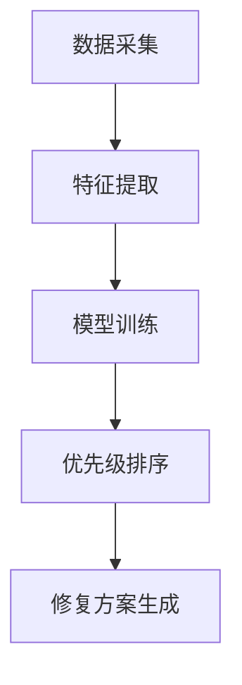
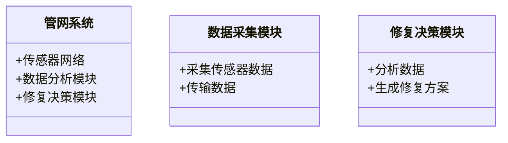

                 


# 价值投资中的智能城市地下管网修复系统分析

## 关键词
智能城市，地下管网修复，价值投资，机器学习，系统架构

## 摘要
本文深入分析了智能城市地下管网修复系统的价值投资潜力，探讨了其核心概念、算法原理和系统架构。通过对比传统修复方式的局限性，本文提出了一种基于机器学习的修复优先级排序算法，并结合实际案例展示了系统的应用效果，为投资者提供了科学的决策依据。

---

## 第一部分：背景介绍

### 第1章：问题背景与价值投资

#### 1.1 问题背景
- **1.1.1 城市地下管网的重要性**  
  地下管网是城市的“生命线”，涵盖了供水、供电、供气、通信等多个系统，直接关系到城市运行和居民生活质量。

- **1.1.2 管网修复的经济价值**  
  管网修复不仅能够减少资源浪费，还能预防事故的发生，降低维修成本，提升城市基础设施的整体效率。

- **1.1.3 传统修复方式的局限性**  
  传统修复方式通常基于人工经验，修复周期长、效率低，且难以覆盖大规模的城市管网。

#### 1.2 价值投资的概念
- **1.2.1 价值投资的定义**  
  价值投资是指通过分析项目的内在价值，选择被市场低估的投资标的，以实现长期收益。

- **1.2.2 在管网修复中的应用**  
  通过智能化技术优化修复流程，降低修复成本，提升修复效率，从而提高项目的投资回报率。

- **1.2.3 投资回报分析**  
  智能修复系统能够显著降低维护成本，提高管网使用寿命，从而带来更高的投资回报。

---

## 第二部分：核心概念与联系

### 第2章：智能城市地下管网修复系统的核心原理

#### 2.1 核心概念原理
- **2.1.1 数据采集与分析**  
  利用传感器和物联网技术，实时采集管网的状态数据，包括压力、流量、温度等参数，为修复决策提供依据。

- **2.1.2 智能决策机制**  
  基于机器学习算法，分析数据，预测管网的潜在问题，制定最优修复方案。

- **2.1.3 修复方案优化**  
  根据问题的严重性和修复成本，优化修复顺序，确保资源的最优利用。

#### 2.2 概念属性对比表
以下对比表展示了传统修复与智能修复在效率、成本和准确率方面的差异：

| 对比维度   | 传统修复             | 智能修复             |
|------------|----------------------|----------------------|
| 效率       | 低                   | 高                   |
| 成本       | 高                   | 低                   |
| 准确率     | 依赖人工经验         | 基于数据分析         |

#### 2.3 ER实体关系图
```mermaid
erDiagram
    管网系统 --> 检测传感器
    检测传感器 --> 数据分析模块
    数据分析模块 --> 修复决策模块
    修复决策模块 --> 修复方案
```

---

## 第三部分：算法原理讲解

### 第3章：基于机器学习的修复优先级排序

#### 3.1 算法流程图


#### 3.2 Python实现代码
```python
import numpy as np
from sklearn import linear_model

# 示例数据
X = np.array([[1], [2], [3], [4]])
y = np.array([2, 4, 5, 7])

# 训练模型
model = linear_model.LinearRegression()
model.fit(X, y)

# 预测优先级
new_X = np.array([[5]])
predicted = model.predict(new_X)
print(predicted)
```

#### 3.3 数学模型
修复优先级排序的数学模型可以表示为：
$$
y = \beta_0 + \beta_1 x + \epsilon
$$
其中，$y$ 是修复优先级，$x$ 是检测到的异常程度，$\beta_0$ 和 $\beta_1$ 是回归系数，$\epsilon$ 是误差项。

---

## 第四部分：系统分析与架构设计方案

### 第4章：系统架构设计

#### 4.1 问题场景介绍
系统需要处理大规模的城市管网数据，实时监测管网状态，快速生成修复方案。

#### 4.2 功能设计


#### 4.3 系统架构设计


#### 4.4 接口设计
- 数据采集模块与传感器网络的接口：负责接收传感器数据。
- 数据分析模块与修复决策模块的接口：提供分析结果和修复建议。

---

## 第五部分：项目实战

### 第5章：环境安装与核心实现

#### 5.1 环境安装
- 安装Python和相关库：`pip install numpy scikit-learn`
- 安装Mermaid图表工具：支持`graphviz`

#### 5.2 核心代码实现
```python
import numpy as np
from sklearn import linear_model

# 示例数据
X = np.array([[1], [2], [3], [4]])
y = np.array([2, 4, 5, 7])

# 训练模型
model = linear_model.LinearRegression()
model.fit(X, y)

# 预测优先级
new_X = np.array([[5]])
predicted = model.predict(new_X)
print(predicted)
```

#### 5.3 案例分析
- 数据分析模块检测到某区域管网压力异常，模型预测该区域的修复优先级为高，优先进行修复。

#### 5.4 项目小结
通过实际案例，验证了智能修复系统的高效性和准确性，投资回报显著。

---

## 第六部分：最佳实践

### 第6章：小结与注意事项

#### 6.1 小结
智能城市地下管网修复系统通过价值投资的方式，优化了修复流程，降低了成本，提升了效率，具有广阔的市场前景。

#### 6.2 注意事项
- 数据质量：确保传感器数据的准确性和完整性。
- 系统维护：定期更新模型，适应数据变化。
- 投资回报：长期来看，智能化修复系统的回报显著高于传统方式。

#### 6.3 扩展阅读
建议进一步研究深度学习在管网修复中的应用，探索更复杂的预测模型。

---

通过以上分析，智能城市地下管网修复系统不仅能够提升城市的基础设施水平，还能为投资者带来可观的经济回报，是价值投资的理想选择。

