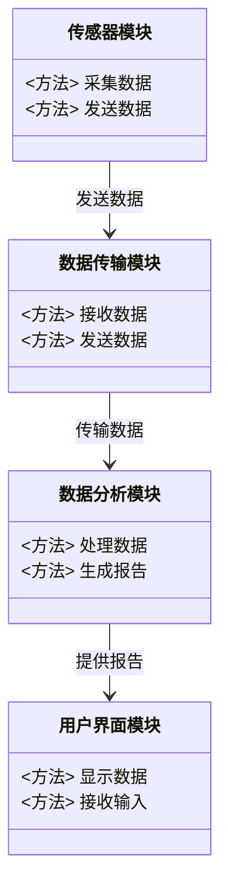
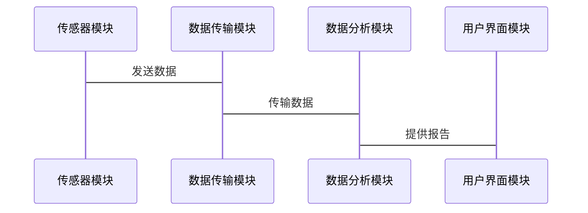

                 


# 价值投资中的智能城市地下管网监测系统分析

## 关键词：价值投资，智能城市，地下管网，监测系统，算法，系统架构，案例分析

## 摘要：本文从价值投资的角度分析智能城市地下管网监测系统的投资价值，探讨其在城市运营中的重要性。文章详细介绍了系统的构成、算法原理、系统架构，并通过案例分析展示了如何应用价值投资理念进行系统评估。内容涵盖背景介绍、核心概念、项目实战和未来展望，为投资者和城市规划者提供参考。

---

# 第一部分：价值投资与智能城市地下管网监测系统背景

## 第1章：价值投资与智能城市地下管网监测系统概述

### 1.1 价值投资的基本概念

#### 1.1.1 价值投资的定义与核心理念
- 价值投资是一种长期投资策略，强调以低于内在价值的价格购买优质资产。
- 核心理念：市场先生、安全边际、先生价值。

#### 1.1.2 价值投资在城市基础设施中的应用
- 城市基础设施作为长期资产，适合价值投资。
- 以地下管网为例，分析其在城市运营中的基础性作用。

#### 1.1.3 智慧城市建设的背景与意义
- 智慧城市是现代城市发展的重要方向，地下管网监测系统是其关键组成部分。
- 智慧城市的建设不仅提升城市管理效率，还为市民提供更优质的服务。

### 1.2 智慧城市地下管网监测系统的定义与特点

#### 1.2.1 地下管网监测系统的定义
- 利用物联网、大数据、人工智能等技术，实时监测地下管网的状态，预防事故，优化管理。

#### 1.2.2 智能监测系统的智能化特点
- 数据采集自动化：传感器实时采集管网数据。
- 数据分析智能化：通过机器学习预测潜在问题。
- 系统管理可视化：提供直观的监控界面，便于决策者操作。

#### 1.2.3 系统在城市运营中的作用与价值
- 提高管网维护效率，降低运营成本。
- 预防管网事故，保障城市安全。
- 支持城市可持续发展，提升城市竞争力。

### 1.3 价值投资与智能监测系统的结合

#### 1.3.1 价值投资视角下的地下管网监测
- 管网监测系统作为城市基础设施的一部分，具有长期稳定的投资回报。
- 价值投资关注企业的内在价值，适合应用于地下管网监测系统的长期投资。

#### 1.3.2 智能监测系统如何创造投资价值
- 提高管网维护效率，降低运营成本，间接提升投资回报率。
- 通过数据驱动的决策，优化资源配置，提升投资收益。

#### 1.3.3 系统投资回报的评估方法
- 现金流分析：评估系统的投资回收期。
- 投资回报率（ROI）：衡量投资收益。
- 风险评估：分析系统可能面临的技术风险和市场风险。

---

## 第2章：智能城市地下管网监测系统的核心概念

### 2.1 系统的组成与功能

#### 2.1.1 感知层：传感器与数据采集
- 传感器类型：压力传感器、温度传感器、流量传感器等。
- 传感器的作用：实时采集管网数据，为后续分析提供基础。

#### 2.1.2 网络层：数据传输与通信
- 通信方式：有线网络、无线网络（如LoRa、NB-IoT）。
- 数据传输的重要性：确保数据的实时性和完整性。

#### 2.1.3 应用层：数据处理与决策支持
- 数据分析：使用大数据技术处理海量数据，提取有价值的信息。
- 决策支持：基于分析结果，为城市管理者提供决策支持。

### 2.2 价值投资中的关键要素

#### 2.2.1 系统的经济性分析
- 初始投资：传感器、通信设备、数据分析平台的采购和部署成本。
- 运营成本：系统维护、数据处理、人员工资等。

#### 2.2.2 系统的可靠性和可持续性
- 系统可靠性：传感器的准确性、通信的稳定性、数据处理的精确性。
- 可持续性：系统的扩展性、适应性，能够长期稳定运行。

#### 2.2.3 系统的扩展性和灵活性
- 系统扩展性：能够根据城市发展的需要，扩展监测点和功能。
- 系统灵活性：能够适应不同的城市环境和需求，灵活调整监测参数。

### 2.3 核心概念的ER实体关系图

```mermaid
erDiagram
    class 投资者 {
        <属性> 资金投入
        <属性> 投资回报率
    }
    class 监测系统 {
        <属性> 数据采集点
        <属性> 数据传输
    }
    class 决策者 {
        <属性> 数据分析
        <属性> 决策支持
    }
    投资者 -->> 监测系统 : 通过投资资金采购设备
    监测系统 -->> 决策者 : 提供实时数据支持决策
```

---

## 第3章：算法原理与实现

### 3.1 算法原理

#### 3.1.1 时间序列分析
- 定义：分析管网压力、流量等数据的时间序列，预测未来趋势。
- 方法：使用ARIMA模型。
- 公式：
  $$
  ARIMA(p, d, q) = \phi(B)^p (1 - B)^d X_t = \theta(B)^q Z_t
  $$
  其中，$p$ 是自回归阶数，$d$ 是差分阶数，$q$ 是移动平均阶数。

#### 3.1.2 支持向量机（SVM）
- 应用：分类和回归分析，用于识别管网异常状态。
- 核心思想：将数据映射到高维空间，使用最大-margin分类。
- 公式：
  $$
  y = \text{sign}(\sum_{i=1}^n \alpha_i y_i x_i \cdot x + b)
  $$
  其中，$\alpha_i$ 是拉格朗日乘子，$y_i$ 是类别标签。

#### 3.1.3 随机森林
- 应用：回归分析，预测管网潜在故障。
- 原理：通过构建多个决策树，减少过拟合，提高泛化能力。

### 3.2 算法实现

#### 3.2.1 时间序列分析代码
```python
from statsmodels.tsa.arima_model import ARIMA
import pandas as pd

# 数据准备
data = pd.read_csv('管网数据.csv')

# 模型训练
model = ARIMA(data['压力'], order=(1, 1, 1))
model_fit = model.fit()

# 预测未来值
future_forecast = model_fit.forecast(steps=5)
print(future_forecast)
```

#### 3.2.2 支持向量机代码
```python
from sklearn.svm import SVC
from sklearn.model_selection import train_test_split
import pandas as pd

# 数据准备
data = pd.read_csv('管网数据.csv')
X = data[['压力', '流量']]
y = data['状态']

# 数据分割
X_train, X_test, y_train, y_test = train_test_split(X, y, test_size=0.2)

# 模型训练
model = SVC()
model.fit(X_train, y_train)

# 预测
y_pred = model.predict(X_test)
print('预测结果:', y_pred)
```

---

## 第4章：系统架构与设计

### 4.1 系统架构设计

#### 4.1.1 分层架构
- 感知层：部署传感器，采集数据。
- 网络层：数据传输，使用MQTT协议。
- 应用层：数据存储、分析和可视化。

#### 4.1.2 模块设计


#### 4.1.3 系统交互流程


---

## 第5章：项目实战与案例分析

### 5.1 项目实战

#### 5.1.1 环境搭建
- 安装Python、Pandas、Scikit-learn、Mermaid工具。
- 配置传感器和通信模块。

#### 5.1.2 核心代码实现
```python
import numpy as np
import pandas as pd
from sklearn.ensemble import RandomForestRegressor

# 数据准备
data = pd.read_csv('管网数据.csv')
X = data.drop('故障预测', axis=1)
y = data['故障预测']

# 数据分割
X_train, X_test, y_train, y_test = train_test_split(X, y, test_size=0.2)

# 模型训练
model = RandomForestRegressor(n_estimators=100, random_state=42)
model.fit(X_train, y_train)

# 预测
y_pred = model.predict(X_test)
print('预测结果:', y_pred)
```

#### 5.1.3 案例分析
- 某城市地下管网监测系统案例，分析投资回报率。
- 系统部署后的维护成本降低，故障率减少，投资回报显著。

---

## 第6章：总结与展望

### 6.1 总结
- 价值投资在智能城市地下管网监测系统中的应用前景广阔。
- 系统的智能化和数据驱动决策是未来发展的关键。

### 6.2 展望
- 人工智能技术的进一步应用，提升系统预测和决策能力。
- 更多城市将采用智能监测系统，推动智慧城市建设。

---

通过以上内容，本文详细分析了价值投资在智能城市地下管网监测系统中的应用，为投资者和城市规划者提供了理论和实践指导，未来的研究方向和应用前景广阔。

