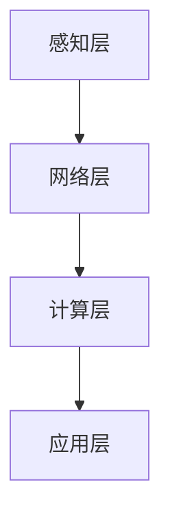
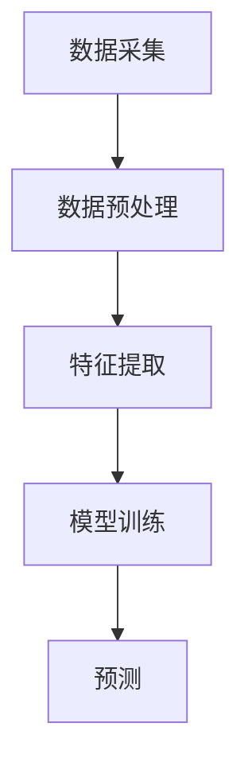

                 


# 价值投资中的智能城市地下管网监测系统分析

## 关键词：价值投资、智能城市、地下管网、监测系统、算法分析、系统架构

## 摘要：本文从价值投资的角度，深入分析智能城市地下管网监测系统的应用价值、算法原理和系统架构。通过对系统的详细解析，揭示其在城市基础设施投资中的潜力和挑战，并探讨如何利用该系统优化投资决策。

---

# 第1章 价值投资与智能城市地下管网监测系统概述

## 1.1 价值投资的核心概念

### 1.1.1 价值投资的定义与特点
价值投资是一种以基本面分析为基础的投资策略，强调以低于内在价值的价格购买优质资产。其核心在于识别市场低估的投资机会，长期持有，等待价值回归。

### 1.1.2 价值投资在现代金融中的地位
价值投资在金融领域占据重要地位，尤其在股票市场中，通过分析公司的财务状况、行业地位和未来前景，帮助投资者做出明智的投资决策。

### 1.1.3 价值投资与智能城市地下管网监测系统的结合
智能城市地下管网监测系统通过实时数据采集和分析，评估城市基础设施的状态，为投资者提供可靠的数据支持，从而优化投资决策。

## 1.2 智能城市地下管网监测系统的基本概念

### 1.2.1 地下管网监测系统的定义
地下管网监测系统是指通过传感器、物联网技术和数据分析，实时监控城市地下管网（如供水、燃气、电力等）的状态，及时发现并解决问题。

### 1.2.2 智能监测系统的特征
智能监测系统具有实时性、准确性、高效性和可扩展性等特点，能够快速响应和处理数据，为城市运营提供支持。

### 1.2.3 系统的核心组成部分与功能
系统的核心组成部分包括传感器网络、数据采集终端、数据传输网络、数据分析平台和用户界面。其功能包括数据采集、存储、分析和可视化。

## 1.3 价值投资视角下的地下管网监测系统分析

### 1.3.1 系统在城市运营中的价值
地下管网监测系统能够提高城市基础设施的运行效率，降低维护成本，保障城市安全。

### 1.3.2 系统对城市基础设施投资的影响
通过系统提供的数据，投资者可以更准确地评估项目的可行性和风险，优化投资决策。

### 1.3.3 系统对城市经济发展的潜在贡献
智能监测系统能够提升城市基础设施的质量，吸引更多的投资和人才，促进经济发展。

---

# 第2章 智能城市地下管网监测系统的数学模型与算法分析

## 2.1 系统数据采集与处理的数学模型

### 2.1.1 数据采集模型的建立
通过传感器采集管网压力、温度、流量等数据，构建数据采集模型。

### 2.1.2 数据预处理的数学方法
使用均值、中位数等方法处理异常数据，确保数据准确性。

### 2.1.3 数据特征提取的算法选择
采用主成分分析（PCA）提取关键特征，减少数据维度。

## 2.2 系统状态评估的数学模型

### 2.2.1 状态评估模型的构建
基于历史数据，建立回归模型预测系统状态。

### 2.2.2 状态评估的数学公式
使用线性回归模型：$y = \beta_0 + \beta_1x + \epsilon$，其中$y$为系统状态，$x$为输入变量，$\epsilon$为误差项。

### 2.2.3 模型的验证与优化
通过交叉验证优化模型参数，确保预测精度。

## 2.3 系统风险评估的数学模型

### 2.3.1 风险评估指标的定义
定义风险指标如故障率、维修成本等。

### 2.3.2 风险评估的数学公式
使用贝叶斯网络模型，计算系统故障概率：$P(F) = P(F|D)P(D) + P(F|\neg D)P(\neg D)$。

### 2.3.3 风险评估模型的实现
通过历史数据训练模型，评估系统在不同情况下的风险。

---

# 第3章 智能城市地下管网监测系统的系统分析与架构设计

## 3.1 系统应用场景分析

### 3.1.1 地下管网监测的典型场景
包括管网泄漏检测、压力异常处理等。

### 3.1.2 系统在城市运营中的实际应用
应用于供水、燃气等管网的实时监控。

### 3.1.3 系统的用户需求分析
用户包括城市管理部门、投资者和运维人员，需求涵盖实时监控、数据分析和决策支持。

## 3.2 系统功能设计

### 3.2.1 系统功能模块划分
包括数据采集、存储、分析、可视化和报警模块。

### 3.2.2 功能模块的交互流程
数据采集模块向存储模块发送数据，分析模块处理数据，生成报告并发送给用户。

### 3.2.3 功能模块的实现方式
采用分布式架构，模块间通过API进行通信。

## 3.3 系统架构设计

### 3.3.1 系统架构的总体设计
采用分层架构，包括感知层、网络层、计算层和应用层。

### 3.3.2 系统架构的分层设计
感知层负责数据采集，网络层负责数据传输，计算层进行数据分析，应用层提供用户界面。

### 3.3.3 系统架构的优化与扩展
通过边缘计算优化数据处理效率，支持扩展更多传感器。

## 3.4 系统接口设计

### 3.4.1 系统内部接口设计
模块间通过RESTful API进行通信，确保高效和可靠。

### 3.4.2 系统外部接口设计
提供API接口给第三方应用，如城市管理系统和投资决策支持系统。

### 3.4.3 接口的标准化与兼容性
采用标准接口协议，确保系统兼容性和扩展性。

## 3.5 本章小结

---

# 第4章 智能城市地下管网监测系统的项目实战

## 4.1 环境安装与配置

### 4.1.1 开发环境的选择
选择Python 3.8及以上版本，安装Jupyter Notebook和相关库。

### 4.1.2 系统依赖的安装
安装传感器驱动、数据采集库和数据分析库。

### 4.1.3 开发工具的配置
配置Jupyter Notebook，安装必要的扩展插件。

## 4.2 系统核心功能的实现

### 4.2.1 数据采集模块的实现
编写Python代码，通过传感器获取数据并存储。

### 4.2.2 数据处理模块的实现
使用Pandas库进行数据清洗和特征提取。

### 4.2.3 系统状态评估模块的实现
训练机器学习模型，预测系统状态并输出结果。

## 4.3 代码实现与解读

### 4.3.1 核心代码的编写
```python
import pandas as pd
from sklearn.linear_model import LinearRegression
from sklearn.metrics import mean_squared_error

# 数据加载
data = pd.read_csv('管网数据.csv')

# 特征选择
X = data[['压力', '温度']]
y = data['状态']

# 模型训练
model = LinearRegression()
model.fit(X, y)

# 预测
y_pred = model.predict(X)
print('均方误差:', mean_squared_error(y, y_pred))
```

### 4.3.2 代码的功能解读
上述代码实现数据加载、特征选择、模型训练和预测，评估模型性能。

### 4.3.3 代码的优化与改进
通过网格搜索优化模型参数，提高预测精度。

## 4.4 实际案例分析

### 4.4.1 案例背景介绍
某城市供水管网出现泄漏，通过系统监测及时发现并修复。

### 4.4.2 案例的实现过程
传感器采集数据，分析模块识别异常，触发报警并生成修复建议。

### 4.4.3 案例的分析与总结
案例展示了系统在实际应用中的高效性和准确性，证明了系统的价值。

## 4.5 本章小结

---

# 第5章 智能城市地下管网监测系统的最佳实践与注意事项

## 5.1 价值投资中的最佳实践

### 5.1.1 投资策略的选择
根据系统提供的数据，选择具有稳定回报的项目进行投资。

### 5.1.2 投资风险的控制
通过系统评估风险，制定风险控制策略，降低投资损失。

### 5.1.3 投资回报的评估
定期评估投资项目的回报率，优化投资组合。

## 5.2 系统设计中的注意事项

### 5.2.1 数据安全的重要性
确保系统数据的安全性，防止数据泄露和篡改。

### 5.2.2 系统可扩展性
设计时考虑系统的扩展性，支持未来更多的传感器和数据源。

### 5.2.3 系统维护
定期维护和更新系统，确保其正常运行和数据准确性。

## 5.3 小结

---

# 附录

## 附录A 系统架构图（Mermaid）



## 附录B 算法流程图（Mermaid）



---

# 参考文献

1. 《价值投资入门》
2. 《智能城市地下管网监测系统设计与实现》
3. 相关学术论文和研究报告

---

# 结语

智能城市地下管网监测系统在价值投资中具有重要的应用价值，通过系统的实时数据和精准分析，投资者可以做出更明智的投资决策。未来，随着技术的不断进步，系统将发挥更大的作用，推动城市基础设施的智能化发展。

