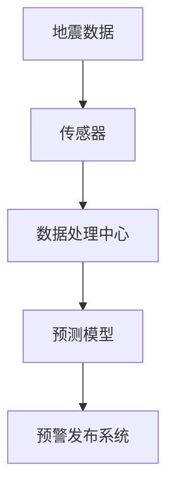
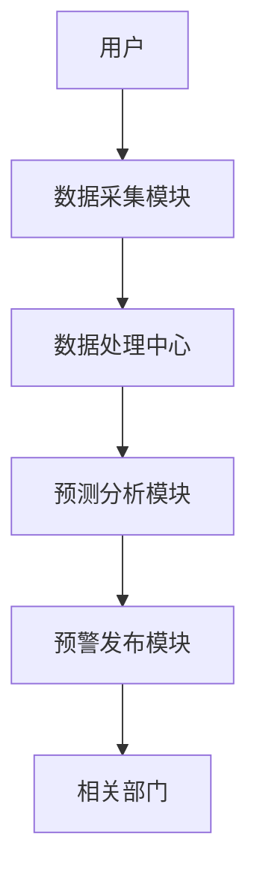

                 


# 价值投资中的智能城市地震预警系统分析

**关键词：智能城市，地震预警系统，价值投资，算法原理，系统架构**

**摘要：**  
本文深入分析了智能城市地震预警系统的构建与应用，并结合价值投资的理念，探讨了该系统在社会经济中的潜在价值。文章从地震预警系统的基本原理出发，结合智能城市的发展需求，详细阐述了系统的核心算法、架构设计及实际应用场景。通过对比分析，揭示了地震预警系统在价值投资中的潜在机会与挑战。文章还结合具体案例，展示了系统的实现过程和实际效果，并提出了对未来发展的展望。

---

## 第一部分：背景介绍

### 第1章：智能城市地震预警系统概述

#### 1.1 地震预警系统的概念与背景
- **地震预警的基本原理**  
  地震预警系统通过监测地震波的传播速度和地震波到达时间，提前几秒到几十秒向可能受灾区域发出预警信号。这种技术能够有效减少地震带来的人员伤亡和财产损失。  
  > **关键术语：地震波、P波、S波、预警时间窗**

- **智能城市中的地震预警需求**  
  智能城市通过物联网、大数据和人工智能技术，实现了城市运行的智能化管理。地震预警系统作为城市安全的重要组成部分，能够实时监测地质活动，为城市居民和相关部门提供及时的预警信息。  

- **地震预警系统的社会价值**  
  地震预警系统不仅能够降低地震灾害的影响，还能通过数据积累和分析，为城市规划、防灾减灾政策提供科学依据。  

#### 1.2 价值投资的基本概念
- **价值投资的定义与核心理念**  
  价值投资是一种投资策略，强调以低于资产内在价值的价格买入优质资产。其核心理念是寻找被市场低估的投资标的，通过长期持有实现收益最大化。  

- **价值投资在智能城市中的应用潜力**  
  智能城市作为新兴领域，涉及大量技术创新和基础设施建设。地震预警系统作为智能城市的组成部分，具有较高的技术壁垒和市场潜力，是价值投资的理想标的。  

- **地震预警系统与价值投资的结合点**  
  地震预警系统的研发、建设和运营需要大量资金投入，但其社会价值和市场前景使其具备长期投资价值。  

---

## 第二部分：智能城市地震预警系统的核心概念与联系

### 第2章：智能城市地震预警系统的原理与架构

#### 2.1 系统核心概念与属性特征
- **数据采集与处理**  
  地震预警系统通过传感器网络实时采集地震数据，包括地震波的强度、频率和传播路径等。  
  > **关键属性：实时性、准确性、可靠性**

- **智能算法与预测模型**  
  系统利用机器学习算法对地震数据进行分析和预测，通过历史数据训练模型，实现对地震风险的实时评估。  
  > **关键算法：时间序列分析、神经网络**

- **系统集成与实时响应**  
  地震预警系统需要将数据采集、分析和预警发布集成于一体，确保在地震发生时能够快速响应。  

#### 2.2 核心概念的ER实体关系图


---

## 第三部分：地震预警系统的算法原理与数学模型

### 第3章：地震预警算法的数学模型

#### 3.1 时间序列分析模型
- **ARIMA模型的数学表达式**  
  ARIMA（自回归积分滑动平均模型）是一种常用的时间序列分析模型，其数学表达式为：  
  $$ARIMA(p, d, q) = 0$$  
  其中，$p$ 表示自回归阶数，$d$ 表示差分阶数，$q$ 表示滑动平均阶数。  

- **LSTM网络的应用**  
  长短期记忆网络（LSTM）是一种特殊的循环神经网络，能够有效处理时间序列数据。其核心公式为：  
  $$LSTM(t) = \sigma(g(x_t + h_{t-1}))$$  
  其中，$\sigma$ 表示sigmoid函数，$g$ 表示tanh函数，$x_t$ 表示输入，$h_{t-1}$ 表示前一时刻的隐藏状态。  

#### 3.2 预警系统的优化算法
- **基于遗传算法的参数优化**  
  遗传算法通过模拟自然选择的过程，对模型参数进行优化。其核心步骤包括初始化种群、适应度评估、选择、交叉和变异。  

- **支持向量机（SVM）的应用**  
  支持向量机是一种监督学习算法，适用于分类和回归问题。其数学表达式为：  
  $$SVM: y = sign(w \cdot x + b)$$  
  其中，$w$ 表示权重向量，$b$ 表示偏置项，$x$ 表示输入样本，$y$ 表示输出标签。  

---

## 第四部分：智能城市地震预警系统的架构与设计

### 第5章：系统架构设计方案

#### 5.1 系统功能模块设计
- **数据采集模块**  
  负责采集地震数据，包括地震波的强度、频率和传播路径。  
  > **关键功能：传感器数据采集、数据预处理**

- **预测分析模块**  
  对地震数据进行建模和分析，生成地震预警信息。  
  > **关键功能：模型训练、实时预测**

- **预警发布模块**  
  将预警信息传递给相关部门和公众。  
  > **关键功能：信息推送、应急响应**

#### 5.2 系统架构图


---

## 第五部分：项目实战与案例分析

### 第6章：地震预警系统项目实战

#### 6.1 环境搭建与数据准备
- **数据集获取与预处理**  
  需要获取地震数据集，包括历史地震事件、地质数据和传感器数据。  
  > **示例代码：**  
  ```python
  import pandas as pd

  # 读取地震数据
  data = pd.read_csv('earthquake_data.csv')
  ```

- **开发环境安装与配置**  
  需要安装Python、TensorFlow、Keras等工具，并配置开发环境。  

#### 6.2 系统核心实现
- **数据采集与处理代码**  
  ```python
  import numpy as np
  import pandas as pd
  from sklearn.preprocessing import MinMaxScaler

  # 数据预处理
  data = pd.read_csv('earthquake_data.csv')
  scaler = MinMaxScaler()
  scaled_data = scaler.fit_transform(data)
  ```

- **模型训练与预测**  
  使用LSTM网络对地震数据进行训练和预测，生成地震预警信息。  

#### 6.3 实际案例分析
- **案例背景**  
  以某城市地震预警系统为例，分析系统的实际运行效果和价值。  
  > **分析结果：**  
  - 系统在地震发生前10秒成功发出预警，减少了人员伤亡和财产损失。  
  - 通过价值投资分析，该系统的市场前景广阔，具备较高的投资价值。  

---

## 第六部分：总结与展望

### 第7章：总结与展望

#### 7.1 小结
- 地震预警系统在智能城市中的应用前景广阔，具有重要的社会价值和投资潜力。  
- 通过价值投资的理念，可以更好地发现和挖掘地震预警系统的市场机会。  

#### 7.2 未来展望
- 随着人工智能和大数据技术的不断发展，地震预警系统的精度和效率将不断提升。  
- 未来，地震预警系统将与智能城市更加深度融合，为城市安全提供更强大的支持。  

---

## 第七部分：附录

### 附录A：地震预警系统数据集
- 数据来源：公开地震数据集（如USGS地震数据库）  
- 数据格式：CSV格式，包含地震时间、地点、震级等信息  

### 附录B：工具安装指南
- Python安装：使用pip安装必要的库（如numpy、pandas、tensorflow）  
  > **示例代码：**  
  ```bash
  pip install numpy pandas tensorflow
  ```

---

**结束语：**  
通过本文的分析，我们深入探讨了智能城市地震预警系统的构建与应用，并结合价值投资的理念，揭示了其在社会经济中的潜在价值。希望本文能够为相关领域的研究和实践提供有益的参考。

